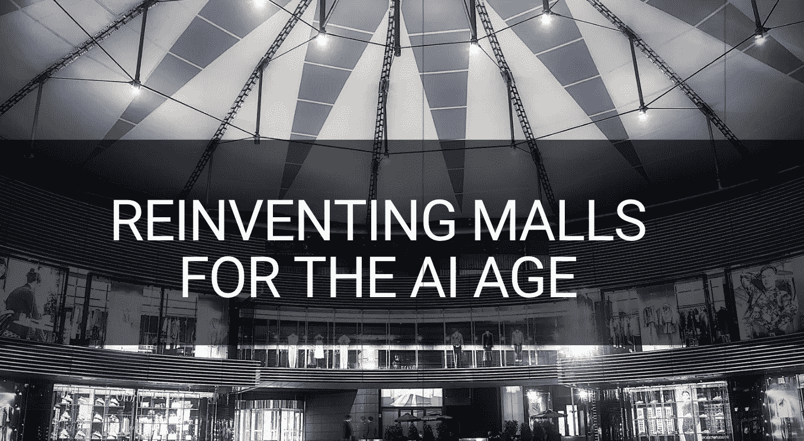
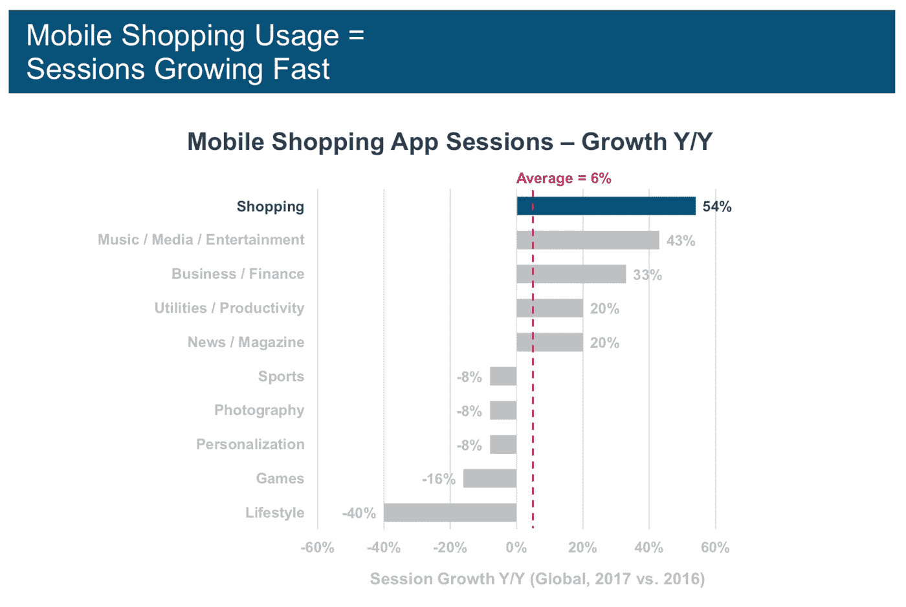
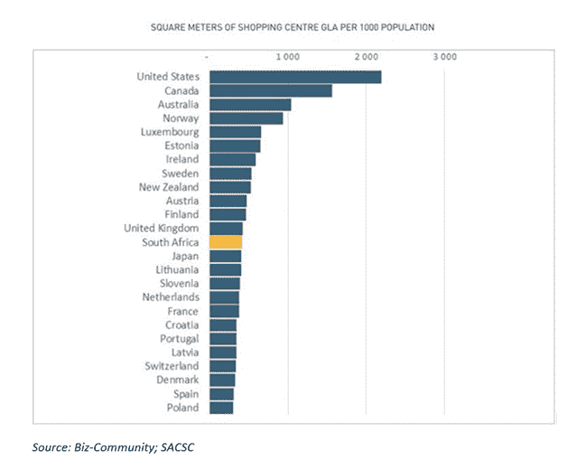
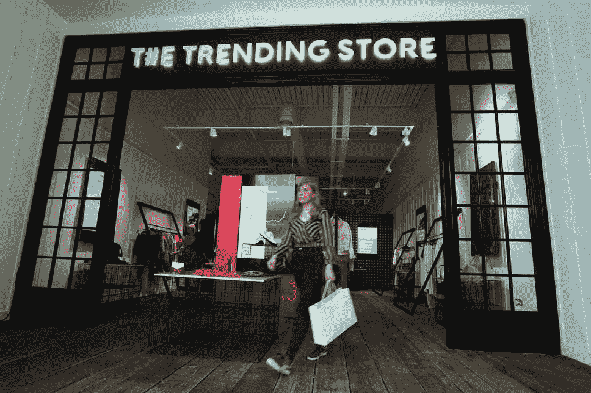
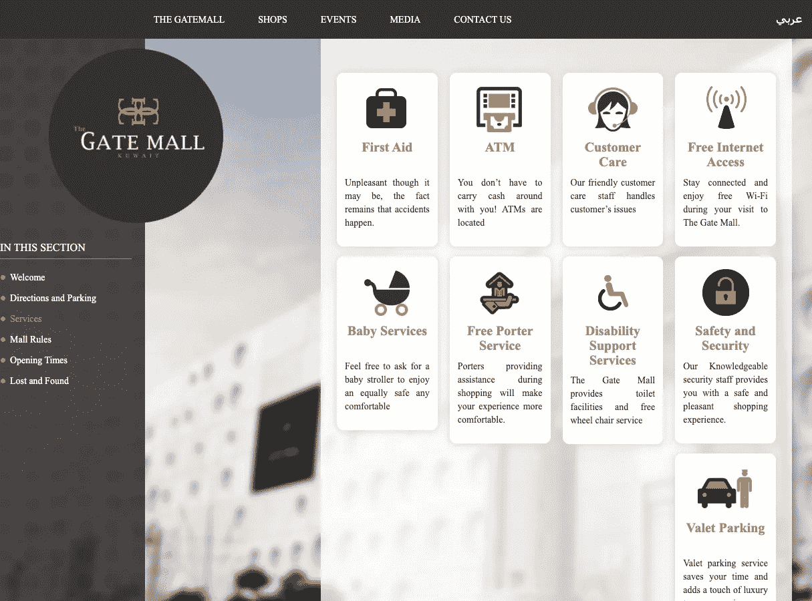
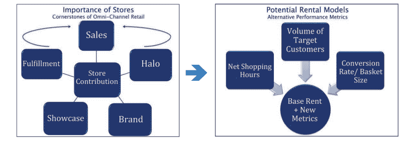

# 为人工智能时代重塑商场

> 原文：<https://towardsdatascience.com/reinventing-malls-for-the-ai-age-7d8f0d0af30d?source=collection_archive---------15----------------------->

# 设置背景

全球每月只有几十亿人逛商场和购物中心。这不仅反映了购物中心在零售业中不可或缺的地位，也反映了等待利用的数据驱动洞察的巨大潜力。购物中心可以使用大数据、机器学习和人工智能来获得有意义的见解，以最大限度地降低运营成本，建立更好的客户参与，探索新的收入途径，使租户能够提高生产力，等等。然而，我们看到和读到的新闻预示着一个新时代的到来，更多的购物中心将停止营业(分析师估计，到 2022 年，美国每 4 个购物中心中就有 1 个可能停业)。

最近，欧洲一家超大型购物中心管理服务公司的资产管理负责人在一次私人讨论中告诉我们:

> “我们在做决定时很慢，但在询问结果和指向别处时却很快……我们发现很难做出充满不确定性的决定，也很难少做我们应该做的实验。我们想知道哪些品牌创造了更多的流量，但我们没有衡量品牌的停留时间。世界各地的购物中心和购物中心都在快速变化——我们只有在受到重创时才会做出反应，而我们通常在利用新技术方面动作迟缓。”

今天，大多数大型全球购物中心运营商的资产管理和运营领导人都敏锐地意识到，技术推动的破坏性创新、受过教育的年轻人口的偏好变化以及在线购物正在迅速缩短传统购物中心的生命周期，并创造新的机会将购物中心改造成不同于现状的东西。这些领导人被迫重新思考支持商业战略的技术投资，以便在这个新的世界秩序中生存和发展。然而，许多这样的领导人和他们的组织也遭受着失败的恐惧，缺乏内部支持，和实践的责任，特别是当开始雄心勃勃的计划时。

# **领导人面前的挑战**

购物中心/购物中心正处于一场完美风暴的中心，这场风暴是由不同的内部和外部力量造成的，这些力量逐渐迫使高管将稀缺资源投入到多个相互矛盾的方向。

> *“购物中心作为购物大厅的传统概念正在成为‘历史的错误’,迫切需要彻底改造。”*
> 
> *-零售开发商 Caruso 附属公司首席执行官 Rick Caruso*

*   过去十年左右，在线/移动购物的迅速崛起导致大品牌零售商的客流量下降，这些零售商是许多购物中心的核心商店。由于一些商店因财务原因关闭，商场客流量减少。

*Of all the things we do on our phones, the fastest-growing segment in 2017 was shopping, up 54% year-over-year. Source:* [*Mary Meeker 2018 State of the Internet report*](https://www.bondcap.com/report/it18/)

*   大衰退的打击降低了整体支出，大多数千禧一代现在更注重体验而非所有权。旅游业蓬勃发展，酒店入住率高得惊人，餐饮服务和饮酒场所增长迅速，而购物中心的核心店铺——服装支出却在下降。随着消费者开始寻找便宜货，快时尚商店和俱乐部商店从百货商店那里抢走了一些市场份额。
*   **并非所有的商场都是平等的。**购物中心“可出租总面积”(GLA)——美国的人均购物面积比加拿大多 40%，比英国多 5 倍，比德国多 10 倍。这是一个数量过多的问题，许多分析师认为有必要对 T4 市场进行一次必要的调整，尤其是当购物中心不在市区范围内或者维护不善的时候。虽然目的地购物中心(如美国购物中心)将能够成功地创造出值得离开沙发开车去的体验，但其余的购物中心将在关注如此广阔空间中塑造人类体验的细节方面挣扎或死亡。

This report clearly highlights the excess GLA that many countries have Source: A study commissioned by the [South African Council of Shopping Centres](https://sacsc.co.za/) to understand the GLA relative to the world.

*   **商场管理层对测量工具的有限投资**一直是一个很少被提及的话题，但却是一个关键的内部挑战。大多数商场业主都不愿意和/或缓慢地采用新技术，并进行充分的测量，以了解在这个新世界中什么可行，什么不可行。*例如，虽然大多数购物中心资产经理总是在寻找下一个突破性品牌、新时代杂货连锁店和继续将流量带到他们家门口的活动，但这些领导者没有/只有有限的工具集来了解当前的基线数字，导致与零售商之间的相互不信任。*一级和二级商场的运营和营销团队充分意识到，他们正在与提供个性化、便利性和无缝体验的在线聚合商激烈竞争，但大多数人仍忙于按照过去 20 年左右的方式查看客流量。

# **可见的中奖趋势**

> *“独自购物或主要购物不再是人们会来购物中心的原因。随着越来越多的空地、充足的停车位和通往主干道的通道，购物中心现在开始问‘这些地方还能用来做什么？’*
> 
> *- Peter Muoio，Ten-X 首席经济学家*

商场业主和购物中心管理层有一个传统的剧本——*现有的结构、古老的治理流程、集中的资本要求&投资战略、长期运行的技术创新周期、本地有限的营销* —这是过时的，不适合在这个新的变化环境中推动增长。应对压力已经迫使许多一级和二级商场走上战略弯路。我们见证的最大趋势是购物中心的重新定位，从购物交易场所到以顾客体验创新为核心的**消费者参与中心**。这已经反映在

*   **不断变化的租户组合模式**已经从纯粹的零售转变为餐饮、娱乐、健康和一系列多样化业务的结合，包括办公空间，有时甚至是公寓。这种类似微型城市的发展已经成为千禧一代的磁石，他们离开市中心前往郊区，但仍然希望生活在一个密集、可步行的社区，并靠近他们想要的一切。
*   也有一个明显的转变，从只有长期租赁到灵活的短期租赁和弹出窗口，并增加了营销投入，以获得全年正确的租户组合。GenZ 和千禧一代中的很大一部分人生活在 Insta 和其他社交媒体的潮流中，Westfield 通过推出有史以来第一个人工智能驱动的“潮流商店”来捕捉他们的兴趣，该商店实时显示社交媒体上的热门产品。

The Trending Store operated by Westfield London — a pop-up selling clothes which are trending online. Source: [https://www.standard.co.uk/fashion/westfield-trending-store-ai-pop-up-save-the-children-a4154196.html](https://www.standard.co.uk/fashion/westfield-trending-store-ai-pop-up-save-the-children-a4154196.html)

*   线上和线下模式的日益融合导致前者在受欢迎的购物中心开设实体店，而购物中心大量投资数字界面，以实现混合购物体验。现在，在购物中心看到过多的数字信息亭和显示器并不罕见，它们超越了正常的“在购物中心找到你的路”——技术可能是实体商店重生的关键。
*   此外，由于购物中心在价格或其他便利选项上无法击败在线玩家，许多一级购物中心**提供差异化服务，如忠诚客户的 VIP 待遇**，举办产品学习会、音乐表演等。科威特的 Gate Mall 推出了一项为顾客提购物袋的礼宾服务，以帮助他们舒适地购物。事实证明，这是一项非常受顾客欢迎的服务，增加了购物时间，提高了转化率。

Listing of special concierge services at the Gate Mall in Kuwait: Source: [http://www.thegatemall.com.kw/The-Gatemall/Services](http://www.thegatemall.com.kw/The-Gatemall/Services)

# **前进前进策略**

> *“我们将继续与品牌紧密合作，提供创新的零售空间，为他们和我们的访客创造理想的环境，包括开发融合数字和实体购物的技术，以增强在一流环境中的额外体验。”*
> 
> *-Myf Ryan，Westfield 英国和欧洲首席营销官*

追逐商业房地产，尤其是购物中心的资本数量惊人，其核心信念是，实体环境具有更接近客户的根本优势，可以提供在线不可能提供的令人愉快的服务。我们看到，在全球范围内运营商业房地产服务业务的客户驱动型运营模式正在逐步但肯定地演变。基于上述趋势以及我们与众多领导者的闭门讨论，我们将以下内容确定为购物中心房地产开发商繁荣发展的三大赌注**。**

## ****#1 为租户创造相互价值&商城开发商****

**我们预计将会出现一股采用新的灵活租赁模式的强劲浪潮，这种模式强调了实体店在更广泛的全渠道零售中的作用，为零售商和购物中心物业经理创造了双赢的机会。这将有助于从商场所有者到零售商的相对自由的度量和见解流动，反之亦然，创造一个信任的环境，这是今天所缺少的。**

****

***Next-gen rental models are on the rise and forward-looking malls are going to adopt them. Source:* [*ICSC Research Envision 2020*](https://www.icsc.com/uploads/default/Envision-2020-Report.pdf)**

**新兴的混合购物模式，如展厅和网络空间，将被纳入租金公式，尊重开发商和零售商的需求和利益，并定义对双方公平公正的商业结果。与绩效相关的指标将成为这种共同价值创造的关键，并取决于净购物时间(停留时间)、顾客量、转换率和购物篮大小。根据零售商之间的剥离计算率，通过确定任何单个零售商的净客流量贡献，这将得到进一步完善。**

## ****#2 将购物中心重新定位为目的地，而不是购物中心****

**为了保持相关性，大型购物中心必须不仅仅是“商品集散地”，而是要发展成为社区中心和文化中心。一级和二级玩家正在认真考虑他们的投资组合，以确定将公寓、酒店、电影院、健身俱乐部、餐厅、活动区和其他类型的用途纳入其中的机会，从而增加宝贵的密度、客流量和活力。受过良好教育的年轻千禧一代和 Zs 一代不断涌入大城市，导致某些市中心市场的零售、公寓和写字楼需求增加，为重新定位现有城市中心和进行有限的开发创造了机会。**

## ****#3 投资人工智能技术****

**计算机视觉(AI)等数字跟踪技术的快速发展实现了准确的计算(而不是容易出错的基于 wifi 的估计或传统的人数计算)，并为[生物识别驱动的营销](https://9d9644ff-70d8-4391-a27d-4c16a1cc7fd3.filesusr.com/ugd/3b5692_4eca85dbc41d4e53bc78203a9c99f13b.pdf)、运营效率和潜在的新收入渠道创造了机会。**

**这里有几个关键领域，这种技术可以推动针，我们希望领导人迅速实施它们。**

**Computer Vision is used to securely analyze the visitor flow and related demographics and mood index of areas inside and outside the malls without compromising on individual privacy. Source: [RealValue.ai](http://www.realvalue.ai)**

****作战****

*   ****保护场所和资产:**面部识别可以通过防止潜在威胁和快速管理情况，为商场提供一种强大的[安全和监控机制](https://9d9644ff-70d8-4391-a27d-4c16a1cc7fd3.filesusr.com/ugd/3b5692_f2e09ffbd25d4ff8b1f6e2ff9c531673.pdf)。**
*   ****提高运营效率:**通过准确估计访客流量和管理相关资源和资产，管理电梯、洗手间、停车场的排队时间或自动扶梯和入口的拥挤情况。这使我们能够预测交通模式，并相应地提前计划人员需求。这可以非常有效地减少人员过剩的成本，避免在拥挤时期出现人员不足的情况。**
*   ****优化布局和标志:**通过性别、年龄和情绪分析精心制作的热图可以帮助跟踪消费者的旅程，识别热点和瓶颈。这可用于设计布局变化，以提供最佳的客户购物路径，衡量数字标牌板和邻近营销的影响。**

****新收入****

*   ****广告收入:**根据热图分析，确定针对特定受众创建新广告空间的最佳位置和时间。将现有的数字内容货币化，如开店视频、活动、产品发布等。将它们与产品/品牌发现 KPI 联系起来。**
*   **从互动信息亭中获取更多:信息亭在很大程度上仍未得到充分利用，仅仅作为方向提供者。智能信息亭可以快速分析客户人口统计数据，以提供量身定制的产品推荐、个性化促销，帮助发现商店、特色、设施等。这可以通过手势和情绪分析增强内容的相关性来进一步参与。**
*   ****让弹出式商店更赚钱:**不仅仅是出租你的空间给弹出式商店。从访客分析中获得洞察，为参与的品牌带来显著价值。使用面部识别功能方便支付。**

****营销&品牌****

*   ****帮助租户确定他们的视觉营销:**橱窗展示对品牌认知影响最大，在将路人转化为店内访客方面发挥着至关重要的作用。通过研究顾客对零售展示的反应，获得见解，帮助租户确定最有效的橱窗展示形式、产品组合和价格点，从而吸引顾客进店。**

****

**Simple dwell time, attention time analysis can help boost advertisement revenues inside and outside the malls. Source: RealValue.ai**

*   ****消除营销活动中的猜测:**确定实施营销活动的最佳条件，并用真实数据衡量其有效性。芬兰赫尔辛基的 Kamppi 购物中心分析了步行交通模式，发现购物者聚集在午餐时间，而不是之前认为的下班后——他们能够通过调整时间来创造更有效的营销活动。**
*   ****创建能够转化的促销活动:**利用能真正打动客户的内容，生成有针对性的信息。今天的顾客眼光更加敏锐，不会被折扣所左右或诱惑，只会受到价值的影响。**

# ****最终……****

> **“如果我们有数据，你就可以进行智能对话。这真的很重要。想想伙伴关系，所有的关系都是如此，因为数据会让你有能力很好地分析关系，也会让你有能力真正了解如何改善。”**
> 
> **—行为分析学院(Behavior Analytics Academy)创始人罗尼·马克斯(Ronny Max)谈到数据在提高零售商和商场开发商之间的互信方面的重要性**

**勇气、雄心和毅力是所有三个建议奏效的先决条件:对当前商业模式施加压力的勇气、打破惯性的雄心和通过使用技术跟随变化的毅力。虽然多次访问硅谷和观看类似 TED 的视频启发了领导者，但现在是时候将这些战略迅速付诸行动，并接受数字化转型之旅中的不确定性。承诺是零售商和物业管理公司之间更好的合作，对终端消费者的透明度和便利性，以及快速响应市场变化的能力。**

**购物中心和购物中心已被证明是很好的生意，在那里有房地产开发商、零售商和其他供应商的利益汇合，当然还有像你我这样的消费者。我们正在见证这个行业为适应社会和技术变化而进行的缓慢但确定的演变。**

**Realflow 是来自 Calculai 的人工智能视觉智能平台，它对我们工作、娱乐和购物的物理空间产生了有意义的影响，从而提高了参与度、安全性和转化率。我们植根于硅谷、印度和法国，将前沿的人工智能和创新带给全球的本地企业。**

****来源****

***https://www . the verge . com/2019/5/24/18638782/Amazon-mall-kiosk-shopping-new-presented-by-stores***

***https://www . the guardian . com/us-news/2017/jul/22/mall-of-America-Minnesota-retail-周年庆***

***https://www . theatlantic . com/business/archive/2017/04/retail-meltdown-of-2017/522384/***

***https://www . Forbes . com/sites/geristengel/2018/02/21/6-ways-retailers-is-prospering-in-malls/# 3 dbdb 9 c 02 be 9***

***https://time.com/4865957/death-and-life-shopping-mall***