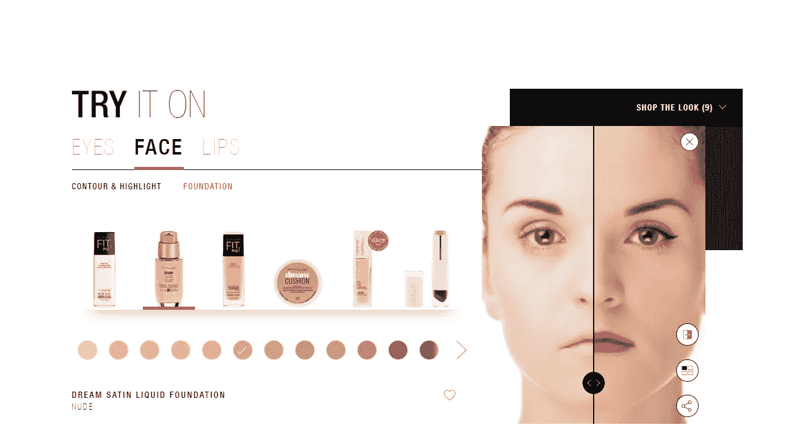

# 重塑客户体验的个性化

> 原文：<https://towardsdatascience.com/reinventing-personalization-for-customer-experience-235d8c75aa38?source=collection_archive---------14----------------------->

## 为什么？什么？怎么会？

“记住，对一个人来说，他的名字是任何语言中最甜美、最重要的声音。”—戴尔·卡耐基，*如何赢得朋友并影响他人*

说到与客户建立良好的关系，记住他们的名字对于任何级别的企业都是必不可少的一步。当涉及到与他们做生意的品牌时，消费者希望被当作个体对待。记住一个人的名字，并在适当的时候使用它，这是赢得那个人接受你的思维方式的关键。这一事实得到了科学的支持，科学认为[听到自己的名字会对听者的大脑产生强大的影响](http://www.ncbi.nlm.nih.gov/pmc/articles/PMC1647299/)。因此，合乎逻辑的做法是，不仅要记住并使用客户的名字，还要记住并使用他们的好恶，让他们感到受到重视——换句话说，为消费者提供个性化的客户体验可以让他们立刻成为品牌的忠实客户。

Personalizing the customer experience across all touch points

客户时代标志着一刀切的信息时代的结束。如今，一条信息无法完成工作，除非它能与每个客户完美契合。在这个时代，消费者比以往任何时候都更有权力，更能控制他们与品牌的关系。这些消费者在整个购买过程中不断要求个性化。

生活在一个喧嚣的即时满足的世界，一家企业如何在一个已经过度拥挤的领域留下印象？实际上很简单——利用所谓的“鸡尾酒会”效应。鸡尾酒会效应是这样的:当你在一个鸡尾酒会上，有几十个人围着你聊天，你会发现你很容易模糊掉那些对话。对你来说，它们只是背景噪音。但是，一旦有人说了你的名字或你特别感兴趣的事情，你的耳朵就会竖起来，进入那个特定的对话。这个信息会超越噪音，因为它对你来说很重要*。*

同样，在客户体验中加入个人风格，例如，在电子邮件中使用动态收件人姓名标签，可以让企业发出自己的声音，从而在过度拥挤的市场中脱颖而出。

# 个性化——制胜策略

公司不能再依赖他们的产品和服务作为他们的主要竞争优势；如今，他们只能在提供卓越体验的基础上竞争。

据 Janrain 称，48%的消费者在他们的体验个性化时会花更多的钱，而 74%的人讨厌看到与 T2 无关的内容。那么，这说明了什么是个性化？在客户体验中，个性化是一种成功的策略，可以帮助公司增进与客户的关系。88%的营销人员声称，在实施客户体验个性化策略后，他们的业务有了明显的改善。

然而，只有 33%的企业对他们拥有的适当个性化客户体验的工具有信心。因此，企业如何利用数字化转型赢得客户体验竞赛，而不是因为这个事实而气馁？

这里的指南可以帮助企业为他们的客户创造更个性化的体验，不管他们目前的情况如何。

1.  **鼓励客户创建用户档案**

创建完美个性化公式的基本要素之一是准确和完整的信息。为了获取这些信息，企业鼓励客户在他们的平台上创建用户档案是至关重要的。客户非常乐意让公司跟踪他们的行为，只要这只是用来提升他们的体验。顾客现在希望公司通过他们的个人资料来监控他们的行为，因为超过一半的顾客承认他们希望品牌能预测他们的需求，这样他们就能收到相关的建议。
因此，这个年龄段的客户希望公司:

*   为他们提供更个性化的体验
*   在多个频道上增强 CX
*   给他们有效的建议

据咨询公司麦肯锡估计，高达 35%的亚马逊购买来自推荐。网飞关于个性化的咒语很好地从顾客的角度总结了重要性:个性化=享受最大化+搜索时间最小化。

记住，激励客户建立个人资料的最好方法是让这个过程变得非常简单——不需要在注册表格中有数百个不相关的字段。

**2。细分是成功的关键**

无论是收集电子邮件还是在社交媒体上制作广告，细分都是关键。对于电子邮件，对电子邮件订户进行细分至关重要，因此只有相关内容才会发送给每个订户。尽管每个注册公司时事通讯的人都可能对该品牌感兴趣，但这并不一定意味着他们有相同的需求。例如，女装打五折与男性电子邮件收件人没有任何关系；对他来说，这是普通的垃圾邮件，没有人喜欢被垃圾邮件。因此，将用户分组或划分到不同的列表中有助于确保没有人被“垃圾邮件”

同样，细分受众可以帮助企业通过广告锁定潜在客户。

**3。为未来保存信息—使用基于云的技术实现个性化**

同样，用户配置文件在这里是最重要的。公司需要确保他们只要求相关信息来完成一次购买。之后，可以存储这些信息，以便通过任何渠道、在任何设备上、在任何时间加速未来的购买过程。

**4。实施地理定位实践**

客户的位置可以在几个方面有助于提升来自同一地区的所有潜在客户的客户体验。例如，一家公司可以通过允许网站访问者选择他们的国家来为他们提供定制的 CX。因此，如果它是一个零售电子商店，巴基斯坦人将看到公制计量，而美国人将看到 USCS 的公制计量。位置信息还可以以其他方式使用，如向电子邮件订户发送与天气或特殊场合相关联的报价。

**5。听取客户反馈**

所有伟大的公司都把客户放在第一位。根据研究，68%的消费者放弃一项业务，因为他们觉得这个品牌不关心他们。

向客户寻求反馈是对的，倾听反馈更好，但是仅仅为了反馈而实施改变并不是一个好主意，因为这不会带来投资回报。然而，如果大部分客户给出了类似的反馈，明智的做法是实施变革，不仅改善流程，还改善客户-品牌关系。

**6。让顾客成为个性化过程的一部分**

互动过程与个性化策略的融合有助于为顾客创造难忘的体验。即使一些客户没有个人资料，企业仍然可以使用交互工具为他们提供卓越的个性化体验。美宝莲的虚拟“试戴”功能就是一个很好的例子，它允许人们在购买前虚拟试戴化妆品。

Maybelline’s virtual ‘Try It On’ feature

**7。不要一直拘谨**

保持正式总是好的，但正式往往会使品牌难以与人们联系起来。为了与客户建立个人关系，在撰写内容时使用第一个词的视角极其重要。通过这样做，一个品牌能让它的顾客感觉更舒服，就像他们在和朋友交谈一样。

**8。个性化电子邮件**

个性化电子邮件内容与分割电子邮件列表一样重要。精心设计完美的主题是成功的电子邮件营销策略的第一步。毕竟，如果没有人打开那封邮件，它很可能是垃圾邮件。在 Inqline，我们使用电子邮件作为渠道，向客户提供个性化和周到的回复，这有助于改善客户体验。我们鼓励我们的团队使用客户的名字，以及感同身受的词语和写作风格，以便我们在保持专业的同时营造一种友爱感。一个很好的例子是，当我们的一位客户以歌曲的形式向我们发送他们的关注时，我们用一首歌来回复，为他创造了一个难忘的客户体验。

# 定论

我们知道，客户正在迅速转变为聪明的买家，这使得客户体验成为品牌之间唯一的竞争优势。面对激烈的竞争，品牌不断寻找不同的策略来保持客户的忠诚度和参与度。如果执行得当，客户体验的个性化可能是在让客户满意的同时获得更高回报的最可靠方法之一。