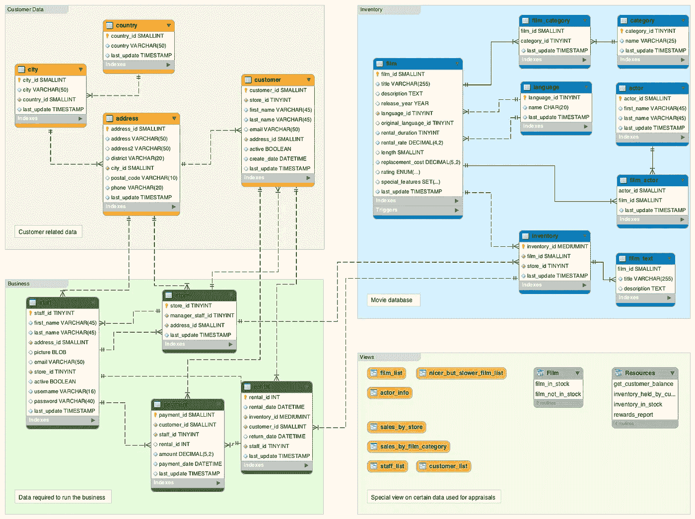
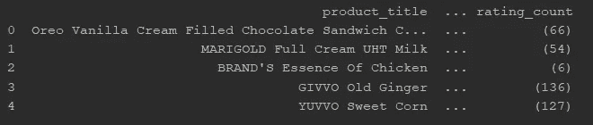
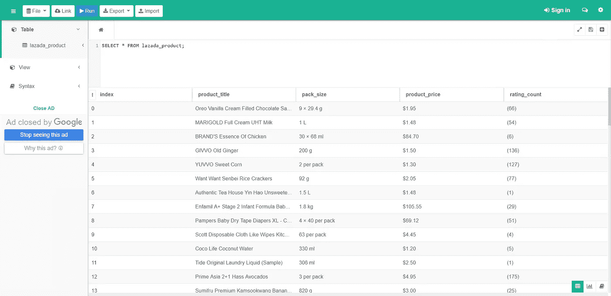

# 面向数据专业人员的关系数据库管理(RDBMS)基础

> 原文：<https://towardsdatascience.com/relational-database-management-rdbms-basic-for-data-professionals-aca3567f03da?source=collection_archive---------7----------------------->

## 数据专业人员权威指南

## 使用 Python SQLite3 和 SQLAlchemy 的基本 RDBMS


Source from Unsplash

数据科学家需要每天与数据库打交道。作为数据分析师和工程师，我们需要精通 SQL 和数据库管理。了解 RDBMS 将有助于我们访问、交流和处理数据。它将允许我们更快、更稳健地存储和过滤替代数据。

## 在本教程中，我们将学习如何:

1.  设置 SQLite 磁盘连接
2.  创建具有结构的表
3.  将数据框值插入表中

在本教程中，我们将学习在 Python 中执行的两种方法。第一个是使用 SQLite 3，这里我们将使用 Python 和 SQL 来执行每个学习点。但是，我们也将简要讨论一下 SQL 炼金术，它允许我们仅用 4 行代码就能执行这些学习要点。(不开玩笑！)

在此之前，我们先来谈谈 RDBMS

# 什么是 RDBMS？

> 一个*关系数据库*是一种数据库。它使用的结构允许我们识别和访问数据库中与另一条数据相关的数据*。通常，关系数据库中的数据被组织成表。法典编纂*

关系数据库使用被称为**记录**的表。这些记录拥有**多个列**，这些列具有不同的**名称**和**数据类型**。然后，我们可以通过使用**主键**和**外键**来识别表模式关系，从而在记录之间建立连接。



Data Schema Sample for RDBMS

# 为什么不只是？csv 或。xlsx 对比 RDBMS (SQL)？

如今，Excel 和 csv 在存储我们的数据需求方面存在许多限制，而 RDBMS 可以解决这些限制:

## 容量

数据生态系统每天都在变化，今天被认为是大而快的东西，明天可能就不是了。这意味着我们需要一个能够灵活承载大量数据的专用存储。我们需要比 Excel 和 csv 更具可扩展性的存储。RDBMS 是解决方案—它允许基于服务器分布的可伸缩性，而不是基于行数和列数有限的 Excel，048，576 行乘以 16，384 列)。

## 具有已定义关系的依赖性

RDBMS 允许用户在表之间建立定义的关系。这将给用户一个完整的数据定义画面。例如，在您的购物收据中，您可能有几个实体，如产品描述、商品价格、商店分店位置等。所有这些都可以根据需要进行分离和合并。

## 分析没有从数据中分离出来

我们现在可以将数据与分析分开存储。在 Excel 中，我们需要管理不同的版本来与您的团队成员协作。每个文件都需要结合不同版本的数据和分析。但是，在 RDBMS 中，我们现在可以使用 SQL 指令分别重现和分析数据。这样，我们可以确保您的团队从中央数据服务器生成更新的数据和分析。

如果您想了解更多信息，请参考这篇 Codecademy 文章。

[](https://news.codecademy.com/excel-to-sql-why-switch/) [## Excel 到 SQL:为什么您应该进行转换

### 如果您在工作中使用 Excel 或 Google Sheets 等电子表格应用程序，这些问题可能对您来说很熟悉:它…

news.codecademy.com](https://news.codecademy.com/excel-to-sql-why-switch/) 

对于数据专业人员来说，这项技能很有价值。它创建了一个一站式数据存储，每个人都可以从他们的 SQL 指令中获得相同的更新数据。

# 为什么我们选择 SQLite 而不是 PostgreSQL？

SQLite 为基于磁盘的数据库提供了一个轻量级的 C 库，允许 SQL 处理 CRUD 进程。这意味着我们可以在许多小型应用程序/用例中依赖 SQLite:

1.  SQLite 用于快速方便的内部数据存储
2.  SQLite 快速开发小型原型
3.  在通过 PostgreSQL 或 Oracle 迁移到更大的数据库之前，SQLite 托管概念证明(POC)。

PostgreSQL 是一个非常先进的开源数据库，提供专用的数据服务器来运行其数据库。但是，SQLite 提供了不需要专用数据服务器的轻量级设置。

如果我们的数据需求包括适当的管理和安全性，那么 PostgreSQL 将是合适的选择。否则 SQLite 也行。

[](https://tableplus.io/blog/2018/08/sqlite-vs-postgresql-which-database-to-use-and-why.html) [## SQLite 与 PostgreSQL——使用哪个数据库，为什么？

### SQLite 和 PostgreSQL 是最广泛使用的关系数据库管理系统(RDMS)。他们都是…

tableplus.io](https://tableplus.io/blog/2018/08/sqlite-vs-postgresql-which-database-to-use-and-why.html) 

为了构建本文的 POC，我们将使用 SQLite。但是可以尝试使用 PostgreSQL。

# 将来自 Lazada 的数据提取插入 SQLite

## 问题陈述

我们将重用从 Lazada 中提取关键产品信息的问题。我们将把它导出到 SQLite 数据库，而不是导出到 csv。



product_df to store scraped information at Lazada Website

如果你对此不熟悉，请随意浏览我下面的文章。

[](/in-10-minutes-web-scraping-with-beautiful-soup-and-selenium-for-data-professionals-8de169d36319) [## 10 分钟内:为数据专业人员提供美味汤和硒的网络刮擦

### 使用 BS4 和 Selenium 快速提取关键信息

towardsdatascience.com](/in-10-minutes-web-scraping-with-beautiful-soup-and-selenium-for-data-professionals-8de169d36319) 

对于本教程，我们将首先使用 SQLite3 来生成到 SQLite 引擎的连接。这将允许我们执行 SQL 命令来插入值。之后，我们将研究 SQLAlchemy 来缩短和简化这个过程，而不需要创建任何 SQL 命令。

# Python SQLite3

## 连接到 SQLite 磁盘

我们首先建立到磁盘文件 lazada.db 的连接，这是 SQLite 引擎用来存储数据的磁盘。如果 lazada.db 不存在，它将创建一个新的，下次我们可以连接它。

```
import sqlite3
conn = sqlite3.connect("lazada.db")
c = conn.cursor()
```

注意，当我们打开连接时，我们也建立了一个游标。数据库游标是一种遍历数据库记录的工具。使用这个游标，我们可以创建表并在数据库磁盘中执行 SQL 命令。

## 创建 lazada_product 表

在将我们的 SQLite3 连接到 *lazada.db* 之后，我们将使用游标执行 SQL 查询并创建 *lazada_product* 表。我们将我们的元数据标识如下。

```
c.execute('''
    CREATE TABLE lazada_product (
    time date_time ,
    id **INTEGER** ,
    link **TEXT** NOT NULL,
    product_title **TEXT** NOT NULL,
    product_price **DOUBLE** NOT NULL,
    category **TEXT** NOT NULL,
    PRIMARY KEY (time, id)
    );
    ''')
```

注意我们是如何将 time 和 id 指定为主键的。这意味着每一行都有唯一的 id 和日期时间。如果我们插入具有相同 id 和日期时间的行；SQLite 会抱怨并返回一个重复的错误。这种验证有助于防止不干净的冗余数据进入数据库。

## 将 df 行插入 lazada_product 表

让我们将提取的 product_df 插入到 lazada_product 表中。

```
def write_from_df_with_sqlite3(df):
    for index, row in df.iterrows():
        c.execute(
        '''
            INSERT INTO lazada_product VALUES 
              (*CURRENT_TIMESTAMP*,?,?,?,?,?)
        ''',
            (row['id'], row['link'],row['product_title'],row['product_price'],
            row['category'])
        )
```

一旦运行这个方法，您将成功地将每个值转储到您的 lazada_product 表中。

> 祝贺您，您已经创建了 RDBMS 表并向其中插入了数据

注意，SQLite3 Python 有一个限制。当您将 SQL 命令和 Python 代码组合在一个文件中时，代码可能很难阅读。它看起来也很冗长。

因此，我们将看看如何使用 SQLAlchemy 以一种更短的、无 SQL 的方法来执行表和数据插入。

# Python 对象关系映射器(ORM) SQLAlchemy

SQLAlchemy 是一个激活数据库引擎的 Python ORM。它在 SQLite 的 SQL 执行之上创建了一个 pythonic 包装器。这允许您在不接触任何 SQL 命令代码的情况下对表运行逻辑。

## 什么是对象关系映射器(ORM)？

ORM 提供了一个高级抽象，允许开发人员编写 Python 代码来调用数据库中 CRUD 和模式的 SQL。每个开发人员都可以使用他们熟悉的编程语言，而不是处理 SQL 语句或存储过程

## 连接到 SQLite 引擎

```
from sqlalchemy import create_engine
disk_engine = create_engine('sqlite:///lazada_alchemy.db')
```

## 创建 lazada_product 表并插入 df 行

```
def write_from_df_with_alchemy(df):
    df.to_sql('lazada_product', disk_engine, if_exists='append')
```

看看这段代码有多简洁。运行这个方法后，我们立即根据 df 数据类型创建带有默认设置的表。同时，我们将把值追加到 lazada_product 表中，而不涉及任何 SQL。

因此，SQLAlchemy 最大的优点是促进 SQL 命令的高级抽象，以帮助 Python 开发人员使用同一种语言提取数据。

> 执行 SQL 而不运行 SQL 查询。— SQLAlchemy

当然，这不应该取代懂 SQL 语言的重要性。我们可以用 SQL 更好地处理更多的复杂性。然而，要对数据表的设置和插入进行编码，SQLAlchemy 将为您节省大量时间和精力。

# 访问我们的 SQLite 磁盘

为了检查我们磁盘的内容，我们可以使用下面的 Web Dashboard 工具。

 [## SQLite 浏览器- SQL Online

### JavaScript 上的 SQL 在线。用户友好的界面。不下载，不安装。在线测试 SQL 脚本…

sqliteonline.com](https://sqliteonline.com/) 

从这里，您可以将磁盘作为文件插入，并编写一个简单的 SQL select 语句。

```
SELECT * from lazada_product
```

单击 run，这将显示您在 lazada_product 中的所有数据。



The results after inserting lazada_product inside the table. In total there are 108 products appended

> 恭喜你，你已经学会了 RDBMS 和使用 Python SQLite3 和 SQLAlchemy 插入值

# 结论

1.  RDBMS 为 csv 或 excelsheet 提供了许多好处，因为它具有更大的**容量、依赖性检查以及分析和数据的分离**
2.  **创建**一个**简单的 RDBMS** 并不需要太多时间，我们可以使用 **SQLAlchemy** 来创建模式，只需用**的 4 行代码**。
3.  我们可以通过使用 SQLite 浏览器在线或**下载 Linux 或微软 SQLite 浏览器**来**恢复读取和 CRUD 操作。**

# 目的、Github 代码和您的贡献

[](https://github.com/VincentTatan/Web-Scraping/tree/master/Selenium%20Web%20Scraping) [## Vincent tatan/网页抓取

### 美汤硒网刮。为 VincentTatan/Web 抓取开发做出贡献，创建一个…

github.com](https://github.com/VincentTatan/Web-Scraping/tree/master/Selenium%20Web%20Scraping) 

请随意克隆存储库并做出贡献。

## 最后…

我真的希望这是一本很棒的读物，是你发展和创新的灵感来源。

请在下面**评论**出来建议和反馈。

快乐编码:)

# 关于作者

Vincent Tatan 是一名数据和技术爱好者，拥有在 Visa Inc .和 Lazada 实施微服务架构、商业智能和分析管道项目的相关工作经验[。](https://bit.ly/2I8jkWV.)

Vincent 是土生土长的印度尼西亚人，在解决问题方面成绩斐然，擅长全栈开发、数据分析和战略规划。

他一直积极咨询 SMU BI & Analytics Club，指导来自不同背景的有抱负的数据科学家和工程师，并为企业开发他们的产品开放他的专业知识。

请通过[**LinkedIn**](http://www.linkedin.com/in/vincenttatan/)**、**[**Medium**](https://medium.com/@vincentkernn)**或** [**Youtube 频道**](https://www.youtube.com/user/vincelance1/videos) 联系文森特