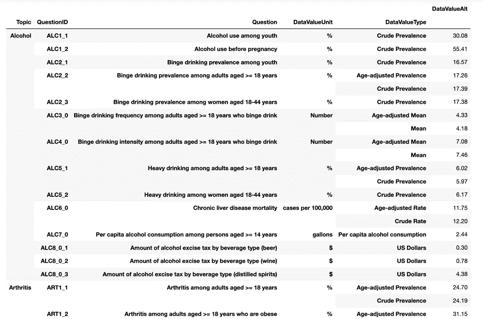
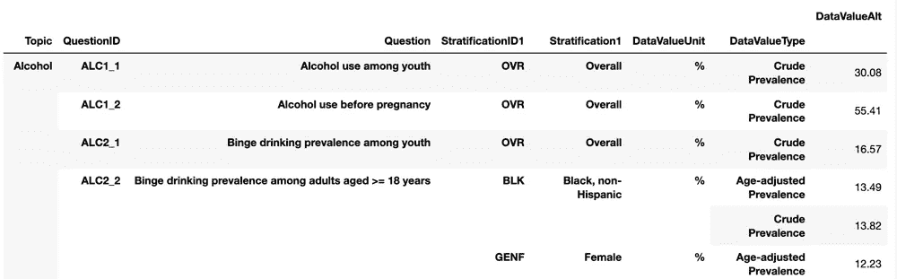
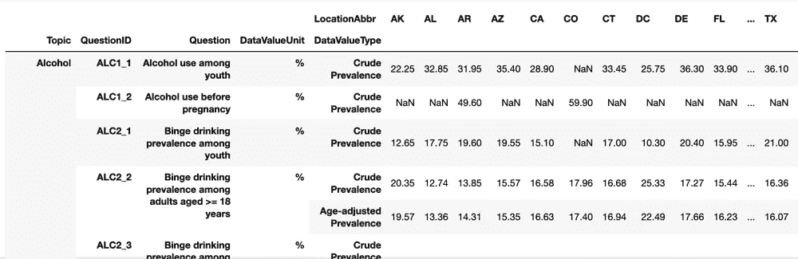
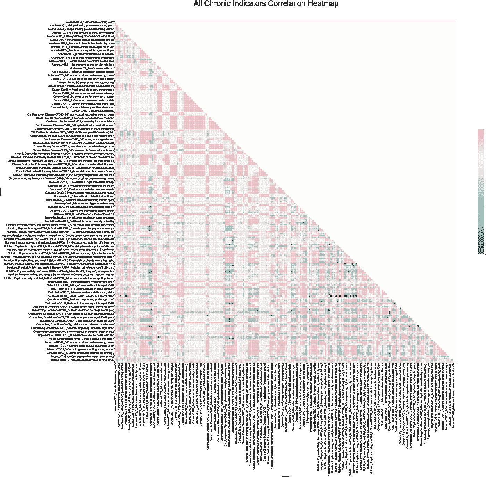
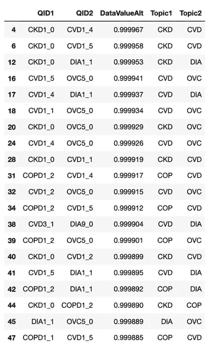

# 验证人群健康慢性指标之间的关系

> 原文：<https://towardsdatascience.com/relationships-validated-between-population-health-chronic-indicators-b69e7a37369a?source=collection_archive---------16----------------------->

## 糖尿病、慢性肾病和心血管疾病之间的联系


Photo by [v2osk](https://unsplash.com/@v2osk?utm_source=medium&utm_medium=referral) on [Unsplash](https://unsplash.com?utm_source=medium&utm_medium=referral)

在[的最后一个故事](https://medium.com/@danielwu3/inspecting-a-cdc-chronic-disease-dataset-e1685a6b525a)中，我们开始研究美国疾病控制和预防中心(CDC)15 年的慢性病数据集。探索性数据分析始于理解数据的列和行，以及与进一步分析相关的内容。

在这篇文章中，我们将深入理解这 40 万行和 17 个主题类别，这需要将数据帧转换成数据透视表汇总和可视化的格式。在看了前面的 df_new.head()之后，我认为我们不会使用下面的列，这导致了 15 列的较小集合:

```
df_new = df_new.drop(columns=['YearEnd','LocationDesc','DataSource','DataValue','DataValueFootnoteSymbol','DatavalueFootnote','LowConfidenceLimit','HighConfidenceLimit','GeoLocation'])<class 'pandas.core.frame.DataFrame'>
RangeIndex: 403984 entries, 0 to 403983
Data columns (total 15 columns):
YearStart                    403984 non-null int64
LocationAbbr                 403984 non-null object
Topic                        403984 non-null object
Question                     403984 non-null object
DataValueUnit                374119 non-null object
DataValueType                403984 non-null object
DataValueAlt                 273666 non-null float64
StratificationCategory1      403984 non-null object
Stratification1              403984 non-null object
LocationID                   403984 non-null int64
TopicID                      403984 non-null object
QuestionID                   403984 non-null object
DataValueTypeID              403984 non-null object
StratificationCategoryID1    403984 non-null object
StratificationID1            403984 non-null object
dtypes: float64(1), int64(2), object(12)
```

**表 1:按主题、问题和值汇总**

使用数据透视表(很像 Excel)，让我们总结每个问题及其相关值。为了通知每个问题和值，我们将从每个问题的类别(主题)、问题 ID、问题、数据单元(数据值单元)以及与稍后的分层相关的数据类型(数据值类型)创建多个索引。Pandas Pivot_table 需要数值，默认为平均值(numpy.mean)。此外，我已经删除了 LocationID 和 YearStart 列，因为我以后不会使用它们，并且为了可读性，将其四舍五入为两位小数:

```
df_QD = df_new.pivot_table(index=['Topic','QuestionID','Question','DataValueUnit','DataValueType'],columns=None,dropna=True)df_QD.drop(columns=['LocationID','YearStart']).round(2).head(25)
```



Table 1\. Pivot Table showing the Question and Values

**表 2:使用带有分层、问题和值的 Groupby】**

除了 pivot_table，我还可以使用 groupby()创建一个类似的汇总表。我想在生成的数据帧中展示更多关于分层的信息。

```
df_unittype_table1 = df_new.groupby(['Topic','QuestionID','Question','StratificationID1','Stratification1','DataValueUnit','DataValueType']).mean().round(2)df_unittype_table1.drop(columns=['YearStart','LocationID'])
```



Table 2\. Using groupby() to summarize stratification

**表 3:按问题和地点汇总**

一种有趣的方法是用数据值按每个状态(LocationAbbr)显示数据。下面的数据透视表包括额外的索引，这些索引为诸如单位和类型之类的数字提供了上下文。

```
df_new_qloc = df_new.pivot_table(values='DataValueAlt',index=['Topic','QuestionID','Question','DataValueUnit','DataValueType'], columns='LocationAbbr',aggfunc='mean',dropna=True).round(2)
```



Table 3\. Pivot Table of Question and Location

**可视化所有指标之间的相关性**

现在，我们已经看到这些表格按问题、分层和位置呈现数据值。那还是很多信息啊！我们先来了解一下问题指标本身说明了什么。每对问题指示器之间有什么关系？这就是数据可视化将描绘出一幅理解整体关系的图画的地方。

最初，我使用表 3 中的 pivot_table，但是轴标签太长了，很难阅读。稍微倒退一下，我们将基于新的列问题创建一个不同的 pivot_table (df_new_qloc2 ),取问题的前 37 个字符:

```
df_new['QuestionAbbr'] = df_new['Question'].str[:37]df_new_qloc2 = df_new.pivot_table(values='DataValueAlt',index=['Topic','QuestionID','QuestionAbbr'], columns='LocationAbbr',aggfunc='mean',dropna=True).round(2)
```

通过转置 df_new_qloc2 数据透视表，我们准备应用关联方法。corr()并将数据可视化。使用来自 [seaborn](https://seaborn.pydata.org/examples/many_pairwise_correlations.html) 文档的代码，我们可以绘制一个相关矩阵热图。这使每一对指标可视化，以了解正相关对位于何处。由于相关矩阵会在对角线的上方和下方产生重复的视图，为了简单起见，我们将通过使用 np.zeros_like()创建一个零数组并使用 triu _ indices _ from()返回对角线上方区域的索引来屏蔽热图的上半部分。使用 matplotlib，我们设置了一个大的图形尺寸，以允许在 jupyter 笔记本上放大。cmap 为图形设置色彩映射表(更多选项[此处](https://seaborn.pydata.org/generated/seaborn.diverging_palette.html))。最后，sns.heatmap()使用遮罩呈现热图。

```
# Table 4 - Using Table 3 with question indicators as columns
new_qloc2_corr = df_new_qloc2.transpose().corr()# Generate a mask for the upper triangle
mask = np.zeros_like(new_qloc2_corr, dtype=np.bool)
mask[np.triu_indices_from(mask)] = True# Set up the matplotlib figure
f, ax = plt.subplots(figsize=(150, 150))
f.suptitle('All Chronic Indicators Correlation Heatmap', x=0.4,y=0.85,fontsize=150)
ax.tick_params(labelsize=50)# Generate a custom diverging colormap
cmap = sns.diverging_palette(190, 10, as_cmap=True)# Draw the heatmap with the mask and correct aspect ratio
sns.heatmap(new_qloc2_corr, mask=mask, cmap=cmap, vmax=.3, center=0,square=True, linewidths=2, cbar_kws={"shrink": .3})
```



Figure 1\. All Indicators Correlation Heatmap (Higher Correlation in Pink)

即使做了一些调整，信息也是密集的，可以更方便用户阅读(我们将在下一篇文章中解决这个问题)。尽管如此，热图轴显示了主题、问题 ID 和缩写问题 QuestionAbbr。我们可以看到一些粉红色的区域正相关程度更高，绿色的区域负相关程度更高。从视觉上看，心血管疾病(CVD)和癌症(CAN)的某些领域似乎具有更高的相关性。看到这个演示很有帮助，但最终，我们希望通过创建一个顶级相关性列表来获得更细粒度的外观。

**表五。指标对顶部关联表**

仅从 df_new 中取出 QuestionID、LocationAbbr 和 DataValueAlt，我创建了 new_qloc2_1_corr 表。使用线性代数，我们可以通过将 new_qloc2_1_corr 相关数据帧和与先前数据帧形状相同但值为 1 的数组的下半部分相乘来对数组进行矢量化。的。stack()将数组放入一个列表中。sort_values()将列表按降序排序。Top_corr 由大约 36k 项组成。

```
top_corr = (new_qloc2_1_corr * np.tril(np.ones(new_qloc2_1_corr.shape),-1)).stack().sort_values(by=['DataValueAlt'],ascending=False)
```

通过几个额外的步骤来重置索引，更改列名，并根据 QuestionID 添加几个新列，我们就有了一个包含顶部相关对的数据框架。由于主题有许多重复对，我将删除重复项，不包括主题类别的相同指标对，这样会产生大约 33k 个项目:

```
top_corr_pair_dd = []for row in range(len(top_corr_pair)): if top_corr_pair.loc[row]['Topic1'] != top_corr_pair.loc[row].     
     ['Topic2']:
          top_corr_pair_dd.append(top_corr_pair.loc[row])
```



Table 5\. Top Correlation by Topic Descending

在这一点上，我们看到了指标中出现的主题。表 5 向我们展示了基于主题类别的特定模式。例如，慢性肾病(CKD)和心血管疾病(CVD)中的那些问卷(QID1 和 QID2 列)；慢性肾病和糖尿病患者(DIA)；CVD 和 DIA 内的那些；总体条件内的指标(OVC)和先前指标；最后，患有 DIA 和 CVD 慢性阻塞性肺病(COP)的患者。

总的来说，我们看到 CVD、CKD 和 DIA 等指标之间的关系，这有意义吗？

心血管疾病包括许多与心脏相关的疾病，包括心律失常(不正常的不规则心脏跳动)、高血压(对动脉壁的高作用力)、心脏骤停(功能突然丧失)、冠状动脉疾病(主要血管受损)和充血性心力衰竭(心脏泵血不畅的慢性疾病)。这是一种非常常见的疾病，源于血管堵塞，影响着四分之一的美国人。据 [CDC](https://www.cdc.gov/heartdisease/facts.htm) 称，增加这种疾病的风险因素包括饮食、肥胖、糖尿病、过度饮酒和缺乏锻炼。

慢性肾脏疾病是肾脏及其功能丧失导致衰竭的长期疾病，也称为终末期肾脏疾病(ESRD)。这也是一种常见的疾病，影响着七分之一的美国人。根据[梅奥诊所](https://www.mayoclinic.org/diseases-conditions/chronic-kidney-disease/symptoms-causes/syc-20354521)的说法，增加这种疾病的风险因素包括糖尿病、高血压、吸烟、心血管疾病、老年和某些种族背景。在肾病患者中，心血管疾病倾向于“诊断不足和治疗不足”(S，Hernandez GT。慢性肾脏疾病和心血管疾病之间的联系。 *J 肾病学*。2014;3(3):99–104.).根据美国肾脏基金会的说法，当肾脏的功能没有达到最佳状态时，这需要心脏和心血管系统更加努力地工作。

糖尿病与体内葡萄糖失调有关，包括一些疾病，如 1 型、2 型和妊娠糖尿病。虽然 1 型糖尿病的原因不明，如家庭背景和环境，但妊娠期糖尿病通常伴随着妊娠而来。二型糖尿病与上述疾病有相似的风险因素，包括缺乏锻炼、年龄、家庭背景、高血压、体重、多囊卵巢综合征和胆固醇/甘油三酯水平异常(来源:[梅奥诊所](https://www.mayoclinic.org/diseases-conditions/diabetes/symptoms-causes/syc-20371444))。患有糖尿病会导致各种并发症，包括心血管和慢性肾脏疾病。

> 答案是肯定的！该数据集与文献一致，表明心血管疾病、慢性肾病和糖尿病之间存在高度相关性。

在本系列的最后一篇博文中，我们将继续深入了解以下内容:

*   首要条件是什么？
*   具体的顶级指标还有哪些亮点？
*   按年份和分层我们能看到什么趋势？

希望你喜欢读到这里，并随时给我一些想法和建议！