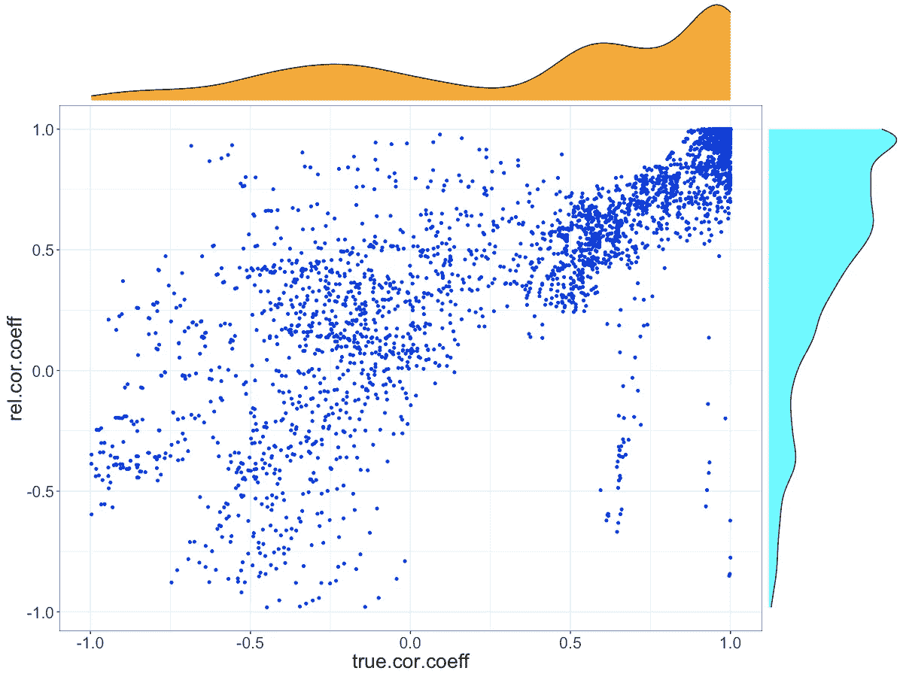
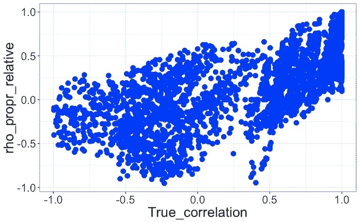

# 相对与绝对:如何进行成分数据分析？第二部分

> 原文：<https://towardsdatascience.com/relative-vs-absolute-how-to-do-compositional-data-analyses-part-2-f554eb9b26e?source=collection_archive---------11----------------------->

这是我早先关于成分数据分析的文章的延续，在那篇文章中，我展示了将成分数据视为绝对数据而不是相对数据的缺陷。在这篇文章中，我将总结我们可以用来正确分析成分数据的技术，并用具体的例子展示使用 [RNA-Seq](https://en.wikipedia.org/wiki/RNA-Seq) 数据。

有两种主要策略用于处理成分数据，特别是 NGS 数据:
1。归一化以取回绝对计数
2。成分数据分析(CoDA)方法，在样品参考范围内转换数据(例如:ALR、CLR)

# 绝对计数标准化

当需要跨样本比较时，这是 NGS 数据预处理中最广泛使用的技术。相对读取计数被“标准化”为总读取深度，以“恢复”绝对计数。然而，当 RNA 或细胞的总绝对量或相关生物材料的量在样品间显著变化时，这不能恢复绝对计数。这通常会给分析人员带来错误的安全感，并导致将这些“标准化”样品视为绝对计数。在样本间进行比较时，这可能会导致错误的结论。让我们用模拟数据来证明这一点。

## 模拟细节

这里，我模拟了 100 个基因的数据，其中
a. 5 个基因在对照和实验条件之间具有 1 的真实对数倍数变化(在选择下接近耐受或不生长)；
b . 2 个基因在实验条件下具有与> 1 相同的真实对数倍数变化(在选择下耐受并表现出生长)；
c . 2 个基因在实验条件下具有与< 1 相同的真实对数倍数变化(不耐受或耐受)，
我模拟了其余 91 个基因的不同比例发生变化的 5 种不同情况。在发生变化的基因中，约 90%被耗尽，约 10%被富集。
其他基因的缺失/富集影响相对计数值和读取深度标准化计数，即使总读取深度固定在 200K 读取

## 读取深度标准化(RDN)计数

1.  **差异表达或丰度:**即使所有读数具有相同的总深度(计数之和)，使用读数深度标准化计数(RDN 计数)计算的基因对数倍数变化(LFC)与真实的对数倍数变化相比有所偏移(见下图 1)。有趣的是，转变的方向并不总是可以根据基因改变的比例来预测的。例如，当大约 70%的基因改变时，使用 RDN 计数计算的 LFC 与真实的 LFC 相比下移。另一方面，当 90%的基因改变时，使用 RDN 计数计算的 LFC 与真实 LFC 相比向上移动。这是因为前一种情况下的绝对真实计数高于后一种情况。一般来说，我们无法预测或估计样本的真实总绝对计数。

Fig 1: Comparing True Log-Fold Changes to Log-Fold Changes Calculated using RDN Counts

**2。基因之间的相关性:**看事物如何在相对计数和绝对计数之间进行比较。，我计算了所有 5 个样本中非恒定基因的相关性(每个样本都有 0.1、0.2、0.4、0.6、0.9 个比例的变化基因)。在 200K 读取深度下，我使用了真实计数和使用[聚酯](https://github.com/alyssafrazee/polyester)模拟计数数据的相对计数。

Fig 2: Comparing True Correlations Between Genes to Correlations Calculated using RDN Counts

从上图可以看出，使用 RDN 计数计算的一些相关系数与真实相关系数有显著差异，存在负偏差。

上面的两个例子显示了使用 RDN 计数来估计基因之间的差异表达或相关性的缺陷。当试图从相对组成数据中恢复绝对计数时，应始终使用加标控制，而不是使用 RDN 计数。接下来我们将展示这一点

## 峰值标准化计数

为了真正校正绝对计数的变化，我们需要在测序步骤之前以相同的丰度(数量)添加到所有样品中的掺入对照或基因。这样做可以将所有样本标准化到相同的总丰度级别，并使比较正确。这仅在数据由于测序而关闭时有效(因为我们是在测序之前添加掺入物)，如果约束是生物学的或者发生在测序步骤的上游，这将没有帮助。在这种情况下，我们需要在这个约束步骤之前添加尖峰，但是由于添加尖峰的物理和生物限制，这并不总是可能的。
让我们用我们的数据来看看这是如何工作的。在我们的数据中，我们有 92 个不同的对照或掺入基因，它们具有真正的绝对丰度。让我们使用这些来“标准化”数据，从而使所有样本达到相同的绝对计数范围。

1.  **差异表达或丰度:**下面的图 3 类似于图 1，但是用掺入标准化计数代替 RDN 计数。该图添加了人工抖动(噪声)来显示所有数据，但真实数据都位于对角线上。这表明了插队的力量。如果刚好在导致数据闭合或约束的步骤之前添加尖峰信号，则适当设计的尖峰信号可以恢复绝对计数(达到常数乘法因子)，但这并不总是可能的。

Fig 3: Comparing True Log-Fold Changes to Log-Fold Changes Calculated using Spike-in Normalized Counts

2.**基因之间的相关性:**查看基因之间的相关性，我们看到使用尖峰标准化计数计算的系数可以恢复真实的系数。下图 4:

Fig 4: Comparing True Correlations Between Genes to Correlations Calculated using Spike-in Normalized Counts

看来我们找到了解决问题的方法。我们所要做的就是添加一些控制，我们很好！不幸的是，没那么快。在这个模拟的案例中，组成数据的闭合来源是测序，我们能够在模拟测序数据之前添加一些控制。在现实生活的数据生成过程中，闭包的来源可以出现在提取 DNA/RNA 的通常复杂的工作流程中的任何地方。此外，生物系统本身可能是固有组成的(例如，细胞产生 RNA 的能力是有限的)，在这种情况下，细胞外引入的尖峰信号不能恢复真实的绝对计数。

# 成分数据分析(CoDA)方法

一种替代掺入归一化的方法是使用 CoDA 方法，这种方法通常根据样本内参考转换计数数据。加法对数变换(ALR)和中心对数变换(CLR)是一些常用的尾波变换的例子。这些方法最初是由 John Aitchison 在 1986 年提出的。核心思想是组件相对于另一个参考组件的对数比变换可以被视为任何其他无约束数据。这将数据从原始的单纯形空间(如我们在[第一部分](https://medium.com/@krishna.yerramsetty/relative-vs-absolute-understanding-compositional-data-with-simulations-fdc15e0c781e?source=friends_link&sk=e77346ead8198083d479364fba2632e0)中的三元图)转换到欧几里得空间。这使得我们可以对这些数据使用所有经典的分析技术。

注意:这些技术并不像前一节中的“规范化”方法那样要求开放数据。这些技术也适用于所有数据，无论是相对数据还是绝对数据。另一点需要注意的是，使用尖峰信号进行归一化与使用加性对数比(ALR)变换是一样的。使用一般 ALR 变换的好处是，即使我们没有样品间丰度恒定的掺入，它也是适用的。一般 ALR 变换的缺点是，我们需要正确选择基准电压源，以理解数据并回答相关问题。现在让我们使用和以前一样的数据集来更详细地看看 CoDA 方法。

**1。差异表达或丰度:**有许多方法可以发现处理前后成分数据的变化。令人惊讶的是，这些方法中有许多来自微生物组文献，而基因表达文献主要依赖于传统方法，如 [DESeq2](https://bioconductor.org/packages/release/bioc/html/DESeq2.html) 和 [EdgeR](https://bioconductor.org/packages/release/bioc/html/edgeR.html) ，这些方法没有明确考虑数据的组成性质。DESeq2 和 EdgeR 隐含地假设绝对丰度不会因处理而改变。[这相当于使用 CoDA 方法](https://academic.oup.com/bioinformatics/article/34/16/2870/4956011)的中心对数比(CLR)转换。这种转化使用基因或组分的几何平均值作为参照，因此所有结果都必须根据几何平均值来解释。在这个阶段，很容易将这种假设解释为基因的几何平均值在对照组和治疗组之间没有变化。也许几何平均数改变了，也许没有，除了来自测序的相对计数之外，没有正交信息，没有办法确切知道。DESeq2 和其他差异表达工具的大多数用户都落入了这个陷阱，并认为算法调用的任何重大变化都意味着绝对计数的重大变化。相反，这些只是相对于所有组件的几何平均值的显著变化。

有一些新兴的方法将统计学的严谨性应用于成分数据中的 DA。最流行的方法是 [ALDEx2](https://bioconductor.org/packages/release/bioc/html/ALDEx2.html) 和 [ANCOM](http://scikit-bio.org/docs/0.4.2/generated/generated/skbio.stats.composition.ancom.html) 。这些方法的主要原理是依靠相对于参考成分的转换相对数据的对数比测试，并仔细解释这些结果。这些方法的主要问题是只能根据所选的参比来解释结果，并且没有提供如何选择参比的指导。[朱利亚诺·克鲁兹](https://medium.com/u/26642ecd871f?source=post_page-----f554eb9b26e--------------------------------)给我介绍了一种更近的方法，这种方法使用了差异排名(DR)并提出了一种更合理的选择参考的方法。这是我将在这里简要使用的，并希望在将来的某个帖子中深入到运行这些算法的血淋淋的细节。

DR 的主要思想是选择一些随机参考成分来计算治疗和对照中所有成分的对数比。在下一步中，这些成分按照它们在处理和控制条件之间的差δ(对数比)的顺序排列。使用已知相对计数计算的δ(对数比)值的等级顺序应该与使用未知真实绝对计数计算的δ(对数比)值的等级相同。例如，对于 90%的基因差异表达的情况，我在下面显示了使用相对计数计算的δ(对数比)值与使用绝对计数计算的δ(对数比)值:

Fig 5: Δ(log-ratio) values Calculated using Absolute vs. Relative Counts

如您所见，δ(对数比)值的大小因我们使用相对计数还是绝对计数而异，但δ(对数比)值的等级保持不变。这并不意味着排名靠前的基因在治疗中的数量高于对照组，而排名靠后的基因数量较低。可能发生的情况是，与对照条件相比，在治疗条件下，排名靠前的基因已经耗尽了绝对计数，但是在治疗条件下，排名靠后的基因的耗尽甚至更糟。简而言之，我们不能说治疗和病情之间的绝对读数有什么变化。

我现在将选择排名第一的基因作为我的参考，并使用这个新的参考再次计算δ(对数比)值。

Fig 6: Δ(log-ratio) Values Calculated using the Top-Ranking Gene as Reference

从该图中，我们可以使用 0.5 的任意截止值，并选择超过该值的任何基因作为我们的潜在 DA 基因进行进一步测试。当然，如果我们想测试更多的基因，我们可以放宽截止日期。

另一个避免选择参照的建议是在人群中建立某种阳性或阴性对照。假设，我们知道一个在治疗条件下绝对丰度会增加的基因，那么我们可以使用这个基因作为计算对数比的天然参考，并对δ(对数比)值进行排序。任何大于 1 的对数比意味着该基因优于阳性对照，而小于 1 的对数比意味着比阳性对照差。更好的是，有 2 个对照来限制效应大小，并参照这两个基因来解释对数比。

在我的模拟中，我每次复制只有一个样本，因此无法进行任何统计分析。在以后的文章中，我将为每个条件生成多个重复，并使用 ALDEx2、ANCOM 和 DR 算法来测试它们的灵敏度和特异性。

2.**基因之间的相关性:**如本系列[第 1 部分](https://medium.com/@krishna.yerramsetty/relative-vs-absolute-understanding-compositional-data-with-simulations-fdc15e0c781e?source=friends_link&sk=e77346ead8198083d479364fba2632e0)所示，相关性不是亚组成连贯的，因此不遵循 CoDA 的原则之一。简而言之，任何两个基因之间的相关系数取决于数据中存在的其他成分或基因。Aitchison 首先提出使用对数比转换值的方差(VLR)来估计两个变量的相关性。例如，为了计算跨 n 个样本的特征或基因 g 和 h 之间的相关性，我们将使用:

VLR 是子成分相干的，因此不会导致伪相关。使用 VLR 的主要问题是，即使当基因 g 和 h 完全相关时，它等于 0，但当基因完全独立时，它没有上限。由于这个比例问题，很难将 VLR 的一个基因对与 VLR 的另一个基因对进行比较。基于 VLR 提出了几种方法/度量来估计组合之间的依赖关系，最著名的是 [SparCC、SPIEC-EASI](https://www.rdocumentation.org/packages/SpiecEasi/versions/1.0.2) 和[比例](https://cran.r-project.org/web/packages/propr/index.html)。在这篇博客中，我只是稍微详细地回顾一下比例。所有这些方法都试图使用 VLR 来导出类似于相关系数的度量，因此可以在不同的成分对之间进行比较。

基于[洛弗尔等人的工作，在 R 包](https://www.ncbi.nlm.nih.gov/pubmed/25775355) [propr](https://cran.r-project.org/web/packages/propr/vignettes/a_introduction.html) 中提出了三个基于比例的度量标准。艾尔。和[奎恩等人。艾尔。](https://www.nature.com/articles/s41598-017-16520-0)这些指标是根据对数转换数据计算的。定义见 [propr](https://cran.r-project.org/web/packages/propr/vignettes/a_introduction.html) 包。下面的 Ai 是指数据中基因或成分“I”的对数转换值。Ai 可以是绝对计数或相对计数，这些定义仍然适用。

1.  phi(φ)= var(Ai-Aj)/var(Ai)
2.  ρ(⍴)= var(ai-aj)/(var(ai)+var(aj))
3.  phis(φs)= var(Ai-Aj)/var(Ai+Aj)

与传统相关系数最接近的度量是 rho，范围从-1 到 1。phi 是无界的，可以从 0 变化到 Inf，phis 是 phi 的对称变体，是 rho 的单调函数。在博客的其余部分，我将重点关注 rho。

***a .使用绝对计数*** :如果我们有一个尖峰控制，我们可以从相对计数恢复绝对计数。由于我们已经有可用的峰值数据，我将使用峰值转换后的数据计算 rho 值，即使用峰值 TPM 计数作为归一化计数的基因 1 的 A = log(TPM _ counts/Spike _ TPM _ counts)。这将恢复原始绝对计数。现在，我们可以使用上面的等式计算ρ值。我将绝对计数和 rho 值之间的相关性绘制如下:

Fig 7: Correlations of True Absolute Counts Between Genes vs. Rho Values Calculated using Spike-Normalized Data

从该图中可以看出，使用比例关系，我们可以捕获真实绝对计数之间的大部分原始相关性。当然，这是一个虚构的例子，我们有一个很好的 spike-in 来检索绝对计数。即使有了这个人为的例子，我们仍然可以看到真实的相关性和使用峰值归一化计数计算的比例值之间的一些差异。这是由于基于比例的度量的计算方式使得它们对对数变换值的方差估计极其敏感。这里我们只有 5 个样本来计算方差，在大多数情况下，前 3 个样本具有相同的值。我怀疑这导致了计算分解指标的公式。我得多琢磨琢磨这个。这一假设的证据是，如果我们只寻找在至少 4 个不同样本中具有不同值的分量，则相关值和比例度量匹配得相当好，如下所示:

Fig 8: Correlations of True Absolute Counts Between Genes vs. Rho Values Calculated using Spike-Normalized Data: Only for Genes with At Least 4 Distinct Values out of 5 Samples

一般而言，rho 和其他基于比例的度量具有良好的精度和较差的召回率，并且具有更多样本给出了对方差的更好估计，因此给出了 rho 值的更好估计。此外，引导通常用于建立一个重要关系的界限。例如，在上面的图中，重要“rho”值的临界值可能是 0.75。

***b .使用相对计数*** :这个世界复杂得不公平，不幸的是，我们身边通常没有一个好的替代物可供我们使用😢。因此，我们必须使用相对数据，或者更具体地说，加性对数转换(ALR)相对数据。或者，如果我们确信样本间计数的几何平均值不会改变，我们可以使用中心对数变换(CLR)(我们知道这不适用于此处的模拟数据)。本质上，在这种情况下，我们能做的最好的事情就是计算相关数据之间的关系。因此，让我们比较相对数据(相对于选择的参考基因)的 rho 值与真实绝对计数之间的相关性。下图显示了使用 2 个随机选择的参考基因计算的相对计数之间的相关性:

Fig 9: Correlations of True Absolute Counts Between Genes vs. Rho Values Calculated using 2 randomly chosen reference genes

从上面的图中可以明显看出，参考基因的选择对我们称之为成比例的基因对产生了巨大的影响。我们无法事先知道如何选择比例值的截止值，以确保精确度和召回率之间的良好平衡。Aitchison 提出的 VLR，他的公式在这篇文章的前面已经展示过了，不会有这样的问题，因为当我们取一个基因对中的两个基因的对数比时，参考被抵消了，但是我们不能用 VLR 来比较基因对，因为它没有一个可解释的尺度。不幸的是，我们又回到了起点。这在数学上用 [Erb 和 Notredame](https://link.springer.com/article/10.1007/s12064-015-0220-8) 来解释。另一种选择是不去考虑比例本身，而是计算不同条件下的[微分比例](https://cran.r-project.org/web/packages/propr/vignettes/e_differential.html)。要做到这一点，我们只需要比较不同条件下的基因对，VLR 就足够了，我们不必担心缩放。这篇文章已经太长了，这可能是另一篇文章的讨论。此外，现在我已经看到了基于比例的度量的问题，其他方法，如 [SparCC](https://cran.r-project.org/web/packages/propr/vignettes/e_differential.html) 似乎是一个不错的选择，至少尝试一下。再说一次，也许是为了另一篇文章。总的来说，对于成分数据，基于比例的度量提供了一种有趣的替代基于相关性的度量，但在缺乏良好的加标控制的情况下解释这些数据是很棘手的。

# 外卖食品

总之，在没有加标控制的情况下，没有从相对数据中恢复绝对计数的灵丹妙药。然而，学习 CoDA 方法帮助我更好地理解解释成分数据的细微差别。我认为这类似于贝叶斯统计和频率统计，前者迫使从业者以先验的形式列出所有的假设。在 CoDA 方法的情况下，选择参考迫使用户警惕对数据的错误解释。

你可以在这里找到这篇文章和[之前的文章](https://medium.com/@krishna.yerramsetty/relative-vs-absolute-understanding-compositional-data-with-simulations-fdc15e0c781e?source=friends_link&sk=e77346ead8198083d479364fba2632e0)的所有代码和数据:[https://github.com/kimoyerr/CODA](https://github.com/kimoyerr/CODA)