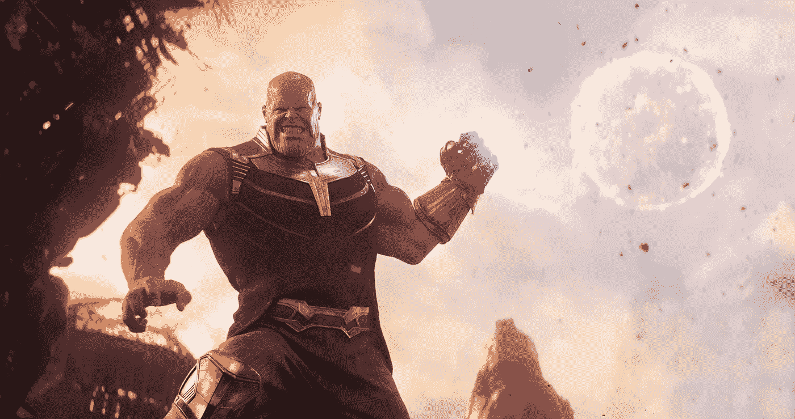
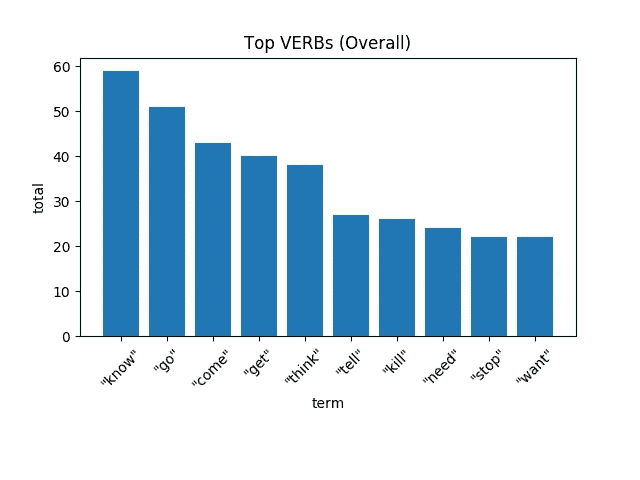
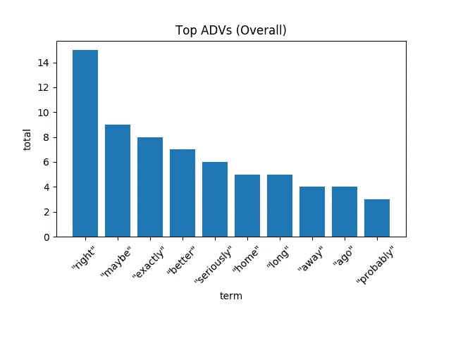
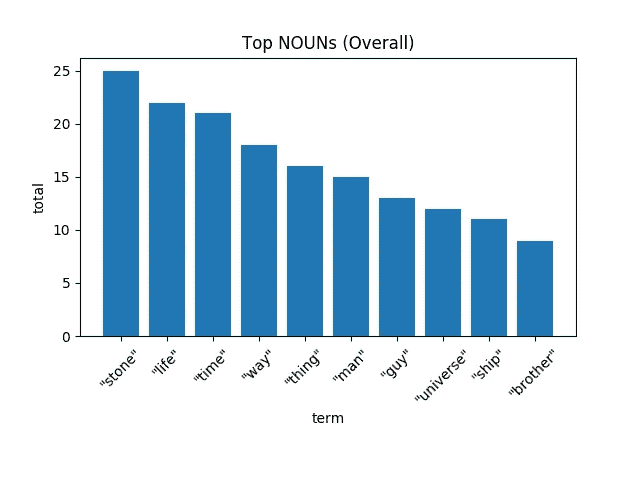
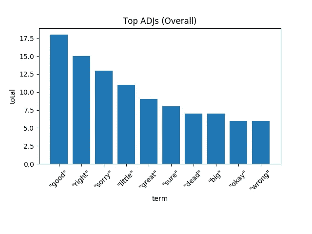
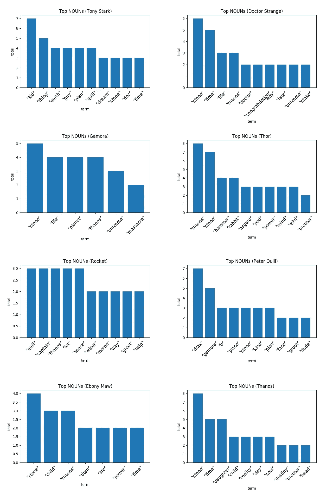
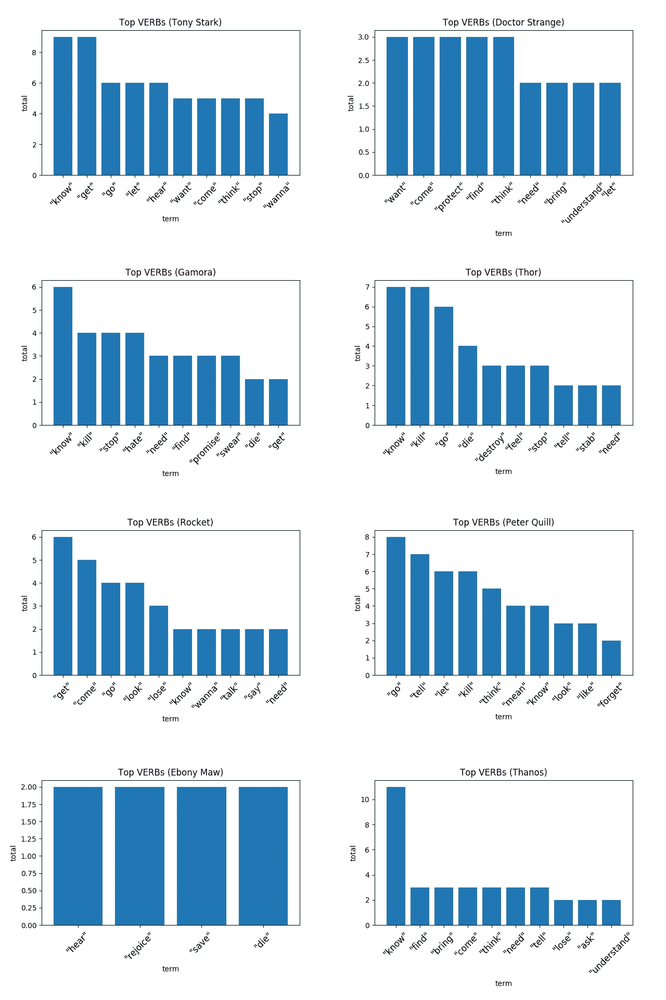
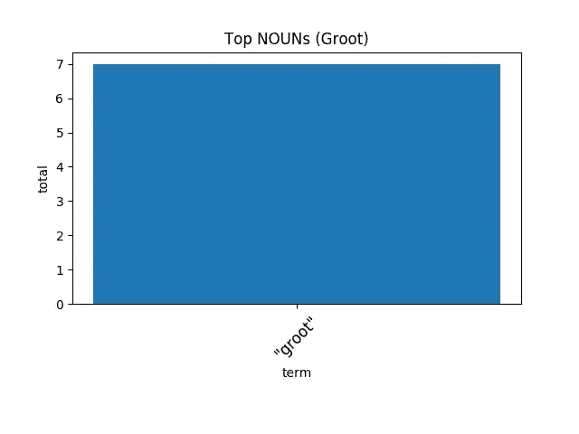
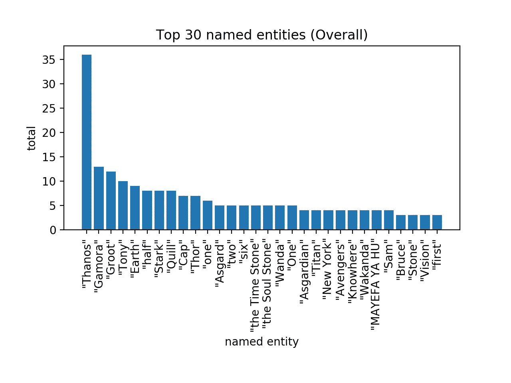

# 用空间和自然语言处理重温复仇者联盟 3：无限战争

> 原文：<https://towardsdatascience.com/reliving-avengers-infinity-war-with-spacy-and-natural-language-processing-2abcb48e4ba1?source=collection_archive---------14----------------------->

## 发现地球上最强大的英雄的台词中的顶级名词、动词、实体和文本相似性

经过漫长的一年等待，复仇者联盟 4：终局之战终于来了。我和你一样，世界上大多数人都会在第一天赶到电影院看电影，体验复仇者联盟如何拯救世界，结束一个十年的故事。为了平静我的神经和缓解等待，我想重温以前的电影，无限战争，但不同的和互动的。而且，因为我是一个数据专家，当然，它必须涉及数据和一些流行词汇。

答案？**自然语言处理**，简称 NLP。

使用 [spaCy](https://spacy.io) ，一个 NLP Python 开源库，旨在帮助我们处理和理解大量文本，我分析了电影的脚本，以研究以下概念:

*   电影中的十大动词、名词、副词和形容词。
*   由特定角色说出的顶级动词和名词。
*   电影中的前 30 个命名实体。
*   每个字符对的台词之间的相似性，例如，托尔和灭霸的台词之间的相似性。

在本文中，我将讨论并展示我的发现，同时用代码解释我是如何用 spaCy 做到这一点的。

你对代码和技术词汇不感兴趣吗？今天是你的幸运日！我想说的是，我在这里使用的词汇和术语大多是非技术和用户友好的，所以即使你没有自然语言处理、人工智能、机器学习或*在这里插入流行语*的经验，你也应该能够掌握我想要传达的主要思想和概念。所以，请随意忽略这些代码:)

The Mad Titan. Credits: [Marvel](https://www.marvel.com/movies/avengers-infinity-war)

## 处理数据

用于实验的数据或文本语料库——在 NLP 中通常被称为——是电影的剧本，可在这个[链接](https://transcripts.fandom.com/wiki/Avengers:_Infinity_War)获得。然而，在使用这些数据之前，我必须对其进行清理。因此，我删除了一些不必要的东西，如描述一个动作或场景的评论，如*“[灭霸粉碎宇宙魔方，露出蓝色的太空石……]”*，以及说这句话的角色的名字(实际上，这个名字是用来知道谁说了什么，但不是用于分析的实际语料库的一部分)。此外，作为空间数据处理步骤的一部分，我忽略了标记为**停止词**的术语，换句话说，即常用词，例如*【我】**【你】**【安】。*另外，我只使用了**引理**，这是每个单词的标准形式。例如，动词 *"talks】、*、*、*、*、【talking】、*是同一个词位的形式，其引理是*、【talk】、*。

要在 spaCy 中处理一段文本，首先，我们需要加载我们的语言模型，然后在文本语料库上调用该模型。结果是一个`Doc`对象，一个保存已处理文本的对象。

Creating a Doc object in spaCy

现在我们有了一个干净的经过处理的语料库，是时候开始了！

## 十大动词、名词、副词和形容词

仅仅通过看**动词**就能知道电影的整体动作或情节是什么吗？本文的第一张图解决了这个问题。

“I know”, “you think” are some of the most common phrases

*【知道】**【走】**【来】**【得到】**【想】**【告诉】**【杀死】**【需要】**【停止】**【想要】*。从中我们可以推断出什么？因为我看过这部电影几次——这也暗示我有偏见——我愿意根据这些动词得出结论，复仇者联盟 3：无限战争是关于知道、思考和研究如何去阻止某事或某人。

这就是我们如何获得带有空间的动词:

描述动词的单词，即**副词**呢？

“I seriously don’t know how you fit your head into that helmet” — Doctor Strange

对于一部关于阻止一个人摧毁半个宇宙的电影来说，口语副词中有很多实证主义——“对”、“完全正确”和“更好”等词就是例子。

所以，我们知道了动作，以及它们是如何被描述的，现在是时候看看**名词**了。

“You will pay for his life with yours. Thanos will have that stone.” — Proxima Midnight

看到第一个结果是*【stones】*并不奇怪，毕竟电影讲的就是他们。在第二个位置，我们有术语*“生命”，*，这是灭霸想要摧毁的东西，接下来是*“时间”，*恰恰是复仇者联盟没有的(注意:*“时间”*也可能是因为提到了时间石)。

最后，我将用形容词或者描述名词的单词来结束这一节。与副词类似，我们有一些表达肯定的术语，如*、*、*、【对】、*，还有一些表达肯定的术语，如*、*、*、【肯定】、*。

“I’m sorry, little one.” — Thanos

## 特定人物提到的顶级动词和名词

之前，我们看到了电影中提到的最常见的动词和名词有哪些。虽然这些知识让我们对电影的整体感觉和情节有所了解，但它并没有说太多关于我们角色的个人冒险经历。因此，我应用了与查找前十名动词和名词相同的过程，但是是在字符级别上。

由于电影中有许多角色，我只选择了一些实际上说了合理数量台词的角色，加上一些我最喜欢的:)。这些角色是托尼·史塔克、奇异博士、加莫拉、托尔、火箭、彼得·奎尔(星际领主)、乌木·莫和灭霸。抱歉，队长，你没入选。然而，在我的 GitHub(链接在文章末尾)中，你可以找到一个文件夹，里面有每个角色的图形。

接下来的图片显示了这些人物使用的顶级名词。

What’s with Quill calling Drax so much?

我发现很奇怪，甚至令人耳目一新的是，在大多数情况下，我们亲爱的英雄们使用的顶级名词是提及船员。比如托尼说了*【小子】*九次(指蜘蛛侠)，火箭叫了奎尔(星主)三次，而奎尔本身就叫了(更像是冲着)德拉克斯七次。

通过进一步的考察，我们可以推断出对每个角色来说什么似乎是最重要的。就钢铁侠而言，数据表明地球对他来说很有价值。与他相似的是加莫拉，他总是在思考更高的目标——*、*、*、*、*、【行星】、*——并最终为此付出代价。奇异博士还有另一个目的——保护他的宝石——他反复提到了这个目的。然后，还有托尔，他对灭霸有个人恩怨，说了八次他的名字，还有一个新的兔子最好的朋友。最后，还有疯狂的泰坦本身，灭霸，他无法停止思考收集无限宝石，或者他的女儿。

虽然名词富有表现力和意义，但动词却不是这样。正如你将在下一张图中看到的，动词不像名词那样丰富多彩。像*、*、*、【想要】、*、*、*这样的词占据了大部分的榜首。然而，有一个角色可能拥有整个语料库中最独特的动词:乌木·莫。如果你不记得，乌木的血盆大口，是灭霸的头号心腹。就像他是一个好仆人一样，他的目标是——除了得到时间之石——宣扬他主人的使命，这个任务他用了诸如*、*和*“欢呼”这样的词来完成*蠕变。

“Hear me, and rejoice. You have had the privilege of being saved by the Great Titan…” — Ebony Maw

此外，以下是格鲁特的热门名词。

“I am Groot”

## 命名实体

到目前为止，我们已经探索了我们的英雄和反派在这部史诗电影中使用的最常见的动词、名词、副词和形容词。然而，为了完全解释我们一直在仔细研究的所有这些词，我们需要一些上下文，即**命名实体**。

我引用 spaCy 网站上的话，一个命名实体是一个*“被赋予名称的真实世界的物体——例如，一个人，一个国家，一个产品或者一本书的名字。”*所以，知道实体，就意味着，意识到人物所谈论的事物。在 spaCy 包中，实体有一个预测标签，它将实体分类为许多类型中的一种，如**人**、**产品**、**艺术作品**等等([https://spacy.io/api/annotation#named-entities](https://spacy.io/api/annotation#named-entities))，为我们提供了额外的粒度级别，这对于进一步分类它们很有用。不幸的是，出于简单的原因，我不会使用实体类，而只是实体本身。

这些是排名前 30 的实体。

“MAYEFA YA HU” is the chant of Wakanda’s Jabari warriors

首先，我们有灭霸，考虑到这部电影全是关于他的，这一点也不奇怪。跟随他的是他的女儿加莫拉，影片的中心人物之一。然后在第三个位置，我们有格鲁特(我肯定我没有解释为什么)，其次是托尼，其他复仇者，以及一些地方，如纽约，阿斯加德和瓦坎达[永远]。除了英雄和地点，两块*【六】*(见 14 号实体)无限之石——时间和灵魂石——出现在这个名单上(分别是第 15 和第 16 位)。令人惊讶的是，将灭霸带到地球的心灵之石不在名单上。

要访问空间中的实体，请读取`Doc`的属性`ents`，如下所示:

## 每个字符对的口语行之间的相似性

当我们讨论每个角色的顶级动词时，我们意识到，与名词不同，大多数动词都非常相似，并且传达相同的感觉。像*【走】**【来】*这样的术语给我们一种运动的印象或我们的角色想要去或到达某个特定地方的感觉，而像*【杀死】**【停止】*这样的动词暗示着确实有一个巨大的威胁必须被阻止。

带着这个想法，为了进一步研究相似性的概念，我计算了每个角色对的台词之间的**相似性**分数。

NLP 中的相似性概念描述了两段文本的合成或句法意义有多接近或相对——通常，相似性得分的范围是从 0 到 1，其中 0 表示完全不相似，1 表示完全相似(或者两个文本相同)。从技术上讲，相似度是通过测量单词向量之间的距离来计算的，即单词的多维表示。对于那些有兴趣了解这个主题的人，我推荐搜索 word2vec，这可能是用于生成这些单词嵌入的最常见的算法。下图显示了相似性矩阵。

Again, Ebony Maw is the most unique character

说实话，我没想到会是这个结果。一方面，我可以接受所有的相似性接近于 1，因为毕竟，电影有一个主要情节，它应该有跨对话的关联。然而，让我感到不安的是，分数非常非常相似。我的意思是，看看灭霸的分数；我希望看到一个恶棍的分数与那些想要阻止他的人的分数相比有很大的不同。从更积极的角度来看，有趣的是，彼得·帕克(蜘蛛侠)的得分变化最大。毕竟，他只是一个在混乱中被抓住的孩子，所以，有这个结果是意料之中的。

这是一个如何计算空间中两个`Doc`之间相似性的例子:

## 总结和结论

在电影《复仇者联盟 3：无限战争》中，我们跟随一群超级英雄踏上了阻止灭霸的旅程，这个威胁的目标是毁灭宇宙一半的生命。通过这部电影，我们了解到大多数英雄都有拯救世界的动机和动力，这反映在他们表达自己的方式上。在本文中，我们在 Python、NLP 和 spaCy 的帮助下，探索我们的英雄和反派如何通过研究他们的每一句台词来表达和交流。通过关注他们最常用的动词和名词等特征，我们学习、确认并重温了钢铁侠对地球的忠诚、奇异博士保护时间之石的宣誓职责、托尔复仇的渴望以及灭霸完成自己命运的雄心。

复仇者联盟周快乐，等残局剧本出来后再见。

在我的 GitHub 上可以找到用于生成这个实验的代码，链接如下:

 [## 胡安得斯/无限战争空间

### 在 GitHub 上创建一个帐户，为 juandes/infinity-war-spacy 开发做贡献。

github.com](https://github.com/juandes/infinity-war-spacy) 

如果你有任何问题，评论，疑问，或者想聊天，请在这里或 Twitter 上留下评论，我将很乐意帮助你。

 [## 胡安·德迪奥斯·桑托斯(@ jdiosantos)|推特

### 胡安·德迪奥斯·桑托斯的最新推文(@ jdiossantos)。机器学习/数据工程师。还有，口袋妖怪大师，还有…

twitter.com](https://twitter.com/jdiossantos)