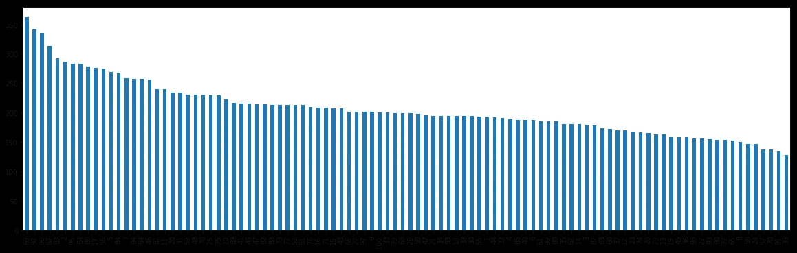
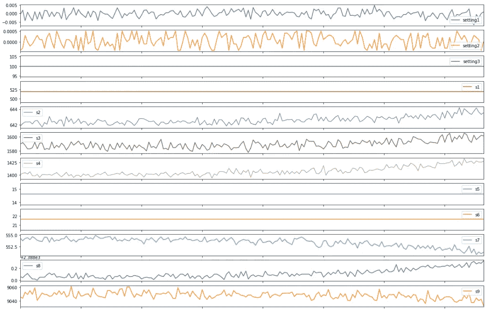
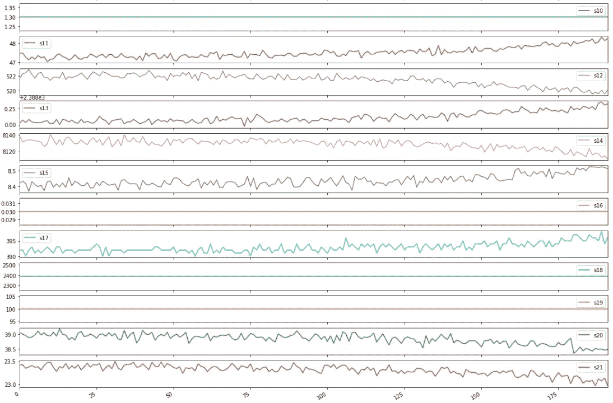
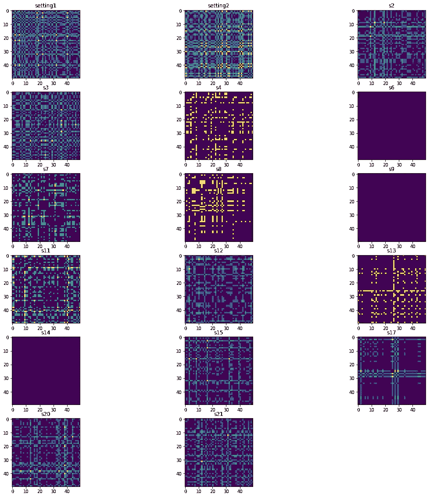
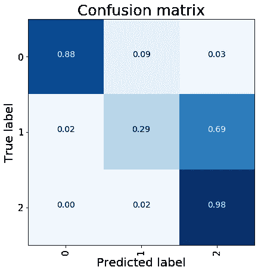

# 用 Keras 估计剩余寿命

> 原文：<https://towardsdatascience.com/remaining-life-estimation-with-keras-2334514f9c61?source=collection_archive---------9----------------------->

## 从时间序列到图像…问 CNN“下一次故障什么时候发生？”


Photo by [SpaceX](https://unsplash.com/@spacex?utm_source=medium&utm_medium=referral) on [Unsplash](https://unsplash.com?utm_source=medium&utm_medium=referral)

在许多人工智能解决方案中，预测罕见事件正成为研发的重要课题。生存分析、客户流失预测、预测性维护和异常检测是处理罕见事件的最受欢迎的应用领域的一些例子。考虑到这些情况，我们可以将罕见事件想象为在特定条件下发生的特定状态，不同于正常行为，但在经济利益方面起着关键作用。

在这篇文章中，我开发了一个机器学习解决方案来预测特定发动机组件的剩余使用寿命( **RUL** )。这类问题在**预测性维护**领域起着关键作用，这里的目的是说' ***距离下一次故障还剩多少时间？***’。为了实现这个目标，我在 Keras 中开发了一个卷积神经网络，以图像的形式处理时间序列。

# 数据集

对于数据科学家来说，在处理这种任务时，最重要的问题是缺乏可用的观察形式的罕见事件。因此，实现良好性能的第一步是尝试处理最丰富的数据集，以处理各种可能的情况。

由 NASA 提供的**涡扇发动机退化模拟** [**数据集**](https://ti.arc.nasa.gov/tech/dash/groups/pcoe/prognostic-data-repository/) ，正在成为一个同类型(共 100 台)发动机机群剩余使用寿命( **RUL** )估算的重要基准。数据以时间序列的形式提供:3 个操作设置、21 个传感器测量值和周期，即工作寿命的时间观察值。

> 发动机在每个时间序列开始时正常工作，在序列中的某个点出现故障。在训练集中，故障在数量上增长，直到系统故障。在测试集中，时间序列在系统故障前的某个时间结束。目标是预测测试组中故障前的剩余运行循环数，即发动机将继续运行的最后一个循环后的运行循环数。

为了更好地理解这个解释，我们试着看一下数据:

```
train_df.id.value_counts().plot.bar()
```



Life Cycles for each engine before a fault in train set

发动机有不同的寿命。列车数据中的平均工作时间为 206 个周期，最少 128 个周期，最多 362 个周期。

在单个发动机的列车设置中，绘制了操作设置和传感器测量值，亲爱的:

```
engine_id = train_df[train_df['id'] == 1]engine_id[train_df.columns[2:]].plot(subplots=True, sharex=True, figsize=(20,30))
```



settings 1–3, sensors 1–9 for engine1



sensors 10–21 for engine1

绘图总是一个好主意……这样，我们可以对我们所掌握的数据有一个印象深刻的总体概述。在大部分系列的结尾，我们可以观察到一个不同的行为，这预示着未来的失败。

# 准备数据

为了预测每台发动机的 RUL，我们采用了一种分类方法，通过以下方式自行生成标签:

从 0(故障)到 15 个剩余周期，我们标记为 2；从 16 到 45 个周期，我们标记为 1，其余的(> 46)标记为 0。很明显，在现实场景中，标记为 2 的类别是最有经济价值的。预测该类的良好性能将允许我们运行一个适当的维护程序，避免未来的故障并节省资金。

为了让我们能够处理列车的最大数量的数据，我们使用固定窗口和 1 步滑动来分割序列。例如，引擎 1 具有 192 个训练周期，窗口长度等于 50，我们提取长度为 50 的 142 个时间序列:
*窗口 1 - >从周期 0 到周期 50，窗口 2 - >从周期 1 到周期 51，…，窗口 142 - >从周期 141 到周期 50，窗口 191。*每个窗口都标有该窗口所考虑的最终循环的相应标签。

```
sequence_length = 50def gen_sequence(id_df, seq_len, seq_cols):data_matrix = id_df[seq_cols].values
    n_elem = data_matrix.shape[0]
    for a,b in zip(range(0,n_elem-seq_len), range(seq_len,n_elem)):
        yield data_matrix[a:b,:]

def gen_labels(id_df, seq_len, lab):

    data_matrix = id_df[lab].values
    n_elem= data_matrix.shape[0]
    return data_matrix[seq_len:n_elem,:]
```

# 从时间序列到图像

为了让事情变得更有趣，我决定将这个系列转化成图像。以便用它们来填充我们的分类模型。

我根据这个惊人的[资源](https://www.kaggle.com/tigurius/recuplots-and-cnns-for-time-series-classification)创建了这些图片。这个概念很简单…当我们试图将时间序列转换成图像时，我们总是利用声谱图。这个选择很聪明，但并不总是最好的选择(你可以在这里阅读)。在这篇文章中，作者解释了他对用声谱图表示处理音频系列的困惑。他谈到了声音，但意思可以在我们的场景中翻译。光谱图是强大的，但它们的使用可能会导致信息的丢失，特别是如果我们试图用计算机视觉的方式来解决问题。为了有效，2D CNN 需要空间不变性；这建立在一个假设上，即一幅经典图像(比如一张照片)的特征无论在哪里都有相同的含义。另一方面，声谱图意味着由两个不同的单位(频率和时间)构成的二维表示。

出于这些原因，我决定利用**循环图**来转换我的时间序列窗口(长度为 50 个周期)。它们很容易用 python 实现，只需几行代码，利用 Scipy。

```
from scipy.spatial.distance import pdist, squareformdef rec_plot(s, eps=0.10, steps=10):d = pdist(s[:,None])
    d = np.floor(d/eps)
    d[d>steps] = steps
    Z = squareform(d)
    return Z
```

使用这个函数，我们能够为我们处理的每个时间序列生成一个 50x50 的图像(我已经排除了方差为 0 的恒定时间序列)。因此，每一次观察都是由一组大小为 50x50x17 (17 是没有零方差的时间序列)的图像组成的，如下所示。



Example of a train observation

# 模型

至此，我们已经准备好构建我们的模型了。我采用了经典的 2D CNN 架构:

```
model = Sequential()
model.add(Conv2D(32, (3, 3), activation='relu', input_shape=(50, 50, 17)))
model.add(Conv2D(32, (3, 3), activation='relu'))
model.add(MaxPooling2D(pool_size=(2, 2)))
model.add(Dropout(0.25))
model.add(Conv2D(64, (3, 3), activation='relu'))
model.add(Conv2D(64, (3, 3), activation='relu'))
model.add(MaxPooling2D(pool_size=(2, 2)))
model.add(Dropout(0.25))
model.add(Flatten())
model.add(Dense(256, activation='relu'))
model.add(Dropout(0.5))
model.add(Dense(3, activation='softmax'))model.compile(loss='categorical_crossentropy', optimizer='adam', metrics=['accuracy'])
```

我只对 10 个时期进行了拟合，达到了 0.832%的精度。



From [sklearn documentation](https://scikit-learn.org/stable/auto_examples/model_selection/plot_confusion_matrix.html)

从混淆矩阵中我们可以看到，我们的模型可以很好地区分发动机何时接近故障(2 个标签:<16 cycles remaining) or when it works normally (0 label: > 45 个循环)。一点点噪音出现在中级(> 15，<46 cycles). We are satisfied to achieve a great and clear result for the prediction of class 2 — i.e. near to failure.

# SUMMARY

In this post, we try to solve a **预测性维护**问题。估算发动机的 **RUL** 由于收集这类数据的难度，我们有意识地应对罕见事件。我们提出了一个有趣的解决方案，利用**循环图**将时间序列转换成图像。通过这种方式，我们能够区分处于工作寿命末期的油井发动机。

[**查看我的 GITHUB 回购**](https://github.com/cerlymarco/MEDIUM_NoteBook)

保持联系: [Linkedin](https://www.linkedin.com/in/marco-cerliani-b0bba714b/)