# 用异常检测去除拉曼光谱中的尖峰:Python 中的 Whitaker-Hayes 算法

> 原文：<https://towardsdatascience.com/removing-spikes-from-raman-spectra-8a9fdda0ac22?source=collection_archive---------11----------------------->

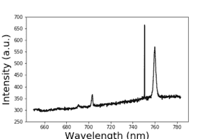

Detecting and removing spikes from Raman spectra

**摘要**。在这篇文章中，我想对 D. Whitaker 和 K. Hayes 在《化学计量学和智能实验室系统杂志》上提出的一种去除拉曼光谱中尖峰信号的新方法进行评论。在他们的出版物中，作者使用了一种基于改进的 Z 分数异常值检测的算法来定位这种尖峰，如果存在的话，随后使用简单的移动平均来消除它们。他们不是计算光谱强度的 Z 值，而是计算一次差分光谱的 Z 值。他们还提供了用 r 实现算法的代码。在这里，我用 Python 实现了算法，并展示了如何将它应用于不同的数据集。

拉曼光谱是一种广泛使用的分析技术，它提供来自分子和固体的结构和电子信息。它适用于实验室和大规模生产规模，并在许多不同的领域，如物理，化学，生物，医学或工业应用。

拉曼光谱学中已知的一个典型问题是拉曼光谱有时被尖峰“污染”。尖峰是出现在频谱上随机位置的正的窄带宽峰值。它们起源于高能宇宙射线撞击用于测量拉曼光谱的电荷耦合器件探测器。这些尖峰是有问题的，因为它们可能会妨碍后续分析，特别是在需要多变量数据分析的情况下。因此，处理拉曼光谱数据的第一步是清除尖峰。

首先，加载所需的 Python 包:

```
import numpy as np
import pandas as pd
import matplotlib.pyplot as plt
```

图 1 显示了石墨烯的拉曼光谱。在过去的几年里，石墨烯由于其卓越的物理性能，包括优异的电子、热、光学和机械性能，已经成为非常受欢迎的材料。其特征拉曼光谱由如图所示的几个峰组成。从它们的形状和相关强度，可以获知掺杂、应变或晶界等大量信息。该光谱是被尖峰污染的光谱的明显例子。

```
# load the data as data frame
df = pd.read_csv(‘folder_name.../spectrum.txt’, delimiter = ‘\t’)# Transform the data to a numpy array
wavelength = np.array(df.Wavelength)
intensity = np.array(df.Intensity)# Plot the spectrum:
plt.plot(wavelength, intensity)
plt.title(‘Spectrum’, fontsize = 20)
plt.xticks(fontsize = 15)
plt.yticks(fontsize = 15)
plt.xlabel(‘Wavelength (nm)’, fontsize = 20)
plt.ylabel(‘Intensity (a.u.)’, fontsize = 20)
plt.show()
```

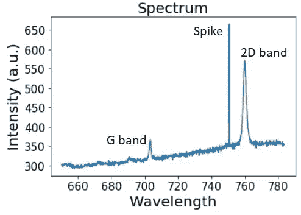

**Figure 1.** A spike was recorded while measuring the typical Raman spectrum of graphene (characterized by the G and 2D bands).

**基于 Z 分数的拉曼光谱尖峰检测方法**

尖峰强度通常高于光谱中其他拉曼峰的强度，因此使用基于 z 分数的方法可能是一个好的起点。z 得分以标准差为单位表示一个值离平均值有多远。因此，如果已知总体均值和总体标准差，则原始得分 x(i)的标准得分计算如下:

z(i) = (x(i)-μ) / σ

其中 *μ* 是平均值*，σ* 是总体 x 的标准偏差(x(i)代表单个拉曼光谱的值)。关于如何使用 Z 分数方法检测异常值的更多详细信息可以在参考文献[3]中找到。

让我们计算光谱中点的 z 分数:

```
def z_score(intensity):
 mean_int = np.mean(intensity)
 std_int = np.std(intensity)
 z_scores = (intensity — mean_int) / std_int
 return z_scoresintensity_z_score = np.array(z_score(intensity))
plt.plot(wavelength, intensity_z_score)
plt.xticks(fontsize = 15)
plt.yticks(fontsize = 15)
plt.xlabel( ‘Wavelength’ ,fontsize = 20)
plt.ylabel( ‘Z-Score’ ,fontsize = 20)
plt.show()
```

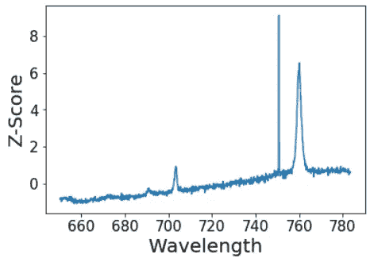

**Figure 2.** Z-scores of the spectrum plotted in figure 1.

然后需要一个阈值来判断一个值是否是异常值。该阈值的典型值为 3.5，由美国质量控制协会提出作为异常值标记规则的基础，而该出版物的作者使用 6。为了应用阈值来排除峰值，必须采用 Z 得分的绝对值:

|z(i)| = |(x(i)-μ) / σ|

计算为

```
def z_score(intensity):
 mean_int = np.mean(intensity)
 std_int = np.std(intensity)
 z_scores = (intensity — mean_int) / std_int
 return z_scoresthreshold = 3.5intensity_z_score = np.array(abs(z_score(intensity)))
plt.plot(wavelength, intensity_z_score)
plt.plot(wavelength, threshold*np.ones(len(wavelength)), label = ‘threshold’)
plt.xticks(fontsize = 15)
plt.yticks(fontsize = 15)
plt.xlabel( ‘Wavelength’ ,fontsize = 20)
plt.ylabel( ‘|Z-Score|’ ,fontsize = 20)
plt.show()
```

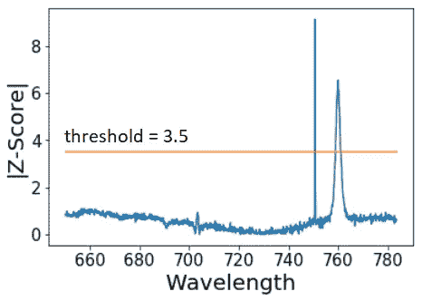

**Figure 2b.** Z-scores of the spectrum plotted in figure 1\. The threshold still cuts the 2D Raman peak.

然而，z 分数非常类似于原始光谱，并且阈值仍然切断主要拉曼峰。让我们使用 3.5 的阈值来绘制检测到的峰值:

```
threshold = 3.5# 1 is assigned to spikes, 0 to non-spikes:
spikes = abs(np.array(z_score(intensity))) > thresholdplt.plot(wavelength, spikes, color = ‘red’)
plt.title(‘Spikes: ‘ + str(np.sum(spikes)), fontsize = 20)
plt.grid()
plt.xticks(fontsize = 15)
plt.yticks(fontsize = 15)
plt.xlabel( ‘Wavelength’ ,fontsize = 20)
plt.ylabel( 'Z-scores > ' + str(threshold) ,fontsize = 20)
plt.show()
```

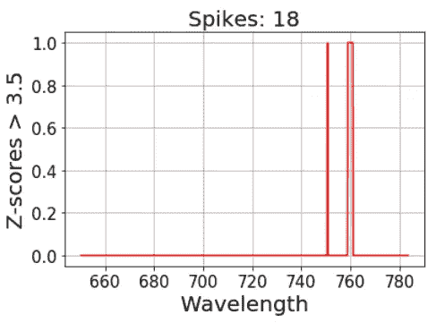

**Figure 3.**Using modified Z-Scores, 18 spectral point are above the threshold.

**用于拉曼光谱中尖峰检测的改进的基于 Z 分数的方法**

第二种选择是利用稳健统计并计算光谱的修正 z 分数。这种改进的 Z 得分方法使用中位数(M)和中位数绝对偏差(MAD ),而不是平均值和标准差:

z(i) = 0.6745 (x(i)-M) / MAD

其中 MAD = median(|x-M|)和|…|代表绝对值。中位数和 MAD 分别是集中趋势和离差的稳健度量。乘数 0.6745 是标准正态分布的第 0.75 个四分位数，MAD 将 to⁴.收敛到该四分位数

```
def modified_z_score(intensity):
 median_int = np.median(intensity)
 mad_int = np.median([np.abs(intensity — median_int)])
 modified_z_scores = 0.6745 * (intensity — median_int) / mad_int
 return modified_z_scoresthreshold = 3.5intensity_modified_z_score = np.array(abs(modified_z_score(intensity)))
plt.plot(wavelength, intensity_modified_z_score)
plt.plot(wavelength, threshold*np.ones(len(wavelength)), label = 'threshold')
plt.xticks(fontsize = 15)
plt.yticks(fontsize = 15)
plt.xlabel('Wavelength (nm)' ,fontsize = 20)
plt.ylabel('|Modified Z-Score|' ,fontsize = 20)
plt.show()
```

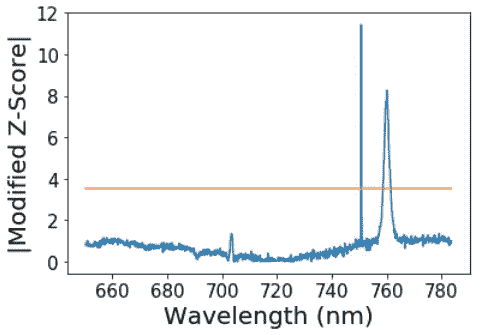

**Figure 4\.** Modified Z-scores of the spectrum plotted in figure 1\. The threshold still cuts the 2D Raman peak.

仍然可以观察到相同的问题:

```
# 1 is assigned to spikes, 0 to non-spikes:
spikes = abs(np.array(modified_z_score(intensity))) > thresholdplt.plot(wavelength, spikes, color = ‘red’)
plt.title(‘Spikes: ‘ + str(np.sum(spikes)), fontsize = 20)
plt.grid()
plt.xticks(fontsize = 15)
plt.yticks(fontsize = 15)
plt.xlabel( ‘Wavelength’ ,fontsize = 20)
plt.ylabel( 'Modified Z-scores > ' + str(threshold) ,fontsize = 20)
plt.show()
```

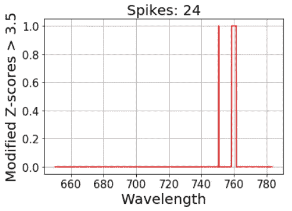

**Figure 5\.** Using modified Z-Scores, 24 spectral points are above the threshold.

2D 拉曼峰值仍然被检测为尖峰，因此需要更灵敏的方法。

**Whitaker 和 Hayes 的** **改进的基于 Z 分数的拉曼光谱尖峰检测方法**

Whitaker 和 Hayes 建议利用尖峰的高强度和小宽度，因此使用连续光谱点之间的差异∇x(i) = x(i)-x(i-1 来计算 z 分数，其中 x(1)，…，x(n)是以等间距波数记录的单个拉曼光谱的值，i = 2，…，n。该步骤消除了线性和缓慢移动的曲线线性趋势，而尖锐的细尖峰将被保留。现在，

z(i) = 0.6745 (∇x(i)-M) / MAD

因此只包括一个额外的步骤，其中包括连续值之间的差。

```
# First we calculated ∇x(i):
dist = 0
delta_intensity = [] 
for i in np.arange(len(intensity)-1):
 dist = intensity[i+1] — intensity[i]
 delta_intensity.append(dist)delta_int = np.array(delta_intensity)
# Alternatively to the for loop one can use: 
# delta_int = np.diff(intensity) intensity_modified_z_score = np.array(modified_z_score(delta_int))
plt.plot(wavelength[1:], intensity_modified_z_score)
plt.title('Modified Z-Score using ∇x(i)')
plt.xticks(fontsize = 15)
plt.yticks(fontsize = 15)
plt.xlabel('Wavelength (nm)', fontsize = 20)
plt.ylabel('Score', fontsize = 20)
plt.show()
```

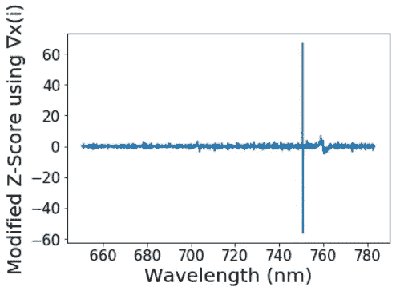

**Figure 6\.** Modified Z-scores using ∇x(i) of the spectrum plotted in figure 1.

同样，为了应用阈值来排除尖峰，必须采用修改后的 Z 得分的绝对值:

|z(i)| =|0.6745 (∇x(i)-M) / MAD|

导致

```
threshold = 3.5intensity_modified_z_score = np.array(np.abs(modified_z_score(delta_int)))
plt.plot(wavelength[1:], intensity_modified_z_score)
plt.plot(wavelength[1:], threshold*np.ones(len(wavelength[1:])), label = 'threshold')
plt.title('Modified Z-Score of ∇x(i)', fontsize = 20)
plt.xticks(fontsize = 15)
plt.yticks(fontsize = 15)
plt.xlabel('Wavelength (nm)', fontsize = 20)
plt.ylabel('Score', fontsize = 20)
plt.show()
```

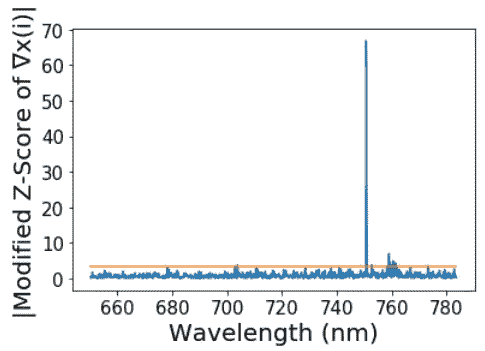

**Figure 7\.** Abosolute value of the modified Z-scores of ∇x(i) of the spectrum plotted in figure 1.

同样，检测到的尖峰数量可以计算如下

```
# 1 is assigned to spikes, 0 to non-spikes:
spikes = abs(np.array(modified_z_score(intensity))) > thresholdplt.plot(wavelength, spikes, color = ‘red’)
plt.title(‘Spikes: ‘ + str(np.sum(spikes)), fontsize = 20)
plt.grid()
plt.xticks(fontsize = 15)
plt.yticks(fontsize = 15)
plt.xlabel( ‘Wavelength’ ,fontsize = 20)
#plt.ylabel( ‘Spike(1) or not(0)?’ ,fontsize = 20)
plt.show()
```

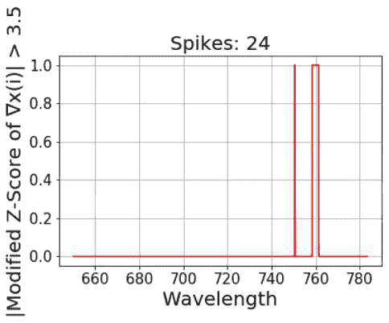

**Figure 8\.** Using modified Z-Scores with ∇x(i), 17 spectral points are above the threshold = 3.5.

对于 3.5 的推荐阈值，分配了许多错误的尖峰。然而，与拉曼峰相比，通过这种方法得到的值比以前高得多。

```
plt.plot(wavelength[1:],
np.array(abs(modified_z_score(delta_int))), color='black', label = '|Modified Z-Score using ∇x(i)|')
plt.plot(wavelength, np.array(abs(modified_z_score(intensity))), label = '|Modified Z-Score|', color = 'red')
plt.plot(wavelength, np.array(abs(z_score(intensity))), label = '|Z-Score|', color = 'blue')
plt.xticks(fontsize = 15)
plt.yticks(fontsize = 15)
plt.xlabel( 'Wavelength' ,fontsize = 20)
plt.ylabel( 'Score' ,fontsize = 20)
plt.legend()
plt.show()
```

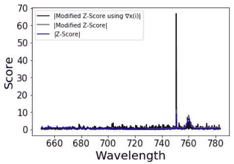

**Figure 9\.** Comparison between the three different approaches.

一般来说，必须根据数据集选择合适的阈值。对于这种情况，阈值= 7 已经足以获得清晰的选择。

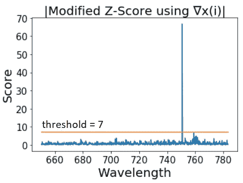

**Figure 10\.** Absolute values of the modified Z-scores with ∇x(i) of the spectrum plotted in figure 1.

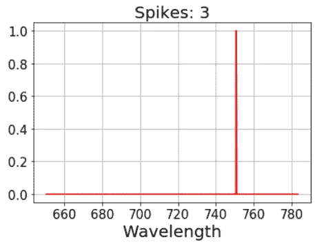

**Figure 11\.** Using modified Z-Scores with ∇x(i), 3 spectral points are above the threshold = 7.

**固定拉曼光谱**

一旦检测到尖峰信号，下一步就是移除它们并修正光谱。为此，通过计算每个候选波数的近邻的平均值(在 2m+1 个值窗口内)，在每个候选波数处获得插值。

```
def fixer(y,m):
 threshold = 7 # binarization threshold. 
 spikes = abs(np.array(modified_z_score(np.diff(y)))) > threshold
 y_out = y.copy() # So we don’t overwrite y for i in np.arange(len(spikes)):
  if spikes[i] != 0: # If we have an spike in position i
   w = np.arange(i-m,i+1+m) # we select 2 m + 1 points around our spike
   w2 = w[spikes[w] == 0] # From such interval, we choose the ones which are not spikes
   y_out[i] = np.mean(y[w2]) # and we average their values

return y_out# Does it work?
plt.plot(wavelength, intensity, label = 'original data')
plt.plot(wavelength, fixer(intensity,m=3), label = 'fixed spectrum')
plt.title('Despiked spectrum',fontsize = 20)
plt.xticks(fontsize = 15)
plt.yticks(fontsize = 15)
plt.xlabel('Wavelength (nm)' ,fontsize = 20)
plt.ylabel('Intensity (a.u.)' ,fontsize = 20)
plt.legend()
plt.show()
```

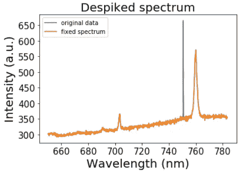

**Figure 12\.** Original and despiked Raman spectrum using modified Z-Scores with ∇x(i) with the threshold = 7.

因此，在计算了∇x 的修改的 z 分数，并且通过设置适当的阈值来进行阈值处理之后，通过应用移动平均滤波器来去除和平滑尖峰。

**其他例子**

最后，给出了两个具有不同强度信号的尖峰信号的例子，显示了这种方法的优点。

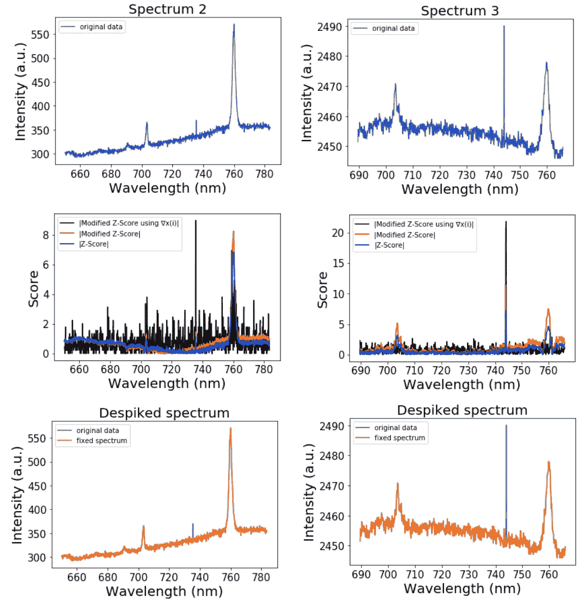

**Figure 13.** Examples of two more spectra in the first row of graphs, their Z-scores (blue lines) , modified Z-scores (red lines) and modified Z-scores using ∇x(i) (black lines) in the second row of graphs and thei despiked spectra in the third row, are presented.

**承认。**我要感谢[豪尔赫·路易斯·希塔](https://medium.com/@jluishita)和[安娜·索拉古伦-比斯科](https://medium.com/@ana.solagurenbeascoa)花时间校对这些笔记。

[1]惠特克，达伦 a .，和凯文海斯。"消除拉曼光谱尖峰的简单算法."*化学计量学和智能实验室系统*179(2018):82–84。

[2] Iglewicz 和 D. Hoaglin。" ASQC 质量控制基本参考:统计技术."*如何检测和处理异常值*16(1993):1–87。

[3] [Colin Gorrie 的数据故事:检测离群值的三种方法。http://colingorrie.github.io/outlier-detection.html](http://colingorrie.github.io/outlier-detection.html)

[4]若昂·罗德里格斯。“离群值让我们发疯:单变量离群值检测”。中等。[https://medium . com/James-blogs/outliers-make-us-go-mad-单变量-离群值-检测-b3a72f1ea8c7](https://medium.com/james-blogs/outliers-make-us-go-mad-univariate-outlier-detection-b3a72f1ea8c7)