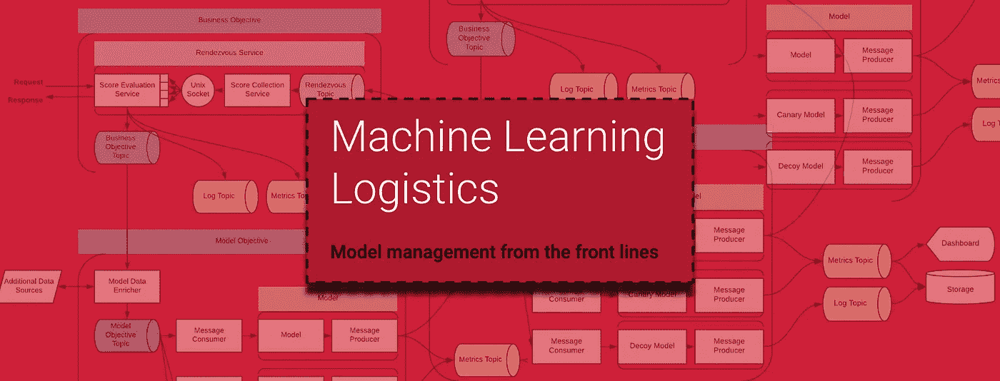
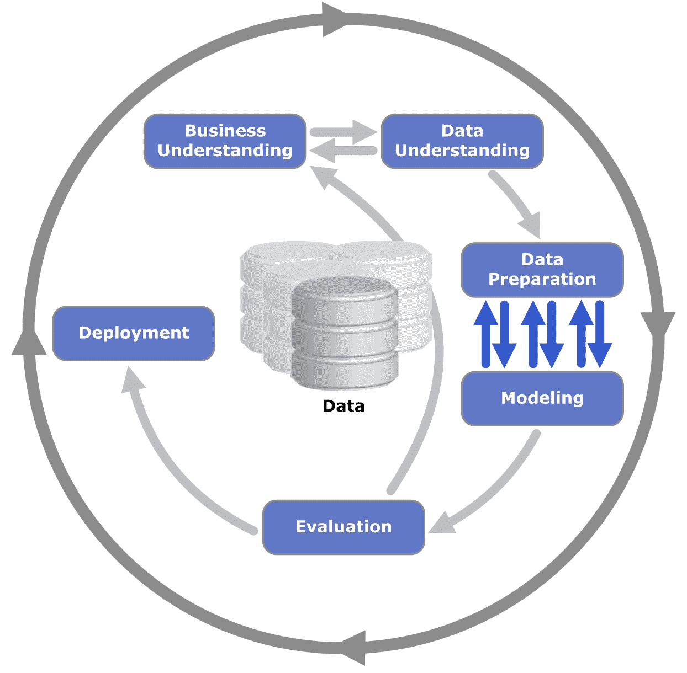
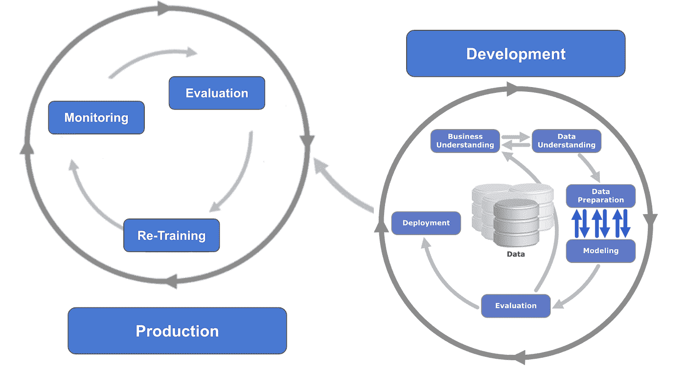
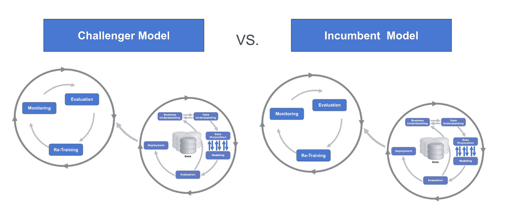
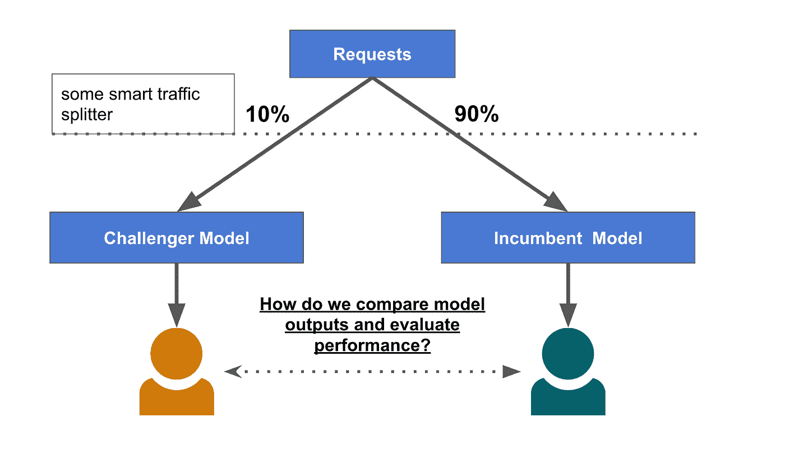
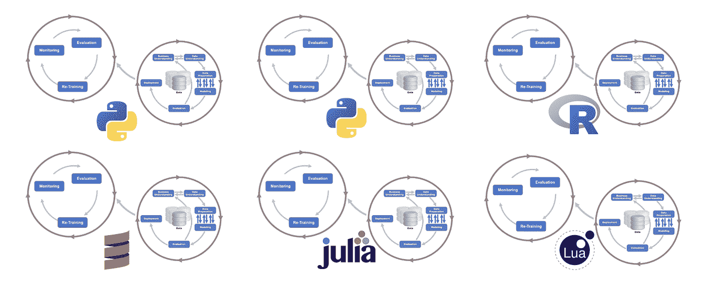
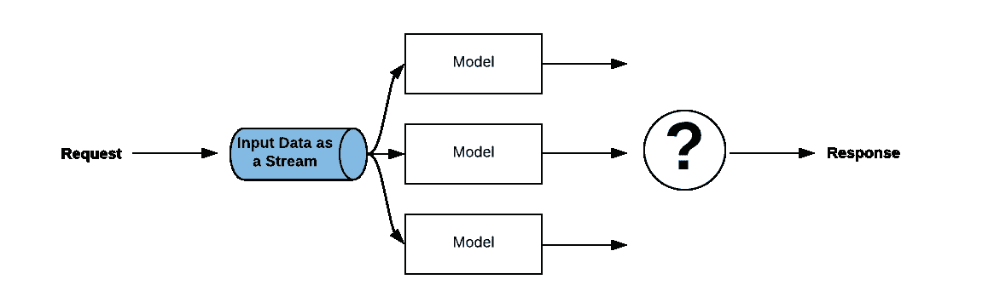
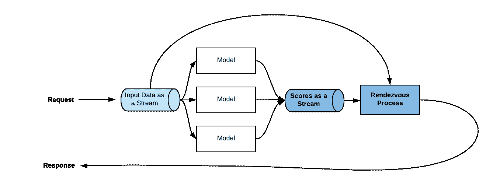
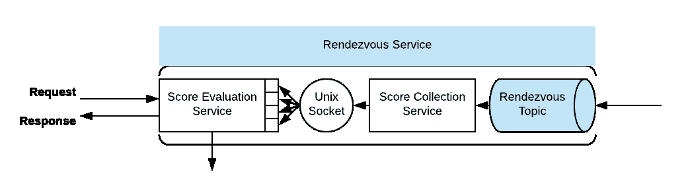
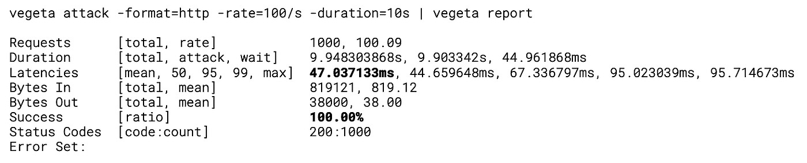

# 生产中数据科学的会合体系结构

> 原文：<https://towardsdatascience.com/rendezvous-architecture-for-data-science-in-production-79c4d48f12b?source=collection_archive---------4----------------------->



## 如何构建一个前沿的数据科学平台来解决数据科学中的真正挑战:生产化。集合点架构介绍。

# 第 1 部分:数据科学的真正挑战

不可能错过数据领域如何获得一些新的流行词汇。它曾经是“大数据”，但最近，它被数据湖、机器学习、人工智能、区块链和数据科学独角兽所主导。随着数据科学的大肆宣传，围绕它的生态系统不断扩大，越来越多的大数据平台承诺让数据科学变得简单，并为大众带来商业成功。

但是，数据科学有什么不同之处，以至于它需要新的方法和所有这些新的平台和产品？

2016 年的一项调查得出结论: **80%的数据科学都在准备和清理数据**(80/20 法则)。数据科学家的这项调查很快流行起来，并发展成为数据科学领域公认的问题陈述。不幸的是。因为如果你从这篇博文中拿走一样东西

> “模型的生产是数据科学中*最困难的*问题” *(Schutt，R & O'Neill C.《从第一线直接做数据科学》, O'Reilly 出版社。加利福尼亚州，2014)*

而不是准备数据。

# 为什么数据科学不同于任何软件项目。



Source: Kenneth Jensen, ([wikimedia](https://commons.wikimedia.org/wiki/File:CRISP-DM_Process_Diagram.png))

为了理解为什么数据科学是不同的，我仍然从臭名昭著的 80/20 规则和数据挖掘的跨行业标准过程(CRISP-DM)开始。尽管 CRISP-DM 早于今天的数据科学学科，但它完美地描述了数据科学家日常工作的很大一部分。自 1996 年以来，似乎发生了变化的方面是大量集成不良的数据源，以及对数据准备步骤的日益重视。因此，80/20 法则变得如此流行就不足为奇了。

但是在数据科学中，CRISP-DM 只是图片的一半！模型不是普通的软件，也不仅仅是部署数据科学(在此插入 meme！).模型具有独特的生命周期管理，以及独特的集成、自动化和操作要求。



生产中的模型是动态的，具有复杂的生命周期。不幸的是，生产中的模型管理很少被讨论或解决。重点仍然是数据准备和 80/20 法则的重要性。

然而，管理单个模型也不是全部，数据科学的复杂性仍在继续。在某个时候，将会出现一个挑战者模型:



解决这个问题的一种方法是使用传统的 A/B 测试场景和流量分流。但是你只能孤立地看到一个单一的模型响应。假设您正在尝试测试一个严重依赖于被评分用户的上下文的推荐模型。对所有模型的请求进行并行评分，然后简单地比较它们的评分，这样不是更好吗？此外，你的挑战者模型可能不会工作得很好。不幸的是，你必须让 10%的用户经历一次糟糕的体验才能找到答案。这显然需要一个更好的方法。



但是我们还没有完成。在成功的数据科学研究中，开发和生产的界限越来越模糊。一个单一的业务目标将会看到许多不同的现任和挑战者模型，以及在一个不断变化的环境中对这些模型进行再培训的要求，其中包括持续的基准测试、监控和生产移交。真实世界的场景将很快变得更像这样:



这些都是让任何 IT 部门都物有所值的要求。挑战在于解决数据科学工具包日益增长的异构性、数据基础架构所需的弹性和灵活性，以及复杂数据科学模型生命周期的端到端自动化。

# 第 2 部分:解决方案

# 认识集合建筑

总结前面对问题陈述的介绍，我们正在寻找一些架构来

*   **并行评估大量现有车型和挑战者车型**
*   **管理模型生命周期**
*   **处理日益多样化的数据科学工具包**
*   **允许在不影响用户体验的情况下进行生产实验，并将业务目标与数据科学目标分离**
*   **将 SLA 和 GDPR 等企业需求从数据科学模型中分离出来**
*   **扩展到每分钟 50+k 页面负载的峰值，而无需雇佣大批 DevOps 工程师**

这个非常真实的数据科学问题的解决方案来自于 [Ted Dunning](https://www.linkedin.com/in/teddunning/) 和 [Ellen Friedman](https://www.linkedin.com/in/ellen-friedman-a93743/) 在他们的书《机器学习物流》(O'Reilly 2017)( [免费电子书](https://mapr.com/ebooks/machine-learning-logistics/ch03.html))中命名为 **Rendezvous Architecture** 。该架构的核心是作为流的输入数据和使用发布-订阅消息模式订阅数据的模型。通过一个流接收评分请求允许我们**轻松地分发一个请求并并行评估大量的模型。**

但是它没有解决如何从大量模型中健壮地返回响应，同时支持企业需求。



为了返回一个响应，架构还将模型分数视为一个流，并与名称 lending**Rendezvous service**相结合。从概念上讲，rendezvous 服务订阅原始的评分请求，将它们与来自模型响应流的模型评分相结合。



在 rendezvous 服务中订阅评分请求将从成功返回评分输出的模型中返回响应的能力分离开来。它还允许 rendezvous 服务实现 SLA:在模型失败或被延迟并且没有评分输出到达 SLA 内的 rendezvous 服务的情况下，rendezvous 服务可以例如发送有意义的默认响应。这是可能的，因为会合服务首先知道评分请求。rendezvous 服务实现了模型评分输出与**可配置 SLA 和超时策略**的竞争条件。

关于 rendezvous 架构更详细的介绍，你应该读一下 Ted Dunning 和 Ellen Friedman 的伟大著作:[https://mapr . com/ebooks/machine-learning-logistics/ch03 . html](https://mapr.com/ebooks/machine-learning-logistics/ch03.html)

采用这种概念架构并将其应用于我们提出的要求，我们得到了以下数据科学平台:


我们根据需要将架构划分为一个**业务目标层次结构，该层次结构实现了企业需求和数据科学团队的建模目标。**

整个平台是用**容器化的**无状态服务构建的，这提供了期望的解耦和可伸缩性。甚至有状态模型也可以在模型数据丰富器的帮助下在平台上实现，如下面步骤 3 中所讨论的。

1.  当评分请求到达时，入口控制器将该请求分配给集合服务实例的评分评估服务，该集合服务实例实例化异步评估策略。这为模型评分输出设置了竞争条件。每个策略实例就像一个邮箱，收集它们对应的评分请求的模型评分输出。
2.  评分评估服务将策略实例 ID 和集合服务 ID 附加到评分请求，并将其发布到该业务目标的输入数据流。
3.  模型数据丰富器订阅带有评分请求的输入数据流。该服务附加了额外的数据点，如**元数据或有状态模型的外部状态**。例如，推荐模型可能会考虑用户以前的行为来创建推荐。因此，数据丰富器可以交叉引用用户 ID 和以前用户交互的缓存。模型数据富集器然后将富集的评分请求发布到建模目标信息流。
4.  每个模型的消息消费者订阅建模目标输入流，并将评分请求发送到相应的模型实例。每个模型目标可以拥有一系列不同的模型，只要它们共享输入数据模式。每个模型目标还拥有一个**诱饵模型**和一个**金丝雀模型**，前者将评分请求记录到日志流中，后者用于检测输入数据中的漂移，并提供一致的基线来比较模型性能。
5.  消息生产者基于集合服务 ID 将模型评分输出发送到相应的集合流，该集合服务 ID 已经由评分评估服务附加到消息。
6.  分数收集服务从其相应的集合流中读取所有进入的模型评分输出。每条消息都有一个策略实例 ID，该 ID 已由评分评估服务附加到消息上。消息策略实例 ID 是分数收集服务和分数评估服务之间的共享卷上的 Unix 套接字的名称，其允许收集服务将模型评分输出发送到相应评分请求的等待策略实例。
7.  等待策略实例通过 unix 套接字服务器接收模型分数，并评估其策略逻辑是否以特定分数响应发起的评分请求。

# 实现集合服务

该平台的大部分相当简单，因为它由无状态的容器化服务和简单的发布/订阅消息模式组成。在生产中，这可以使用舵图和**水平 pod 自动缩放器**以及循环负载平衡在 Kubernetes 上轻松部署。实际上，业务和建模目标中的平台图中的每个分组实体都是水平缩放的豆荚。

主要的挑战是实现有状态的集合服务。从概念上讲，最好将 rendezvous 服务描述为邮箱。每个活动评分请求都有一个等待模型评分响应的活动邮箱。这些邮箱接收其相应评分请求的模型评分，并执行附加的评分评估策略。

当模型分数被发布到流时，每个邮箱可以订阅该流，并过滤出它们相关的模型分数进行评估(扇出模式)。这将为每个订阅的邮箱复制邮件。在每分钟 50+k 个请求的规模下，大量现有和挑战者模型并行返回分数，这将是不切实际的。为了实现可伸缩性，我们必须保持每个运行的策略实例尽可能的轻量级。



我们用 **Python** 实现了分数评估服务，使用 **asyncio** 库实现了**异步事件驱动的策略评估**。以下代码是该服务的简化版本:

```
import asyncio app.route(‘/topic/test’, methods=[‘POST’])def incoming_scoring_request(): scoring_request = SomeMessageDeserialisation( request.get_json(), os.environ['THIS_RENDEZVOUS_SERVICE_ID'] ) loop = asyncio.new_event_loop() asyncio.set_event_loop(loop) scoring_response = loop.run_until_complete( async_score_evaluation_service,        scoring_request,         loop ) return jsonify(scoring_response)async def async_score_evaluation_service(scoring_request, loop): policy = SomePolicy(loop.create_future()) policy_coro = asyncio.start_unix_server( policy.handle_connection, policy.socket_path, loop=loop ) policy_task = asyncio.ensure_future(policy_coro) extended_scoring_request = SomeMessageSerialisation( scoring_request, policy.socket_path ) message_task = syncio.ensure_future( publish(extended_scoring_request) ) try: scoring_response = await asyncio.wait_for(
             policy.result_future, timeout=policy.sla
        ) except asyncio.TimeoutError: scoring_response = policy.default_value() return scoring_response
```

如代码片段所示，模型分数评估策略启动一个异步 unix 套接字服务器。套接字的路径由策略实例的 uuid 给出。这是获得模型分数所需的全部内容。除了评估服务，sidecar 分数收集服务订阅模型响应流。

```
import pulsarimport socket pulsar_consumer = get_message_consumer(os.environ['THIS_RENDEZVOUS_SERVICE_ID']) while True: msg = pulsar_consumer.receive() scoring_response = SomeMessageDeserialisation( msg.data() ) policy_socket = scoring_response.policy_socket_path sock = socket.socket(socket.AF_UNIX, socket.SOCK_STREAM) sock.connect(policy_socket) sock.sendall(SomeMessageSerialisation(scoring_response)) sock.close() consumer.acknowledge(msg)
```

它根据策略实例 ID 将消息发送到相应分数评估策略实例的 unix 套接字。在将扩展的评分请求发布到评分评估服务中该业务目标的数据流之前，我们将该 ID 附加到扩展的评分请求中。

为了在 Score Collection sidecar 和 Score Evaluation Service 之间创建连接，我在 unix 套接字的两个容器之间使用了一个共享卷。这种实现模式比简单的扇出模式伸缩性好得多，单个 Rendezvous 服务实例可以托管大量并发的分数评估策略。


我使用**Apache Pulsar**([link](https://pulsar.apache.org/en/))作为分布式发布-订阅消息系统。Pulsar 不仅仅是一个高性能的消息传递系统，它可以轻松扩展到大量的主题，并以高度可扩展的消息持久存储为主要目标。主题压缩和分层持久存储([链接](https://pulsar.apache.org/docs/latest/getting-started/ConceptsAndArchitecture/#Topiccompaction-050li))允许 rendezvous 平台在未来无限期地保存消息，并重放评分请求，例如测试和验证新的挑战者模型或预热保持内部状态的模型。

下图显示了 minikube 开发环境中的一个示例:


该请求贯穿会合平台的所有元素，总时间为 51 毫秒。测试主题通过模型数据丰富器获取一个随机数，模型目标 test-0 运行一个简单的模型，该模型返回评分请求中所有数值的总和。我用那个装置来测试会合平台的元件。实际模型是集装箱化和解耦的，这允许我们独立地测试它们。**这意味着 rendezvous 架构的开销在 40-50 毫秒之间。**相对于该架构提供的广泛优势，这是一个非常小的成本，并且留下了充足的时间来获取外部数据点和评估复杂的模型。

> 做好这件事的代价是 40 毫秒

minikube 开发环境的负载测试表明，每秒 100 个请求也不是什么难事:



参考实现展示了 rendezvous 架构的优势，并展示了非常有前途的性能。我目前正在研究 Kubernetes 的生产，关注舵手和操作员。一旦我们在生产 Kubernetes 集群上部署了我们的平台，我将在这篇博客文章之后跟进我们的生产负载测试结果。

# 信用

我们正站在巨人的肩膀上。信用到期时的信用:

*   [Ted Dunning](https://www.linkedin.com/in/teddunning/) 和 [Ellen Friedman](https://www.linkedin.com/in/ellen-friedman-a93743/) 以及他们的励志书籍《机器学习物流》(O'Reilly 2017)介绍了概念上的会合架构
*   [来自](https://www.linkedin.com/in/tpmccann/)[www.advancinganalytics.co.uk](http://www.advancinganalytics.co.uk/)的 Terry McCann 和 [Christopher Conroy](https://www.linkedin.com/in/christopher-conroy-2aaa4566/) 他们是我努力的早期信徒、贡献者和支持者

# 来自数据科学节的录音:

[www.datasciencefestival.com](http://www.datasciencefestival.com) Day 2 at Zoopla


Jan 是公司数据转型方面的成功思想领袖和顾问，拥有将数据科学大规模应用于商业生产的记录。他最近被 dataIQ 评为英国 100 位最具影响力的数据和分析从业者之一。

**在 LinkedIn 上连接:**[**https://www.linkedin.com/in/janteichmann/**](https://www.linkedin.com/in/janteichmann/)

**阅读其他文章:**[**【https://medium.com/@jan.teichmann】**](https://medium.com/@jan.teichmann)