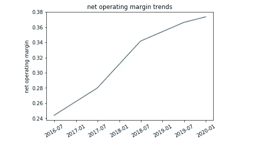
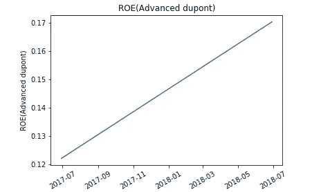

# 使用 Python-2 构建高级会计模型

> 原文：<https://towardsdatascience.com/replace-traditional-accounting-analysis-with-python-advanced-dupont-9b24f7719ee0?source=collection_archive---------21----------------------->

## 使用正确的数据科学工具充分利用会计公式


Photo by [Carlos Muza](https://unsplash.com/@kmuza?utm_source=medium&utm_medium=referral) on [Unsplash](https://unsplash.com?utm_source=medium&utm_medium=referral)

## 背景

如果你看了我之前的文章[这里](https://medium.com/analytics-vidhya/web-scraping-for-accounting-analysis-using-python-part-1-b5fc016a1c9a)，你就知道我们可以很容易地从雅虎财经刮出财务报表。但是现在呢？当您进行任何类型的业务评估和财务分析时，我们的数据框架中的大多数特征都是重要的指标。它们都是公开的和经过审计的信息，最终决定了股票价格的变动。管理层希望他们看起来不错，所以他们经常操纵他们，并确保数字符合公众的期望。

现在，这就是数据科学和您的领域知识发挥作用的地方。为了解释会计比率，你需要理解这些特征的含义。这往往需要上几堂大学会计课。你可能已经学过一些比率，如每股收益、利润率、速动比率等。今天，我将重点讨论**股本回报率、**与股本相关的企业盈利能力。

> 股本回报率=净收入/股本

## 数据清理

在进行任何数值操作之前，我们需要整理数据。以下是我们的目标:

1.  将数据类型从 object 转换为 numeric。
2.  将日期索引转换为 DateTime 以进行时序分析。

我不会在清理数据上做太多的细节，因为这是另一个话题，但是可以随意检查我写的这个函数。当你真正检查数据帧时，它们更有意义。你可以暂时忽略它。

```
def convert_to_int(df): 
     col = df.columns
     for col in df: 
           temp = df[col].to_string().replace(‘,’,’’).split(‘\n’) #     Replace comma with space and clean out extra spaces temp.pop(0) #Remove first erronous element df.index = pd.to_datetime(df.index) # Convert index to datetime           df[col]= [i[10:].strip() for i in temp] # stripping off nth characters df[col] = pd.to_numeric(df[col],        errors=’coerce’).fillna(0).astype(int) # Transform columns from   object to numeric return df
```

# **简介**

简单的杜邦模型将净资产收益率分解为 3 个部分

> **净资产收益率=(净收入/销售额)*(销售额/总资产)*(总资产/股东权益)**

第一个组成部分侧重于经营业绩:每笔销售产生多少净收入。第二个衡量公司利用其资产创造销售收入的效率。第三个关注股权管理:你每股产生多少资产。

然而，如果你仔细观察引擎盖下发生的事情，你会注意到那些组件非常嘈杂。例如，净收入由财务费用组成，这意味着运营 KPI 与投资 KPI 相结合。第二，什么样的资产最能反映整体经营状况？我们想看看运营方面可以产生销售的资产。

现在你可能会问，我们为什么要关注运营？我们为什么不考虑投资和财务方面呢？我们确实有来自投资和贷款的现金流入。嗯，要看行业和商业模式。一般来说，经营现金流是企业的血液。其他一切都只是支撑。

# **高级杜邦模型**

> 净资产收益率=净资产收益率+财务杠杆*利差

上述公式的想法是，我们希望将运营和财务部分分开。 **1。**我们想知道每股股票的回报率是多少。好了，我们现在来看经营中资产的回报，基本上就是净收入加上利息之类的财务费用(因为是从投资方来的，这是一个不稳定不可靠的指标)和少数股权(实际上不属于你的普通股权益份额的东西)。

**2。**好了，现在是财务杠杆部分。我买了你的股份，但是你用了多少来偿还债务呢？这样，在扣除成本后，有多少金融债务实际上产生了利润。

不要被不熟悉的公式吓倒，下面我来做个分解。一旦你理解了逻辑流程，一切都会变得清晰。

> 净营运资产回报率=净营运利润率*净营运资产周转率
> 
> 净营业利润率=(净收入+净财务费用)/净销售额
> 
> 净营业资产周转率=净销售额/平均资产
> 
> 财务杠杆=平均净财务责任/平均普通股权益
> 
> 净借款成本=净财务费用/平均净财务义务
> 
> 净财务责任=总债务+少数股东权益+优先股
> 
> 净财务费用=净利息费用* (1-税率)+优先股股息+盈利中的少数股权
> 
> 利差=净经营资产回报率-净借款成本

## 数据操作

在这里，我创建了一个新的数据框架来包含所有的比率计算，以得出最终的股本回报率。为了更清楚，我用粗体突出了重要的部分。

```
ratio = pd.DataFrame()
```

接下来，我发现有效税率是多少。

```
ratio[‘effective tax rate’]= Income_st[‘Income Tax Expense’]/Income_st[‘Income Before Tax’]
```

然后我从运营部分减去财务部分。记住，我们想从我们的税收中拿回那部分。

```
**ratio[‘net operating margin’]= (Income_st[‘Income Before Tax’]+Income_st[‘Interest Expense’]*(1-ratio[‘effective tax rate’]))/Income_st[‘Total Revenue’]**
```

在这里，我使用今年和去年之间的平均时间点来更好地表示总负债和权益的潜在价值。

```
ratio[‘net operating asset turnover’] = Income_st[‘Total Revenue’]/((balance_st[‘Total liabilities and stockholders\’ equity’]+balance_st[‘Total liabilities and stockholders\’ equity’].shift(1))/2)**ratio[‘Return on NOA’]= ratio[‘net operating margin’]*ratio[‘net operating asset turnover’]**ratio[‘Net financial expense’] = Income_st[‘Interest Expense’]*(1-ratio[‘effective tax rate’])ratio[‘Net borrowing cost’]= ratio[‘Net financial expense’]/(balance_st[‘Total Liabilities’]+balance_st[‘Total Liabilities’].shift(1)/2)**ratio[‘spread’]= ratio[‘Return on NOA’]-ratio[‘Net borrowing cost’]****ratio[‘leverage’] =(balance_st[‘Total Liabilities’]+balance_st[‘Total Liabilities’].shift(-1)/2) / (balance_st[‘Total liabilities and stockholders\’ equity’]+balance_st[‘Total liabilities and stockholders\’ equity’].shift(1))/2**
```

这是最终的净资产收益率。

```
ratio[‘ROE(Advanced dupont)’] = ratio[‘Return on NOA’]+ ratio[‘leverage’]*ratio[‘spread’]
```

## 数据可视化

这是我们新的数据框架和一些简单的数据可视化。

你注意到有很多 NaN 值，这只是因为我在计算中使用了平均值，而我们没有 2015 年的数据。如果您有更多的数据，并按季度或月份进行分析，您会看到一个更复杂的数据框架。

