# 用 Python 替换 Excel

> 原文：<https://towardsdatascience.com/replacing-excel-with-python-30aa060d35e?source=collection_archive---------3----------------------->

Photo by [rawpixel](https://unsplash.com/@rawpixel?utm_source=medium&utm_medium=referral) on [Unsplash](https://unsplash.com?utm_source=medium&utm_medium=referral)

在与我的初恋情人 Excel 相处了近十年后，是时候继续前进，寻找一个更好的另一半了，他在我的日常任务中与我同甘共苦，比我好得多，也比我快得多，并且可以在充满挑战的技术时代给我带来优势，在这个时代，新技术正以非常快的速度被新事物抛弃。这个想法是在 Python 中复制几乎所有的 excel 功能，无论是使用简单的过滤器，还是从行中创建数据数组并处理它们以获得有趣结果的复杂任务

这里遵循的方法是从简单的任务开始，然后转移到复杂的计算任务。我鼓励你自己重复这些步骤，以便更好地理解。

创造这种东西的灵感来自于一个免费教程的不可用性。我大量阅读并关注 Python 文档，您会从该网站中找到很多灵感。

*GitHub 回购链接*

https://github.com/ank0409/Ditching-Excel-for-Python

## 将 Excel 文件导入熊猫数据框架

第一步是将 excel 文件导入 DataFrame，这样我们就可以在它上面执行所有的任务。我将演示熊猫的 **read_excel** 方法，它支持 **xls** 和 **xlsx** 文件扩展名。
**read_csv** 与使用 **read_excel** 相同，我们不会深入讨论，但我会分享一个例子。

虽然 **read_excel** 方法包含了数百万个参数，但是我会让你熟悉那些在日常操作中非常有用的最常见的参数。

虽然 read_excel 方法包括数百万个参数，但我会让您熟悉在日常操作中会非常方便的最常见的参数
我将使用 Iris 样本数据集，该数据集在网上免费提供，用于教学目的。

请点击以下链接下载数据集，并确保将其保存在保存 python 文件的同一文件夹中

[https://archive.ics.uci.edu/ml/datasets/iris](https://archive.ics.uci.edu/ml/datasets/iris)

## **第一步是用 Python 导入必要的库**

我们可以使用以下代码将电子表格数据导入 Python:

pandas.read_excel(io，sheet_name=0，header=0，names=None，index_col=None，parse_cols=None，usecols=None，squeeze=False，dtype=None，engine=None，converters=None，true_values=None，false_values=None，skiprows=None，na_values=None，keep_default_na=True，verbose=False，parse_dates=False，date_parser=None，千位=None，comment=None，skip_footer=0，skip _ footer = 0

因为有太多的参数可用，让我们看看最常用的一个。

## 重要熊猫 read_excel 选项

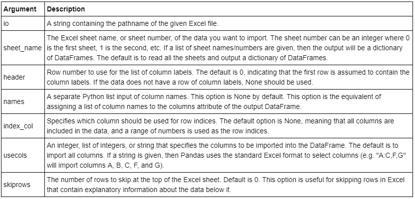

如果我们使用本地文件的路径，默认情况下它由“\”分隔，但是 python 接受“/”，所以要更改斜线或简单地将文件添加到 python 文件所在的同一文件夹中。如果你需要以上的详细解释，请参考下面的文章。[https://medium . com/@ ageitgey/python-3-quick-tip-the-easy-way-to-deal-of-file-paths-on-windows-MAC-and-Linux-11a 072 b 58 d5f](https://medium.com/@ageitgey/python-3-quick-tip-the-easy-way-to-deal-with-file-paths-on-windows-mac-and-linux-11a072b58d5f)

我们可以使用 Python 扫描目录中的文件，并挑选出我们想要的文件。

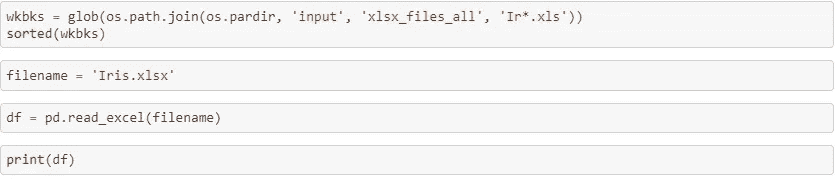

## 导入特定的工作表

默认情况下，文件中的第一个工作表按原样导入到数据框中。
使用 sheet_name 参数，我们可以明确地提到我们想要导入的工作表。默认值为 0，即文件中的第一张图纸。
我们既可以提到工作表的名称，也可以传递一个整数值来引用工作表的索引

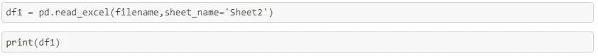

## 使用工作表中的列作为索引

除非明确说明，否则在数据帧中添加一个索引列，默认情况下从 0 开始。
使用 index_col 参数，我们可以操作数据帧中的索引列，如果我们将值从 none 设置为 0，它将使用第一列作为我们的索引。

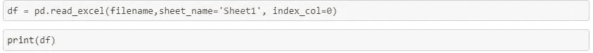

## 跳过行和列

默认的 read_excel 参数假设第一行是列名的列表，它作为列标签自动包含在数据帧中。
使用 skiprows 和 header 等参数，我们可以操作导入数据帧的行为。

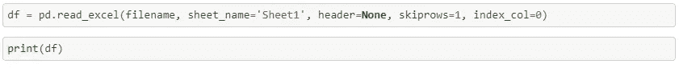

## 导入特定的列

使用 usecols 参数，我们可以指定是否在数据帧中导入特定的列

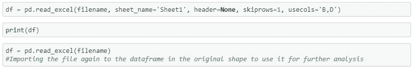

*这并不是可用功能的终结，而是一个开始，您可以根据自己的需求来使用它们*

# 让我们来看看从 10，000 英尺高度的数据

现在我们有了数据框架，让我们从多个角度来看这些数据，以便掌握其中的窍门/
Pandas 有很多我们可以使用的功能。我们将使用其中的一些来浏览一下我们的数据集。

## “头”对“尾”:

查看第一个或最后一个**的五个**行。
*默认为 5，然而该参数允许我们使用一个特定的数字*

## 查看特定列的数据

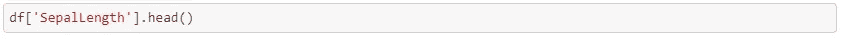

## 获取所有列的名称

## 信息方法

给出了数据帧的概要

## 形状方法

返回数据帧的维度

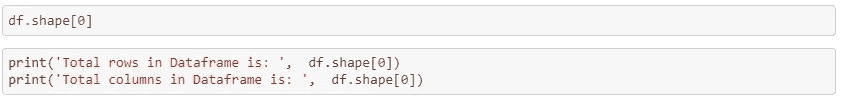

## 查看 DataFrame 中的数据类型

# 切片和切块，即 Excel 过滤器

描述性报告是关于数据子集和聚合的，当我们稍微理解我们的数据时，我们开始使用过滤器来查看更小的数据集或查看特定的列，可能会有更好的理解。Python 提供了许多不同的方法来分割数据帧，我们将使用其中的几种方法来了解它是如何工作的

## 查看特定列

选择列有三种主要方法:

*   使用点符号:例如 data.column_name
*   使用方括号和列名，例如 data['column_name']
*   使用数字索引和 iloc 选择器 data.loc[:，' column_number']

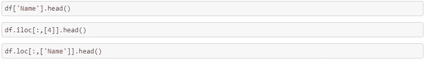

## 查看多列

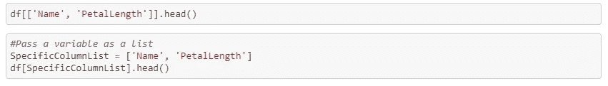

## 查看特定行的数据

这里使用的方法是使用 loc 函数进行切片，在这里我们可以指定由冒号分隔的开始和结束行
记住，**索引从 0 开始，而不是从 1 开始**

## 将行和列切片在一起

## 筛选列中的数据

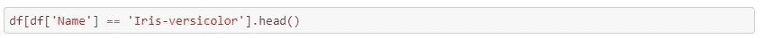

## 过滤多个值

## 使用列表筛选多个值

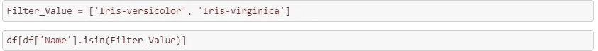

## 筛选不在列表中或不等于 Excel 中的值

## 在多列中使用多个条件进行筛选

**输入应该总是列表**
我们可以用这种方法复制 excel 中的高级过滤功能

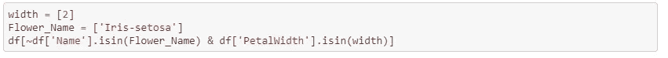

## 使用数字条件过滤

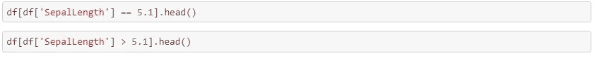

## 在 Excel 中复制自定义筛选器

## 组合两个过滤器以获得结果

## 包含 Excel 中的函数

## 从 DataFrame 中获取唯一值

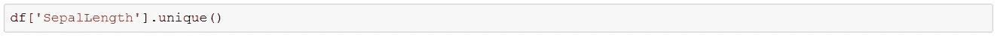

*如果我们想要查看具有唯一值的整个数据帧，我们可以使用 drop_duplicates 方法*

## 排序值

按某一列对数据进行排序，默认情况下是升序排序

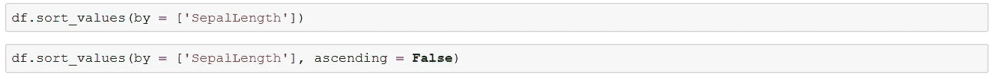

# 数据的统计摘要

## 数据帧描述方法

*生成描述性统计数据，总结数据集分布的集中趋势、离散度和形状，不包括 NaN 值*

字符列的汇总统计信息

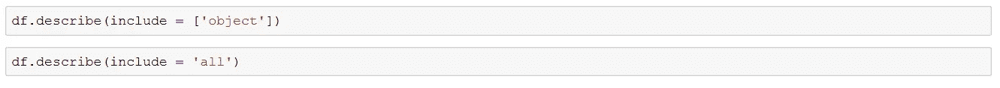

# 数据聚合

## 计算特定列的唯一值

*产生的输出是一个序列。您可以将其称为单列透视表*

## 细胞计数

对每列或每行的非 NA 细胞进行计数

## 总和

汇总数据以获得行或列的快照

复制针对每一行添加总计列的方法

## 向现有数据集中添加汇总列

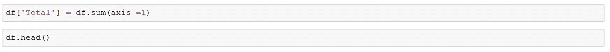

## 特定列的总和，使用 loc 方法并传递列名

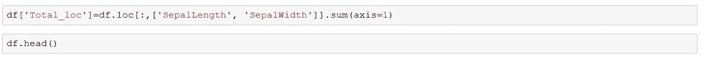

## 或者，我们可以使用下面的方法

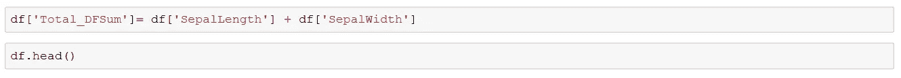

## 不喜欢新列，使用 drop 方法将其删除

## 在每列下添加总和

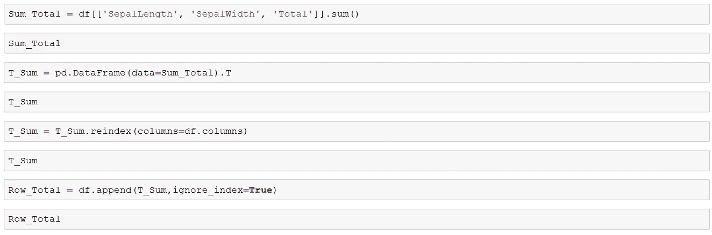

上面已经做了很多，我们使用的方法是:

*   Sum_Total:对列求和
*   T_Sum:将串行输出转换为数据帧并转置
*   重新索引以添加缺少的列
*   Row_Total:将 T_Sum 附加到现有数据帧

## 基于标准的总和，即 Excel 中的 Sumif

## 苏米夫斯

## 平均 if

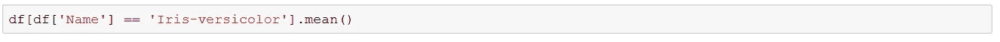

## 最大

## 福建话

## Groupby，即 Excel 中的小计

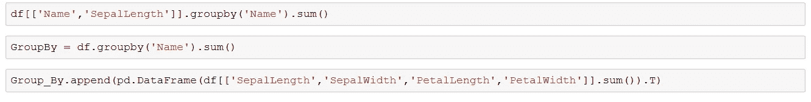

# 数据框架中的数据透视表，即 Excel 中的数据透视表

谁不喜欢 Excel 中的数据透视表呢？它是分析数据的最佳方式之一，可以快速浏览信息，用一个超级简单的界面帮助你分割数据，帮助你根据数据绘制图表，添加计算列等。不，我们不会有一个接口来工作，我们将不得不显式地编写代码来获得输出，不，它不会为您生成图表，但我不认为我们可以在不了解数据透视表的情况下完成一个教程。

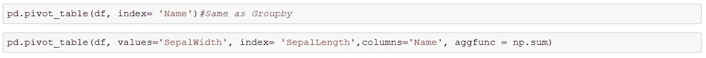

一个简单的数据透视表向我们显示了行中的 SepalWidth 值、列中的 SepalLength 值和列标签中的 Name 值的总和

让我们看看能不能把它弄复杂一点。

通过使用 fill_value 参数，空格现在被替换为 0

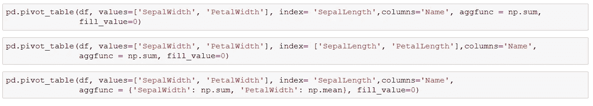

我们可以使用字典方法对值进行单独计算，也可以对值进行多次计算

如果我们使用 margins 参数，我们可以添加总计行

# 纵向查找函数

Excel 中的 vlookup 是一个多么神奇的公式啊，我想这是每个人在学习加法之前都想学的第一件事。当有人应用 vlookup 时看起来很迷人，当我们得到输出时看起来很神奇。让生活变得简单。我可以非常自信地说，它是在电子表格上进行的所有数据争论的支柱。

**很遗憾**我们熊猫没有 vlookup 功能！

因为我们在 Pandas 中没有“Vlookup”功能，所以使用 Merge 作为替代，这与 SQL 相同。总共有四个合并选项可用:

*   ‘left’—使用左侧数据帧中的共享列并匹配右侧数据帧。将任何 N/A 填写为 NaN
*   ‘右’—使用右侧数据帧中的共享列，并与左侧数据帧匹配。将任何 N/A 填写为 NaN
*   ' inner' —仅显示两个共享列重叠的数据。默认方法。
*   ‘outer’—当左数据帧或右数据帧中存在匹配时，返回所有记录。

上面的例子可能不是支持这个概念的最好例子，但是工作原理是一样的。

正如他们所说，“没有完美的教程存在”，我的也没有:)