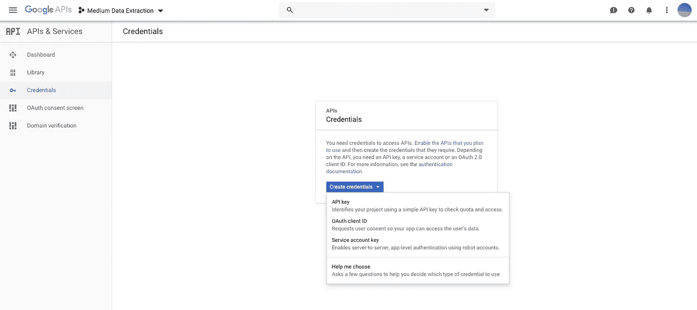

# 用 Python 从各种工作表中提取数据

> 原文：<https://towardsdatascience.com/replacing-sheets-with-python-f1608e58d2ca?source=collection_archive---------6----------------------->

## 或者如何学习统一 Google 工作表、Excel 和 CSV 文件——代码指南


Widespread tabular data storage file formats — CSV, Microsoft Excel, Google Sheets

Python 通常被称为粘合语言。这是因为随着时间的推移，开发了大量的接口库和特性——这是由它的广泛使用和令人惊叹的、广泛的开源社区推动的。这些库和特性提供了对不同文件格式以及数据源(数据库、网页和 API)的直接访问。

这个故事着重于数据的提取部分。下周的故事将更深入地分析综合数据，以获得有意义和令人兴奋的见解。

[](/how-to-explore-and-visualize-a-dataset-with-python-7da5024900ef) [## 如何使用 Python 浏览和可视化数据集

### 了解如何使用 Seaborn 快速生成漂亮而有见地的图表

towardsdatascience.com](/how-to-explore-and-visualize-a-dataset-with-python-7da5024900ef) 

但是不要让这阻止你自己分析数据。

## 您将学到的内容:

*   从 Google Sheets 中提取数据
*   从 CSV 文件中提取数据
*   从 Excel 文件中提取数据

## 这篇文章是写给谁的:

*   Python 初学者
*   不得不经常争论数据的人

由于本文旨在作为一篇代码文章，您应该设置您的开发环境(我推荐 Jupyter Notebook/Lab)并开始一个新的笔记本。你可以在这里找到源代码和文件[。](https://github.com/FBosler/Medium-Data-Extraction)

如果你不知道如何使用 Jupyter/Python。请查看该指南:

[](/get-started-with-python-e50dc8c96589) [## 所以你想成为一名数据科学家？

### 到底是什么阻止了你？下面是如何开始！

towardsdatascience.com](/get-started-with-python-e50dc8c96589) 

# 情况:

在今天的故事中，我将带你进入一个虚构但可能非常熟悉的场景。你要结合各种来源的数据来创建一个报告或运行一些分析。

**免责声明:下面的例子和使用的数据完全是虚构的**

你的任务是找出如何提高你的销售团队的业绩。在我们假设的情况下，潜在客户有相当自发的需求。当这种情况发生时，您的销售团队会在系统中输入一个订单线索。然后，您的销售代表会尝试在订单线索被发现时安排一次会议。有时在之前，有时在之后。你的销售代表有一个费用预算，并且总是把会议和他们付钱的一顿饭结合在一起。销售代表报销他们的费用，并将发票交给会计团队处理。在潜在客户决定是否接受你的报价后，勤奋的销售代表会跟踪订单线索是否转化为销售。

对于您的分析，您可以访问以下三个数据源:

*   100，000 条订单线索(谷歌表单)
*   约 50.000 份餐费发票(Excel 文件)
*   公司和负责这些公司的销售代表的列表(CVS 文件)

# 获取 Google Sheets 数据:

访问 Google Sheets 是三者中最复杂的，因为它要求您设置一些使用 Google Sheets API 的凭证。理论上，您可以抓取一个公开可用的 Google Sheet(即，提取 HTML 源代码)，但是您必须使用 Beautiful Soup 之类的工具进行大量的数据操作，才能将 HTML 转储转换成有用的东西。我确实试过这个，但是结果很乱，不值得努力。那就 API 吧。此外，我们将使用 [gspread](https://gspread.readthedocs.io/en/latest/oauth2.html) 更加无缝地转换成熊猫数据帧。

## 获取 OAuth2 凭据

**前往** [**谷歌开发者控制台**](https://console.developers.google.com/project) **并创建一个新项目**(或者选择一个已有的)。单击“创建项目”按钮。如果你的公司使用谷歌邮件，你可能想换成你的私人账户，以避免潜在的权限冲突。


**为你的项目选择一个名字**(名字不重要，我称之为矿媒数据提取)


**点击 API&服务**并前往库


**启用 Google Sheets API。**点击结果，在下一页点击启用 API。


**创建服务账户&密钥文件。**服务账户是用于具有有限访问权限的编程访问的专用账户。服务帐户可以而且应该由 project 设置，并具有尽可能具体的权限以及手头任务所必需的权限。



创建一个 JSON(另一种文件格式)密钥文件。对于角色，选择“项目->查看器”


如果在上一步中没有设置角色，现在就设置。


Note: Setting “Viewer” is somewhat restrictive. If you want to create google sheets programmatically, you’ll have to choose a different setting

您的私有 JSON 密钥文件将可以下载或者自动下载。我建议将该文件重命名为“medium _ Data _ Extraction _ key . JSON ”,并将该文件移动到您的 Jupyter 笔记本的文件夹中，因为这将使下面的示例无缝工作。JSON 文件包含您最近创建的服务帐户的凭证。

**完美。你差不多完成了。**

## 下载数据

首先，您必须通过在笔记本中运行以下命令来下载并安装附加的软件包。

```
!pip install gspread
!pip install oauth2client
```

其次，您必须确保将之前创建的 JSON 密钥文件移动到运行 Jupyter 笔记本的文件夹中，如果它还不在那里的话。或者，您可以指定一个不同的 GOOGLE_KEY_FILE 路径。

WORKBOOK_KEY 是我为本次会议准备的 Google 工作表的工作簿 id。

```
WORKBOOK_KEY = '10HX66PbcGDvx6QKM8DC9_zCGp1TD_CZhovGUbtu_M6Y'
```

该表是公开的。如果您想下载不同的数据，您需要更改 WORKBOOK_KEY。id 通常可以在问题 URL 的 Google 工作表的最后两个反斜杠之间找到。

# 获取 CSV 数据

我们既可以通过传统方式从 [repo](https://github.com/FBosler/Medium-Data-Extraction) 下载 CSV 数据，也可以使用下面的代码片段。同样，您可能需要像这样安装缺失的请求包(在您的笔记本中运行):

```
!pip install requests
```

CSV 数据的美妙之处在于 Python / Pandas 可以开箱即用地处理它。对于 Excel，还需要额外的库。

# 获取 Excel 数据

在我们开始之前，你很可能必须安装 [openpyxl](https://openpyxl.readthedocs.io/en/stable/#) 和 [xlrd](https://pypi.org/project/xlrd/) ，这使得你的熊猫也能打开 Excel 表格。

```
!pip install openpyxl
!pip install xlrd
```

完成之后，我们以同样的方式获得 Excel 数据，并将其加载到另一个数据框架中。

**搞定！**您已经创建了三个不同的 Pandas 数据框，并且可以在同一个 Jupyter 笔记本中访问它们:

*   销售 _ 数据
*   销售 _ 团队
*   发票

请继续关注下周的文章，届时我们将探讨如何组合这些数据框架并分析数据。