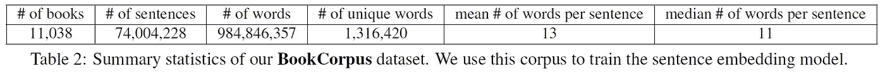

# 复制多伦多图书语料库数据集——一篇综述

> 原文：<https://towardsdatascience.com/replicating-the-toronto-bookcorpus-dataset-a-write-up-44ea7b87d091?source=collection_archive---------26----------------------->

## 通过从原始来源收集和预处理图书，复制不再公开的多伦多图书语料库数据集

Front page of the [Smashwords](https://www.smashwords.com/books/category/1/downloads/0/free/medium) website

虽然 Toronto BookCorpus (TBC)数据集不再公开提供，但它仍然经常用于现代 NLP 研究(例如，像 BERT、RoBERTa、XLNet、XLM 等的变压器)。)因此，对于我们这些无法在数据集离线前获取其副本的人来说，这篇文章提供了一种尽可能复制原始 TBC 数据集的方法。

# 🔍了解原始的多伦多图书语料库数据集

因此，为了尽可能好地复制 TBC 数据集，我们首先需要查阅介绍它的 [**原始论文**](https://arxiv.org/abs/1506.06724) 和 [**网站**](https://yknzhu.wixsite.com/mbweb) 以更好地理解它的内容。

在论文中，朱等人(2015)写道:*“我们从网络上收集了 11038 本书的语料库。[……]我们只收录了超过 2 万字的书籍，以过滤掉可能更嘈杂的短篇故事。”*接下来，作者给出了一些汇总统计数据:

从网站上，我们了解到网站 [**Smashwords**](https://www.smashwords.com/books/category/1/downloads/0/free/medium) 是数据集中收集和使用的 11038 本书的原始来源。

# 📚收集书籍

现在我们已经(大致)知道了要收集多少本书，从什么来源收集，我们就可以开始收集这些书了。为此，我写了一些抓取 Smashwords 网站的代码，在 [**这个 GitHub 资源库**](https://github.com/sgraaf/Replicate-Toronto-BookCorpus) **中公开。代码很快(并发)，结构良好，有据可查，所以应该非常容易使用。**

Inspector mode on a Smashwords book page (accessible through “Inspect Element” or F12 on Firefox)

## 🔗获取纯文本图书 URL

为了获得要下载的明文书籍的 URL 列表，我们首先需要从 Smashwords 的首页获取书籍页面的 URL(每本书在 Smashwords 上都有自己的页面)。接下来，我们可以从这些书籍页面中抓取明文书籍的 URL 进行下载。*你可以使用我的代码* [*在这里*](https://github.com/sgraaf/Replicate-Toronto-BookCorpus#1-getting-the-download-urls-of-the-plaintext-books-optional) *找到这样做的说明。*

## 📥下载明文书籍

现在我们有了一个要下载的明文书籍列表(使用它们的 URL)，我们需要…下载它们！这有点棘手，因为 Smashwords(暂时)阻止任何在一定时间内下载太多书(> 500 本)的 IP 地址。然而，这可以通过在下载书籍和经常切换 IP 地址(大约 30 次)时使用 VPN 来规避。你可以使用我的代码 [*在这里*](https://github.com/sgraaf/Replicate-Toronto-BookCorpus#2-downloading-the-plaintext-books) *找到这样做的说明。*

# ⚙️预处理书籍

为了获得 Toronto BookCorpus 数据集在大小和内容方面的真实副本，我们需要对我们刚刚下载的明文书籍进行如下预处理:1 .句子标记的书籍和 2。将所有书籍写入一个文本文件，每行一句话。*你可以使用我的代码* [*在这里*](https://github.com/sgraaf/Replicate-Toronto-BookCorpus/blob/master/README.md#3-pre-processing-the-plaintext-books) *找到这样做的说明。*

**就这样，大功告成！**🙌现在，您可以使用您刚刚创建的 Toronto BookCorpus 数据集的副本，亲自尝试 NLP 中最新最棒的内容。🤗

[1] Zhu，y .，Kiros，r .，Zemel，r .，Salakhutdinov，r .，Urtasun，r .，Torralba，a .，& Fidler，s .，对齐书籍和电影:通过观看电影和阅读书籍实现类似故事的视觉解释(2015)，《IEEE 计算机视觉国际会议论文集》(第 19–27 页)。