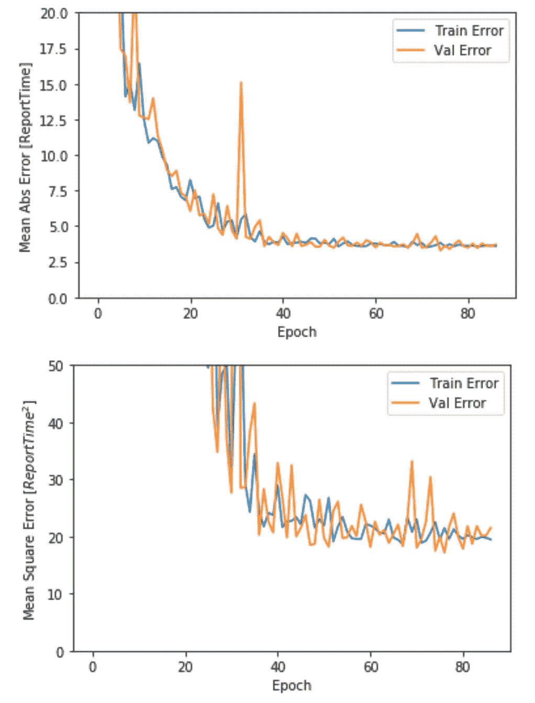

# 使用 Keras 和 TensorFlow 报告时间执行预测

> 原文：<https://towardsdatascience.com/report-time-execution-prediction-with-keras-and-tensorflow-8c9d9a889237?source=collection_archive---------12----------------------->

## 这篇文章的目的是用实践的方式向软件开发者解释机器学习。该模型基于企业系统中的一个常见用例—预测生成业务报告之前的等待时间。


Source: Pixabay

**用例**

业务应用程序中的报告生成通常需要时间，可能是几秒钟到几分钟。生成报告需要时间，因为通常会获取和处理许多记录，这个过程需要时间。用户经常感到沮丧，他们不知道要等多久才能完成报告，可能会关闭浏览器等。如果我们能够在提交报告请求之前通知用户——执行它需要多长时间，这将是一个很大的可用性改进。

我已经使用 [Keras](https://keras.io/) 回归实现了机器学习模型，根据训练数据(来自过去报告执行的日志信息)计算预期的报告执行时间。Keras 是一个将 [TensorFlow](https://www.tensorflow.org/) 复杂性包装成简单且用户友好的 API 的库。

这篇文章的目标是为软件开发人员提供一步步的指导，告诉他们如何构建一个简单而有用的机器学习模型。

Python 源代码和训练数据可以在我的 [GitHub](https://github.com/abaranovskis-redsamurai/automation-repo/tree/master/regression) repo 上获得。这段代码基于 Keras [教程](https://www.tensorflow.org/tutorials/keras/basic_regression)。

**数据**

使用 Pandas 库从 CSV 文件中获取训练数据:

```
column_names = ['report_id','report_params','day_part','exec_time']
raw_dataset = pd.read_csv('report_exec_times.csv')
dataset = raw_dataset.copy()
```

数据有四个特征，其中 *exec_time* 是目标特征(我们将要学习预测的那个)。 *Report_id* (报告类型标识符)和 *day_part* (一天标识符的一部分——上午、中午或下午)是分类特征，我们需要对这些特征进行编码，以帮助机器学习模型从中学习。基于报表类型，不同的报表具有不同的复杂性，模型将学习计算报表执行时间。如果指定了更多的报告参数，则报告的执行速度会更快(在当前的训练数据中假设，但这可以更改)-要处理的数据会更少。假设报告在中午和下午执行速度较慢(同样，如果您的场景不同，这可以更改)。

**数据处理**

我们需要对分类特征进行编码( *report_id* 和 *day_part* ，并对 *report_params* 特征进行规范化。这将有助于机器学习模型以更少的错误从数据中学习。

分类特征编码以一种简单的方式完成-查找所有唯一值，创建与唯一值一样多的列，并为当前行中与值匹配的列赋值 1。

从数据集中移除分类要素:

```
report_id = dataset.pop('report_id')
day_part = dataset.pop('day_part')
```

当值与当前行中的值匹配时，通过向数据集添加新列并设置 1 来编码 *report_id* 和 *day_part* 功能:

```
dataset['report_1'] = (report_id == 1)*1.0
dataset['report_2'] = (report_id == 2)*1.0
dataset['report_3'] = (report_id == 3)*1.0
dataset['report_4'] = (report_id == 4)*1.0
dataset['report_5'] = (report_id == 5)*1.0dataset['day_morning'] = (day_part == 1)*1.0
dataset['day_midday'] = (day_part == 2)*1.0
dataset['day_afternoon'] = (day_part == 3)*1.0
```

拆分行的子集进行测试是一个好主意，这将有助于评估模型定型质量。通常的做法是使用大约 20%的数据进行测试:

```
train_dataset = dataset.sample(frac=0.8,random_state=0)
test_dataset = dataset.drop(train_dataset.index)
```

下一步是为训练数据集生成统计数据(我们对目标变量的统计数据不感兴趣):

```
train_stats = train_dataset.describe()
train_stats.pop("exec_time")
train_stats = train_stats.transpose()
train_stats
```

创建标签(目标变量)—我们将训练模型来预测标签(执行时间):

```
train_labels = train_dataset.pop('exec_time')
test_labels = test_dataset.pop('exec_time')
```

归一化数据-将要素转换为相似的比例(数字之间不会有大的差异)，这将有助于模型更好地学习。使用先前计算的数据集统计信息完成归一化:

```
def norm(x):
  return (x - train_stats['mean']) / train_stats['std']normed_train_data = norm(train_dataset)
normed_test_data = norm(test_dataset)
```

**Keras 车型**

模型用 Keras API 定义。建立一个具有两层数据处理和第三层数据输出的神经网络。根据我对给定训练数据的测试，当每层有 50 个单元时，模型表现良好。使用 SGD(随机梯度下降)优化器(把它想成是一种从一步到另一步改进训练的工具)。训练质量——损失，通过均方误差度量来测量。这表明训练过程进行得有多顺利:

```
def build_model():
  model = keras.Sequential([
    layers.Dense(50, activation='sigmoid', input_shape=[len(train_dataset.keys())]),
    layers.Dense(50, activation='sigmoid'),
    layers.Dense(1)
  ])optimizer = keras.optimizers.SGD(0.001)model.compile(loss='mean_squared_error',
                optimizer=optimizer,
                metrics=['mean_absolute_error', 'mean_squared_error'])
  return model
```

**模型训练和评估**

Keras 提供了一个选项来定义提前停止回调。这有助于防止模型过度拟合。如果在 10 次迭代中没有改进，您可以指定停止训练:

```
model = build_model()# The patience parameter is the amount of epochs to check for improvement
early_stop = keras.callbacks.EarlyStopping(monitor='val_loss', patience=10)history = model.fit(normed_train_data, train_labels, epochs=EPOCHS,
                    validation_split = 0.2, batch_size=40, verbose=0, callbacks=[early_stop, PrintDot()])plot_history(history)
```

使用验证分割很重要，它会自动分配一部分训练数据，以便在训练过程中不断评估模型质量。

训练结果，由对照验证数据的训练误差表示:



Training results

让我们通过针对测试数据集运行模型来评估训练模型的质量:

```
loss, mae, mse = model.evaluate(normed_test_data, test_labels, verbose=0)print("Testing set Mean Abs Error: {:5.2f} Report Execution Time".format(mae))
```

结果——误差约为 4 秒，这非常合理:

```
Testing set Mean Abs Error:  3.65 Report Execution Time
```

**新数据预测**

我们已经准备好针对新数据运行我们的模型，新数据是训练或测试数据集中不存在的数据。我将使用类型 1 的报告，并告诉报告在下午执行(类型 3)。报告参数的数量等于 15，这样数量的参数在训练数据中不可用。让我们看看模型将如何执行，如果指定了更多的参数，它应该会选择更快的报告执行趋势。

数据帧结构:

```
headers = ['report_id', 'report_params', 'day_part']
dataset_input = pd.DataFrame([[1, 15, 3]],
                                columns=headers, 
                                dtype=float,
                                index=['input'])
```

标准化:

```
report_id = dataset_input.pop('report_id')
day_part = dataset_input.pop('day_part')dataset_input['report_1'] = (report_id == 1)*1.0
dataset_input['report_2'] = (report_id == 2)*1.0
dataset_input['report_3'] = (report_id == 3)*1.0
dataset_input['report_4'] = (report_id == 4)*1.0
dataset_input['report_5'] = (report_id == 5)*1.0dataset_input['day_morning'] = (day_part == 1)*1.0
dataset_input['day_midday'] = (day_part == 2)*1.0
dataset_input['day_afternoon'] = (day_part == 3)*1.0
```

编码:

```
normed_dataset_input = norm(dataset_input)
```

使用定型的 Keras 模型预测报表时间执行:

```
res = model.predict(normed_dataset_input)
```

结果:429.1053772 秒

让我们看看训练数据。具有 10 个参数的类型 1 和日期时间类型 3 的报告被记录为在 431 秒内执行。在同一时间使用更多参数的相同报告执行速度更快，这意味着模型运行良好。

**模型保存和重用**

了解如何将训练好的模型保存到文件中以供将来重用是很有用的:

```
model.save("report_exec_times_model.h5")
```

模型还原:

```
from keras.models import load_modelmodelFromFile = load_model('report_exec_times_model.h5')
modelFromFile.summary()
```

您可以在恢复的模型上运行预测功能，就像在刚刚训练的模型上一样:

```
res = modelFromFile.predict(normed_dataset_input)
```