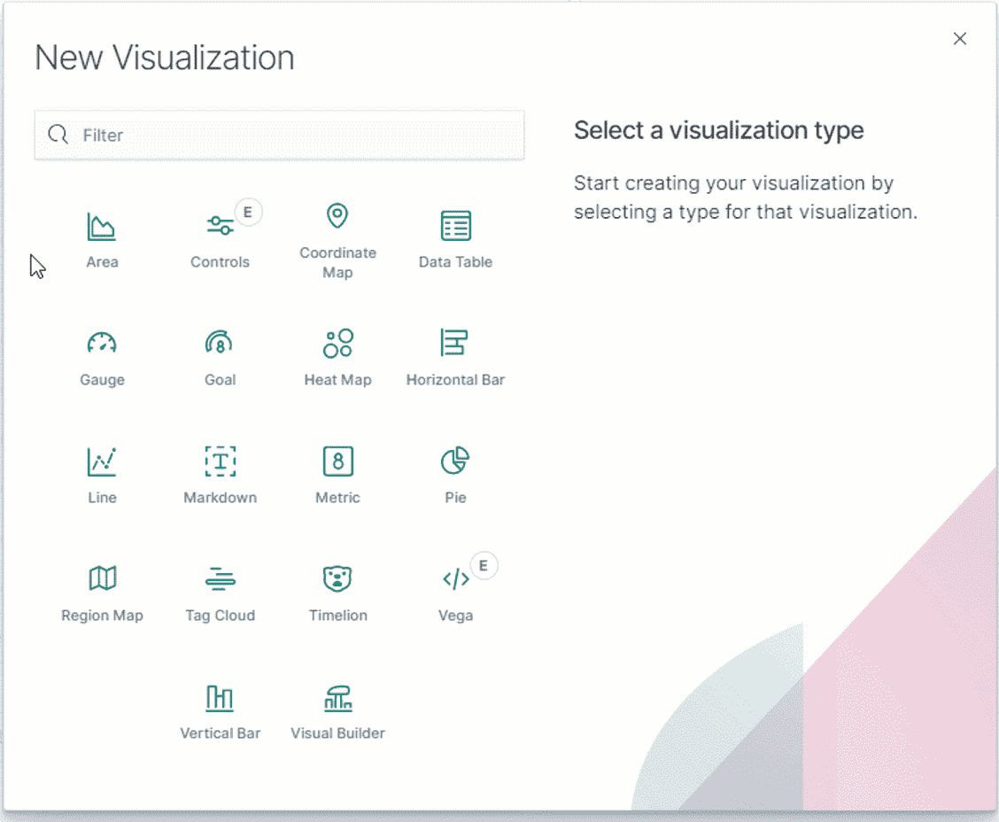
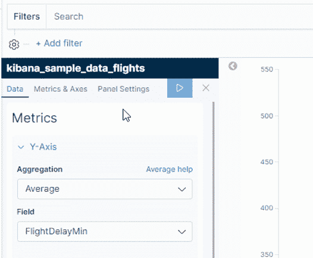
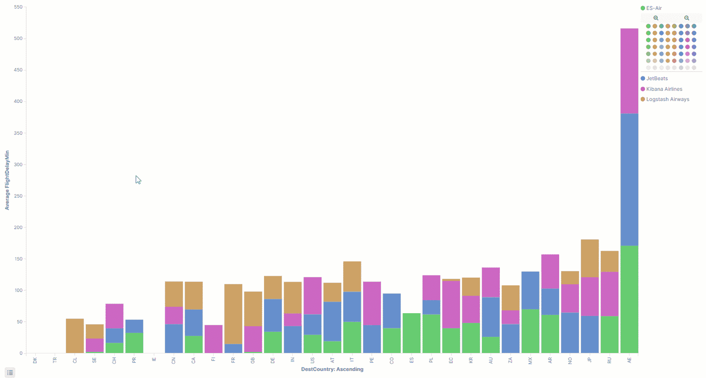
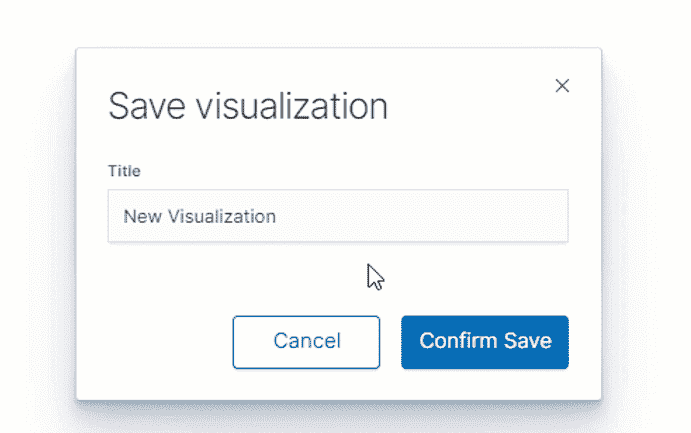
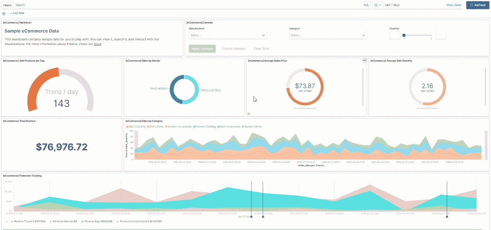
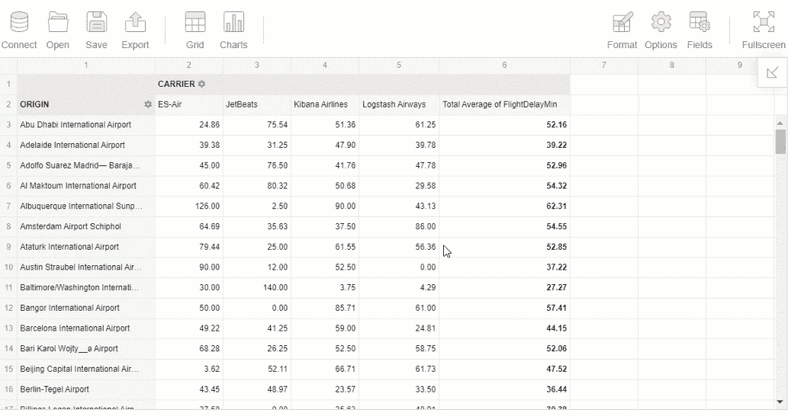
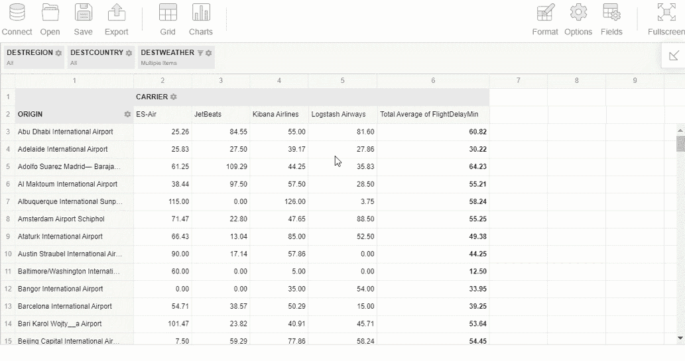

# 基巴纳的报告和数据可视化

> 原文：<https://towardsdatascience.com/reporting-data-visualization-in-kibana-336bbe92ac9d?source=collection_archive---------4----------------------->

## **简介**

在本文中，我想根据我的个人经验展示一下 **Kibana** 的功能。我的目的是对 Kibana 的功能给出一个高层次的概述，并分析定制插件对旋转和报告的需求。在接下来的文章中，我希望对 Kibana 进行一次*的深入探索，并更详细地介绍*数据可视化过程*。*

# **什么是基巴纳**

凭借 GitHub 上超过 11k 颗星星， **Kibana** 赢得了全世界开发者的心，多年来一直是弹性搜索数据可视化的最佳平台。不是没有原因的。

*那么是什么让 Kibana 成为弹性搜索的必备工具呢？*

它的主要目的听起来很简单，但它确实很强大:

*   Kibana 旨在通过提供一个单一的接口，使与弹性堆栈的交互变得简单而省时，从而帮助您更好地理解您的数据。 *Kibana 为您做了很多繁重的工作*，包括通过 REST API 查询 Elasticsearch 的数据。通过这种方式，它消除了手工编写查询的需要。
*   你会喜欢的另一个特性是，Kibana 是 100% **开源的**——它的源代码可以在 [GitHub 库](https://github.com/elastic/kibana/?r=td1)上找到，每个人都可以为它的开发做出贡献。由于这个原因，产品被积极地更新、维护和增强。
*   此外，**社区**非常强大并且**支持**——你可以在[基巴纳讨论论坛](https://discuss.elastic.co/c/kibana/?r=td1)上感受到这一点。

# **可视化能力**

让我简单介绍一下可视化功能。

当您将数据导入到 Kibana 中时，神奇的事情就开始了。

有多个**核心可视化**，如*区域*、*饼图*、*线条*和*条形图*、*直方图*、*日光*、*热度*、*区域*和*坐标图*、*量规*、

*控件*值得特别关注——使用它们，您可以添加交互式输入(下拉菜单和单选滑块)并在**实时**中过滤仪表板的内容。

除了基本的可视化，Kibana 还支持**Vega**——一种*高级语法*，允许快速构建定制的可视化。

如果你对分析时间序列数据感兴趣，你可以利用 **Timelion** 提供的功能。Timelion 是一种特殊类型的可视化工具，它可以获取原始时间序列数据，并以某种方式呈现出来，从而帮助您从数据中获得可操作的见解。

一旦定义了索引模式并选择了可视化，就可以应用**度量聚合**和**桶聚合**来对符合特定搜索标准的文档进行分类。

人们可能会对各种口味和用途的 Y 轴聚合印象深刻，尤其是统计聚合:um、平均值、最小值、最大值、计数(唯一计数)、标准偏差、中值、百分位数、百分位数排名、最高命中率和地理质心。

对于 X 轴，您可以从**桶聚合**中受益，如*日期直方图、范围、术语、过滤器和重要术语*。除了聚合之外，您还可以通过应用后续的子聚合来进一步划分数据。

除了上述聚合，您还可以定义*父管道*和*同级管道*聚合。要详细了解所有可能的聚合，我推荐阅读这篇综合文章。

为了只显示符合特定标准的文档中的数据，您可以添加**字段过滤器**。

**过滤**有两个选项:

*   通过使用**基巴纳查询语言** (KBL)或 **Lucene** 作为语法来编写搜索查询。
*   通过点击可视化元素。

添加过滤器的界面非常舒适——来看看吧:

没有任何东西限制您编写基于多个字段和条件的复杂过滤器。

## **可视化样本**

以下是一个堆积条形图的示例，您可以创建该图来了解承运人飞往特定目的地的航班的平均延误时间:

这种可视化建立在[样本飞行数据](https://www.elastic.co/guide/en/kibana/current/add-sample-data.html)的基础上。

## **保存结果**

一旦您对结果感到满意，您就可以**保存**创建的可视化。它已准备好添加到仪表板中，并与您的队友共享。可视化是完全可重复使用的。

# **向仪表板添加组件**

下面是一个可以用 Kibana 构建的仪表板示例:

您可以通过查看底层的原始数据或聚合数据来检查每一个可视化，如果有必要，甚至可以将这些数据导出到 CSV。

为了数据分析过程的完整性，生成的仪表板可以转换为 **PDF** 和 **PNG** 格式的**定制报告**。

# **个人印象**

最酷的一个优点是，Kibana 让你可以自由控制仪表盘的几乎每个方面。从提供给可视化效果的数据源到调整特定元素的单个颜色。其他强大的特性是**聚合**和**过滤**功能。

但是我特别喜欢仪表盘的元素是完全交互式和可配置的。每个组件都可以根据您的喜好定制—您可以更改颜色、图例、标题等。

# **增强了基巴纳语的报告功能**

作为*商业智能*的工具，Kibana 是完美的。它的界面允许在几分钟内创建一个仪表板，并在它的帮助下分析数据。

尽管有大量的可视化工具，如果基巴纳有一个专门为*高级报告*目的设计的工具，那就太好了。它应该能够通过切片和切块从不同角度查看数据。在我看来，数据透视表最适合这项任务。Kibana 有一个插件，很容易安装和使用 Elasticsearch 数据。它叫 **Flexmonster** 。虽然最初是作为一个可以集成到任何使用 JavaScript 的应用程序中的数据透视表组件创建的，但它也可以作为 Kibana 的一部分。你可以将它连接到 *Elasticsearch index* ，从中获取文档并开始探索数据。

## **透视表的特性**

Flexmonster 为有效的报告提供了多种功能，如**聚合函数**、**过滤器**、排序以及内置的将报告导出为 PDF、Excel 和其他格式的**。**

对于聚合，有 *sum、count、distinct count、average、min 和 max 函数*可用。

## **过滤选项**

您可以按成员名称或报表筛选器来筛选数据，以保持报表井井有条。

但是我想特别强调的一个特性是通过 UI 完全交互地改变切片的能力。设置好一个报告后，你可以将 ***拖放到*** 网格的右边。要知道哪些记录支持聚合值，您可以*钻取*单元格。

一个额外的优势是组件的性能。人们可以注意到大量的行被足够平滑地渲染。

## **数据透视表**

我喜欢的另一件事是在网格和图表模式之间切换的能力。通过单击工具栏上的按钮，您可以立即在图表中显示报告的层次结构。图表也支持*过滤*。

## **定制组件**

数据透视表提供了通过在紧凑视图和经典视图之间切换来配置布局的自由。另一种定制组件外观的方法是应用主题，改变 CSS 样式和工具栏。

# **个人印象**

今天，我尝试介绍了 Kibana 的数据可视化功能，并展示了一个名为 Flexmonster 的 web 报告插件。

在我看来， **Flexmonster** 补充了 **Kibana** 中可用的数据可视化——它们是很好的搭配。这个工具完全符合我在数据分析方面的要求。有了它，我可以专注于报告，并揭示隐藏在数据中的见解。

我建议尝试一下。希望它们能让你的数据分析大放异彩。

感谢您的阅读！

# **反馈**

在 Kibana 中，你最喜欢哪种可视化？你使用任何第三方插件进行数据分析吗？我很高兴听到你的经历。

## **有用链接**

*   [关于基巴纳](https://www.elastic.co/products/kibana/?r=td1)
*   [Flexmonster 透视表&图表演示](https://www.flexmonster.com/demos/pivot-table-js/?r=td1)
*   [如何将 Flexmonster 透视表添加到 Kibana](https://github.com/flexmonster/pivot-kibana/?r=td1)