# 使用隐马尔可夫模型用社交网络数据表示人类移动模式

> 原文：<https://towardsdatascience.com/representing-human-mobility-patterns-with-social-network-data-using-hidden-markov-models-68d90218f39?source=collection_archive---------21----------------------->

**作者** : *王家卫，塞斯·李，蔡贤洙，贺飞*

https://github.com/sethlee0111/MobilityHMM**Github**

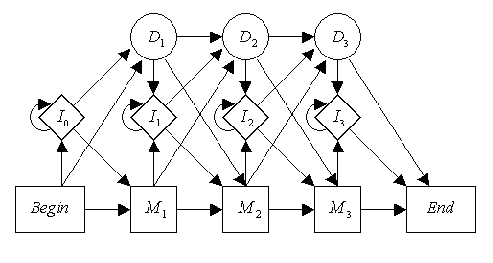

Hidden Markov Model

# **简介**

理解并知道如何利用人类的移动性对于现代的各种应用非常有帮助。例如，通过了解人们如何在城市中移动，城市规划者和开发者可以更有效地设计城市。然而，利用人类的流动性并不容易，因为人们的生活方式多种多样。此外，城市每天都变得越来越复杂，越来越大。因此，我们需要一种更好的方法和模型来分析和描述人类的移动模式。

其中一种方法是使用地理标签社交媒体应用。现在，每个人都有一部随身携带的手机。此外，脸书、Instagram 和 Twitter 等社交媒体应用程序现在为用户的 show others 提供签到服务，并跟踪他们去了哪里。

这个收集的海量数据集包括用户的位置和活动，通过利用这个社交媒体服务，我们可以更好地表示人类的移动性。

对于这个项目，我们分析并利用 *FourSquare* 手机应用程序数据来建立一个模型，以便更好地预测人类的移动性。

# **数据集**

我们使用 FourSquare 的*纽约入住数据集*。总共有 227428 个签到数据集，日期范围在 2012 年 4 月到 2013 年 2 月之间。总共有 1083 个用户，每人至少签到 100 次。此外，有 250 个场馆类别，每个场馆有 38333 个不同场馆 id。

adataset 的示例如下所示:

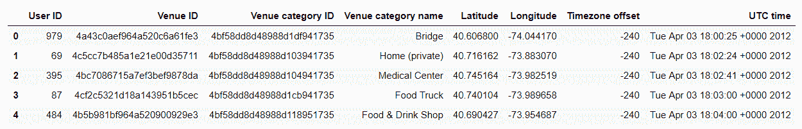

*Figure: raw data*

数据表现出高度的稀疏性和高度的复杂性。这主要是因为人们不会在所到之处持续不断地签到。此外，纽约市的人类活动非常复杂，因为它的人口密度高，场地密度大，所有东西都在彼此之上。因此，我们必须对数据进行预处理，以收集我们需要的正确和有意义的信息。

轨迹是从包含用户活动模式的用户签到记录中提取的有用特征。轨迹被定义为在定义的时间间隔内连接的用户活动的序列。对于这个时间差，我们使用了 3 个小时，并通过计算用户两次活动之间的时间差和定义轨迹来预处理数据。

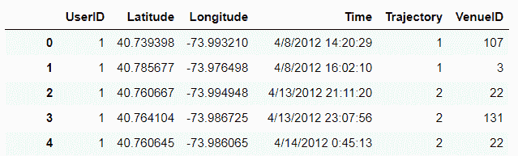

*Figure: pre-processed data after grouping by user and trajectory*

数据集在[这里](https://sites.google.com/site/yangdingqi/home/foursquare-dataset)可用。

# **机动性嗯**

现有的移动模型大多使用 ***隐马尔可夫模型*** 来表示人体的移动性。隐马尔可夫模型是简单的具有隐藏状态的马尔可夫模型，其将更好地抽象用户的不可观察状态。其中一种是基于隐马尔可夫模型建立的，该模型具有由双变量高斯分布产生的发射概率，并预测用户的下一个位置。然而，我们想要使用所有三个特性；*地点、时间和类别。*这让我们设计并实现了一个隐马尔可夫模型，对于从每个状态观察到的每个特征，该模型具有不同的发射概率。在我们的模型中，一个状态生成三个特征，即位置(经度和纬度)、时间(秒)和类别。为了生成这些特征，高斯分布用于位置和时间，多项式分布用于类别。我们完全实现了这个模型，参考了 *hmmlearn* 库中 hmm 的现有实现。

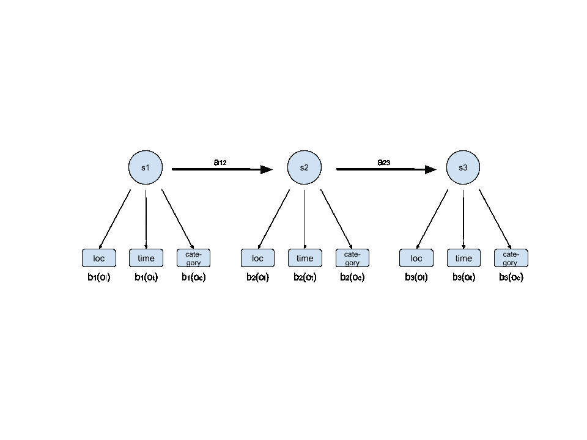

*Figure: Mobility Hidden Markov Model*

# **简单模型**

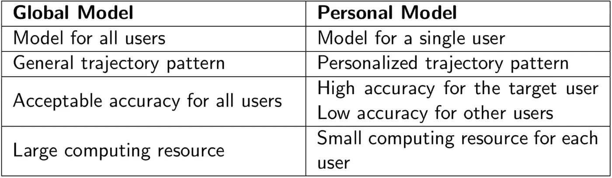

Figure. Global Model v.s. Personal Model

如上图所示，我们的简单模型有两个层次，一个是全局模型，另一个是个人模型。

全局模型是用所有用户数据训练的，它只代表所有用户的一般生活模式。对于没有足够数据生成高质量个人模型的用户来说，这是一个很好的替代模型，但它并不反映任何个人偏好。

个人模型是用每个用户自己的数据为每个用户训练的，它指示该用户的特定移动模式。然而，如前所述，数据集具有高度稀疏性，这意味着许多用户没有丰富的数据来生成其个性化模型。

总而言之:

**全球化**模式:

*   只能显示所有人的基本生活模式
*   不显示人的个性，过于概括

**个性化**模式:

*   只能展示每个人独特的生活方式
*   需要大量的轨迹数据供每个用户个性化

为了避免两种模型中任何一种的缺点，应该开发一些中级模型。

# **本地化型号**

显然，对于这个复杂而难以解决的问题来说，简单的模型过于简单和幼稚。即使使用我们定制的移动性隐马尔可夫模型，这也表现不佳。此外，很明显，对于这个问题来说，全球模型过于一般化，而个人模型过于具体和昂贵。

启发式地，我们的模型的粒度应该被重新考虑。根据分组模式对用户进行分组和预测是一个很好的选择。分组不仅有助于我们最终模型的粒度，而且有助于处理数据稀疏问题。用户不会记录他们每天的活动，通常他们会在一个不可预知的时间登录。而且他们数据的稀疏性给我们预测他们的活动带来了很多麻烦。

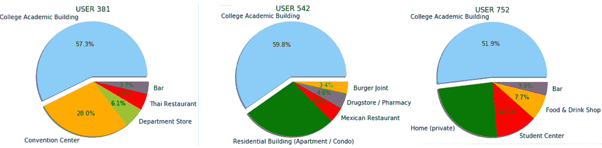

*Figure: Users sharing similar mobility pattern*

而分组有助于发现一定数量的人的模式，这些人可能有相似的工作，有相似的兴趣或经常去相似的地方。只有根据经验，我们才能得出结论，通过预测这些人群的活动能把我们引向更好的结果。我们决定使用场所类别名称对用户进行分组，因为在相同类别场所登记的用户可能具有相似的生活模式。从图中我们可以看出，这三个用户很可能是大学生，他们都有非常相似的生活方式。

我们发明了基于贪婪和随机算法的算法。它被命名为 ***基于 Jaccard 的随机化算法*** 。

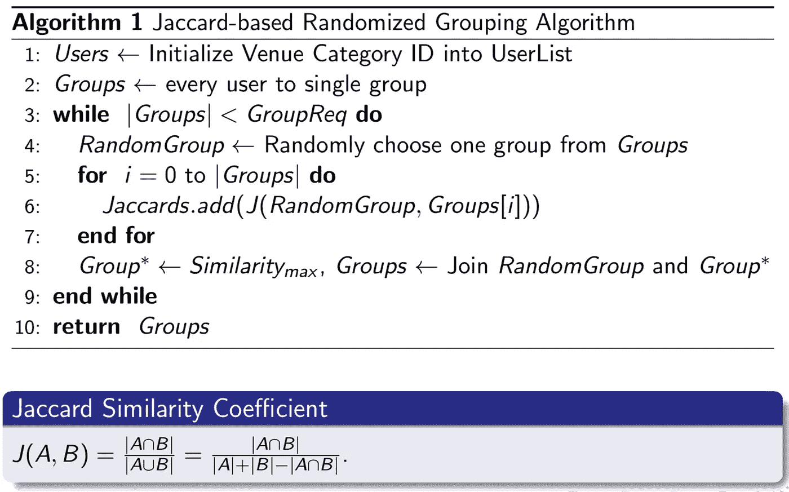

Alg: Jaccard-based Randomized Grouping Algorithm

[*Jaccard 相似系数*](https://en.wikipedia.org/wiki/Jaccard_index) 用来定义两个不同集合之间的相似性。我们随机选择一组，计算所有与其他组的 Jaccard 相似性。然后，我们将选择的组与他们登记入住的用户场地类别上的最大 Jaccard 相似性组相结合。我们一直这样做，直到所需的组数达到我们模型的要求。

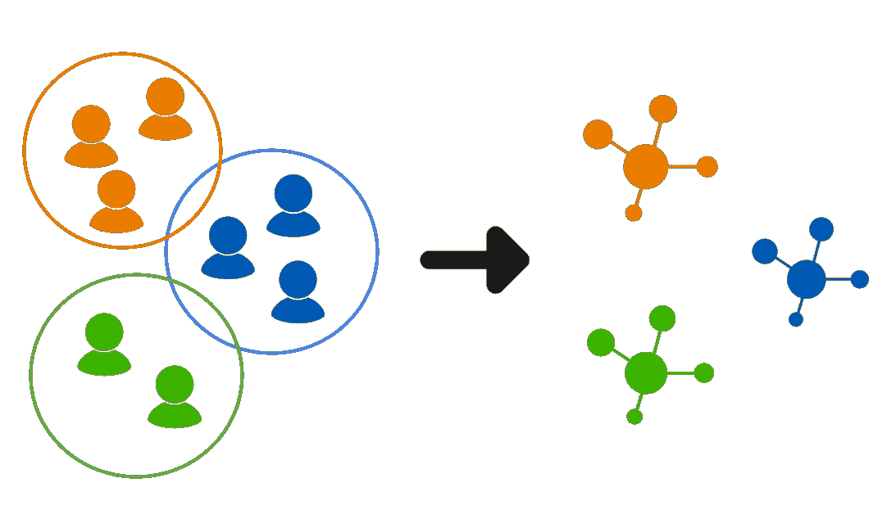

*Figure: localization model*

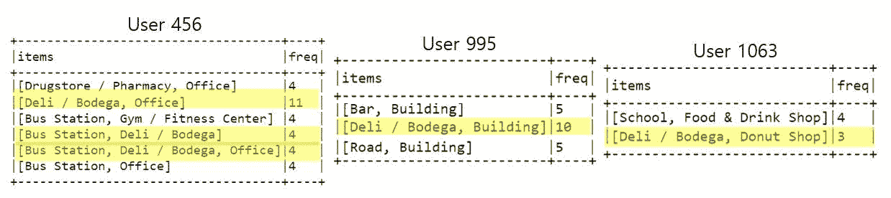

*Figure: users in the same group*

幸运的是，我们的本地化模式奏效了。正如我们从上图中看到的，我们从分组算法结果集中抽取了三个用户，显然他们有一些共同的场馆活动签到。

然而，这种基于 Jaccard 的算法确实有一些限制。一方面，我们在整个时间讨论中讨论术语“轨迹”，即某些基于时间的活动的动作序列。在我们的算法中，我们只计算地点类别，这与轨迹不同，因为用户可能有不同类型的轨迹模式，但最终与其他用户在相同的地方登记。然而，他们的生活模式可以完全不同。另一方面，我们的模型侧重于将用户分成特定的组，这在某种程度上降低了他们的个性。例如，用户可以是学生，也可以是舞蹈演员。然而，使用我们的模型，我们只能将这个用户分配到一个特定的组，而不是根据权重或概率将用户分成不同的组。

因此，我们需要更先进的分组技术或算法来解决这个问题。

# **重组模型**

如果这个模型不仅能学习移动模式，还能学习用户的分组方式，那就太棒了。我们的团队已经实现了一个新颖的迭代模型，它从拟合代表组的 hmm，到基于拟合的 hmm 对用户进行分组。

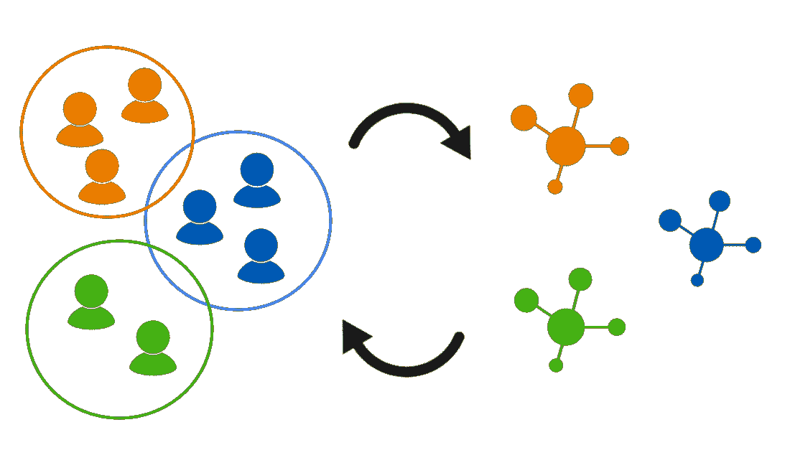

*Figure: re-grouping model*

在这个模型中，用户不属于一个单独的组。他们有**个向量**来记录他们属于某个群体的概率。这些向量是随机初始化的。在初始拟合之后，得到一个用户属于一个组的概率，我们计算它的后验概率，并使用**贝叶斯定理**从那里得到一个近似值。我们重复这个过程，直到模型收敛，这是用户分组没有变化的点。我们认为这可能揭示有意义的分组，因为它是随机初始化的，能够很好地代表其用户特征的组在分组阶段得到加强。

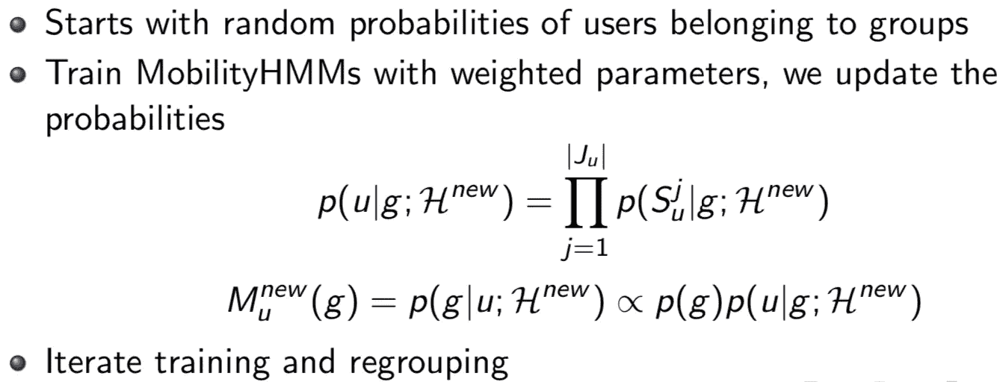

Figure. Weight Regrouping Algorithm

# **结果&评估**

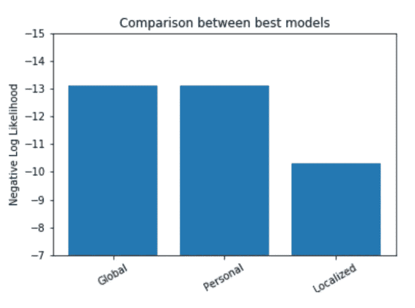

Figure: Best results for models

模型的评估是基于对数似然的度量来完成的。首先，我们使用 forward 算法计算测试数据集中样本的可能性，并根据测试数据集中的数据点数对其进行平均。如上图所示，与个人和全局这两个简单模型相比，本地化模型的性能要好得多。

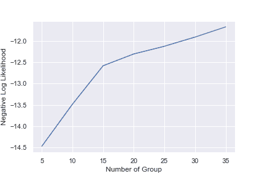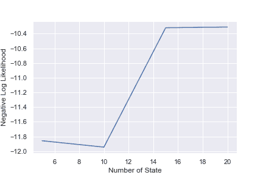

***Figure****:* hyperparameter tuning, Number of Group(left); Number of State(right)

为了获得我们本地化模型的最佳性能，有一些**超参数**可以在整个过程中进行调整。

*组数*:

从上图中我们可以看出，随着组数量的增加，模型表现得更好，这对于更多的组有能力表示不同的个性化组是有意义的。

*状态数*:

随着状态数量的增加，我们的模型表现得更好。隐马尔可夫模型的状态数说明了该模型表示复杂用户模式的能力。

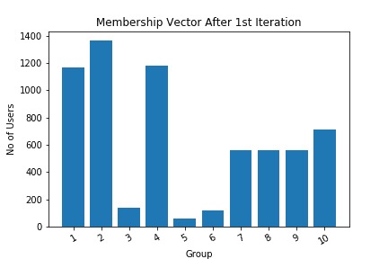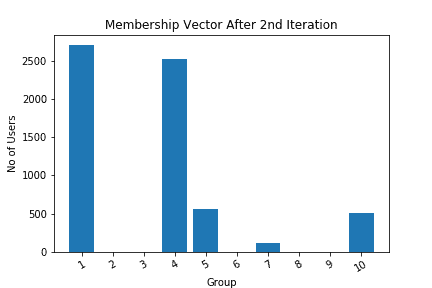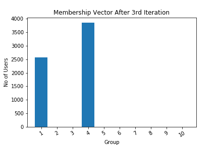

*Figure:* re-grouping results

不幸的是，重新分组方案还没有显示出有希望的结果。上面的三个图表明，用户倾向于聚集到最能代表他们的移动模式的两个组，而不是被分组到几个群中。我们认为这是因为我们使用的组数量较少。像本地化模型一样，如果我们使用足够数量的组，它们可能会开始代表一些有意义的东西。然而，由于我们的代码是从基础实现的，所以运行拟合算法需要花费大量时间。我们试图通过实现多处理来克服这个问题，并且实际上成功地将部分实现的学习时间提高了十倍以上，但是还需要做更多的工作来使它更快。

# **未来工作**

对于未来的工作，我们计划测试更多的模型，更好地代表移动模式。有一些现有的工作，通过不仅考虑先前的状态，而且考虑之前的状态，将隐马尔可夫模型向前推进了一步。此外，我们希望将我们的数据与具有类似特征的其他数据集进行测试，这意味着它们是稀疏的，但可以根据它们的模式进行分组。

此外，我们希望使用不同的评估指标，而不是对数似然，并希望能够将该模型推广到更一般的场合。潜在的，我们想在现实生活中应用模型，如广告和营销。

# **结论**

在这个项目中，我们研究了是否可以提出一个模型来表示稀疏的移动数据。我们实现了[**一种新颖的隐马尔可夫模型**](https://github.com/sethlee0111/MobilityHMM/blob/master/hmm.py) ，它可以采用具有不同发射概率的三个特征。最重要的是，我们试图获得人类移动性的最佳表示，从几个简单的模型到重新分组迭代方案。总之，我们发现基于 Jaccard 的随机算法的定位模型效果最好。然而，我们寻求用更高效的代码和计算能力来进一步开发我们的重新分组方法。

# 参考

[1]杨，张大庆，郑文生，和。

*在 lbsns 中利用用户时空特征对用户活动偏好进行建模。*

IEEE 系统、人和控制论汇刊:系统，45(1):129–142，2014。

[2]，张克阳，，，张，蒂姆·汉拉蒂和韩佳伟。

*Gmove:使用地理标记社交媒体的群体级移动性建模。*

第 22 届 ACM SIGKDD 知识发现和数据挖掘国际会议论文集，第 1305–1314 页。ACM，2016。

[3]韦斯利·马休、鲁本·拉波索和布鲁诺·马丁斯。

*用隐马尔可夫模型预测未来位置。*

《2012 年 ACM 普适计算会议论文集》,第 911-918 页。美国计算机学会，2012 年。

[4] Budhaditya Deb 和 Prithwish Basu。

*发现人体运动痕迹中的潜在语义结构。*

在欧洲无线传感器网络会议上，第 84-103 页。斯普林格，2015。

[5]格雷厄姆·W·泰勒、杰弗里·E·辛顿和萨姆·T·罗威斯。

*产生高维时间序列的两种分布式状态模型。*

《机器学习研究杂志》，2011 年第 12 期(3 月):1025–1068 页。

[6]克里斯蒂安·巴雷特、理查德·休伊和凯文·卡普勒斯。

*评分隐马尔可夫模型。*

生物信息学，13(2):191–199，1997。