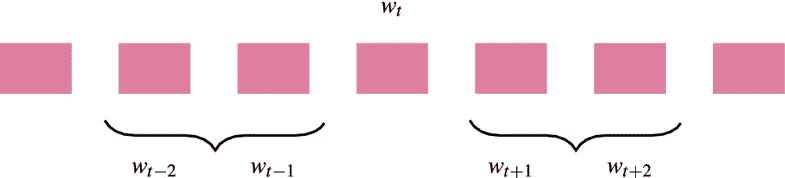
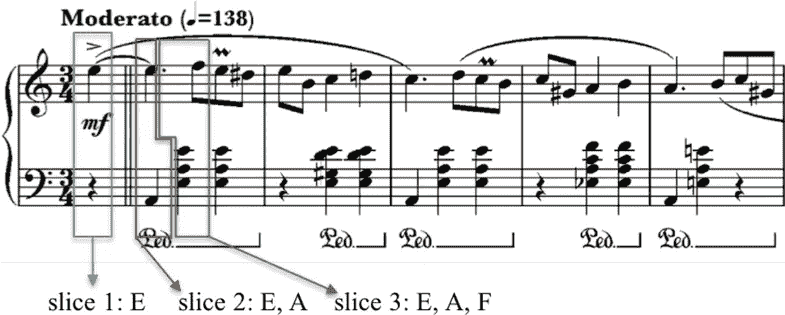
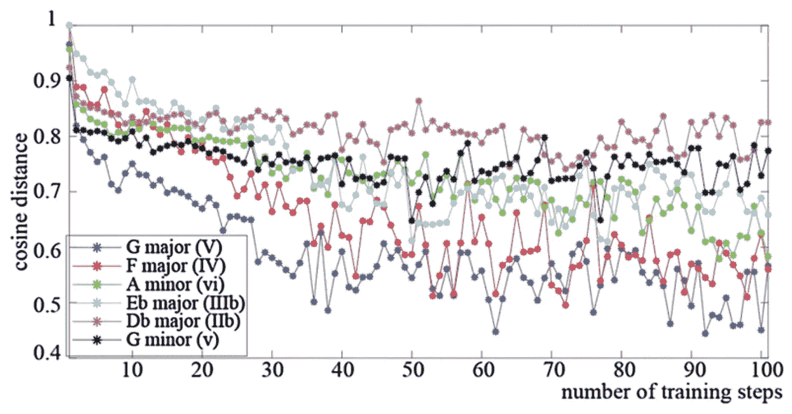
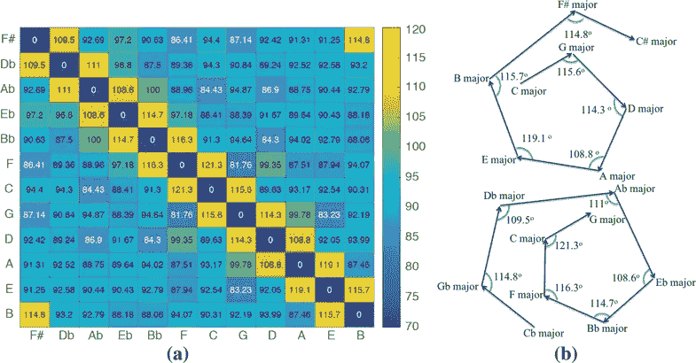
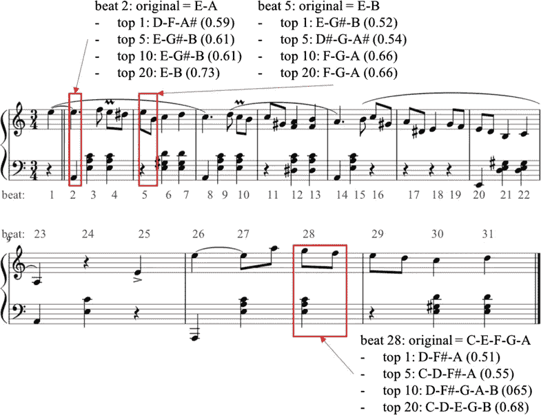

# 用 Word2vec 表现音乐？

> 原文：<https://towardsdatascience.com/representing-music-with-word2vec-c3c503176d52?source=collection_archive---------21----------------------->

机器学习算法已经改变了视野和自然语言处理。但是音乐呢？近几年来，音乐信息检索领域发展迅速。我们将研究如何将自然语言处理中的一些技术移植到音乐领域。在最近由[川，阿格雷斯，& Herremans (2018)](http://link.springer.com/article/10.1007/s00521-018-3923-1) 发表的一篇论文中，他们探索了 NLP 的一种流行技术，即 word2vec，如何用于表示复调音乐。让我们深入了解一下这是如何做到的…

# Word2vec

单词嵌入模型使我们有可能以一种有意义的方式来表示单词，以便机器学习模型可以更容易地处理它们。它们允许我们用一个表示语义的向量来表示单词。Word2vec 是 Mikolov 等人(2013)开发的一种流行的向量嵌入模型，它可以以非常有效的方式创建语义向量空间。

word2vec 的本质是一个简单的单层神经网络，以两种可能的方式构建:1)使用连续词袋(CBOW)；或者 2)使用跳格结构。这两种架构都非常高效，并且可以相对快速地进行训练。在这项研究中，我们使用 skip-gram 模型，因为 Mikolov 等人(2013 年)暗示它们对于较小的数据集更有效。跳格结构采用当前单词 w_t(输入层)并尝试在上下文窗口(输出层)中预测周围的单词:

**Figure from** [**Chuan et al (2018)**](http://link.springer.com/article/10.1007/s00521-018-3923-1)**. Illustration of a word *t* and its surrounding context window.**

由于网上流传的一些[流行图片](https://cdn-images-1.medium.com/max/800/1*SR6l59udY05_bUICAjb6-w.png)，人们对跳过程序的架构看起来有些困惑。网络输出不是由多个单词组成，而是由上下文窗口中的一个单词组成。它如何学会表示整个上下文窗口？在训练网络时，我们使用采样对，由输入单词和来自上下文窗口的随机单词组成。

这种类型的网络的传统训练目标包括计算𝑝(𝑤_{𝑡+𝑖}|𝑤_𝑡的 softmax 函数，其梯度的计算是昂贵的。幸运的是，噪声对比估计(Gutmann & Hyvä rine，2012 年)和负采样(Mikolov 等人，2013 年 b)等技术提供了一个解决方案。我们使用负采样来定义一个新的目标:最大化真实单词的概率，最小化噪声样本的概率。简单的二元逻辑回归将噪声样本从真实单词中分类出来。

一旦训练了 word2vec 模型，隐藏层的权重基本上代表了学习到的多维嵌入。

# 音乐作为文字？

音乐和语言有着内在的联系。两者都由一系列遵循一套语法规则的连续事件组成。更重要的是，它们都创造了期望。想象一下，我说:“我要去比萨店买一个…”。这产生了一个明确的期望…比萨饼。现在想象一下，我为你哼唱生日快乐的旋律，但我在最后一个音符前停下了…就像一个句子，旋律会产生期望。期望如此之高，以至于可以通过脑电图来测量，例如，大脑中的 N400 事件相关电位(Besson & Schö，2002)。

鉴于语言和文字之间的相似性，让我们看看一个流行的语言模型是否可以用作音乐的有意义的表示。为了将一个 midi 文件转换成“语言”，我们定义了音乐的“片段”(相当于单词)。我们数据集中的每个音乐片段都被分割成等时长、不重叠的一拍片段。每首乐曲的节拍时长可能不同，由 MIDI 工具箱估算。对于这些切片中的每一个，我们保留所有音高类别的列表，即没有八度音程信息的音高。

下图显示了肖邦玛祖卡舞曲作品 67 №4 的第一小节的切片是如何确定的。一拍在这里是四分之一音长。

**Figure from** [**Chuan et al (2018)**](http://link.springer.com/article/10.1007/s00521-018-3923-1) **— Creating words from slices of music**

# Word2vec 学习音调——音乐的分布语义学假说

在语言中，分布语义假设驱动矢量嵌入背后的动机。它认为“出现在相同语境中的词往往有相似的意思”(哈里斯，1954)。转换到向量空间，这意味着这些单词将在几何上彼此接近。让我们看看 word2vec 模型是否学习了音乐的类似表示。

## ***数据集***

川等人使用了一个包含八种不同风格(从古典到金属)的 MIDI 数据集。基于流派标签的存在，从总共 130，000 个作品中，仅选择了 23，178 个作品。在这些碎片中，有 4076 个独特的切片

## ***超参数***

仅使用 500 个最常出现的片段(或单词)来训练该模型，使用虚拟单词来替换其他单词。该过程增加了模型的准确性，因为更多的信息(出现)可用于所包括的单词。其他超参数包括学习率 0.1、跳过窗口大小 4、训练步骤数(1，000，000)和嵌入大小 256。

## *和弦*

为了评估音乐片段的语义是否被模型捕获，让我们看一下和弦。

在切片词汇表中，所有包含三元组的切片都被识别。然后用罗马数字标注它们的音阶等级(在音乐理论中经常这样做)。例如，在 C 调中，和弦 C 是 I，另一方面，G 和弦被表示为 v。余弦距离然后被用于计算不同音阶度的和弦在嵌入中彼此相距多远。

在 *n-* 维空间，中，两个非零向量 A 和 B 之间的余弦距离 Ds(A，B)计算如下:

D𝑐(A,B)=1−cos(𝜃)=1−D𝑠(A,B)

其中𝜃是 a 和 b 之间的角度，Ds 是余弦相似度:

从音乐理论的角度来看，I 和弦与 V 和弦之间的“音调”距离应该小于 I 和弦与 III 和弦之间的距离。下图显示了 c 大调三和弦与其他和弦之间的距离。

**Figure from** [**Chuan et al (2018)**](http://link.springer.com/article/10.1007/s00521-018-3923-1) **— Cosine distance between triads and the tonic chord = C major triad.**

一个 I 三和弦到 V，IV，vi 的距离更小！这与它们在音乐理论中被视为“音调更接近”的方式相对应，并表明 word2vec 模型学习了我们片段之间有意义的关系。

*word 2 vec 空间中和弦之间的余弦距离似乎反映了和弦在乐理中的功能作用！*

## 键

看看巴赫的《调和的克拉维尔》( WTC)的 24 首前奏曲，其中 24 个调(大调和小调)中的每一个都包含一段，我们可以研究新的嵌入空间是否捕获了关于调的信息。

为了扩充数据集，每个片段都被转置到其他每个主要或次要键(取决于原始键)，这导致每个片段有 12 个版本。这些键中的每一个的切片被映射到先前训练的向量空间上，并且使用 k-means 进行聚类，使得我们获得新数据集中每一个片段的质心。通过将片段转置到每个键，我们确保质心之间的余弦距离只受一个元素的影响:键。

下图显示了不同调中各棋子形心之间的余弦距离。正如所料，相隔五分音符在音调上很接近，并表示为对角线旁边的较暗区域。音调相距较远的键(例如 F 和 F#)具有橙色，这证实了我们的假设，即 word2vec 空格反映了键之间的音调距离！

**Figure from** [**Chuan et al (2018)**](http://link.springer.com/article/10.1007/s00521-018-3923-1)**— similarity matrix based on cosine distance between pairs of preludes in different keys.**

## *比喻*

word2vec 的一个突出例子是[图像](https://www.distilled.net/uploads/word2vec_chart.jpg)，它显示了向量空间中国王→王后和男人→女人之间的翻译(Mikolov 等人，2013c)。这表明意义可以通过矢量翻译提出来。这也适用于音乐吗？

我们首先从和弦切片中检测和弦，并查看和弦对向量，从 c 大调到 G 大调(I-V)。不同 I-V 向量之间的角度非常相似(见右图)，甚至可以认为是五分之一的多维圆。这再次证实了类比的概念可能存在于音乐的 word2vec 空间中，尽管需要更多的研究来揭示更清晰的例子。

**Figure from** [**Chuan et al (2018)**](http://link.springer.com/article/10.1007/s00521-018-3923-1) **— angle between chord-pair vectors.**

## 其他应用—音乐生成？

Chuan 等人(2018)简要介绍了该模型如何用于替换音乐片段以形成新音乐。他们表示，这只是一个初步的测试，但该系统可以作为一个更全面的系统，如 LSTM 的代表方法。科学论文中给出了更多的细节，但下图给出了结果的印象。

**Figure from** [**Chuan et al (2018)**](http://link.springer.com/article/10.1007/s00521-018-3923-1) **— Replacing slices with geometrically close slices.**

# 结论

Chuan，Agres 和 Herremans (2018)建立了一个 word2vec 模型，该模型可以捕捉复调音乐的音调属性，而无需将实际音符输入模型。这篇文章展示了令人信服的证据，表明关于和弦和键的信息可以在小说《嵌入》中找到，所以要回答标题中的问题:是的，我们可以用 word2vec 来表示复调音乐！现在，将这种表达嵌入到其他也捕捉音乐时间方面的模型中的道路是开放的。

# 参考

Besson M，schn D(2001)语言和音乐的比较。安纽约科学院科学 930(1):232–258。

传，陈春华，阿格雷斯，k .，&赫里曼斯，D. (2018)。从语境到概念:用 word2vec 探索音乐中的语义关系。*神经计算与应用——音乐与音频深度学习特刊*，1–14。 [Arxiv 预印本](https://arxiv.org/abs/1811.12408)。

Gutmann MU，hyv rinen A(2012)非标准化统计模型的噪声对比估计，以及对自然图像统计的应用。马赫学习研究 13(二月):307–361

哈里斯·ZS(1954)的分布结构。单词 10(2–3):146–162。

Mikolov，Chen，k .，Corrado，g .，& Dean，J. (2013 年)。向量空间中单词表示的有效估计。 *arXiv 预印本 arXiv:1301.3781。*

Mikolov T，Sutskever I，Chen K，Corrado GS，Dean J (2013b)对单词和短语及其组合性进行了分布式表征。《神经信息处理系统进展会议录》，第 3111-3119 页

Mikolov T，Yih Wt，Zweig G (2013c)连续空间单词表征中的语言规则。摘自:计算语言学协会北美分会 2013 年会议记录:人类语言技术，第 746-751 页