# 自然语言处理中的文本表示

> 原文：<https://towardsdatascience.com/representing-text-in-natural-language-processing-1eead30e57d8?source=collection_archive---------5----------------------->

## 理解书面单词:温习 Word2vec、GloVe、TF-IDF、单词袋、N-grams、1-hot 编码技术


本文着眼于自然语言处理(NLP)的语言表示。如果你是那些罕见的深度学习大师之一，你可能不会在这里学到任何新东西。如果没有，请和我一起进入将单词转换成算法可以理解的一些表示的迷人世界。我们激励我们为什么要这样做，存在哪些方法，以及它们如何在简单的例子中工作。我们将尽可能避免数学，我们将使用轻松的写作风格，以增加你真正读到文章结尾的机会。虽然文章看起来比较长，但是冲浪挺好玩的。


# 我们为什么关心语言？

每当婴儿开始说话时，语言起源的历史就会重演。事实上，当人类开始命名现实生活中出现的物体、动作和现象时，语言就开始了。当看到数十亿人共有的对神的创造的信仰时，我们可以认为语言和人类一样古老。每当我们写一条短信、一条推文、一次聊天、一封电子邮件、一个帖子甚至一个网页、一篇文章、一个博客或一本书时，我们都将思想转化为文字或符号。多亏了语言，人类能够将看不见的想法变成看得见的东西。此外，人类的思想变得可以被其他人获取，还有…，猜猜看？电脑！如果人类能够从文字中重建思想，计算机也能做到吗？

随着最近被称为人工智能的大肆宣传，让计算机能够处理、理解和生成人类语言是非常有用的。谷歌**翻译**是一个很好的例子，一个有用的例子。谷歌开始扫描大学图书馆的大量书籍并废弃网页，包括它们的人工翻译，并学习源和目标之间的模式(统计机器翻译)。今天，多亏了谷歌翻译和它的[序列对序列模型(神经机器翻译)](/natural-language-understanding-with-sequence-to-sequence-models-e87d41ad258b)，我们可以访问用我们还不会说的任何语言编码的思想。

[](/why-deep-learning-works-289f17cab01a) [## 深度学习为什么有效？

### 在开始是神经元:梯度下降，反向传播，回归，自动编码器，细胞神经网络…

towardsdatascience.com](/why-deep-learning-works-289f17cab01a) 

再比如**文本分类**。人类非常善于将事物分成不同的类别，例如“好”和“坏”。他们这样做已经很久了。同时，人类也非常善于以文本的形式生成和记录信息。根据谷歌的数据，全世界大约有 129，864，880 本书。我们敢打赌，你不会想用手将它们分类，即使给你世界上最大的图书馆，有足够的空间和书架。同时，你真的需要把这些书至少按类型分类:漫画、烹饪、商业、传记等等。在那里，你可以接受一个计算机程序，它可以读取书的内容并自动检测它的类型。让我们暂时离开书本。我们当中有越来越多的人不读书，他们更喜欢新闻。他们通常每天会收到数百条消息、帖子或文章。从相关更新(例如关于行业和市场的更新)中挑选出垃圾消息和假新闻，对于他们来说已经成为非常相关的任务，只要这是由计算机程序来完成的。你读这篇文章很可能是因为一个推荐算法把它从许多其他文章中整理出来，并发送到你的收件箱或移动应用程序中。该算法必须对成千上万篇文章进行分类，并根据你的阅读历史和你聪明的外表，选择这篇你可能会喜欢的文章。

**问答**机器人是如今的另一个炒作。想象一下，作为客户支持专家，如果你有一份自己的副本，每天接听客户打来的几十个电话，一遍又一遍地问同样的问题，你会节省多少时间。我们都听说过亚马逊 Alexa，苹果 Siri 或者谷歌助手。这些系统会自动回答人类用自然语言提出的问题。

希望上面的例子能激发为什么让计算机处理自然语言对你来说是一个吸引人的话题。如果没有，看看进一步说明**语音识别、语音模仿**和**语音合成**的例子肯定会让你大吃一惊。

# 电脑喜欢数字

现在，为什么所有这些谈论语言和计算机？你每天都在你最喜欢的文字处理器或电子邮件软件中输入文本。那么，为什么计算机很难理解你的文本呢？语言在各个层面都是模糊的:词汇、短语、语义。语言假设听者意识到世界，语境和交流技巧。如果你在搜索引擎中输入“鼠标信息”，你是在寻找一只宠物还是一个工具？文本的表示对于许多现实应用程序的性能非常重要。

现在，我们如何把语言变成计算机算法喜欢的东西？在基础上，计算机中的处理器执行简单的算术运算，如数字的加法和乘法。这就是计算机喜欢数字的原因吗？谁知道呢。无论如何，这个问题很好地解决了图像。例如，下图中标有圆圈的区域由三个数字矩阵表示，每个数字矩阵对应一个颜色通道:红色、绿色和蓝色。每个数字表示像素位置的红色、绿色或蓝色等级。(0，0，0)显示为黑色，颜色分量为(255，255，255)的像素显示为白色。

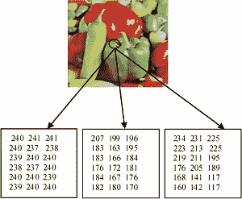

[source](https://www.researchgate.net/figure/RGB-matrix-representation-of-a-cover-image_fig2_261421805)

将文本转换成数字的过程，类似于我们对上图所做的，通常是通过构建一个**语言模型**来完成的。这些模型通常为单词、单词序列、单词组、文档部分或整个文档分配概率、频率或一些模糊的数字。最常见的技术有:1-热编码、N-grams、词袋、向量语义(tf-idf)、分布式语义(Word2vec、GloVe)。让我们看看我们是否理解这一切意味着什么。我们应该可以。我们不是电脑。至少是你。

# 1-热编码模型

如果一个文档的词汇表有 1000 个单词，我们可以用一个热点向量来表示这些单词。换句话说，我们有 1000 维的表示向量，我们将每个唯一的单词与这个向量中的一个索引相关联。为了表示一个唯一的单词，我们将向量的分量设置为 1，并将所有其他分量置零。

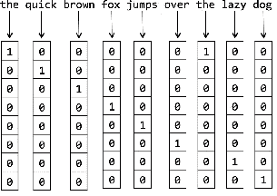

source: Fundamentals of Deep Learning, N. Buduma, 2017

这种表述是相当武断的。它忽略了单词之间的关系，并且没有传达关于它们周围环境的信息。这种方法对于大词汇量来说非常无效。在接下来的几节中，我们将会看到一些更令人兴奋的方法。

# n 元语言模型

我们开始看最基本的 N-gram 模型。让我们来考虑一下我们从小最喜欢的一句话:“请吃你的食物”。2-gram(或 bigram)是由两个单词组成的单词序列，如“请吃饭”、“吃你的”或“你的食物”。一个三字组(或三元组)将是一个三个单词的单词序列，如“请吃你的”，或“吃你的食物”。N-gram 语言模型估计给定前面单词的最后一个单词的概率。例如，给定单词“请吃你的”的顺序，下一个单词“食物”的可能性比“勺子”高。在后一种情况下，我们的妈妈会不太高兴。计算任何一对、三对、四对……单词的这种可能性的最好方法是使用大量的文本。下图显示了从包含与餐馆和食物相关的问题和答案的相对较小的文本体中获得的几个概率。“我”后面经常跟动词“想要”、“吃”或“花”。

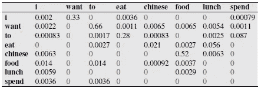

source: Jurafsky et al., 1994

谷歌(再次)实际上在多种语言中为 1 字、2 字、3 字、4 字和 5 字提供了更大的概率集。他们是根据 1500 年至 2008 年间印刷的资料计算出来的！Google Ngram Viewer 允许你下载并使用这个 n 元语法的大集合，用于拼写检查、自动完成、语言识别、文本生成和语音识别。

我们训练 N-gram 模型的上下文越长，我们可以生成的句子就越连贯。下图显示了从 1 克、2 克和 3 克模型中随机生成的 3 个句子，这些模型是从《华尔街日报》的 4000 万字中计算出来的。


source: Jurafsky et al., 2018

即使有非常大的语料库，一般来说，N-gram 也不是一个充分的语言模型，因为语言具有长距离依赖性。例如，在句子“我刚放进五楼机房的电脑死机了。”，虽然“计算机”和“崩溃”这两个词相距 15 个位置，但它们是相关的。一个 5 克重的模型将会错过这个链接，我们的计算机管理员可能会一直认为五楼的计算机运行良好。现在，如何处理德国文学中号称有 1077 个单词的最长句子呢！谁想训练一个 N-gram 语言模型来理解那些通常很长的交错的德语句子？

此外，N-gram 模型严重依赖于用于计算概率的训练语料库。这意味着概率通常编码了关于给定训练文本的特定事实，这不一定适用于新文本。这些原因促使我们进一步研究语言模型。

# 词袋语言模型

当我们对文本分类感兴趣时，基于情感对其分类，或者验证它是否是垃圾邮件时，我们通常不希望查看单词的顺序模式，如 N-gram 语言模型所建议的。相反，我们会将文本表示为一个单词包，好像它是一组无序的单词，而忽略它们在文本中的原始位置，只保留它们的频率。

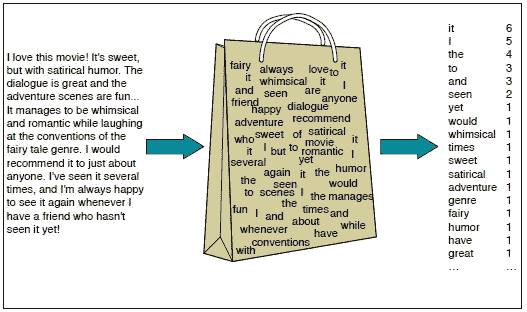

source: Jurafsky et al., 2018

让我们在一个简单的情感分析示例中用两个类正(+)和负(-)来说明文本的单词包表示。下面我们有 5 个已知类别的句子(也称为文档)，以及 1 个未知类别的句子。目的是将最后一句归类为肯定或否定。

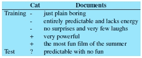

source: Jurafsky et al., 2018

这项任务由所谓的**朴素贝叶斯分类器**来解决，它使用每个类别的词袋中的词频来计算每个类别的概率 *c* ，以及给定类别的每个词的条件概率，如下所示。

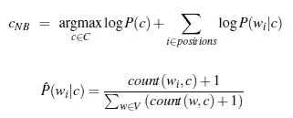

在我们的例子中，负类的概率是 3/5。正类将有 2/5 的概率。一点代数就会显示，给定负类的“可预测”、“有”、“没有”、“好玩”这些词的概率，比给定正类的样本概率要高。因此，基于训练数据，句子“可预测但没有乐趣”将被分类为负面的。

词袋语言模型依赖于词频 TF，它被定义为一个词在给定文本或文档中出现的次数。词汇袋有助于情感分析。这对于检测一篇文章是用哪种语言写的非常有用。它还用于确定作者身份，如性别和年龄。我们还可以使用术语频率信息来设计额外的特征，例如正面词汇的数量(“棒极了”、“不错”、“令人愉快”)，或者第一和第二代名词的数量(“我”、“我”、“你”)，并基于逻辑回归甚至神经网络来训练更复杂的分类器。但是，我们现在不要走那条令人头痛的路。

尽管有这样的荣耀，N-gram 和单词袋模型本身并不能让我们得出有用的推论来帮助我们解决与意义相关的任务，如问答、总结和对话。这就是为什么我们将在下一节研究语义。

# 向量语义学

我们应该如何表达一个词的意思？单词“mouse”可以在词汇词典中找到，但是它的复数形式“mice”将不单独描述。类似地,“sing”作为“sing”、“sang”、“sung”的引理将被描述，但是它的时态形式将不被描述。我们如何告诉计算机所有这些单词的意思是一样的？“工厂”一词根据上下文可能有不同的含义(例如，“特斯拉正在建造新工厂”，“气候变化对工厂有负面影响”)。向量语义学是目前建立计算模型的最佳方法，该模型成功地处理词义的不同方面，包括词义、上下位词、上位词、反义词、同义词、同形异义词、相似性、关联性、词汇场、词汇框架、内涵。我们为语言术语道歉。让我们通过查看**上下文**的概念来建立对向量语义的直觉。

在我们的例句“特斯拉正在建造新工厂”中，如果我们在人类写的许多其他句子中计算“工厂”一词的上下文，我们会倾向于看到像“建造”、“机器”、“工人”甚至“特斯拉”这样的词。这些词和其他类似的上下文词也出现在“工厂”一词周围，这一事实可以帮助我们发现“植物”和“工厂”之间的相似性。在这种情况下，我们不会倾向于将“植物”的含义与“特斯拉正在建造新工厂”这句话中的“植物”联系起来。我们宁愿认为特斯拉在建设新工厂。

因此，我们可以通过计算在一个单词的环境中出现的其他单词来定义这个单词，我们可以用一个向量、一列数字、N 维空间中的一个点来表示这个单词。这样的表示通常被称为**嵌入**。计算机可以利用这种欺骗手段来理解单词在上下文中的意思。

## Word 文档表示法

为了更好地掌握向量语义，让我们假设我们有一组文本(文档)，我们希望找到彼此相似的文档。这个任务与信息检索相关，例如在搜索引擎中，文档是网页。作为说明，下表中的每一列代表具有以下标题的 4 个文档之一:“如你所愿”、“第十二夜”、“朱利叶斯·凯撒”和“亨利五世”。文档中出现的单词表示为行。这些单词构成了我们的词汇。表格告诉我们，单词“battle”在文献“Julius Caesar”中出现了 7 次。这个表格也被称为**术语-文档矩阵**，其中每行代表词汇表中的一个单词，每列代表一个文档、一个章节、一个段落、一条推文、一条短信、一封电子邮件或其他任何内容。

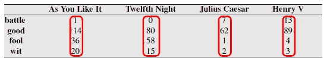

source: Jurafsky et al., 2018

现在我们可以用一个**文档向量**来表示每个文档，例如“Julius Caecar”的[7 62 1 2]。我们甚至可以在二维向量空间中为任何一对单词画出这样的向量。下面我们有这样一个图表的例子。我们看到由“傻瓜”和“战斗”维度构建的空间的文档向量的空间可视化。我们可以得出结论，文献《亨利五世》和《尤利乌斯·恺撒》有类似的内容，与“战斗”的关系大于与“傻子”的关系。对于信息检索，我们也用一个文档向量来表示一个查询，长度也是 4，表示单词“battle”、“good”、“fool”和“wit”在查询中出现的频率。将通过将查询向量与所有四个文档向量进行比较以发现它们有多相似来获得搜索结果。


source: Jurafsky et al., 2018

## **单词-单词表示法**

通过查看术语-文档矩阵的行，我们可以提取单词向量而不是列向量。正如我们看到的，相似的文档往往有相似的单词，相似的单词有相似的向量，因为它们往往出现在相似的文档中。如果我们现在使用单词而不是文档作为术语-文档矩阵的列，我们得到所谓的**单词-单词矩阵，术语-术语矩阵**，也称为**术语-上下文矩阵**。每个单元描述了行(目标)单词和列(上下文)单词在某个训练语料库的某个上下文中同时出现的次数。一个简单的例子是当上下文是一个文档时，那么单元格将告诉两个单词在同一个文档中出现的频率。一种更常见的情况是计算列字在行字周围的字窗口中出现**的频率。在下面的例子中，当考虑“信息”周围的 7 个单词窗口时，“数据”在“信息”的上下文中出现了 6 次。**

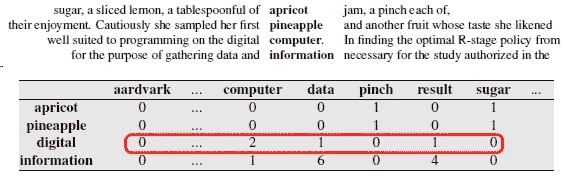

source: Jurafsky et al., 2018

上面的矩阵表明“杏子”和“菠萝”彼此相似，因为“pinch”和“糖”往往出现在它们的上下文中。两个单词 *v* 和 *w* 之间的相似度可以通过计算所谓的**余弦相似度**使用它们相应的单词向量来精确计算，定义如下:

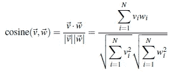

在下面的例子中，“数字”和“信息”之间的相似度等于单词向量[0 1 2]和[1 6 1]之间的余弦相似度。通过应用上面的公式，我们获得 0.58，这高于“杏”和“信息”之间的余弦相似度 0.16。

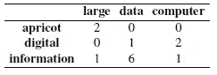

词向量和余弦相似度是处理自然语言内容的有力工具。然而，有些情况下他们的锻炼效果并不好，我们将在下一节看到。

## TF-IDF 语言模型

向量语义模型使用两个单词同时出现的原始频率。在自然语言中，原始频率是非常倾斜的，并且不具有很强的辨别能力。如下面的直方图所示，单词“the”只是一个常用单词，在每个文档或上下文中具有大致相同的高频率。

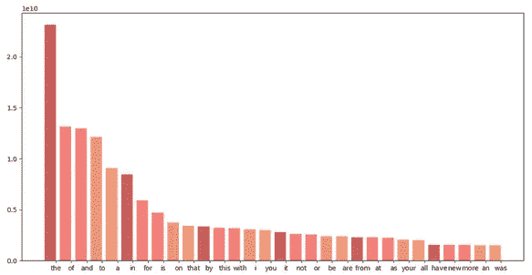

处理这个问题的方法很少。TF-IDF 算法是目前自然语言处理，特别是信息检索中对共生矩阵进行加权的主要方法。TF-IDF 权重被计算为术语频率和逆文档频率的乘积。这有助于我们重视更具区别性的单词。在我们的文件 *d* 中，用于计算每一项 *t* 的 TF-IDF 重量的两个分量描述如下。

**词频**

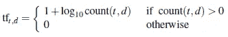

术语或词频计算为该词在文档中出现的次数。因为一个单词在一个文档中出现 100 次并不会使这个单词与文档的意义相关的可能性增加 100 倍，所以我们使用自然对数来稍微降低原始频率。在文档中出现 10 次的单词将具有 tf=2。在文档中出现 100 次的单词意味着 tf=3，1000 次意味着 tf=4，等等。

**逆文档频率**

给定术语或词的文档频率是它出现在文档中的数量。逆文档频率是文档总数与文档频率之比。这使得只在少数文档中出现的单词具有更高的权重。因为在许多集合中有大量的文档，所以通常对逆文档频率应用自然对数，以避免 IDF 的偏斜分布。

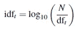

在下图的左侧，我们可以看到为前面介绍的例子中的单词计算的 TF 和 IDF。在图像的右侧，我们显示了给定文档中每个单词的原始频率，以及它在底部表格中的加权 TF-IDF 值。因为“good”这个词在所有文档中出现的频率很高，所以它的 TF-IDF 值就变成了零。这使得原本出现频率很低的区别性单词“battle”的权重更大。

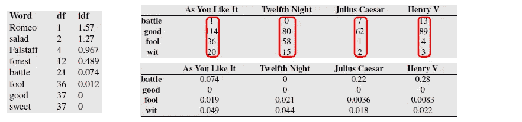

source: Jurafsky et al., 2018

虽然用 TF-IDF 扩充的词袋模型是很好的模型，但是它们不能捕捉语义上的细微差别。让我们用下面的句子来说明这一点:“猫坐在破墙上*”*，“狗跳过砖结构*”*。虽然这两个句子描述的是两个独立的事件，但是它们的语义却是相似的。一只*狗*和一只*猫*相似，因为它们共享一个叫做*的动物实体。*一面*墙*可以被视为类似于一个*砖*结构。因此，虽然这些句子讨论不同的事件，但它们在语义上彼此相关。在经典的单词袋模型中(单词在它们自己的维度中被编码)，编码这样的语义相似性是不可能的。此外，当使用大量词汇和单词向量变大时，这种模型表现出很少的计算问题。我们将在下一节介绍一种更好的方法。

# Word2vec 语言模型

用稀疏而长的向量来表示单词或文档实际上是没有效率的。这些向量通常是稀疏的，因为许多位置被零值填充。它们很长，因为它们的维数等于词汇表的大小或文档集合的大小。

## **什么是单词嵌入？**

与稀疏向量相反，**密集向量**可以更成功地作为特征包含在许多机器学习系统中。密集向量也意味着需要估计的参数更少。在上一节中，我们看到了如何计算语料库中任何给定单词的 *tf* 和 *tf-idf* 值。如果我们不是计算每个单词 *w* 在另一个单词 *v* 的上下文中出现的频率，而是训练一个二进制预测任务的分类器“单词 *w* 可能出现在 *v* 附近吗？”，那么我们可以使用学习的分类器权重作为**单词嵌入**。这些成为单词的连续矢量表示。如果我们想要计算单词之间的语义相似度，我们可以通过查看两个嵌入之间的角度来实现，即它们的余弦相似度，正如我们之前看到的。

## 我们如何计算单词嵌入？

嵌入向量通常至少约 100 维长才能有效，这意味着当我们有 100，000 个单词的词汇表时，分类器需要调整数千万个数字。对于给定的语料库，我们如何确定这些嵌入呢？这正是 word2vec 语言模型的设计目的。

**Word2vec** 有两种型号:CBOW 型号和 **skip-gram** 型号(由 [Mikolov 等人提出)。艾尔。，2013，](https://papers.nips.cc/paper/5021-distributed-representations-of-words-and-phrases-and-their-compositionality.pdf)在谷歌(又来了！)).在 skip-gram 变体中，使用目标单词预测上下文单词，而使用周围单词预测目标单词的变体是 CBOW 模型。通常人们会在大型语料库中使用 [word2vec 实现](https://code.google.com/archive/p/word2vec/)和预训练嵌入。

我们现在将开发 word2vec 模型的 skip-gram 变体背后的直觉。让我们假设下面的句子，其中“杏子”是目标单词，“汤匙”、“of”、“果酱”和“a”是考虑双单词窗口时的上下文单词。

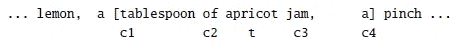

我们可以构建一个二元分类器，它将任意一对单词 *(t，c)* 作为输入，如果 *c* 是 *t* 和 *False* 的真实上下文单词，则预测*为真*。例如，分类器将为*(杏，汤匙)*返回*真*，为*(杏，捏)返回*假*。*下面我们看到更多正面和负面类的例子，当把*杏*作为目标时。

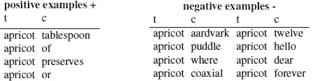

更进一步，我们必须将每个(上下文窗口，目标)对分成(输入，输出)示例，其中输入是目标，输出是上下文中的一个单词。出于说明的目的，对*(【of，杏，a，pinch】，果酱)*将产生正例*(果酱，杏)，*，因为*杏*是*果酱*的真实上下文词。*(果酱、柠檬)*会是一个反面例子。我们继续对每个(上下文窗口、目标)对应用该操作来构建我们的数据集。最后，我们用词汇表中的唯一索引替换每个单词，以便使用独热向量表示。

给定一组正的和负的训练样本，以及用于目标的初始组
嵌入 *W* 和用于上下文单词的初始组 *C* ，分类器的目标是调整这些嵌入，使得我们最大化正样本嵌入的相似性(点积),并且最小化负样本嵌入的相似性。典型地，逻辑回归将解决这个任务。或者，使用具有 softmax 的神经网络。

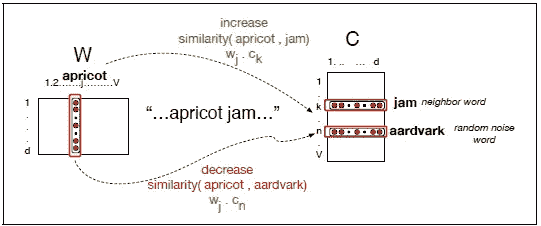

d-dimentional embeddings training on a V-size vocabulary — source: Jurafsky et al., 2018

## **我们为什么喜欢 Word2vec？**

令人惊讶的是，Word2vec 嵌入允许探索单词之间有趣的数学关系。例如，如果我们从单词“king”的向量中减去单词“man”的向量，然后将结果向量加上单词“woman”的向量，我们将得到单词“queen”的向量。

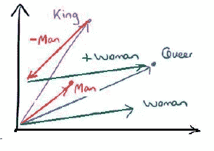

source: Z. Djordjevic, Harvard

我们还可以使用嵌入向量元素的元素相加来询问诸如“德国+航空公司”之类的问题，并通过查看与复合向量最接近的标记来得出令人印象深刻的答案，如下所示。

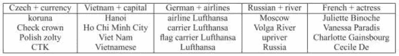

source: Z. Djordjevic, Harvard

当在不同语言的可比语料库上训练时，Word2vec 向量应该具有相似的结构，从而允许我们执行机器翻译。

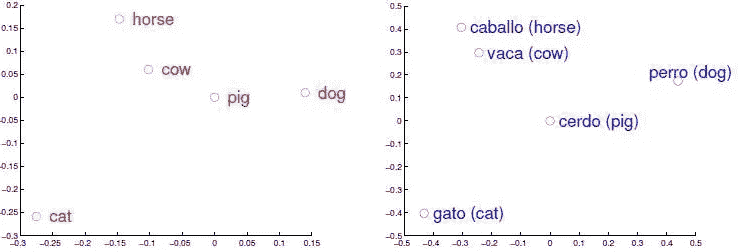

source: Z. Djordjevic, Harvard

嵌入还用于查找与用户指定的单词最接近的单词。他们还可以检测单词之间的性别关系和复数-单数关系。单词向量也可以用于从庞大的数据集中导出单词类别，例如通过在单词向量的顶部执行 K-means 聚类。

在本节中，我们讨论了 Word2vec 变体 CBOW 和 Skip gram，它们是本地上下文窗口方法。它们可以很好地处理少量的训练数据，甚至可以表示被认为是罕见的单词。然而，它们没有充分利用关于单词共现的全局统计信息。因此，让我们看看另一种声称可以解决这个问题的方法。

# 手套语言模型

[GloVe(全局向量)](https://nlp.stanford.edu/pubs/glove.pdf)采用了与 Word2vec 不同的方法。GloVe 不是从设计用于执行分类任务(预测相邻单词)的神经网络或逻辑回归中提取嵌入，而是直接优化嵌入，使得两个单词向量的点积等于这两个单词在彼此附近出现的次数的对数(例如，在两个单词的窗口内)。这迫使嵌入向量对在它们附近出现的单词的频率分布进行编码。我们认为有些读者可能在整篇文章中遗漏了 Python 代码。从现在开始，我们会让他们开心一点。

下面我们将说明如何使用来自预训练手套模型的单词嵌入。我们利用 Python 包 [Gensim](https://radimrehurek.com/gensim/) 。

嵌入(词向量)的美妙之处在于，你不必实现任何 Skip gram 算法，也不必构建大量文本并自己计算权重。你可以使用向量，慷慨的人们已经通过使用非常大的语料库和大量的 GPU 为公众准备了向量。我们将使用预训练的单词向量 [**glove.6B**](https://nlp.stanford.edu/projects/glove/) ，它是在 60 亿个标记的语料库上训练的，包含 40 万个单词的词汇量，从不同的大规模网络数据集(维基百科等)中获得。每个单词分别由 50、100、200 或 300 维的嵌入向量表示。我们将使用 100 维向量，它们存储在一个文件中。第一步是将 GloVe 文件格式转换为 word2vec 文件格式。唯一的区别是增加了一个小标题行。这可以通过调用 glove2word2vec()函数来完成。每一行都以单词开头，后面是该单词对应的所有向量值，每一行都用一个空格隔开，就像下图中单词“the”的情况一样。

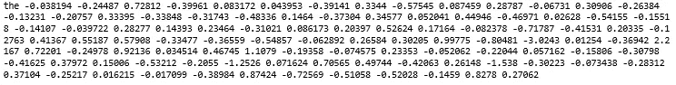

正如我们在上一节中解释的那样，这些实值词向量已被证明对各种自然语言处理任务都很有用，包括解析、命名实体识别和机器翻译。例如，我们发现类似以下的声明适用于相关的单词向量:

国王男人+女人≈王后

也就是说，从“国王”中减去“男人”的概念并加上“女人”这个词，“女王”是最接近的词。“国王”中的“男子气”被“女子气”所取代，给了我们“女王”。这种关于向量的基本代数可以让你进行有趣的语义推理。

```
>>> result = model.most_similar(positive=['woman', 'king'], 
                                negative=['man'], 
                                topn=1)
>>> print(result)[('queen', 0.7698541283607483)]
```

使用单词嵌入的类比工具，我们甚至可以问哪个单词是“俄罗斯”，就像“巴黎”是“法国”一样？

```
>>> result = model.most_similar(positive=['russia', 'paris'], 
                                negative=['france'], 
                                topn=1)
>>> print(result)[('moscow', 0.8845715522766113)]
```

为什么这个效果这么好？让我们仔细看看“俄罗斯”、“莫斯科”、“法国”、“巴黎”这四个词的嵌入。我们可以使用 PCA 变换的前两个分量将 100 个单词的向量投影到 2D 空间中。我们也可以使用 t 分布随机邻居嵌入(t-SNE)方法绘制类似的图。下面的 PCA 图显示“法国”和“莫斯科”之间的直线几乎平行于“法国”和“巴黎”之间的直线。使用 t-SNE，我们获得的谱线比使用 PCA 获得的谱线更加平行。t-SNE 是一种降维技术，特别适合于高维数据集的可视化。与 PCA 相反，它不是一种数学技术，而是一种概率技术。

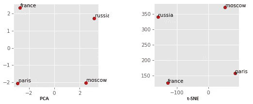

100 维向量也非常擅长回答以下形式的类比问题:“ *a 对 b 就像 c 对*？”。例如:

*   巴黎对于法国来说是什么？
*   女人和国王对男人有什么关系？
*   什么是狗，什么是猫？
*   对于厨师来说，什么是石头对于雕刻家？
*   什么是蜜蜂，什么是熊的巢穴？

下面，我们寻求这些问题的答案，并展示计算机如何使用单词嵌入赢得下一个电视节目的问答比赛。

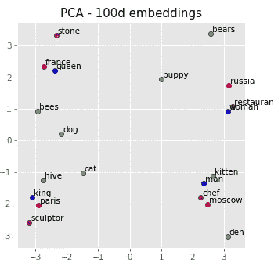

上面的图清楚地显示了嵌入向量能够找到“莫斯科”作为“俄罗斯”的首都，因为“巴黎”是“法国”的首都。同样，“蜂巢”对于“蜜蜂”就像“巢穴”对于“熊”一样。

# 结论

在本文中，我们探讨了为什么用数字格式表示文本对于自然语言处理很重要。我们还介绍了最常用的方法，温和而直观地涵盖了底层算法的关键方面。我们讨论了几种语言模型:一键编码、N-gram、单词包、td-idf、word2vec 和 glove。有一些流行的语言模型没有被介绍。例如，fastText 是 word2vec 模型的扩展，它不是直接学习单词的向量，而是将每个单词表示为 n 元字符。这对于检测后缀和前缀特别有用。本文没有探讨的另一个领域是主题建模。有各种各样的技术用于主题建模，其中大多数涉及术语-文档矩阵的某种形式的矩阵分解(潜在语义索引、潜在狄利克雷分配)。

最近，开发了非常强大的语言模型，如 OpenAI GPT-2 和 Google BERT。在我关于[谷歌 BERT](/bert-for-dummies-step-by-step-tutorial-fb90890ffe03) 的文章中，我解释了如何微调一个预先训练的模型，以利用强大的单词向量表示来完成机器学习任务。

[](/bert-for-dummies-step-by-step-tutorial-fb90890ffe03) [## 伯特为假人-一步一步教程

### 变压器 DIY 实用指南。经过实践验证的 PyTorch 代码，用于对 BERT 进行微调的意图分类。

towardsdatascience.com](/bert-for-dummies-step-by-step-tutorial-fb90890ffe03) 

恰当地表达文本对结交新朋友很有帮助。为了能够在下面的句子中正确地大写我们朋友的名字，我们需要识别第一个“石头”是人名，第二个是物体。在我关于自然语言处理中的[true caseing 的文章中，这个主题得到了进一步的发展。](/truecasing-in-natural-language-processing-12c4df086c21)


如果你真的对表示自然语言文本的问题感兴趣，我们推荐以下书籍作为进一步阅读: ***语音和语言处理，第 3 版。作者丹·茹拉夫斯基和詹姆斯·马丁，2018*T5。我们在这篇文章中孜孜不倦地使用了那本书中的观点。**

感谢您的阅读。请随意查看我下面的文章。

[](/why-deep-learning-works-289f17cab01a) [## 深度学习为什么有效？

### 在开始是神经元:梯度下降，反向传播，回归，自动编码器，细胞神经网络…

towardsdatascience.com](/why-deep-learning-works-289f17cab01a) [](/lstm-based-african-language-classification-e4f644c0f29e) [## 基于 LSTM 的非洲语言分类

### 厌倦了德法数据集？看看 Yemba，脱颖而出。力学的 LSTM，GRU 解释和应用，与…

towardsdatascience.com](/lstm-based-african-language-classification-e4f644c0f29e) [](/natural-language-understanding-with-sequence-to-sequence-models-e87d41ad258b) [## 基于序列对序列模型的自然语言理解

### 如何预测客户询问背后的意图？Seq2Seq 型号说明。在 ATIS 数据集上演示的槽填充…

towardsdatascience.com](/natural-language-understanding-with-sequence-to-sequence-models-e87d41ad258b) [](/practical-guide-to-attention-mechanism-for-nlu-tasks-ccc47be8d500) [## NLU 任务注意机制实用指南

### 测试动手策略以解决注意力问题，从而改进序列到序列模型

towardsdatascience.com](/practical-guide-to-attention-mechanism-for-nlu-tasks-ccc47be8d500) [](/truecasing-in-natural-language-processing-12c4df086c21) [## 自然语言处理中的真实大小写

### 恢复推文和短信中的大写字母可以提高可读性。正确的正确大小写对于…至关重要

towardsdatascience.com](/truecasing-in-natural-language-processing-12c4df086c21)