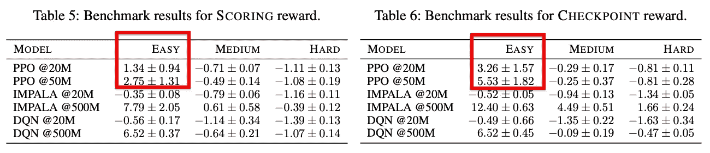
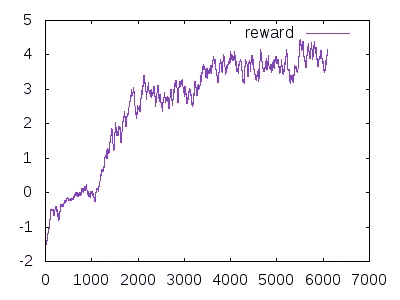
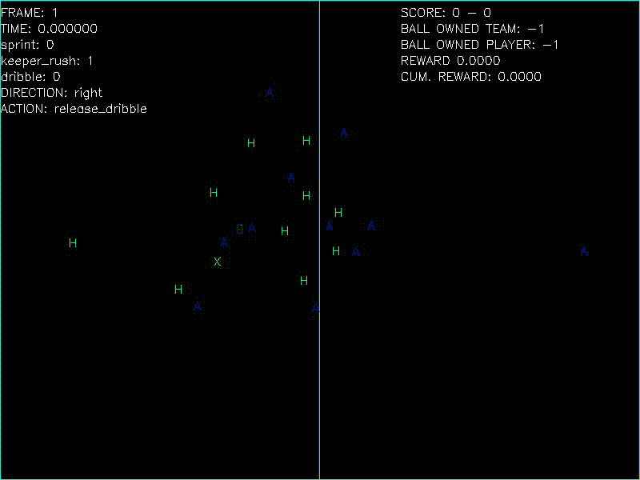
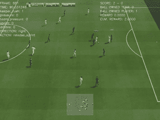
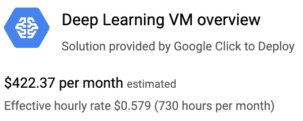

# 再现谷歌研究足球 RL 结果

> 原文：<https://towardsdatascience.com/reproducing-google-research-football-rl-results-ac75cf17190e?source=collection_archive---------11----------------------->

这篇文章记录了我试图(并成功)重现谷歌足球研究(GRF)论文中一些结果的旅程。具体来说，我成功地在单 GPU 云实例上使用 OpenAI 的 PPO 训练了一个强化学习(RL)代理，仅用了两天的最长时间。它复制了纸上的数字。

# 设置:云实例

我们先从用 PPO 设置好准备 RL 的云机器开始。如果你已经有这样做的机器，你可以跳过这一部分。

在你的谷歌云账户上，进入“市场”，搜索“[深度学习虚拟机](https://cloud.google.com/deep-learning-vm)”模板。我变得很好奇，想看看你可以选择的各种 GPU、CPU 内核和 RAM 的成本/收益权衡，所以我用三种不同的设置进行了我的实验。我将在这里提供最具成本效益的方法，并在下面的“成本/时间权衡”一节中详细介绍这三种方法。我建议使用 12 个虚拟 CPU、12GB 内存、64GB 磁盘空间和一个英伟达 P100 GPU。务必选中“安装 NVIDIA 驱动程序”复选框

一旦机器被创建，SSH 进入它。

# 设置:软件和驱动程序

一旦你在你的机器上，我们可以开始设置软件。

> 注意:如果您在任何时候遇到由于`libGL`导致的错误，请参阅本文末尾的“修复 libGL 问题”一节。

首先，有一小组工具我再也离不开了，但是你可以跳过:`sudo apt install tmux fish`，然后以`env SHELL=`which fish` tmux`的身份开始一个新的 tmux 会话。

接下来，我总是更喜欢使用 python 虚拟环境，所以让我们创建一个并在本教程的剩余部分使用它:`sudo apt install python3-venv`，然后用`python3 -m venv venv`在一个名为`venv`的文件夹中创建它，然后通过`. venv/bin/activate.fish`开始使用它(是的，该命令以点开始。)

如果您使用云实例，首先将 TensorFlow 的优化版本安装到 virtualenv 中，在撰写本文时，这是使用`pip3 install /opt/deeplearning/binaries/tensorflow/tensorflow_gpu-1.14.0-cp35-cp35m-linux_x86_64.whl`完成的，在您阅读时，文件名可能会略有变化。

现在，我们终于可以按照 README 安装 gfootball 及其所有依赖项[，使用“克隆的 repo”方式，因为我们将做一些轻微的更改。为了完整起见，这些是命令:](https://github.com/google-research/football#installation)

```
> **sudo** apt-get install git cmake build-essential libgl1-mesa-dev libsdl2-dev libsdl2-image-dev libsdl2-ttf-dev libsdl2-gfx-dev libboost-all-dev libdirectfb-dev libst-dev mesa-utils xvfb x11vnc libsdl-sge-dev python3-pip
```

然后克隆 repo，切换到文件夹，并将其安装到 virtualenv 中，这需要一点时间:

```
> **git** clone https://github.com/google-research/football.git
> **cd** football
> **pip3** install . 
```

接下来，我们想从 OpenAI 基线运行 PPO 算法，所以也要安装它和它的依赖项，同样按照自述文件，为了完整起见复制到这里:`pip3 install "tensorflow-gpu<2.0" dm-sonnet git+https://github.com/openai/baselines.git@master`。

# 运行 PPO 培训

我正在复制的实验是在“简单”模式下的 11vs11 游戏，因为这似乎是导致在合理数量的步骤中合理地玩好 PPO 代理的原因。以下是我们试图复制的论文中的具体数字:



我们可以在论文的附录中找到所有的超参数。

让我们将带有所有参数的完整命令(可在本文的附录中找到)放在一个名为`gfootball/examples/repro_scoring_easy.sh`的脚本文件中，以便于参考和运行:

```
#!/bin/bashpython3 -u -m gfootball.examples.run_ppo2 \
  --level 11_vs_11_easy_stochastic \
  --reward_experiment scoring \
  --policy impala_cnn \
  --cliprange 0.115 \
  --gamma 0.997 \
  --ent_coef 0.00155 \
  --num_timesteps 50000000 \
  --max_grad_norm 0.76 \
  --lr 0.00011879 \
  --num_envs 16 \
  --noptepochs 2 \
  --nminibatches 4 \
  --nsteps 512 \
  "$@"
```

`max_grad_norm`是唯一不可用的设置，但是我准备了一个[拉请求](https://github.com/google-research/football/pull/89)来暴露它。最后一位(`"$@"`)只是转发所有附加参数，因此现在我们可以如下调用它来运行训练:

```
> **gfootball/examples/repro_checkpoint_easy.sh** --dump_scores 2>&1 | tee repro_checkpoint_easy.txt
```

我喜欢将输出明确地`tee`到一个日志文件中，以便于参考，但是请注意，OpenAI baselines 会在`/tmp/openai-[datetime]/`的某个地方生成一个包含日志的文件夹，包括所有输出。虽然它们在/tmp 中，但是要注意它们 ***最终会*** 消失。

`--dump_scores`标志指示环境也存储导致进球的两百帧的`.dump`文件(在 16 个环境中的第一个上)，因此我们可以稍后观看那些进球。另一个将使用更多磁盘空间的选项是使用`--dump_full_episodes`标志为每个完整剧集(16 个环境中的第一个)生成一个转储。如果您想要创建高质量的渲染视频，这是当前必需的。

这里有趣的是最后一个(按日期时间)文件夹中的`progress.csv`文件，包含整体训练进度，如果您启用了视频转储，第一个文件夹应该包含许多“得分转储”，这是两队得分前 20 秒的简短片段。

您可以使用标准的 unix 工具在训练期间获得一些统计数据，例如，我使用以下命令来计算平均 FPS 计数:

```
> **grep** fps repro_scoring_easy.txt | **awk** '{ FS="|"; total += $3; count++ } END { print total/count }'156.545
```

## 再现的结果

在使用“得分奖励”的三次跑步中(即只有当代理人得分时才给予奖励)，我在训练 50 米步后达到了平均每集奖励 1.57、2.42、4.12，对应于**2.70±1.06**(标准偏差)。论文附录中的表 5 报告了该设置的 2.75-1.31。我只对“检查点奖励”进行了一次实验，它达到了平均每集奖励 **6.31** ，落在报告的**5.53±1.28**内。

因此，虽然这再现了结果，但你可以从三次重复的原始数字中看到，在三次重复中，学习到的策略的质量变化相当大。为了让 RL 更可靠，我们还有很多工作要做！

# 训练后要做的事情

一旦训练完成，我们可以报告训练曲线，并查看平均每集奖励，这通常是研究论文所必需的。例如，这个命令给了我一段时间的平均剧集奖励:

```
**> grep** eprewmean repro_scoring_easy.txt | **awk** 'BEGIN{FS="|"} { print $3 }'
```

或者，我们甚至可以使用`gnuplot`立即创建一个图，如下所示，在本例中为三种药剂中的最佳 PPO 药剂:

```
**> grep** eprewmean repro_scoring_easy3.txt | **awk** 'BEGIN{FS="|"} { print NR $3 }' | **gnuplot** -p -e "set terminal png size 400,300; set output 'eprewmean.png'; plot '< cat -' with lines title 'reward'"
```



但是我们也可以做一些更有趣的事情，比如看我们经纪人的视频，甚至和他比赛！

## 制作和观看视频

人们可以在事后使用`dump_to_video`工具从“分数转储”中创建一个视频，比如:`python -u -m gfootball.dump_to_video — trace_file /tmp/openai-2019–09–13–16–00–43–638465/score_20190913–204112398339.dump`。

它会在命令行输出中告诉您视频文件的存储位置，如下所示:

```
I0916 18:03:21.296118 139929219241792 observation_processor.py:383] Start dump episode_doneI0916 18:03:22.525743 139929219241792 observation_processor.py:234] Dump written to /tmp/openai-2019–09–13–16–00–43–638465/episode_done_20190916–180321296073.dumpI0916 18:03:22.525876 139929219241792 observation_processor.py:236] **Video written to /tmp/openai-2019–09–13–16–00–43–638465/episode_done_20190916–180321296073.avi**
```

默认情况下，这个视频是一个“调试视频”,它不是游戏的真实呈现，但有更多关于当前正在发生的事情的信息。下面展示了一个很好的视频，我们的球队(绿色 **H** )跑向对手(蓝色 **A** )，丢球(红色 **B** )，捡球得分。



要查看(并保存)一个轨迹的实际渲染视频，需要使用`replay`工具，比如:`python -u -m gfootball.replay --trace_file /tmp/openai-2019-09–13–16–00–43–638465/episode_done_20190913–161055711125.dump`。这将打开游戏窗口，并再次播放完整的游戏供您观看。一旦游戏结束，当它保存完整游戏的`.avi`视频时，屏幕会出现大约 30 秒的停滞——请耐心等待它结束。我就是这样创作了文章顶部的视频。如果你想剪切出一个容易共享的`.gif`文件，[这个](https://superuser.com/a/556031/119980)是怎么做的:

```
**> ffmpeg** -ss 98 -t 11 -i /tmp/dumps/episode_done_20191022-181100113944.avi -vf "scale=320:-1:lanczos,split[s0][s1];[s0]palettegen[p];[s1][p]paletteuse" -loop 0 game.gif
```



看起来，至少在我写这篇文章的时候，它只能渲染从游戏开始时开始的痕迹，所以还没有完整图形的“得分转储”。

## 和我们训练有素的特工比赛

这可能是最令人兴奋的事情:)它非常简单，在自述文件中有很好的解释，但仅供参考，我使用以下命令来对抗如上所述训练的 PPO 代理:

```
**> python** -m gfootball.play_game --players "keyboard:right_players:1;ppo2_cnn:left_players=1,policy=impala_cnn,checkpoint=/path/to/checkpoint"
```

关于使用哪个键，参见[自述文件](https://github.com/google-research/football#keyboard-mapping)，但本质上是箭头和 WASD。游戏结束时会写一个完整剧集的转储，你可以像上面一样使用它(使用`gfootball.replay`命令)来创建一个完整的渲染。游戏的 avi 视频，就像这篇文章上面的那个。

使用这个命令的一个小变体，您可以观看它与内置 AI 的比赛:

```
**> python** -m gfootball.play_game --players "ppo2_cnn:left_players=1,policy=impala_cnn,checkpoint=/path/to/checkpoint" --level=11_vs_11_easy_stochastic
```

我的结论是，那个叫**达芬奇**的玩家确实不错！

# 成本/时间权衡

我很好奇这个项目最具成本效益的设置是什么，因为我想重复运行三次以获得置信区间，所以我尝试了三种不同的设置，并将它们的速度和成本总结如下:

*   首先我试了单个 V100 GPU，12 个 vCPU 核，32 GB 内存，128Gb 普通磁盘。在这台机器上，我在每种环境下实现了大约 17 SPS(每秒步数)和大约 50–60 FPS(每秒帧数)。我们将并行运行 16 个环境，每个环境平均每秒 280 帧。预计需要 50 小时，5000 万步需要 108 美元。
*   第二次尝试使用便宜得多的机器:8 个 vCPUs、8GB 内存、64GB 磁盘空间和一个 K80 GPU。这给了每个环境大约 10 SPS 和 50–60 游戏 FPS，平均总共大约 160 FPS。预计需要 89 小时，5000 万步的总成本为 51 美元。
*   第三，尝试一台“普通”的深度学习机器:12vCPUs、12GB 内存、64GB 磁盘空间和一个 P100 GPU。这给了每个环境大约 20 SPS 和 70–80 游戏 FPS，平均总共大约 320 FPS。预计 5000 万步需要 43 小时，总成本为 64 美元。



Screenshot of the most cost-efficient machine that I used: the “second try” i.e. the K80 GPU.

# 修复 libGL 问题

这个问题是我在云上想到的，但我假设它也可能发生在其他(基于 ubuntu 的)系统上，因为有[许多](https://github.com/RobotLocomotion/drake/issues/2087#issuecomment-221433993) [报告](http://techtidings.blogspot.com/2012/01/problem-with-libglso-on-64-bit-ubuntu.html) [或](https://www.blender.org/forum/viewtopic.php?t=21867)这个问题。我们无法回避的依赖项之一是`libgl1-mesa-dev`包，它实际上破坏了`/usr/lib/x86_64-linux-gnu/libGL.so`符号链接。

网上报道的一个明显的解决方案是强制重新安装`sudo apt-get install --reinstall libgl1-mesa-glx`。我不知道这有多有效。我推荐的替代方案是，至少在 Google Cloud 上，简单地重新安装 GPU 驱动程序如下:`/opt/deeplearning/install-driver.sh`这个问题就会被修复。