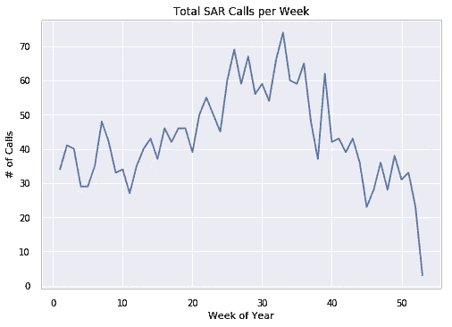
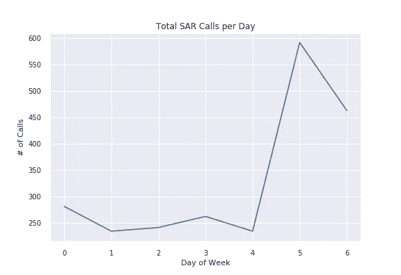
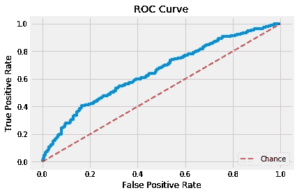
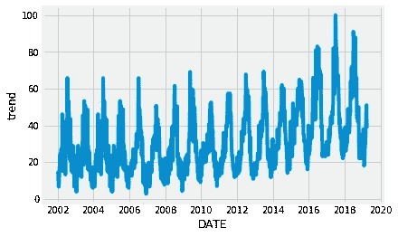

# RescueForest:用随机森林预测紧急响应

> 原文：<https://towardsdatascience.com/rescueforest-predicting-emergency-response-with-random-forests-70c5d65df730?source=collection_archive---------30----------------------->


King County SAR on the job

我正在完成 fast . ai[ML](http://course18.fast.ai/ml)入门课程的材料，这太棒了。这种学习哲学，被导师杰里米描述为自上而下的方法，对我的学习方式非常有效。总的想法是，在你知道为什么它会起作用之前，你先要知道如何做 ML——就像你先知道如何打棒球，然后才知道为什么你会在给定的时间使用一种特定的策略一样。

我想做一个小的顶点项目来实践我学到的东西，所以我决定研究应急响应预测——特别是为一个名为[金县搜救](http://www.kingcountysar.org/) (SAR)的组织，我是该组织的志愿者成员。我们执行各种各样的救援任务，但最常见的呼叫是帮助西雅图周围荒野中受伤或迷路的徒步旅行者。它大多是一个志愿者经营的组织，所以资源本来就有限。拥有一种方法来预测在任何给定的一天打电话的可能性可能会帮助我们优先考虑资源和准备，以最好地为社区服务。

我把这个项目分成了三个步骤，这三个步骤在本课程中都有涉及:1 .数据探索和清理 2。建立一个简单的模型并用它来研究特征重要性 3。特征工程和调整模型

这篇文章将涵盖我的一般方法和发现。详细代码和笔记本可以在我项目的[回购](https://github.com/afederation/SAR_predict)中找到。

# 数据浏览，清理

在建立模型之前，我想了解我们拥有的数据的性质。有几个我们正在使用的数据源，我们将在日期前把它们连接在一起。Python 的 [datetime](https://docs.python.org/2/library/datetime.html) 库对此很关键，并使这些操作变得更加容易。

# 结果数据

该项目的目标是预测在特定的一天是否有搜救呼叫发生。我从组织的内部数据库下载了这个，并删除了一些隐私信息。将数据加载到 python 和 pandas 允许一些简单的绘图，以确保我们专注于最相关的数据。我不得不缩小日期范围，从 2002 年到现在，因为在此之前的数据是不完整的。

一些探索图显示，我们在 29%的日子里有调用，这意味着数据有些不平衡，但并不可怕。电话在周末和夏天最频繁。我们凭直觉知道这一点，数据也支持这一点。这也证实了仅在日期内就可能有一些信息具有某种预测能力。



但首先，我们需要一个整洁的数据集。本质上，我们用一个表来表示我们所考虑的范围内的每个日期，并给出一个布尔值来报告当天是否有电话。通过利用 panda 的 date_range 函数，一个简单的脚本将 raw `sar_data`转换成了一个`clean_table`。

```
date_range **=** pd**.**date_range(start**=**'1/1/2002', end**=**'4/01/2019')
clean_table **=** []
**for** d **in** date_range:
    **if** sar_data**.**date**.**isin([d])**.**any(): *# check if date in in table containing all calls*
        clean_table**.**append([d,1])
    **else**:
        clean_table**.**append([d,0])               
sar_clean **=** pd**.**DataFrame(clean_table)
sar_clean**.**columns **=** ['date','mission']
```

# 特征

通过使用`clean_table`表中的日期列，我们可以使用漂亮的 fast.ai 函数提取信息，如星期、年、月等。从日期时间对象。在把它应用到我们整洁的桌子上之后，我们有了大约 13 个特性。

除此之外，我们还将整合一些来自 NOAA 的天气信息。他们提供了很多很酷的工具，数据科学家会发现这些工具很有用，我鼓励任何对整合天气数据感兴趣的人去看看。

理想情况下，我们可以在这个项目中使用天气预报数据，而不是实际的天气数据。当我们提前计划时，我们只能得到天气预报，而天气预报显然经常与实际天气不同。我找到的所有保存这些数据的资源都是付费服务，所以现在我不得不接受 NOAA 的数据。

我从两个当地气象站下载了天气数据——西雅图南部的波音机场和我们大部分任务发生的山脉中的加德纳山。我们得到温度、风、太阳和降水的信息，这是一幅给定一天的天气图。一些健全性检查确保数据按照我们预期的方式组织(夏天热，冬天多雨)。使用`pandas.merge`将这些与`clean_table`合并，得到包含以下特征的初始数据集:

`[Year', 'Month', 'Week', 'Day', 'Dayofweek', 'Dayofyear', 'Is_month_end', 'Is_month_start', 'Is_quarter_end', 'Is_quarter_start', 'Is_year_end', 'Is_year_start', 'Elapsed', 'DATE', 'AWND_x', 'PRCP_x', 'TAVG_x', 'TMAX_x', 'TMIN_x', 'TSUN', 'WT01', 'WT02', 'WT03', 'WT05', 'WT08', 'WT10', 'AWND_y', 'PRCP_y', 'SNWD', 'TAVG_y', 'TMAX_y', 'TMIN_y', 'TOBS', 'WESD']``

# 特征工程

# 测试、训练、初始模型

选择合适的验证和测试集是课程中的一个重要主题。我在这里采用了与杰里米讨论的推土机拍卖和杂货店销售预测的 Kaggle 竞赛相似的方法。在这些情况下，我们需要使用过去的数据来预测未来，因此我们按日期对数据进行排序，并为验证集保留最近的 15–20%的数据。我们会在这里做同样的事情。

对于测试集，我将使用一种更“真实”的方法，只在今年实时测试我的模型。

对于模型评估，内置的评分函数可能并不理想。只有 29%的时间有任务，所以一个天真的模型总是预测“没有呼叫”将是正确的，准确率为 71%。对于这种情况，ROC 曲线是一种不错的方法，所以我用它来进行模型评估。这些在 fast.ai 课程中没有广泛讨论，因为它们主要集中在回归问题上。作为复习，我发现[这篇文章](https://medium.com/greyatom/lets-learn-about-auc-roc-curve-4a94b4d88152)很有帮助。

接下来，用 scikit-learn 构建的一个简单的随机森林在 ROC 曲线中给出了一些信号(AUC=0.61)，因此我继续进行这项工作，以便更好地理解手头的数据。



当深入研究模型中使用的特性重要性时，事情似乎变得有意义了。一周中的某一天、过去的天数(只是从数据集开始算起的连续天数)和一年中的某一天是三个最重要的特征。最重要的天气特征是西雅图的风，这可能预示着暴风雨的来临？接下来的几个天气特征是温度，这并不奇怪。

在课程中，Jeremy 保留了所有显示重要性的特征，即使它们可能是相关的。毫无疑问，附近地方的温度是相关的，但该模型应该用集合方法来处理这个问题。将来，做一些额外的功能工程来消除一些冗余可能是值得的。我确实删除了一些不太重要的功能，而且删除后不会影响性能。

# 假期数据

添加假期数据对模型有帮助吗？我使用了包含美国假期数据库的`pandas.tseries.holiday`，并尝试了几种不同的方法，总结如下:-为`is_holiday`添加一个布尔值列；-为`days_until_next_holiday`和`days_since_last_holiday`添加列；-为`days_away_from_nearest_holiday`添加一个列

最后一种方法是最有效的，这是有道理的。节假日前后的几天最有可能是休息日，这与徒步旅行者的增加相对应。通过包含这些信息，ROC 从 61%提高到 65%。

# 谷歌趋势

在这个项目中，我发现了谷歌趋势数据的一个很酷的特性。虽然没有 API，但只是在网络界面上玩了玩，我就能得到关于国王县地区“徒步旅行”这个一般主题的搜索频率——这正是我们的准确反应区域。正如预期的那样，这些数据是季节性的，我希望它们可以捕捉到正在发生的其他事件，这些事件可能会增加或减少短期内对徒步旅行的兴趣。



添加这个特性给出了一个令人困惑的结果 ROC 没有提高，但是当您考虑特性的重要性时，它是第二重要的特性。这是否仅仅意味着趋势数据对于某些日期特征来说是多余的？我决定留着它继续前进。

# 构建最终模型

好了，现在是最终模型。我比较了具有相同基本参数的三种基于树的算法，AUC 总结如下。

*   随机森林:0.59
*   AdaBoost: 0.61
*   XGBoost: 0.63

XGBoost 做得最好，所以工具提供了学习如何调优这些模型的机会。我使用的主要方法是 sklearn 内置的[网格搜索](https://scikit-learn.org/stable/modules/generated/sklearn.model_selection.GridSearchCV.html)功能。这花了很长时间来运行，但结果给了我模型可以找到的最佳组合参数。这使我们的 AUC 上升到 0.67。

# 模型评估

我将全年监控该模型的性能，但是在撰写本文时，该模型有 23 的时间是正确预测的。这是个很难的问题，随机性很大，数据量很小。也就是说，到目前为止，它已经对我的生活产生了影响，让我在预测高呼叫概率的日子里提前做好准备。

尽管如此，仍有改进的空间。我将继续尝试新的模型，并在发现新的模型时添加新的数据。我也很高兴听到任何人对我可以改进我的方法的功能或方式的其他想法的建议。感谢 Jeremy、Rachel 和 fast.ai 团队带给我们如此美好的体验！

改编自[我的网站](https://www.alexfederation.com/blog/001-rescue-forecast/)