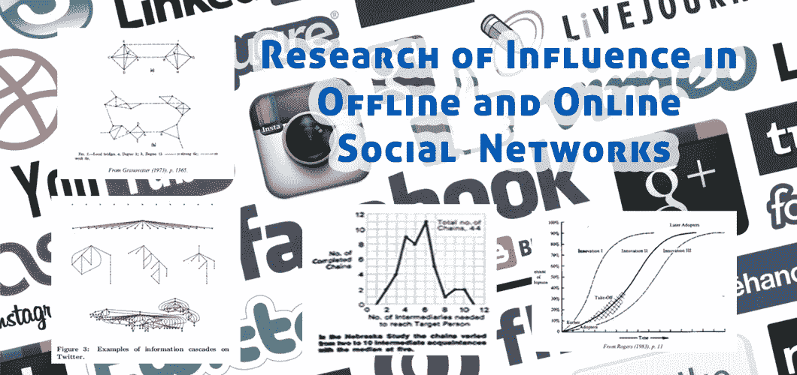
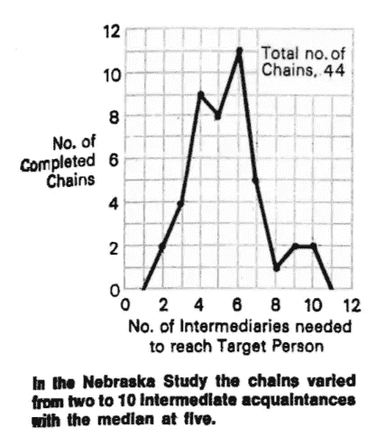
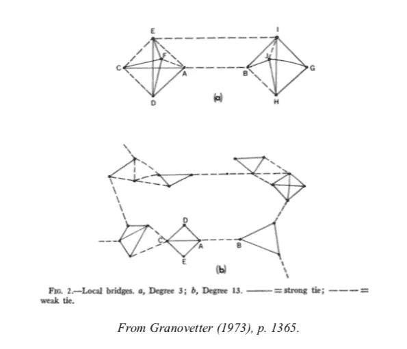
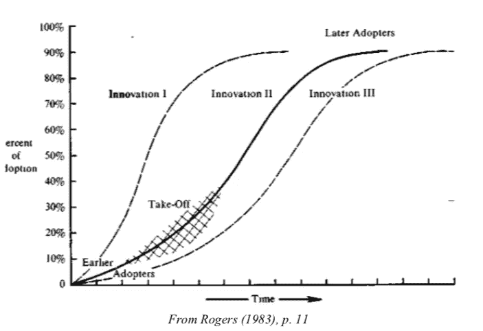
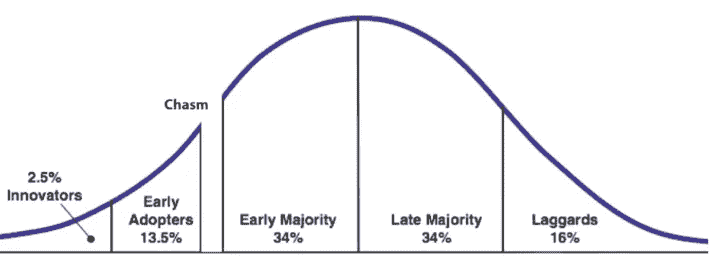
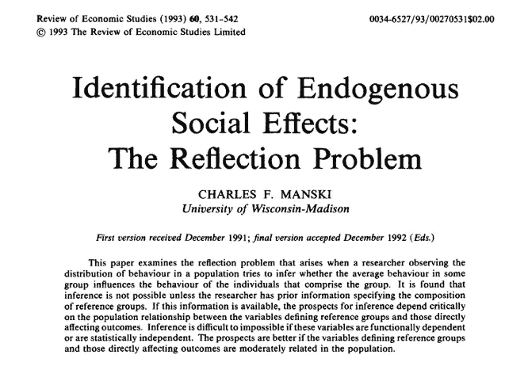
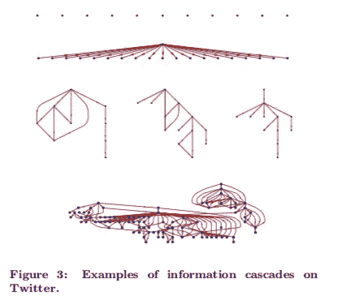
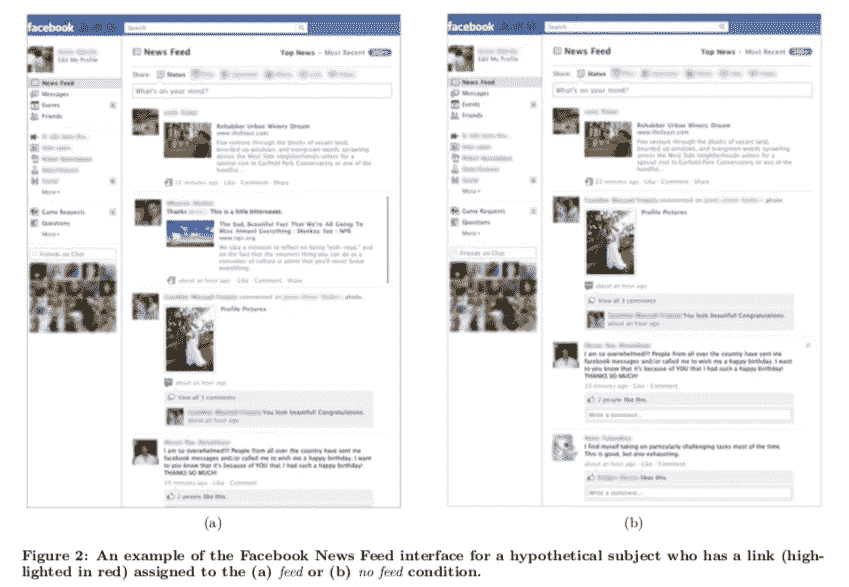
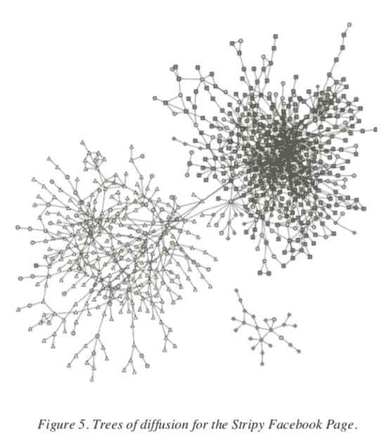

# 线下和线上社交网络中的影响力研究

> 原文：<https://towardsdatascience.com/research-of-influence-in-offline-and-online-social-networks-6ed162bb94dc?source=collection_archive---------26----------------------->

## 关系强度和网络度在决定社会影响力中的作用。

几乎所有关于社交网络和信息流分析的文章都是从提到斯坦利·米尔格拉姆在 20 世纪 60 年代著名的小世界实验开始的。我们照着做吧。

本文的前半部分是关于通过社会网络的信息传播的经典研究的主要发现。之后，我们将关注一种特殊的社交网络:在线社交网络。我们在 YouTube、Twitter 和脸书等社交媒体平台上发现了同样的离线社交网络特征吗？

*注:本文是社交网络分析和影响者营销系列文章的一部分，全部基于我的硕士论文“Instagram 上的影响者欺诈:全球最大参与社区的描述性分析”* ***、*** *其中* [*你可以在这里*](https://www.academia.edu/41132185/Influencer_Fraud_on_Instagram_A_Descriptive_Analysis_of_the_Worlds_Largest_Engagement_Community_Master_Thesis_by_Jonas_Schröder_) *完整阅读。由于现在几乎没有人有时间阅读 140 多页的相关内容，我决定将我的硕士论文分成几篇中等长度的独立文章，让读者自己决定她感兴趣的内容。*

[insta gram 上相关标签的社交网络分析(使用 InstaCrawlR)](/social-network-analysis-of-related-hashtags-on-instagram-using-instacrawlr-46c397cb3dbe)

[在 R 中建立自己的 Instagram 数据库](/build-your-own-instagram-database-134281e8ee92)

[订婚豆荚是什么鬼？](https://medium.com/@jonas.schroeder1991/what-the-hell-are-engagement-pods-234745667036)

[insta gram 上的影响者欺诈——对世界上最大的互动社区的描述性分析(乔纳斯·施罗德的硕士论文)](https://www.researchgate.net/publication/337651456_Influencer_Fraud_on_Instagram_-_A_Descriptive_Analysis_of_the_World's_Largest_Engagement_Community_Master_Thesis_by_Jonas_Schroder)

请随时关注我的个人资料以获取更新或稍后回来。我会继续添加其他文章的链接。

## **世界真小——离线社交网络的经典研究结果**

Taken from Milgram (1967)

在 1967 年的实验中，米尔格拉姆要求随机选择的美国公民向随机目标传递一封信，只使用他们认识的朋友和熟人的名字。由此得出的路径长度中值为 5，这意味着人们通常只需几步就能彼此联系起来。这种“知识”进入了流行文化和常识(例如，S [ix Degrees of 凯文·贝肯](https://en.wikipedia.org/wiki/Six_Degrees_of_Kevin_Bacon))。然而，更有趣的是他关于中介角色的发现。米尔格拉姆写给他们的信有一半是通过同样的三个人:雅各布斯先生、布朗先生和琼斯先生。这些人是高度联系的个人，或社会中心，基本上汇集了整个美国公民网络。

Granovetter (1973)将这些人称为桥梁，即信息通过社交网络流动的瓶颈。他认为，社交网络重叠的程度取决于连接它们的纽带的强度。越是相似或同性的个体，他们越有可能互动并形成牢固的关系。有道理:我们信任我们认识的人，他们往往和我们有相同的背景和兴趣。

然而，为了传播新的信息，我们需要关注那些联系不紧密的个体，他们将不同兴趣的社会圈子联系在一起。因此，弱关系在新信息的传播中起着特殊的作用，例如新产品或流行趋势。Brown 和 Reingen (1987)从经验上证明了这一假设。弱关系确实被发现与新思想的传播和子社区之间的传播不成比例地更相关。

米尔格拉姆经典实验的数字复制品也支持这一发现。在 Dodds，Muhamad 和 Watts (2003)的实验中，6 万名参与者被要求向来自几个国家的 18 个目标转发电子邮件。他们发现，在成功的连锁中，信息被转发给发送者描述为关系相当“随便”和“不密切”的人，因此:关系薄弱。然而，他们没有从米尔格拉姆的研究中找到雅各布斯先生的数字等价物。他们没有发现真正的桥梁。

从任何一个关系紧密的社区的立场来看，局外人都是局外人。他们很奇怪。然而，如上所述，局外人对于新思想的传播是很重要的。我们从许多关于创新传播的书籍和文章中知道，技术的早期采用者在开始时总是被认为是怪异的。

> “为什么这个人在和他的手说话？”，是 90 年代许多人的想法。现在，每个人都有一部 iPhone，在乘地铁上下班的时候，可以和自己通话。

在他经常被引用的书《引爆点》(2000)中，格拉德威尔分析了任何趋势或社会流行病的传播——无论是技术采用、时尚趋势，甚至是犯罪。他认为有三种人必须像野火一样传播信息:连接器、专家和推销员。

连接器是像雅各布斯先生这样的人，他们通过自己的庞大网络将世界联系在一起。专家是有社会动机的人，他们通过分享信息在个人和市场之间充当中间人。当你想买一台新的笔记本电脑时，你最好在你的社交圈里寻找行家。销售人员被描述为天生的说服者，他们使用微妙的、主要是非语言的暗示来影响人们的观点。

> 专家是数据库。他们提供信息。连接器是社会粘合剂:他们传播它。当我们不相信我们所听到的时，推销员会说服我们。—马尔孔·格拉德威尔

格拉德威尔认为这些人最重要的功能之一就是充当翻译。他们获取创新者的信息，并将其翻译给更广泛的受众。因此，它们有助于解决摩尔(1991)的鸿沟问题。这对于那些试图将客户群从早期用户扩大到大众市场的公司来说非常重要。连接器、专家和销售人员——或者更现代的术语:影响者——可以帮助完成这项工作。

这么多关于与人面对面或通过模拟方式互动的旧世界。让我们继续研究在线社交网络中的影响力。

## 你好，扎克，我是汤姆！关于在线社交网络的一些研究结果

关于社会影响力和通过离线社交网络传播信息的经典研究人员不仅受到了他们所处时代的计算限制的挑战。他们不得不处理许多未经证实的假设和有限的数据，因为人们关系的本质和他们的个性不是很容易观察到的，而是可以通过调查解决的。

今天，由于技术进步和社交媒体平台的普及，社交网络分析如今更加富有成果。人们之间的联系很容易以关注者关系或朋友图表的形式观察到。构建和分析巨大的交互模型不再困难。

此外，人们乐于在网上分享大量关于自己和兴趣的信息。没有必要进行调查研究来确定个体群体的异质性和同质性——只需看看他们追随谁，喜欢什么。

这有可能解决 Manski(1993)在网络分析中经常发现的反射问题。一个社区的成员会因为群体对他们的影响而分享某些特征吗？还是说组成这个团体的人一开始就很相似？

Preview from [https://www.jstor.org/stable/2298123](https://www.jstor.org/stable/2298123?seq=1#page_scan_tab_contents)

苏萨拉、吴和谭(2011)分析了 YouTube 的网络结构。他们能够通过系统地分离某些因素来区分社会影响和用户的自我选择，从而控制反思问题。他们的主要发现是，对 YouTube 的影响力来自于一个节点的网络中心性，而同性对社会传染起着至关重要的作用。

Bakshy 等人(2011)研究了对 **Twitter** 的影响力，这种影响力可以被定义为持续播种超越他人的级联的能力。他们发现，拥有许多过去有影响力的追随者的人确实更有可能继续他们的影响力。然而，研究人员指出，在颗粒基础上预测影响是不可靠的。持续影响的效果只对平均值成立，对个体不成立。他们建议营销人员使用一种分散祈祷式的投资组合策略，而不是把所有赌注都押在一匹马上。

Taken from Bakshy et al. (2011): Everyone’s an Influencer — Quantifying Influence on Twitter.

尽管 2018 年有各种坏消息和动荡的股票表现，**脸书**仍然是目前最大的社交媒体平台之一。用户可以通过双向联系与朋友联系，通过单向联系关注他们喜欢的艺术家。NewsFeed 算法决定了每个用户在浏览应用程序或网站时可以看到哪些内容。你可能会收到你的朋友保罗昨天分享的一个链接，你也想和你的网络分享它。

链接共享行为可以被视为影响力的一个指标。脸书在网络中的影响力显而易见。然而，有许多外部影响来源，如面对面接触或电子邮件交流。通过操纵 2.53 亿脸书用户的新闻源，Bakshy 等人(2012)能够确定社交媒体平台在信息传播过程中的作用。

他们创建了两个组:一个组中的某些信息被从新闻源中过滤出来，并且只能在脸书之外获取(无新闻源条件)，另一个组中的信息可以从内部或外部获取(新闻源条件)。

Taken from Bakshy et al. (2012): The Role of Social Networks in Information Diffusion

像这样的实验设置的一大优势是，研究人员可以通过控制与同性相关的混杂因素来解决反射问题。通过比较两组的行为，研究人员发现，暴露于朋友分享行为(喂食条件)的受试者比没有喂食的受试者分享相同信息的可能性高 7.37 倍。因此，我们的朋友在某种程度上影响我们的行为。

此外，Bakshy 等人(2012 年)使用多种互动类型来衡量关系强度，例如，通过脸书信息进行私人交流的频率或通过评论进行公共交流的频率。Granovetter 的假设，即弱关系对新信息的传播更为重要，再次得到了经验上的支持。

为**脸书**再做一次研究。孙等人(2009)的研究重点是版面的扩散事件。当 Sally 喜欢 Metallica 的粉丝页时，这种粉丝行为可以被广播到她的一些网络中。保罗看到这一幕，立刻想到了圣安格尔的金属小军鼓声。他认为这是一支很酷的乐队，并对金属乐队也给予了好评。结果就是一个巨大的树状扩散网络。下面由此产生的网络，与少数人足以以流行病的方式传播信息的普遍假设形成对比(你好，格拉德威尔！).

Taken from Sun et al. (2009): Gesundheit! Modeling Contagion through Facebook News Feed

孙等发现扩散链一般都很长，但不是单个链式反应事件的结果。相反，它们是由大量用户发起的，这些用户的短链被合并在一起。此外，他们注意到，在控制受欢迎程度后，一个起始节点的最大扩散链长度不能用用户的人口统计或脸书使用特征来预测，包括朋友的数量。在此之后，识别潮流引领者将变得困难。

## 结论

影响的力量在一个网络中的个体之间并不是平均分配的。它可以被描述为一个社会网络中的连接数量(数量)以及每个纽带的强度(质量)的函数。如果你的联系质量不高，认识很多人可能还不够。

因此，与拥有成千上万追随者的有影响力的人合作本身还不令人信服，不管他们是真是假。微影响者的巨大吸引力在于他们与粉丝的关系质量，这比那些不在乎的广大观众更重要。

但这是另一个时间的话题。

请随时关注我的个人资料，获取关于这个主题的最新消息。你可以在 [LinkedIn](https://www.linkedin.com/in/jonas-schröder-914a338a/) 或 [Twitter](https://twitter.com/Gedankennahrung) 上联系我，如果你想谈谈我在市场营销方面的研究或数据科学的话。

感谢阅读，

乔纳斯·施罗德

PS:如果你想知道更多关于在线社交网络的研究，以及一些影响者是如何伪造的，直到他们成功，一定要看看我的大量研究论文:[insta gram 上的影响者欺诈——对世界上最大的参与社区的描述性分析(Jonas Schrö der 的硕士论文)](https://www.researchgate.net/publication/337651456_Influencer_Fraud_on_Instagram_-_A_Descriptive_Analysis_of_the_World's_Largest_Engagement_Community_Master_Thesis_by_Jonas_Schroder)

**引用文献**

米尔格拉姆，斯坦利(1967)，“小世界问题”，*《今日心理学》，*第 1 卷，№1，61–67 页。

马克·s·格兰诺维特(1973)，“弱关系的力量”，*《美国社会学杂志》*，第 78 卷，第 6 期，1360–1380 页。

Brown，Jacqueline Johnson 和 Peter H. Reingen (1987)，“社会关系和口碑推荐行为”，*《消费者研究杂志》，*第 14 卷，№3，350–362。

Dodds，Peter Sheridan，Roby Muhamad 和 Duncan J. Watts (2003)，“全球社会网络中搜索的实验研究”，*《科学》，* 301，827–829。

查尔斯·f·曼斯基(1993)，“内生社会效应的识别:反思问题”，*《经济研究评论》*，第 60 卷，第 3531–542 页。

苏萨拉、安贾纳、吴正河和谭勇(2011)，“社交网络和用户生成内容的扩散:来自 YouTube 的证据”，*信息系统研究，文章预告，*1–19。

Bakshy、Eytan、Itamar Rosenn、Cameron Marlow 和 Lada Adamic (2012 年)，“社交网络在信息传播中的作用”，*国际万维网会议委员会(IW3C2) 2012 年会议录，*[可用 athttps://arxiv . org/pdf/1201.4145 . pdf]，1–10。

Bakshy，Eytan，Jake M. Hofman，Winter A. Mason 和 Duncan J. Watts (2011)，“每个人都是影响者:量化对 Twitter 的影响”，*第四届 ACM 网络搜索和数据挖掘国际会议(WSDM，2011 年)*，【可在[http://snap . Stanford . edu/class/cs 224 w-readings/bak shy 11 influencers . pdf 获得】，](http://snap.stanford.edu/class/cs224w-readings/bakshy11influencers.pdf],)1–10。

孙、埃里克、伊塔马尔·罗森、卡梅隆·a·马洛和托马斯·m·伦托(2009 年)，《科学！通过脸书新闻源进行传染建模”，*第三届国际 ICWSM 会议记录(2009)* ，146–153。

*注:本文将是社交网络分析和影响者营销系列的一部分，全部基于我的硕士论文“Instagram 上的影响者欺诈:对世界上最大的参与社区的描述性分析”的研究。相关文章的链接以后会在这里汇总。*