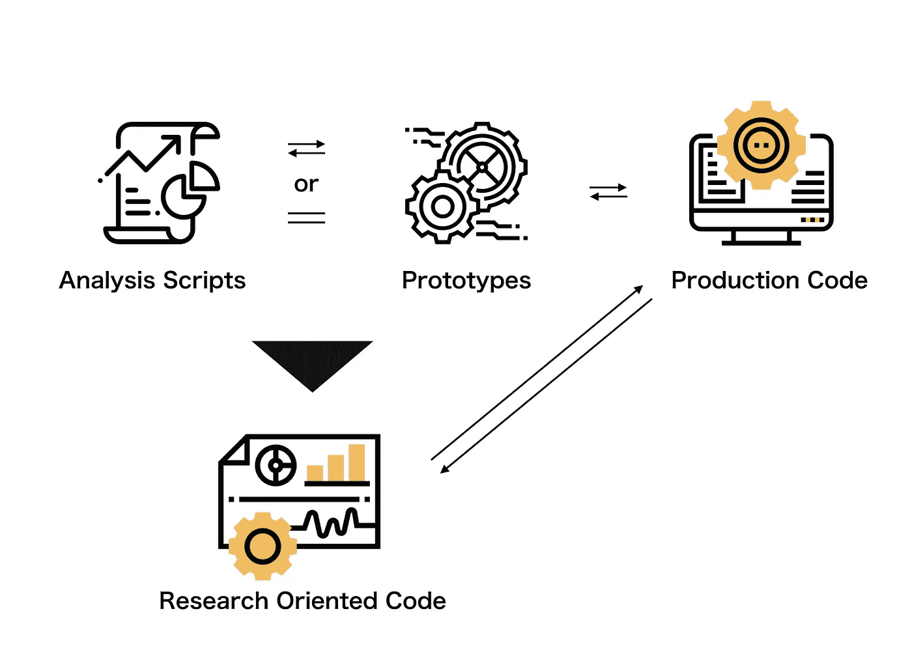
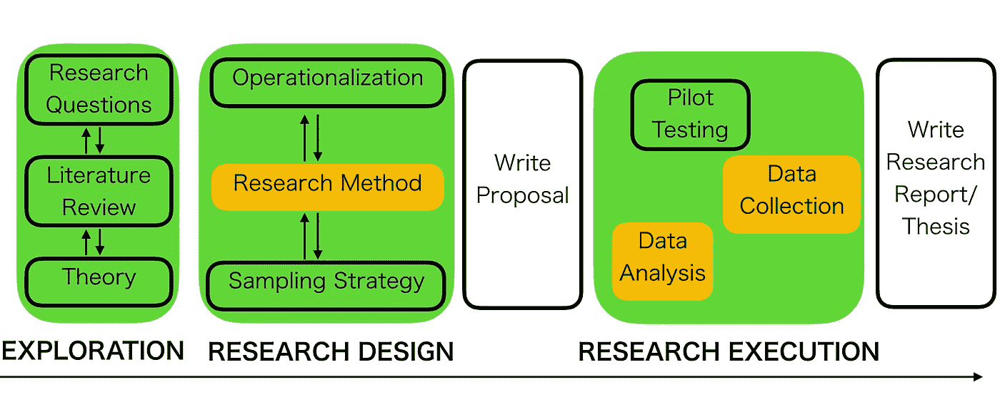
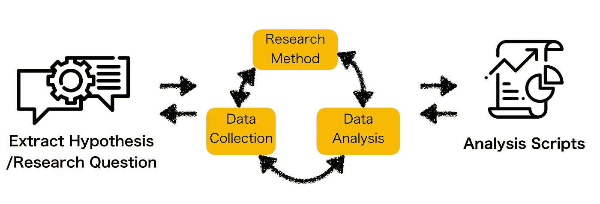
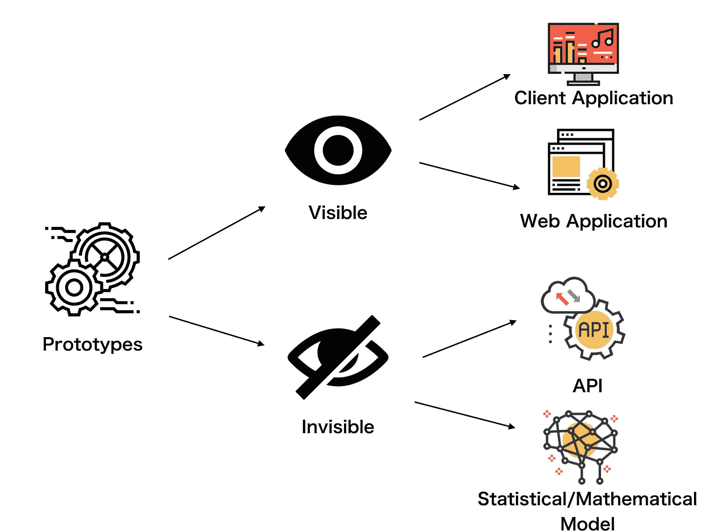

# AI/ML 项目中面向研究的代码

> 原文：<https://towardsdatascience.com/research-oriented-code-in-ai-ml-projects-f0dde4f9e1ac?source=collection_archive---------26----------------------->

Photo by [Vitaly Taranov](https://unsplash.com/@gooner?utm_source=medium&utm_medium=referral) on [Unsplash](https://unsplash.com?utm_source=medium&utm_medium=referral)

## 面向研究的代码概念化，以弥合数据科学和工程之间的差距

最近，web 应用工程师比以前有更多的机会与数据科学家或研究人员一起工作。同时，他们还经常面对由数据科学家或研究人员编写的面向研究的代码。代码往往是为涉及人工智能(AI)或机器学习(ML)的产品编写的。这篇文章可能会帮助初级/中级工程师或数据科学家理解为 AI/ML 产品编写的代码。

# 什么是面向研究的代码？

面向研究的代码是主要由研究人员或科学家编写的代码，它指的是分析脚本和/或原型代码。是基于**科研范式**写的。可以通过以下三个迭代过程**来开发产品:1)编写分析脚本**、 **2)基于分析脚本开发原型**，以及 **3)将原型转化为应用产品。**(如图 1 所示)

Figure 1 created by Jesse Tetsuya

**数据科学家和研究人员往往在数学和算法建模方面有很强的背景。他们可以利用自己的技能来帮助开发工作，比如编写分析脚本和开发原型。在许多与 AI/ML 相关的项目中，他们可能会频繁地编写原型级别的分析脚本和代码。**

虽然一些数据科学家和研究人员拥有工程技能，但**生产级代码主要由 web 应用工程师编写。** Web 应用工程师有责任提高产品代码本身的质量，并使代码在服务器上运行。例如，为了将科学家或研究人员编写的代码与 API 等系统集成，web 应用工程师需要对其进行重构。

# AI/ML 项目中的分析脚本是如何编写的？

为了缩小分析脚本的含义，弄清楚在业务情况下编写分析脚本的过程可能更有益。这是因为分析脚本在学术界和商业中使用，这可能会极大地影响对分析脚本的理解。

编写分析脚本是学术界研究过程的一部分。如图 2 所示，传统研究倾向于**演绎和功能主义性质的**。写分析脚本是为了找出新的知识并把它写在论文上。需要严格和准确的证据来支持新知识的存在和论文中的论点，无论它在商业上如何有益。除了涉及商业的情况，研究人员可能不需要考虑学术会议或期刊的严格资源规划和预计交付日期。

Figure 2 created by Jesse Tetsuya

在商业环境中的实际工作中，特别是关于 AI/ML 项目的工作中，分析脚本本身可以是原型和产品的基础。通过查看原型的演示，决策者需要在其他公司开始相同的业务之前判断它在业务上是否有益。因此，需要分析脚本的快速迭代输出，它也可以是原型。下面的流程适用于**归纳、迭代和有机**的情况。

Figure 3 created by Jesse Tetsuya

上面图 3 中黄色方框的循环将在下面详细讨论。

## **研究方法**

*   在研究中，有两种分析方法； **1)** **定性分析**如观察和非结构化访谈，它使用基于不可量化信息的主观判断，以及 **2)** **定量分析**，它试图通过使用数学和统计建模、测量和研究来理解行为。
*   在 AI/ML 项目中，选择第二种方式，项目的利益相关者需要选择**分析方法**，如回归、分类或神经网络。还有，什么**分析工具** (python，R，SPSS，等等。)他们应该用意志来决定。

## **数据收集**

*   首先，需要从数据库等中收集二级数据，如日志数据。在他们开始收集数据之前，涉众判断哪些数据能够恰当地代表他们想要知道的。在学术界的研究中，数据库或数据本身有时在校园或实验室之外。
*   另一方面，大多数 IT 公司倾向于将数据存储在他们自己的数据库中。这可以使项目更容易在数据收集、数据分析和研究方法决策之间来回切换。

## **数据分析**

*   在学术界和商界，收集的数据是经过预处理的。预处理的方式取决于分析方法和工具。编码人员将经过预处理的数据输入到分析模型中，并验证输出是否适合了解他们想要了解的内容。

# 原型的类型

原型可以分为两组**可见的**如客户端应用程序和 web 应用程序和**不可见的**如 API 或统计/数学模型。(如图 4 所示)在 AI/ML 项目中，后者可以是通过上述编写分析脚本的周期开发的原型。

Figure 4 created by Jesse Tetsuya

# 评估面向研究的代码的五种方法

最后一节描述了哪些评估指标对于修复和编写实际的编程代码是有用的。理解这些指标可以帮助编码人员更好地进行编写分析脚本的迭代循环。

面向研究的代码可以通过使用由 [Zina O'Leary](https://www.anzsog.edu.au/about/contact-directory/zina-o-leary) 撰写的[做你的研究项目的基本指南](https://www.amazon.com/Essential-Guide-Doing-Research-Project/dp/1446258971)中建议的科学研究指标来评估。这是因为它基于上一节所述的科学研究范式。这五个指标可以应用到 AI/ML 项目中编写面向研究的代码的实际过程中。

## 1)客观性

> 客观性意味着研究者和被研究对象之间的距离，并表明这种关系是由协议、理论和方法调节的。该标准的存在是为了防止个人偏见“污染”结果。**主观性是否得到承认和管理？**

**情况:**在对数据进行预处理时，程序员或研究人员需要决定对分析不重要的数据，并删除它们，如离群值。让第三个人查看数据可能会提供有价值的见解，并且是避免个人偏见的有效方法。拥有一个稳定的环境来快速地在数据分析、数据收集和研究方法选择之间来回切换可能是解决方案之一。

## 2)有效性

> 有效性的前提是假设所研究的内容可以被测量或捕捉，并试图确认测量和捕捉的“数据”的真实性和准确性，以及从数据中得出的任何发现或结论的真实性和准确性。说明你得出的结论是可信的。**是否捕捉到了‘真本质’？**

**情况:**当时分析算法没有输出准确的结果或者学习模型没有很好地工作。这些都是通过使用精度等机器学习度量标准来防止的。

## 3)可靠性

> 可靠性的前提是这样一个概念，即在被测量的东西中有某种统一或标准化的感觉，并且方法需要一致地捕捉正在探索的东西。因此，可靠性是指一项措施、程序或仪器在重复试验中提供相同结果的程度。方法是否一致？

**情况:**如果预处理代码输出不一致的结果，则不可靠。例如，如果预处理过程、数据输入流程和参数检查都在代码中定义，则可靠性取决于该代码的质量

## 4)概化

> 概化是指样本的发现直接适用于更大的人群。虽然来自样本的发现可能与总体的发现不同，但被认为是可概括的发现显示了具有代表性的统计概率。**研究结果是否适用于直接参照系之外？**

**情况:**除了极端情况，输入数据的大小和数据类型会极大地影响算法的输出。概化由输入数据的数量和属性控制。算法的弱概括能力会导致数据的过拟合或数据泄漏。这些可以通过交叉验证、正则化和查看学习曲线来进行参数调整。

## 5)再现性

> 再现性与可信度问题直接相关，表明研究过程可以被复制以验证研究结果。换句话说，如果在相同/相似背景下的不同研究中使用相同的方法，结论将得到支持。**研究可以验证吗？**

**情况:**当****编程代码根据不同的运行环境或服务器输出不同的结果，代码不可靠。基础设施的配置可能有一些问题，或者操作环境或服务器可能不适合使代码很好地工作。****

****简而言之， **1)客观性**和 **5)再现性**似乎是与分析脚本本身相关的指标。另一方面， **2)效度**、 **3)信度**和 **4)概化**与分析算法直接相关。使用内置于 [scikit-learn](https://scikit-learn.org/stable/) 中的机器学习指标对于测量机器学习算法本身可能是有用的。****

****“面向研究的代码”是一个有用的词，可以将问题分成小块，从工程师或研究人员的角度来看待它们。工程师和研究人员的技能似乎有点重叠，所以有时他们的工作职责在 AI/ML 项目中似乎是模糊的。特别是，经验不足的工程师/数据科学家可能会比资深工程师对他们自己在 AI/ML 项目中的实际任务感到更加模糊。这也是我将 AI/ML 项目中面向研究的代码概念化并详细描述的原因。****

# ****参考****

****Bhattacherjee，a .，南佛罗里达大学，学者共享和开放教科书图书馆，(2012 年)。*社会科学研究:原则、方法和实践*，可在:【https://open.umn.edu/opentextbooks/BookDetail.aspx? 查阅 bookId=79 。****

****奥利里，z .(2014 年)。*做研究项目的基本指南*第二版。，洛杉矶:鼠尾草。****

****来自[www.flaticon.com](http://www.flaticon.com/)的[桉树](https://www.flaticon.com/authors/eucalyp)制作的图标(图 4 中的大脑图标、web 应用图标/图 1 和图 4 中的原型图标和生产代码图标/图 1 中的面向研究的代码图标/图 3 中的问题图标)****

****来自[www.flaticon.com](http://www.flaticon.com/)的[原符号](https://www.flaticon.com/authors/prosymbols)制作的图标(图 4 中的 API 应用图标)****

****来自[www.flaticon.com](http://www.flaticon.com/)的 [Freepik](https://www.flaticon.com/authors/freepik) 制作的图标(图 4 中的睁开的眼睛图标、闭上的眼睛图标和客户端应用程序图标/图 1 和图 3 中的分析脚本图标)****