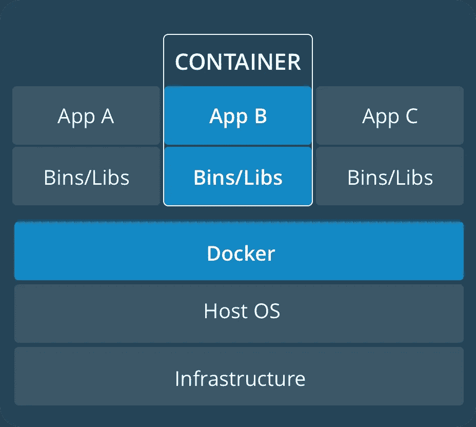
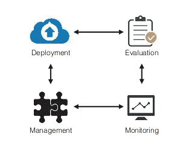
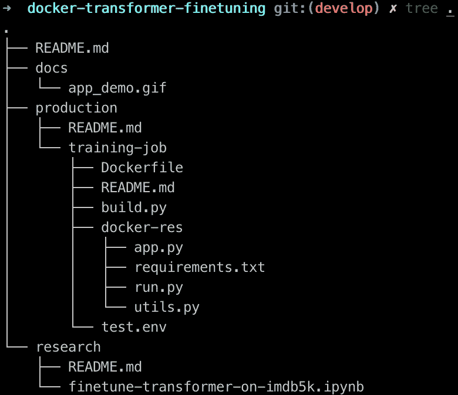
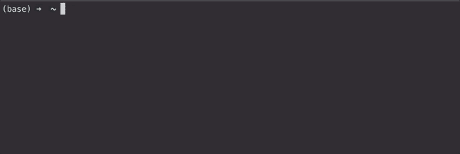
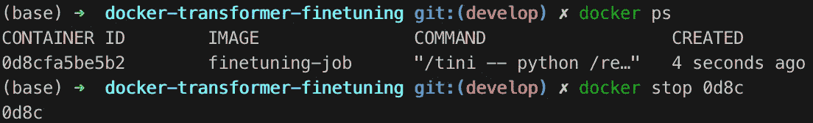

# 🐳从研究到生产:集装箱化的培训工作

> 原文：<https://towardsdatascience.com/research-to-production-containerized-training-jobs-e63d4efd56e1?source=collection_archive---------25----------------------->

> 这篇文章演示了如何使用 Docker 将训练代码容器化，并将适合的模型部署为 web 应用程序。虽然它在一定程度上建立在我之前的帖子上🤖 [用于情绪分析的变压器微调](https://medium.com/@ben0it8/transformer-fine-tuning-for-sentiment-analysis-c000da034bb5?source=friends_link&sk=19ce3ee5a08032c6417268fbce0437ee)，*记住这里描述的方法是通用的；它可以作为机器学习实践者的标准解决方案来封装他们的研究代码，并促进可重复性。*

# 为什么使用 Docker？为什么要在集装箱里训练？



Figure 1: Docker containers share the host OS kernel and do not require virtualized hardware, resulting in smaller footprint.

本质上，容器是轻量级的简洁胶囊，包含使用共享操作系统的应用程序，而不是需要模拟虚拟硬件的虚拟机。Docker 使我们能够轻松地将应用打包成小型、便携、自给自足的容器，几乎可以在任何地方运行。*容器是进程，虚拟机是服务器*(更多)。

以容器化的方式训练机器学习(ML)模型并不是一种常见的做法。大多数人倾向于使用简单的 Python 脚本和 requirement.txt 文件。然而，我认为，一般来说，在生产中的 ML 模型的整个生命周期中，容器化训练代码可以为我们节省大量的时间和麻烦。



Figure 2: Containerized training comes handy once our monitored metrics show model performance deterioration. Source: [https://towardsdatascience.com/flask-and-heroku-for-online-machine-learning-deployment-425beb54a274](/flask-and-heroku-for-online-machine-learning-deployment-425beb54a274)

比方说，我们有一个根据我们收集的用户数据训练的生产模型。但是，随着时间的推移，用户行为会发生变化，这可能会导致数据分布发生显著的**变化。**
因此，**随着生产模型的老化，它的质量会下降**，很可能做出不再有用甚至更糟的预测，对我们的业务有潜在的危害。运行训练作业允许我们毫不费力地根据新的数据分布重新训练我们的模型。进一步来说，容器化有助于定期运行作业——或者在监控指标的性能下降时——自动测试和部署作业，确保预测一致，让我们的用户满意。

另一种情况是，我们的基础设施中有多台服务器用于计算，可能使用不同的 Linux 发行版、CUDA 工具包、Python 版本、库等等。可以说，我们无法预测每一个场景，我们心爱的训练脚本很可能会在某些环境中崩溃。在这种情况下，拥有 Docker 化的作业确实可以节省我们的时间和精力，因为只要安装了 Docker，它就可以在任何环境中运行。

或者，你可以把一个容器化的培训工作想象成一个给定任务的**封装解决方案**。比方说，我们的任务是对员工报告进行分类。在原型开发上投入了几个月后，我们希望以某种方式坚持我们的解决方案，因为结果可能必须在以后重现，或者模型可能在将来应用于类似的问题。

注意，当然，在容器内执行代码仍然需要主机有足够的硬件(计算和内存)和驱动程序(例如，支持 CUDA 工具包的 Nvidia 驱动程序等等)。

# 集装箱化

到目前为止，我们已经有了一些输出经过测试的、健壮的 ML 模型的训练代码，我们现在希望以某种方式保持它(或 *productionalize* )并可能作为服务部署。

此外，假设模型的测试性能符合我们的预期，我们结束*研究阶段*。对于这个演示，我将采用我以前的帖子 [*情感分析的变压器微调*](https://medium.com/@ben0it8/transformer-fine-tuning-for-sentiment-analysis-c000da034bb5) *中的培训程序。*然而，请注意，以下部分完全与底层 ML 模型无关，是所有类型模型拟合任务的通用方法。

出于上述原因，我们决定将整个微调代码封装到一个自包含的 Docker 容器中。🐳

## 结构

在下文中，我们假设[对接器](https://docs.docker.com/v17.12/install/)安装在主机上。让我们简单地将这个 [docker 作业模板](https://github.com/ben0it8/docker-job-template)克隆到我们选择的目录中:

```
git clone [https://github.com/ben0it8/docker-job-template](https://github.com/ben0it8/docker-job-template)
mv docker-job-template docker-transformer-finetuning
```



我们的项目包含两个主要文件夹:`research`和`production`。前者是研究代码所在的地方，从实验性的 Jupyter 笔记本到端到端的完善的培训脚本，任何东西都放在这里(在我们的例子中是一个笔记本)。`production`包含训练工作。所有从研究阶段提炼出来的需要微调的代码都作为一个单独的`utils.py`模块，和包含我们的依赖关系的`requirements.txt`一起送到`docker-res`。最终，训练逻辑在`docker-res/run.py`中定义，web 应用在`docker-res/app.py`中定义。

## Web 应用程序

使用令人惊叹的 [FastAPI](https://github.com/tiangolo/fastapi) 框架，组装一个可以作为服务执行**推理的玩具 web 应用程序非常简单。FastAPI 是*高性能，简单易学，编码速度快，随时可以投入生产。它建立在 OpenAPI 和 JSON Schema 等开放标准之上，使用 Pydantic 的类型声明，并附带自动 API 文档。***

首先，脚本加载我们之前保存的文件`metadata.bin`(包含配置和 int-to-label 映射)和`model_weights.pth`(最终参数)以及用于微调的`tokenizer`。然后我们初始化我们的应用程序，并定义一个调用函数`inference`的 POST 端点`/inference`。这个函数有一个参数，一个`Input`(这个类定义了我们的请求数据模型)并使用`predict`函数返回一个预测字典和它们相应的概率。

Figure 6: Simple web app for inference, implemented using FastAPI.

通过`uvicorn app:app --host 0.0.0.0 --port 8000`执行这个脚本启动一个可以从浏览器访问和测试的本地服务器，并返回任意输入文本的预测情感。

## Dockerfile 文件

*Dockerfile* 本质上是**Docker 建立我们形象所需的所有指令**的“配方”。为了简洁起见，我将在我们的`Dockerfile`中强调一些关键部分，更多信息参见原始[参考](https://docs.docker.com/engine/reference/builder/)。

我们没有从头开始构建容器，而是从*nvidia/cuda:10.0-cud nn7-devel-Ubuntu 16.04*映像中派生出来，因为我们希望使用 Nvidia 容器运行时进行 GPU 加速(更多信息[请点击](https://docs.nvidia.com/dgx/pdf/nvidia-container-runtime-upgrade.pdf)):

在这之后，一堆包，tini 和 Miniconda 被下载和设置。然后我们安装一些 Python 基础并将 conda 添加到$PATH:

接下来，我们安装培训和应用程序要求:

通过在运行作业时将环境变量传递给容器，可以很容易地配置作业，从而对训练过程提供一些控制。这些变量的默认值也在 docker 文件中定义:

这些变量是不言自明的，除了几个:

*   `NVIDIA_VISIBLE_DEVICES`:控制容器内哪些 GPU 可以访问(仅限 GPU)
*   `OMP_NUM_THREADS:`设置 PyTorch 用于 MKL 加速的线程数量，通常不应超过我们机器中物理 CPU 内核的数量(仅当我们没有 GPU 时相关)
*   `TRAIN_BODY`:控制是否训练变压器本体的参数(当然分类器反正是要训练的)

注意，我们的模型通常很大，但是我们希望我们的容器在不知道主机可用资源的情况下运行。因此，为了便于演示，我们将使用一个只有 8 的`BATCH_SIZE`。这个批量大小有望适合大多数硬件的内存，不管是在 GPU 还是 CPU 上训练(因为较大的批量导致更快的训练，如果有足够的内存可用，可以随意增加它)。

最后，我们将 Python 文件复制到`RESOURCES_PATH`，并告诉 Docker 在映像加载后使用 tini 执行`run.py`:

## 建设

`build.py` **管理我们的 Docker 构建、部署**(例如部署到 Docker 注册表)和版本控制。该命令构建一个名为 *finetuning-job 的映像，*默认情况下将其标记为“最新”:

```
python build.py --name finetuning-job
```

更多信息见`python build.py --help`或`training-job/README.md`。

## 奔跑

Docker 容器是运行在主机上的独立进程，具有自己的文件系统、网络和进程树。尽管在运行时有很多选项来配置容器，我将只强调与我们相关的选项。
一旦构建了映像，我们就可以运行容器，可选地通过标志`-e`覆盖 *Dockerfile* 中定义的某些环境变量，或者通过`--env-file=config.env`传递 env-file:

```
# pass env variables to parametrize training
docker run -e LR=0.001 -e N_EPOCHS=2 finetuning-job# or by using an env-file:
docker run --env-file=config.env finetuning-job
```

如果我们可以访问 GPU，我们当然应该使用 Nvidia 容器运行时来运行容器:

```
docker run --runtime=nvidia finetuning-job
```

为了访问运行在容器内部的 web 应用程序，我们必须用`-p`标志向外界公开它的一个端口:

`docker run -p 8000:8000 finetuning-job`

## 推理

当容器运行时，它将执行`run.py`，首先微调我们的分类器，然后使用 [uvicorn](https://www.uvicorn.org/) 在 [http://0.0.0.0:8000](http://127.0.0.1:8000/docs) 本地部署它。让我们通过发送 json 格式的 POST 请求来测试服务:



将浏览器指向[http://localhost:8000/docs](http://0.0.0.0:8000/docs)，查看自动生成的 API 文档。

使用 Ctrl+C 停止正在运行的容器，或者在终端中键入`docker ps`列出正在运行的容器，键入`docker stop [id]`杀死一个容器，其中`[id]`是容器 ID 的前 4 位数字:



🎉演示到此结束——我们已经完成了一个简单的容器化培训工作，允许我们微调一个强大的情感分析转换器，它能够在任何环境中重现我们的结果，并将模型部署为 web 服务。我希望一些 ML 从业者会发现这篇文章对将研究代码转化为产品有用！

🔮*集装箱变压器微调的代码可以在我的 g* [*ithub*](https://github.com/ben0it8/containerized-transformer-finetuning) 上找到🌈*本帖基于 SAP 在柏林
✉️所做的工作。如果您有任何问题/意见，请在下面留下评论，或者通过*[*Twitter*](https://twitter.com/atanaszov)*联系我！*