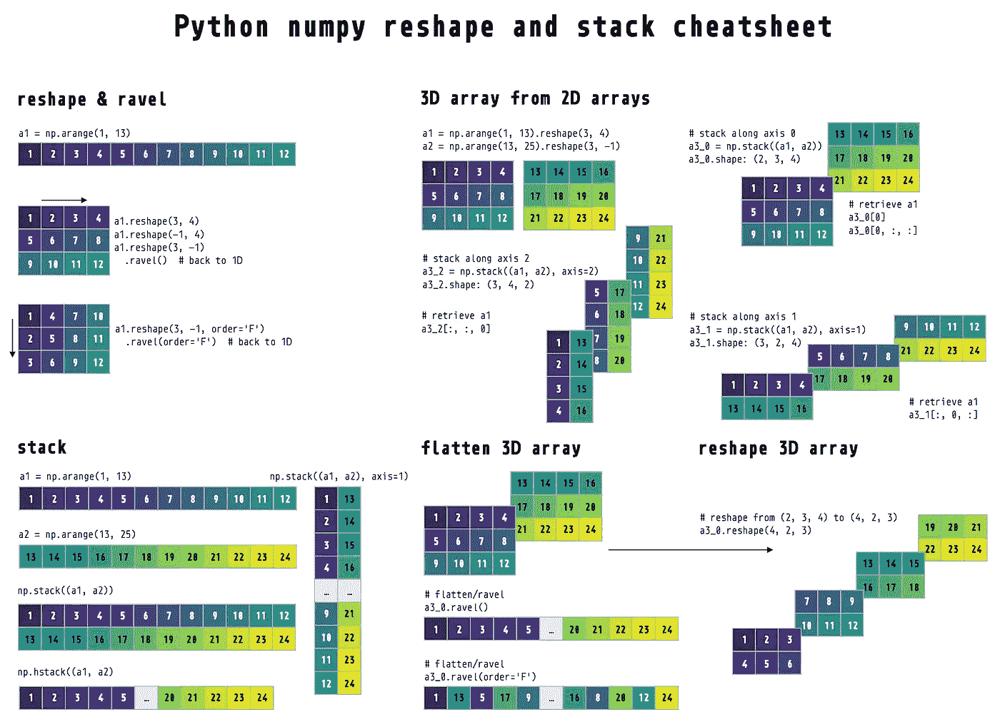
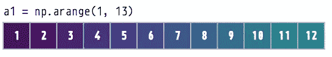
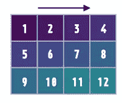
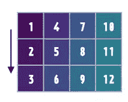
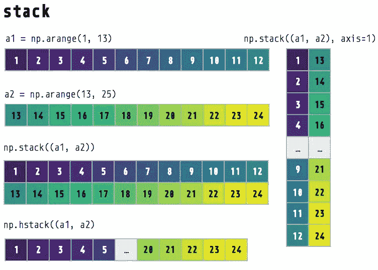
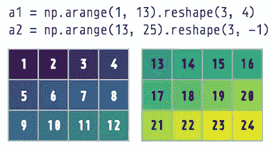
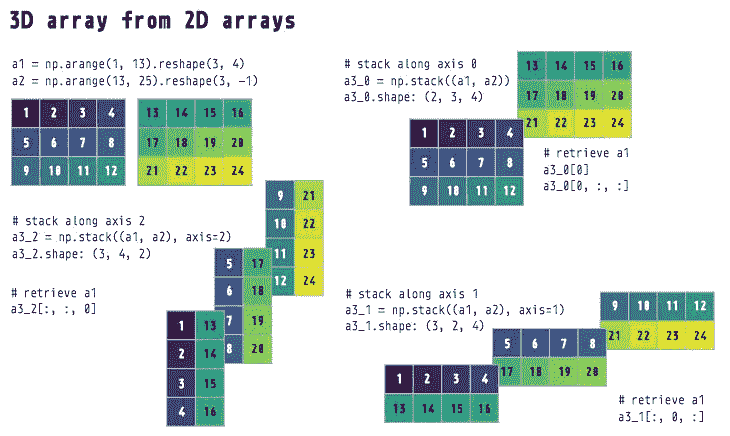
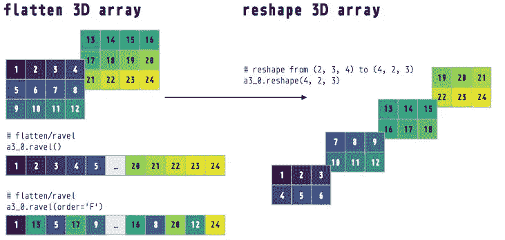

# 用 Python 重塑 numpy 数组——一步到位的图示教程

> 原文：<https://towardsdatascience.com/reshaping-numpy-arrays-in-python-a-step-by-step-pictorial-tutorial-aed5f471cf0b?source=collection_archive---------1----------------------->

## numpy 整形和堆叠的备忘单和教程

## 可视化 numpy 如何重塑多维数组



Cheatsheet for Python numpy reshape, stack, and flatten (created by [Hause Lin](https://www.hauselin.com) and available [here](https://github.com/hauselin/rtutorialsite/blob/master/_posts/2019-12-20-numpy-reshape/reshape.pdf))

*numpy* `reshape()` 方法如何重塑数组？你是否感到困惑，或者在理解它是如何工作的过程中挣扎过？本教程将带你完成 *numpy* 中的整形。如果您想要上述备忘单的 pdf 副本，您可以在此[下载](https://github.com/hauselin/rtutorialsite/blob/master/_posts/2019-12-20-numpy-reshape/reshape.pdf)。

你可能也会喜欢我的重塑熊猫数据帧的教程:

[](/reshape-pandas-dataframe-with-pivot-table-in-python-tutorial-and-visualization-2248c2012a31) [## 用 Python 中的 pivot_table 重塑熊猫数据框—教程和可视化

### 使用 pd.pivot_table 将 long 转换为 wide

towardsdatascience.com](/reshape-pandas-dataframe-with-pivot-table-in-python-tutorial-and-visualization-2248c2012a31) [](/reshape-pandas-dataframe-with-melt-in-python-tutorial-and-visualization-29ec1450bb02) [## 使用 Python 中的 melt 重塑熊猫数据框—教程和可视化

### 想象一下 pd.melt 是如何将熊猫数据帧从宽到长进行整形的

towardsdatascience.com](/reshape-pandas-dataframe-with-melt-in-python-tutorial-and-visualization-29ec1450bb02) 

# 创建一个 Python *numpy* 数组

使用`np.arange()`生成一个 *numpy* 数组，其中包含一系列从 1 到 12 的数字。在这里看文档[。](https://docs.scipy.org/doc/numpy/reference/generated/numpy.arange.html)

```
import numpy as npa1 = np.arange(1, 13)  # numbers 1 to 12print(a1.shape)
> (12,)print(a1)
> [ 1  2  3  4  5  6  7  8  9 10 11 12]
```



np.arange() creates a range of numbers

# 用*整形()*方法整形

使用`reshape()`方法将我们的 *a1* 数组改造成一个 3 乘 4 维的数组。我们用 **3_4** 来指代 it 维度:3 是第 0 个维度(轴)，4 是第 1 个维度(轴)(注意 Python 索引从 0 开始)。在这里见文档[。](https://docs.scipy.org/doc/numpy/reference/generated/numpy.reshape.html)

```
a1_2d = a1.reshape(3, 4)  # 3_4print(a1_2d.shape)
> (3, 4)print(a1_2d)
> [[ 1  2  3  4]
   [ 5  6  7  8]
   [ 9 10 11 12]]
```



3 by 4 numpy array

如果你想让 *numpy* 自动决定一个特定尺寸的大小/长度，将该尺寸指定为-1。

```
a1.reshape(3, 4)
a1.reshape(-1, 4)  # same as above: a1.reshape(3, 4)a1.reshape(3, 4)
a1.reshape(3, -1)  # same as above: a1.reshape(3, 4)a1.reshape(2, 6)
a1.reshape(2, -1)  # same as above: a1.reshape(2, 6)
```

# 沿不同维度重塑

默认情况下，`reshape()`沿着第 0 维(行)对数组**进行整形。此行为可通过`order`参数(默认值为`'C'`)进行更改。更多信息参见[文档](https://docs.scipy.org/doc/numpy/reference/generated/numpy.reshape.html)。**

```
a1.reshape(3, 4) # reshapes or ‘fills in’ row by row
a1.reshape(3, 4, order='C') # same results as above
```

我们可以通过将`order`改为`'F'`来沿着第一维(列)进行**整形。对于熟悉 MATLAB 的人来说，MATLAB 使用的是这个顺序。**

```
a1.reshape(3, 4, order='F')  # reshapes column by column
> [[ 1  4  7 10]
   [ 2  5  8 11]
   [ 3  6  9 12]]
```



3 by 4 numpy array

**测试**:数组 a1 的尺寸/形状是多少？

*a1* 是一个 1D 数组——它只有一维，尽管你可能认为它的维数应该是 **1_12** (1 行乘 12 列)。要转换成 1_12 数组，请使用`reshape()`。

```
print(a1)  # what's the shape?
> [ 1  2  3  4  5  6  7  8  9 10 11 12]print(a1.shape)
> (12,)a1_1_by_12 = a1.reshape(1, -1)  # reshape to 1_12print(a1_1_by_12)  # note the double square brackets!
> [[ 1  2  3  4  5  6  7  8  9 10 11 12]]print(a1_1_by_12.shape)  # 1_12 array
> (1, 12)
```

# 用 ravel()将 1D 数组展平/散开

`ravel()`方法允许你将多维数组转换成 1D 数组(参见文档[这里的](https://docs.scipy.org/doc/numpy/reference/generated/numpy.ravel.html))。我们的 2D 数组( **3_4** )将被拉平或散开，从而成为一个 12 元素的 1D 数组。

如果你不指定任何参数，`ravel()`将沿着行(第 0 维/轴)拉平/散开我们的 2D 数组。即第 0 行[1，2，3，4] +第 1 行[5，6，7，8] +第 2 行[9，10，11，12]。

如果您想沿列(第一维)拉平/散开，使用`order`参数。

```
print(a1_2d)  # 3_4
> [[ 1  2  3  4]
   [ 5  6  7  8]
   [ 9 10 11 12]]print(a1_2d.ravel())  # ravel by row (default order='C')
> [ 1  2  3  4  5  6  7  8  9 10 11 12]print(a1_2d.ravel(order='F'))  # ravel by column
> [ 1  5  9  2  6 10  3  7 11  4  8 12]
```

# 用`np.stack()`和`np.hstack()`连接/堆叠阵列



Stacking numpy arrays

创建两个 1D 阵列

```
a1 = np.arange(1, 13)
print(a1)
> [ 1  2  3  4  5  6  7  8  9 10 11 12]a2 = np.arange(13, 25)
print(a2)> [13 14 15 16 17 18 19 20 21 22 23 24]
```

使用`np.stack()`连接/堆叠数组。默认情况下，`np.stack()`沿着第 0 维(行)堆叠数组(参数`axis=0`)。更多信息参见[文档](https://docs.scipy.org/doc/numpy/reference/generated/numpy.stack.html)。

```
stack0 = np.stack((a1, a1, a2, a2))  # default stack along 0th axis
print(stack0.shape)
> (4, 12)print(stack0)
> [[ 1  2  3  4  5  6  7  8  9 10 11 12]
   [ 1  2  3  4  5  6  7  8  9 10 11 12]
   [13 14 15 16 17 18 19 20 21 22 23 24]
   [13 14 15 16 17 18 19 20 21 22 23 24]]
```

沿第一维堆叠(`axis=1`)

```
stack1 = np.stack((a1, a1, a2, a2), axis=1)
print(stack1.shape)
> (12, 4)print(stack1)
> [[ 1  1 13 13]
   [ 2  2 14 14]
   [ 3  3 15 15]
   [ 4  4 16 16]
   [ 5  5 17 17]
   [ 6  6 18 18]
   [ 7  7 19 19]
   [ 8  8 20 20]
   [ 9  9 21 21]
   [10 10 22 22]
   [11 11 23 23]
   [12 12 24 24]]
```

用`np.hstack()`连接成一个长 1D 数组(水平堆叠)

```
stack_long = np.hstack((a1, a2))
print(stack_long.shape)
> (24,)print(stack_long)
> [ 1  2  3  4  5  6  7  8  9 10 11 12 13 14 15 16 17 18 19 20 21 22 23 24]
```

# 创建多维数组(3D)

多维数组非常常见，被称为张量。它们在深度学习和神经网络中被大量使用。如果你对深度学习感兴趣，你会定期重塑张量或多维数组。

让我们首先创建两个不同的 3x 4 数组。稍后我们将把它们组合起来形成一个 3D 数组。

```
a1 = np.arange(1, 13).reshape(3, -1)  # 3_4
a2 = np.arange(13, 25).reshape(3, -1)  # 3_4print(a1)
> [[ 1  2  3  4]
   [ 5  6  7  8]
   [ 9 10 11 12]]print(a2)
> [[13 14 15 16]
   [17 18 19 20]
   [21 22 23 24]]
```



Two 3 by 4 numpy arrays

# 通过沿不同的轴/维度堆叠阵列来创建 3D 阵列

```
a3_0 = np.stack((a1, a2))  # default axis=0 (dimension 0)
a3_1 = np.stack((a1, a2), axis=1)  # along dimension 1
a3_2 = np.stack((a1, a2), axis=2)  # along dimension 2print(a3_0.shape)
> (2, 3, 4)
print(a3_1.shape)
> (3, 2, 4)
print(a3_2.shape)
> (3, 4, 2)
```



Create 3D numpy arrays from 2D numpy arrays

让我们打印数组，看看它们是什么样子的。可视化效果见上图。

```
print(a3_0)
> [[[ 1  2  3  4]
    [ 5  6  7  8]
    [ 9 10 11 12]]

   [[13 14 15 16]
    [17 18 19 20]
    [21 22 23 24]]]print(a3_1)
> [[[ 1  2  3  4]
    [13 14 15 16]]

   [[ 5  6  7  8]
    [17 18 19 20]]

   [[ 9 10 11 12]
    [21 22 23 24]]]print(a3_2)
> [[[ 1 13]
    [ 2 14]
    [ 3 15]
    [ 4 16]]

   [[ 5 17]
    [ 6 18]
    [ 7 19]
    [ 8 20]]

   [[ 9 21]
    [10 22]
    [11 23]
    [12 24]]]
```

因为这三个 3D 数组是通过沿着不同的维度堆叠两个数组而创建的，所以如果我们想要从这些 3D 数组中检索原始的两个数组，我们必须沿着正确的维度/轴进行子集化。

**测试**:我们如何从这些 3D 数组中检索出我们的`a1`数组？

```
print(a1)  # check what's a1
> [[ 1  2  3  4]
   [ 5  6  7  8]
   [ 9 10 11 12]]# solutions
a3_0[0, :, :]
a3_0[0]  # same as abovea3_1[:, 0, :]a3_2[:, :, 0]
```

# 展平多维数组

我们也可以用`ravel()`扁平化多维数组。下面，我们逐行(默认`order='C'`)遍历 1D 数组。



Flatten arrays with .ravel()

```
print(a3_0)
> [[[ 1  2  3  4]
    [ 5  6  7  8]
    [ 9 10 11 12]]

   [[13 14 15 16]
    [17 18 19 20]
    [21 22 23 24]]]print(a3_0.ravel())
> [ 1  2  3  4  5  6  7  8  9 10 11 12 13 14 15 16 17 18 19 20 21 22 23 24]
```

逐列(`order='F'`)移动到 1D 阵列

```
print(a3_0.ravel(order='F'))
> [ 1 13  5 17  9 21  2 14  6 18 10 22  3 15  7 19 11 23  4 16  8 20 12 24]
```

# 重塑多维数组

我们也可以用`reshape()`来重塑多维数组。

```
# reshape row by row (default order=C) to 2D arrayprint(a3_0)  # 2_3_4
> [[[ 1  2  3  4]
    [ 5  6  7  8]
    [ 9 10 11 12]]

   [[13 14 15 16]
    [17 18 19 20]
    [21 22 23 24]]]print(a3_0.reshape(4, -1))  # reshape to 4_6 (row by row)
> [[ 1  2  3  4  5  6]
   [ 7  8  9 10 11 12]
   [13 14 15 16 17 18]
   [19 20 21 22 23 24]]print(a3_0.reshape(4, -1, order='F'))  # reshape (column by column)
> [[ 1  9  6  3 11  8]
   [13 21 18 15 23 20]
   [ 5  2 10  7  4 12]
   [17 14 22 19 16 24]]print(a3_0.reshape(4, 2, 3))  # reshape to 4_2_3 (row by row)
> [[[ 1  2  3]
    [ 4  5  6]] [[ 7  8  9]
    [10 11 12]] [[13 14 15]
    [16 17 18]] [[19 20 21]
    [22 23 24]]]
```

# 结束语

我希望现在你对 *numpy* 如何重塑多维数组有了更好的理解。期待大家的想法和评论。另外，看看这个[对 numpy 和数据表示](https://jalammar.github.io/visual-numpy/)的可视化介绍。

如果您想要上述备忘单的 pdf 副本，您可以在此下载[。如果你觉得这篇文章有用，请关注我并访问](https://github.com/hauselin/rtutorialsite/blob/master/_posts/2019-12-20-numpy-reshape/reshape.pdf)[我的网站](http://hausetutorials.netlify.com/)获取更多数据科学教程。

如果您对提高数据科学技能感兴趣，以下文章可能会有所帮助:

[](/two-simple-ways-to-loop-more-effectively-in-python-886526008a70) [## 在 Python 中更有效地循环的两种简单方法

### 使用枚举和压缩编写更好的 Python 循环

towardsdatascience.com](/two-simple-ways-to-loop-more-effectively-in-python-886526008a70) [](https://medium.com/better-programming/code-and-develop-more-productively-with-terminal-multiplexer-tmux-eeac8763d273) [## 使用终端多路复用器 tmux 提高编码和开发效率

### 简单的 tmux 命令来提高您的生产力

medium.com](https://medium.com/better-programming/code-and-develop-more-productively-with-terminal-multiplexer-tmux-eeac8763d273) [](/free-online-data-science-courses-during-covid-19-crisis-764720084a2) [## 新冠肺炎危机期间的免费在线数据科学课程

### 像 Udacity、Codecademy 和 Dataquest 这样的平台现在免费提供课程

towardsdatascience.com](/free-online-data-science-courses-during-covid-19-crisis-764720084a2) 

*更多帖子，* [*订阅我的邮件列表*](https://hauselin.ck.page/587b46fb05) *。*