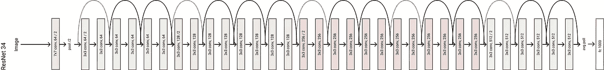
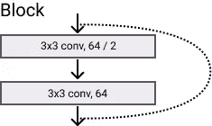
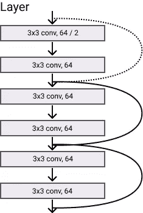
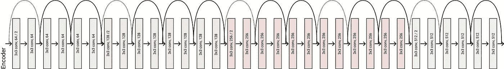

# 剩余网络:在 Pytorch 中实现 ResNet

> 原文：<https://towardsdatascience.com/residual-network-implementing-resnet-a7da63c7b278?source=collection_archive---------1----------------------->


Image by the Author

***我在***[***LinkedIn***](https://www.linkedin.com/in/francesco-saverio-zuppichini-94659a150/?originalSubdomain=ch)***，快来打个招呼*** 👋

今天我们将在 [Pytorch](https://pytorch.org/) 中实现何等人(微软研究院)著名的 ResNet。它在 ILSVRC 2015 分类任务中获得第一名。

**ResNet 及其所有变种已经在我的库中实现** [**眼镜**](https://github.com/FrancescoSaverioZuppichini/glasses)

代码是[这里](https://github.com/FrancescoSaverioZuppichini/ResNet)，这篇文章的互动版可以在[这里下载](https://github.com/FrancescoSaverioZuppichini/ResNet/blob/master/ResNet.ipynb)原文可以从[这里阅读](https://arxiv.org/abs/1512.03385)(很容易理解)附加材料可以在这个 [quora 答案](https://www.quora.com/)中找到



# 介绍

这不是一篇技术文章，我也没有聪明到比原作者更好地解释剩余连接。因此我们将仅限于快速概述。

*越深的神经网络越难训练。*为什么？深层网络的一个大问题是消失梯度问题。基本上是越深越难练。

为了解决这个问题，作者建议使用对前一层的引用来计算给定层的输出。在 ResNet 中，上一层的输出(称为残差)被添加到当前层的输出中。下图显示了这一操作

我们将使用大多数数据科学家都不知道的东西:面向对象编程，使我们的实现尽可能具有可伸缩性

# 基本块

好的，首先要考虑我们需要什么。首先，我们必须有一个卷积层，因为 PyTorch 在 Conv2d 中没有“自动”填充，我们必须自己编码！

```
Conv2dAuto(32, 64, kernel_size=(3, 3), stride=(1, 1), padding=(1, 1), bias=False)
```

接下来，我们使用`ModuleDict`创建一个具有不同激活功能的字典，这在以后会很方便。

如果你对`ModuleDict`不熟悉，我建议阅读我以前的文章 [Pytorch:如何以及何时使用模块、顺序、模块列表和模块指令](/pytorch-how-and-when-to-use-module-sequential-modulelist-and-moduledict-7a54597b5f17)

# 残余块

创建干净的代码必须考虑应用程序的主要构件，或者在我们的例子中是网络的主要构件。残差块采用带有`in_channels`的输入，应用卷积层的一些块将其减少到`out_channels`，并将其加起来作为原始输入。如果它们的大小不匹配，那么输入进入`identity`。我们可以抽象这个过程，并创建一个可扩展的接口。

```
ResidualBlock(
  (blocks): Identity()
  (activate): ReLU(inplace)
  (shortcut): Identity()
)
```

让我们用一个 1 的虚拟向量来测试它，我们应该得到一个 2 的向量

```
tensor([[[[2.]]]])
```

在 ResNet 中，每个块都有一个扩展参数，以便在需要时增加`out_channels`。同样，身份被定义为一个卷积，后跟一个 BatchNorm 层，这被称为`shortcut`。然后，我们可以扩展`ResidualBlock`并定义`shortcut`函数。

```
ResNetResidualBlock(
  (blocks): Identity()
  (activate): ReLU(inplace)
  (shortcut): Sequential(
    (0): Conv2d(32, 64, kernel_size=(1, 1), stride=(1, 1), bias=False)
    (1): BatchNorm2d(64, eps=1e-05, momentum=0.1, affine=True, track_running_stats=True)
  )
)
```

# 基本块

一个基本的 ResNet 块由两层`3x3` conv/batchnorm/relu 组成。图中，线条代表剩余运算。虚线表示应用了快捷方式来匹配输入和输出维度。



Basic ResNet Block

让我们首先创建一个方便的函数来堆叠一个 conv 和 batchnorm 层

```
ResNetBasicBlock(
  (blocks): Sequential(
    (0): Sequential(
      (0): Conv2dAuto(32, 64, kernel_size=(3, 3), stride=(1, 1), padding=(1, 1), bias=False)
      (1): BatchNorm2d(64, eps=1e-05, momentum=0.1, affine=True, track_running_stats=True)
    )
    (1): ReLU(inplace)
    (2): Sequential(
      (0): Conv2dAuto(64, 64, kernel_size=(3, 3), stride=(1, 1), padding=(1, 1), bias=False)
      (1): BatchNorm2d(64, eps=1e-05, momentum=0.1, affine=True, track_running_stats=True)
    )
  )
  (activate): ReLU(inplace)
  (shortcut): Sequential(
    (0): Conv2d(32, 64, kernel_size=(1, 1), stride=(1, 1), bias=False)
    (1): BatchNorm2d(64, eps=1e-05, momentum=0.1, affine=True, track_running_stats=True)
  )
)
```

# 瓶颈

为了增加网络深度，同时保持参数大小尽可能低，作者定义了一个瓶颈块，即“三层是 1x1、3x3 和 1x1 卷积，其中 1×1 层负责减少然后增加(恢复)维度，而 3×3 层是具有较小输入/输出维度的瓶颈。”我们可以扩展`ResNetResidualBlock`并创建这些块。

```
ResNetBottleNeckBlock(
  (blocks): Sequential(
    (0): Sequential(
      (0): Conv2dAuto(32, 64, kernel_size=(1, 1), stride=(1, 1), bias=False)
      (1): BatchNorm2d(64, eps=1e-05, momentum=0.1, affine=True, track_running_stats=True)
    )
    (1): ReLU(inplace)
    (2): Sequential(
      (0): Conv2dAuto(64, 64, kernel_size=(3, 3), stride=(1, 1), padding=(1, 1), bias=False)
      (1): BatchNorm2d(64, eps=1e-05, momentum=0.1, affine=True, track_running_stats=True)
    )
    (3): ReLU(inplace)
    (4): Sequential(
      (0): Conv2dAuto(64, 256, kernel_size=(1, 1), stride=(1, 1), bias=False)
      (1): BatchNorm2d(256, eps=1e-05, momentum=0.1, affine=True, track_running_stats=True)
    )
  )
  (activate): ReLU(inplace)
  (shortcut): Sequential(
    (0): Conv2d(32, 256, kernel_size=(1, 1), stride=(1, 1), bias=False)
    (1): BatchNorm2d(256, eps=1e-05, momentum=0.1, affine=True, track_running_stats=True)
  )
)
```

# 层

ResNet 的层由一个接一个堆叠的相同块组成。



ResNet Layer

我们可以通过一个接一个地粘贴`n`块来轻松定义它，只需记住第一个卷积块的步长为 2，因为“我们通过步长为 2 的卷积层直接执行下采样”。

```
torch.Size([1, 128, 24, 24])
```

# 编码器

类似地，编码器由特征尺寸逐渐增加的多层组成。



ResNet Encoder

# 解码器

解码器是我们创建完整网络所需的最后一块。它是一个完全连接的层，将网络学习到的特征映射到它们各自的类。很容易，我们可以将其定义为:

# 雷斯内特

最后，我们可以将所有的部分放在一起，创建最终的模型。


ResNet34

我们现在可以定义作者提出的五个模型，`resnet18,34,50,101,152`

让我们用[火炬概要](https://github.com/sksq96/pytorch-summary)来测试这个模型

```
----------------------------------------------------------------
        Layer (type)               Output Shape         Param #
================================================================
            Conv2d-1         [-1, 64, 112, 112]           9,408
       BatchNorm2d-2         [-1, 64, 112, 112]             128
              ReLU-3         [-1, 64, 112, 112]               0
         MaxPool2d-4           [-1, 64, 56, 56]               0
        Conv2dAuto-5           [-1, 64, 56, 56]          36,864
       BatchNorm2d-6           [-1, 64, 56, 56]             128
              ReLU-7           [-1, 64, 56, 56]               0
        Conv2dAuto-8           [-1, 64, 56, 56]          36,864
       BatchNorm2d-9           [-1, 64, 56, 56]             128
             ReLU-10           [-1, 64, 56, 56]               0
 ResNetBasicBlock-11           [-1, 64, 56, 56]               0
       Conv2dAuto-12           [-1, 64, 56, 56]          36,864
      BatchNorm2d-13           [-1, 64, 56, 56]             128
             ReLU-14           [-1, 64, 56, 56]               0
       Conv2dAuto-15           [-1, 64, 56, 56]          36,864
      BatchNorm2d-16           [-1, 64, 56, 56]             128
             ReLU-17           [-1, 64, 56, 56]               0
 ResNetBasicBlock-18           [-1, 64, 56, 56]               0
      ResNetLayer-19           [-1, 64, 56, 56]               0
           Conv2d-20          [-1, 128, 28, 28]           8,192
      BatchNorm2d-21          [-1, 128, 28, 28]             256
       Conv2dAuto-22          [-1, 128, 28, 28]          73,728
      BatchNorm2d-23          [-1, 128, 28, 28]             256
             ReLU-24          [-1, 128, 28, 28]               0
       Conv2dAuto-25          [-1, 128, 28, 28]         147,456
      BatchNorm2d-26          [-1, 128, 28, 28]             256
             ReLU-27          [-1, 128, 28, 28]               0
 ResNetBasicBlock-28          [-1, 128, 28, 28]               0
       Conv2dAuto-29          [-1, 128, 28, 28]         147,456
      BatchNorm2d-30          [-1, 128, 28, 28]             256
             ReLU-31          [-1, 128, 28, 28]               0
       Conv2dAuto-32          [-1, 128, 28, 28]         147,456
      BatchNorm2d-33          [-1, 128, 28, 28]             256
             ReLU-34          [-1, 128, 28, 28]               0
 ResNetBasicBlock-35          [-1, 128, 28, 28]               0
      ResNetLayer-36          [-1, 128, 28, 28]               0
           Conv2d-37          [-1, 256, 14, 14]          32,768
      BatchNorm2d-38          [-1, 256, 14, 14]             512
       Conv2dAuto-39          [-1, 256, 14, 14]         294,912
      BatchNorm2d-40          [-1, 256, 14, 14]             512
             ReLU-41          [-1, 256, 14, 14]               0
       Conv2dAuto-42          [-1, 256, 14, 14]         589,824
      BatchNorm2d-43          [-1, 256, 14, 14]             512
             ReLU-44          [-1, 256, 14, 14]               0
 ResNetBasicBlock-45          [-1, 256, 14, 14]               0
       Conv2dAuto-46          [-1, 256, 14, 14]         589,824
      BatchNorm2d-47          [-1, 256, 14, 14]             512
             ReLU-48          [-1, 256, 14, 14]               0
       Conv2dAuto-49          [-1, 256, 14, 14]         589,824
      BatchNorm2d-50          [-1, 256, 14, 14]             512
             ReLU-51          [-1, 256, 14, 14]               0
 ResNetBasicBlock-52          [-1, 256, 14, 14]               0
      ResNetLayer-53          [-1, 256, 14, 14]               0
           Conv2d-54            [-1, 512, 7, 7]         131,072
      BatchNorm2d-55            [-1, 512, 7, 7]           1,024
       Conv2dAuto-56            [-1, 512, 7, 7]       1,179,648
      BatchNorm2d-57            [-1, 512, 7, 7]           1,024
             ReLU-58            [-1, 512, 7, 7]               0
       Conv2dAuto-59            [-1, 512, 7, 7]       2,359,296
      BatchNorm2d-60            [-1, 512, 7, 7]           1,024
             ReLU-61            [-1, 512, 7, 7]               0
 ResNetBasicBlock-62            [-1, 512, 7, 7]               0
       Conv2dAuto-63            [-1, 512, 7, 7]       2,359,296
      BatchNorm2d-64            [-1, 512, 7, 7]           1,024
             ReLU-65            [-1, 512, 7, 7]               0
       Conv2dAuto-66            [-1, 512, 7, 7]       2,359,296
      BatchNorm2d-67            [-1, 512, 7, 7]           1,024
             ReLU-68            [-1, 512, 7, 7]               0
 ResNetBasicBlock-69            [-1, 512, 7, 7]               0
      ResNetLayer-70            [-1, 512, 7, 7]               0
    ResNetEncoder-71            [-1, 512, 7, 7]               0
AdaptiveAvgPool2d-72            [-1, 512, 1, 1]               0
           Linear-73                 [-1, 1000]         513,000
    ResnetDecoder-74                 [-1, 1000]               0
================================================================
Total params: 11,689,512
Trainable params: 11,689,512
Non-trainable params: 0
----------------------------------------------------------------
Input size (MB): 0.57
Forward/backward pass size (MB): 65.86
Params size (MB): 44.59
Estimated Total Size (MB): 111.03
----------------------------------------------------------------
```

为了检查正确性，让我们看看原始实现的参数数量

```
----------------------------------------------------------------
        Layer (type)               Output Shape         Param #
================================================================
            Conv2d-1         [-1, 64, 112, 112]           9,408
       BatchNorm2d-2         [-1, 64, 112, 112]             128
              ReLU-3         [-1, 64, 112, 112]               0
         MaxPool2d-4           [-1, 64, 56, 56]               0
            Conv2d-5           [-1, 64, 56, 56]          36,864
       BatchNorm2d-6           [-1, 64, 56, 56]             128
              ReLU-7           [-1, 64, 56, 56]               0
            Conv2d-8           [-1, 64, 56, 56]          36,864
       BatchNorm2d-9           [-1, 64, 56, 56]             128
             ReLU-10           [-1, 64, 56, 56]               0
       BasicBlock-11           [-1, 64, 56, 56]               0
           Conv2d-12           [-1, 64, 56, 56]          36,864
      BatchNorm2d-13           [-1, 64, 56, 56]             128
             ReLU-14           [-1, 64, 56, 56]               0
           Conv2d-15           [-1, 64, 56, 56]          36,864
      BatchNorm2d-16           [-1, 64, 56, 56]             128
             ReLU-17           [-1, 64, 56, 56]               0
       BasicBlock-18           [-1, 64, 56, 56]               0
           Conv2d-19          [-1, 128, 28, 28]          73,728
      BatchNorm2d-20          [-1, 128, 28, 28]             256
             ReLU-21          [-1, 128, 28, 28]               0
           Conv2d-22          [-1, 128, 28, 28]         147,456
      BatchNorm2d-23          [-1, 128, 28, 28]             256
           Conv2d-24          [-1, 128, 28, 28]           8,192
      BatchNorm2d-25          [-1, 128, 28, 28]             256
             ReLU-26          [-1, 128, 28, 28]               0
       BasicBlock-27          [-1, 128, 28, 28]               0
           Conv2d-28          [-1, 128, 28, 28]         147,456
      BatchNorm2d-29          [-1, 128, 28, 28]             256
             ReLU-30          [-1, 128, 28, 28]               0
           Conv2d-31          [-1, 128, 28, 28]         147,456
      BatchNorm2d-32          [-1, 128, 28, 28]             256
             ReLU-33          [-1, 128, 28, 28]               0
       BasicBlock-34          [-1, 128, 28, 28]               0
           Conv2d-35          [-1, 256, 14, 14]         294,912
      BatchNorm2d-36          [-1, 256, 14, 14]             512
             ReLU-37          [-1, 256, 14, 14]               0
           Conv2d-38          [-1, 256, 14, 14]         589,824
      BatchNorm2d-39          [-1, 256, 14, 14]             512
           Conv2d-40          [-1, 256, 14, 14]          32,768
      BatchNorm2d-41          [-1, 256, 14, 14]             512
             ReLU-42          [-1, 256, 14, 14]               0
       BasicBlock-43          [-1, 256, 14, 14]               0
           Conv2d-44          [-1, 256, 14, 14]         589,824
      BatchNorm2d-45          [-1, 256, 14, 14]             512
             ReLU-46          [-1, 256, 14, 14]               0
           Conv2d-47          [-1, 256, 14, 14]         589,824
      BatchNorm2d-48          [-1, 256, 14, 14]             512
             ReLU-49          [-1, 256, 14, 14]               0
       BasicBlock-50          [-1, 256, 14, 14]               0
           Conv2d-51            [-1, 512, 7, 7]       1,179,648
      BatchNorm2d-52            [-1, 512, 7, 7]           1,024
             ReLU-53            [-1, 512, 7, 7]               0
           Conv2d-54            [-1, 512, 7, 7]       2,359,296
      BatchNorm2d-55            [-1, 512, 7, 7]           1,024
           Conv2d-56            [-1, 512, 7, 7]         131,072
      BatchNorm2d-57            [-1, 512, 7, 7]           1,024
             ReLU-58            [-1, 512, 7, 7]               0
       BasicBlock-59            [-1, 512, 7, 7]               0
           Conv2d-60            [-1, 512, 7, 7]       2,359,296
      BatchNorm2d-61            [-1, 512, 7, 7]           1,024
             ReLU-62            [-1, 512, 7, 7]               0
           Conv2d-63            [-1, 512, 7, 7]       2,359,296
      BatchNorm2d-64            [-1, 512, 7, 7]           1,024
             ReLU-65            [-1, 512, 7, 7]               0
       BasicBlock-66            [-1, 512, 7, 7]               0
AdaptiveAvgPool2d-67            [-1, 512, 1, 1]               0
           Linear-68                 [-1, 1000]         513,000
================================================================
Total params: 11,689,512
Trainable params: 11,689,512
Non-trainable params: 0
----------------------------------------------------------------
Input size (MB): 0.57
Forward/backward pass size (MB): 62.79
Params size (MB): 44.59
Estimated Total Size (MB): 107.96
----------------------------------------------------------------
```

是一样的！

# 用户化

面向对象编程的一个优点是我们可以很容易地定制我们的网络。

# 改变街区

如果我们想使用不同的基本块呢？也许我们只想要一个 3x3 的 conv，也许还要退学？。在这种情况下，我们可以子类化`ResNetResidualBlock`并改变`.blocks`字段！

让我们把这个新的区块交给`resnet18`，创建一个新的架构！

```
----------------------------------------------------------------
        Layer (type)               Output Shape         Param #
================================================================
            Conv2d-1         [-1, 64, 112, 112]           9,408
       BatchNorm2d-2         [-1, 64, 112, 112]             128
              ReLU-3         [-1, 64, 112, 112]               0
         MaxPool2d-4           [-1, 64, 56, 56]               0
        Conv2dAuto-5           [-1, 64, 56, 56]          36,864
         Dropout2d-6           [-1, 64, 56, 56]               0
              ReLU-7           [-1, 64, 56, 56]               0
              ReLU-8           [-1, 64, 56, 56]               0
AnOtherResNetBlock-9           [-1, 64, 56, 56]               0
       Conv2dAuto-10           [-1, 64, 56, 56]          36,864
        Dropout2d-11           [-1, 64, 56, 56]               0
             ReLU-12           [-1, 64, 56, 56]               0
             ReLU-13           [-1, 64, 56, 56]               0
AnOtherResNetBlock-14           [-1, 64, 56, 56]               0
      ResNetLayer-15           [-1, 64, 56, 56]               0
           Conv2d-16          [-1, 128, 28, 28]           8,192
      BatchNorm2d-17          [-1, 128, 28, 28]             256
       Conv2dAuto-18          [-1, 128, 28, 28]          73,728
        Dropout2d-19          [-1, 128, 28, 28]               0
             ReLU-20          [-1, 128, 28, 28]               0
             ReLU-21          [-1, 128, 28, 28]               0
AnOtherResNetBlock-22          [-1, 128, 28, 28]               0
       Conv2dAuto-23          [-1, 128, 28, 28]         147,456
        Dropout2d-24          [-1, 128, 28, 28]               0
             ReLU-25          [-1, 128, 28, 28]               0
             ReLU-26          [-1, 128, 28, 28]               0
AnOtherResNetBlock-27          [-1, 128, 28, 28]               0
      ResNetLayer-28          [-1, 128, 28, 28]               0
           Conv2d-29          [-1, 256, 14, 14]          32,768
      BatchNorm2d-30          [-1, 256, 14, 14]             512
       Conv2dAuto-31          [-1, 256, 14, 14]         294,912
        Dropout2d-32          [-1, 256, 14, 14]               0
             ReLU-33          [-1, 256, 14, 14]               0
             ReLU-34          [-1, 256, 14, 14]               0
AnOtherResNetBlock-35          [-1, 256, 14, 14]               0
       Conv2dAuto-36          [-1, 256, 14, 14]         589,824
        Dropout2d-37          [-1, 256, 14, 14]               0
             ReLU-38          [-1, 256, 14, 14]               0
             ReLU-39          [-1, 256, 14, 14]               0
AnOtherResNetBlock-40          [-1, 256, 14, 14]               0
      ResNetLayer-41          [-1, 256, 14, 14]               0
           Conv2d-42            [-1, 512, 7, 7]         131,072
      BatchNorm2d-43            [-1, 512, 7, 7]           1,024
       Conv2dAuto-44            [-1, 512, 7, 7]       1,179,648
        Dropout2d-45            [-1, 512, 7, 7]               0
             ReLU-46            [-1, 512, 7, 7]               0
             ReLU-47            [-1, 512, 7, 7]               0
AnOtherResNetBlock-48            [-1, 512, 7, 7]               0
       Conv2dAuto-49            [-1, 512, 7, 7]       2,359,296
        Dropout2d-50            [-1, 512, 7, 7]               0
             ReLU-51            [-1, 512, 7, 7]               0
             ReLU-52            [-1, 512, 7, 7]               0
AnOtherResNetBlock-53            [-1, 512, 7, 7]               0
      ResNetLayer-54            [-1, 512, 7, 7]               0
    ResNetEncoder-55            [-1, 512, 7, 7]               0
AdaptiveAvgPool2d-56            [-1, 512, 1, 1]               0
           Linear-57                 [-1, 1000]         513,000
    ResnetDecoder-58                 [-1, 1000]               0
================================================================
Total params: 5,414,952
Trainable params: 5,414,952
Non-trainable params: 0
----------------------------------------------------------------
Input size (MB): 0.57
Forward/backward pass size (MB): 54.38
Params size (MB): 20.66
Estimated Total Size (MB): 75.61
----------------------------------------------------------------
```

# 改变激活功能

容易的事

```
----------------------------------------------------------------
        Layer (type)               Output Shape         Param #
================================================================
            Conv2d-1         [-1, 64, 112, 112]           9,408
       BatchNorm2d-2         [-1, 64, 112, 112]             128
         LeakyReLU-3         [-1, 64, 112, 112]               0
         MaxPool2d-4           [-1, 64, 56, 56]               0
        Conv2dAuto-5           [-1, 64, 56, 56]          36,864
       BatchNorm2d-6           [-1, 64, 56, 56]             128
         LeakyReLU-7           [-1, 64, 56, 56]               0
        Conv2dAuto-8           [-1, 64, 56, 56]          36,864
       BatchNorm2d-9           [-1, 64, 56, 56]             128
        LeakyReLU-10           [-1, 64, 56, 56]               0
 ResNetBasicBlock-11           [-1, 64, 56, 56]               0
       Conv2dAuto-12           [-1, 64, 56, 56]          36,864
      BatchNorm2d-13           [-1, 64, 56, 56]             128
        LeakyReLU-14           [-1, 64, 56, 56]               0
       Conv2dAuto-15           [-1, 64, 56, 56]          36,864
      BatchNorm2d-16           [-1, 64, 56, 56]             128
        LeakyReLU-17           [-1, 64, 56, 56]               0
 ResNetBasicBlock-18           [-1, 64, 56, 56]               0
      ResNetLayer-19           [-1, 64, 56, 56]               0
           Conv2d-20          [-1, 128, 28, 28]           8,192
      BatchNorm2d-21          [-1, 128, 28, 28]             256
       Conv2dAuto-22          [-1, 128, 28, 28]          73,728
      BatchNorm2d-23          [-1, 128, 28, 28]             256
        LeakyReLU-24          [-1, 128, 28, 28]               0
       Conv2dAuto-25          [-1, 128, 28, 28]         147,456
      BatchNorm2d-26          [-1, 128, 28, 28]             256
        LeakyReLU-27          [-1, 128, 28, 28]               0
 ResNetBasicBlock-28          [-1, 128, 28, 28]               0
       Conv2dAuto-29          [-1, 128, 28, 28]         147,456
      BatchNorm2d-30          [-1, 128, 28, 28]             256
        LeakyReLU-31          [-1, 128, 28, 28]               0
       Conv2dAuto-32          [-1, 128, 28, 28]         147,456
      BatchNorm2d-33          [-1, 128, 28, 28]             256
        LeakyReLU-34          [-1, 128, 28, 28]               0
 ResNetBasicBlock-35          [-1, 128, 28, 28]               0
      ResNetLayer-36          [-1, 128, 28, 28]               0
           Conv2d-37          [-1, 256, 14, 14]          32,768
      BatchNorm2d-38          [-1, 256, 14, 14]             512
       Conv2dAuto-39          [-1, 256, 14, 14]         294,912
      BatchNorm2d-40          [-1, 256, 14, 14]             512
        LeakyReLU-41          [-1, 256, 14, 14]               0
       Conv2dAuto-42          [-1, 256, 14, 14]         589,824
      BatchNorm2d-43          [-1, 256, 14, 14]             512
        LeakyReLU-44          [-1, 256, 14, 14]               0
 ResNetBasicBlock-45          [-1, 256, 14, 14]               0
       Conv2dAuto-46          [-1, 256, 14, 14]         589,824
      BatchNorm2d-47          [-1, 256, 14, 14]             512
        LeakyReLU-48          [-1, 256, 14, 14]               0
       Conv2dAuto-49          [-1, 256, 14, 14]         589,824
      BatchNorm2d-50          [-1, 256, 14, 14]             512
        LeakyReLU-51          [-1, 256, 14, 14]               0
 ResNetBasicBlock-52          [-1, 256, 14, 14]               0
      ResNetLayer-53          [-1, 256, 14, 14]               0
           Conv2d-54            [-1, 512, 7, 7]         131,072
      BatchNorm2d-55            [-1, 512, 7, 7]           1,024
       Conv2dAuto-56            [-1, 512, 7, 7]       1,179,648
      BatchNorm2d-57            [-1, 512, 7, 7]           1,024
        LeakyReLU-58            [-1, 512, 7, 7]               0
       Conv2dAuto-59            [-1, 512, 7, 7]       2,359,296
      BatchNorm2d-60            [-1, 512, 7, 7]           1,024
        LeakyReLU-61            [-1, 512, 7, 7]               0
 ResNetBasicBlock-62            [-1, 512, 7, 7]               0
       Conv2dAuto-63            [-1, 512, 7, 7]       2,359,296
      BatchNorm2d-64            [-1, 512, 7, 7]           1,024
        LeakyReLU-65            [-1, 512, 7, 7]               0
       Conv2dAuto-66            [-1, 512, 7, 7]       2,359,296
      BatchNorm2d-67            [-1, 512, 7, 7]           1,024
        LeakyReLU-68            [-1, 512, 7, 7]               0
 ResNetBasicBlock-69            [-1, 512, 7, 7]               0
      ResNetLayer-70            [-1, 512, 7, 7]               0
    ResNetEncoder-71            [-1, 512, 7, 7]               0
AdaptiveAvgPool2d-72            [-1, 512, 1, 1]               0
           Linear-73                 [-1, 1000]         513,000
    ResnetDecoder-74                 [-1, 1000]               0
================================================================
Total params: 11,689,512
Trainable params: 11,689,512
Non-trainable params: 0
----------------------------------------------------------------
Input size (MB): 0.57
Forward/backward pass size (MB): 65.86
Params size (MB): 44.59
Estimated Total Size (MB): 111.03
----------------------------------------------------------------
```

# 结论

在本文中，我们看到了如何以一种良好的、可伸缩的和可定制的方式实现 ResNet。在下一篇文章中，我们将进一步扩展这个架构，训练它并使用另外两个技巧:预激活和挤压和激励。

这里所有的代码都是[这里是](https://github.com/FrancescoSaverioZuppichini/ResNet)

如果你对理解更好的神经网络感兴趣，我建议你读一读我写的另一篇文章

[](/a-journey-into-convolutional-neural-network-visualization-1abc71605209) [## 卷积神经网络可视化之旅

### 弗朗西斯科·萨维里奥·祖皮奇尼

towardsdatascience.com](/a-journey-into-convolutional-neural-network-visualization-1abc71605209) 

想知道如何实现 RepVGG？ResNet 的更好版本？

[](/implementing-repvgg-in-pytorch-fc8562be58f9) [## 在 PyTorch 中实现 RepVGG

### 让您的 CNN 速度快 100 倍以上

towardsdatascience.com](/implementing-repvgg-in-pytorch-fc8562be58f9) 

了解 PyTorch 中的非最大抑制

[](https://medium.com/@FrancescoZ/non-max-suppression-nms-in-pytorch-35f77397a0aa) [## PyTorch 中的非最大抑制(NMS)

### 在 PyTorch 中实现非最大抑制

medium.com](https://medium.com/@FrancescoZ/non-max-suppression-nms-in-pytorch-35f77397a0aa) 

感谢您的阅读

弗朗西斯科·萨维里奥·祖皮奇尼