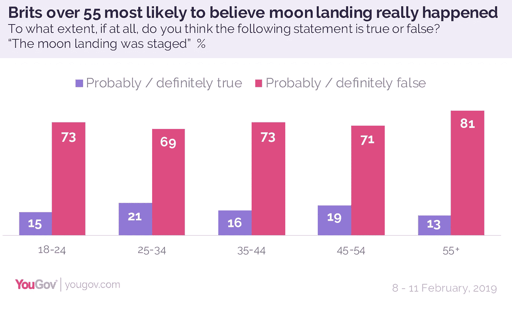
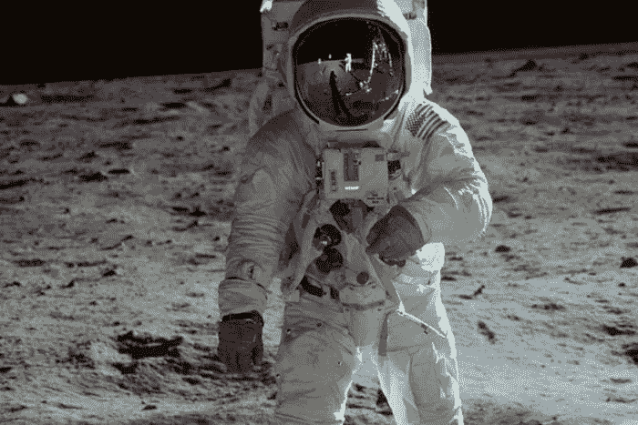
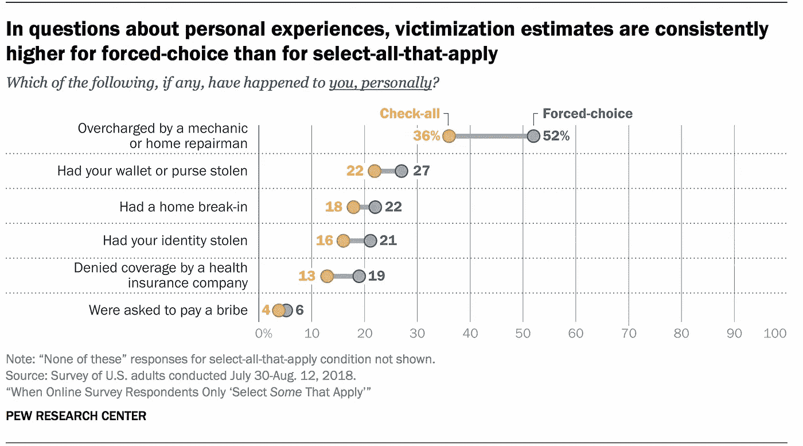

# 回应格式和登月

> 原文：<https://towardsdatascience.com/response-formats-and-the-moon-landing-9423747a2636?source=collection_archive---------32----------------------->

1969 年 7 月，阿波罗 11 号航天飞机发射并让人类登陆月球。五十年后，一些人认为登月并没有真正发生。

这篇文章着眼于两个最近的调查估计，认为登月是伪造的，以及这两个调查之间的差异。

# 真的还是假的？

回到 2019 年 2 月，YouGov 在互联网小组中询问了 2039 名英国成年人，为其与雅虎的播客:

> 如果有的话，你认为下面的陈述是对还是错？
> 
> 登月上演了

人们可以从绝对正确到绝对错误或者他们不知道来回答。调查估计，16%的人认为登月可能(12%)或绝对是真的(4%)是有预谋的。

[几周前](https://capx.co/50-years-on-do-people-really-still-believe-the-moon-landings-were-faked/)，数字分析机构 Politics——它不是[英国民意调查委员会](http://www.britishpollingcouncil.org/)的成员——就几起阴谋询问了 1000 名英国成年人。受访者可以勾选他们认为正确的所有选项。

以前，数字处理器政治混合使用互联网小组和互联网“河流采样”。[河流采样](https://www.cfrinc.net/cfrblog/river-sampling-vs.-panel-sampling-whats-the-difference)包括通过在选定网站上的促销广告邀请人们回答问题。

在调查中，只有 5%的人选择了“1969 年至 1972 年的登月是伪造的，人类没有真正到过月球”。

It has been fifty years since the first Moon landings. (Photo: [ABC News Australia](https://www.abc.net.au/news/2019-07-18/apollo-11-review-documentary-captures-moon-landing-mission/11315242))

那么，到底是 5%还是 16%？

# 差异

在措辞上有一些不同，比较了'伪造'和'上演'，并指明了多次登月的时间。

然而，关键的区别在于响应格式。

在 YouGov 的调查中，人们必须为每个陈述选择一个选项:绝对正确、可能正确、可能错误、绝对错误或不知道。这被称为强制选择格式。

正如文章所暗示的，数字分析政治调查是全选的形式。如果你在网上做过调查，你可能认识这种格式。人们被问到一个问题，可能会从列表中勾选多个选项。

[Pew Research Center](https://www.pewresearch.org/methods/2019/05/09/when-online-survey-respondents-only-select-some-that-apply/) did a randomised experiment comparing the two.

每种格式都有优点和缺点。

选择所有适用问题很简洁，通常只占一个屏幕。强制选择问题占用更多的空间，需要回答者付出更大的努力来滚动或点击每个问题。

然而，全选问题要求回答的人同时考虑所有选项。强迫选择的形式鼓励对每个选项进行更多的思考。

这两种形式都存在问题:默认偏见可能意味着一些人由于受暗示或只是为了通过调查而点击“真”(或“同意”或“是”)选项。在全选问题中，回答满足调查需求意味着人们可能只选择一些适用的。

[皮尤研究中心](https://www.pewresearch.org/methods/2019/05/09/when-online-survey-respondents-only-select-some-that-apply/)进行了一项随机试验，关于负面事件(比如你的身份被盗)的个人经历的问题以两种形式分配。

在所有的问题中，强迫选择的方式比全选的方式产生了更高的估计值，这是一致的。在六个选项中，差异从 2 分(被要求行贿)到 16 分(被多收)不等。两种格式的顺序几乎相同。

# 哪个更好？

虽然全选格式比强制选择格式产生的估计值低，但哪种格式更准确？Callegaro、Murakami、Tepman 和 Henderson 在 2014 年进行的一项[荟萃分析发现，很少有研究涉及这一关键问题，而且没有定论。](https://www.mrs.org.uk/pdf/Callegaro.pdf)

响应格式的变化会产生不同的估计值。需要进一步的调查研究来了解哪种格式更可靠。