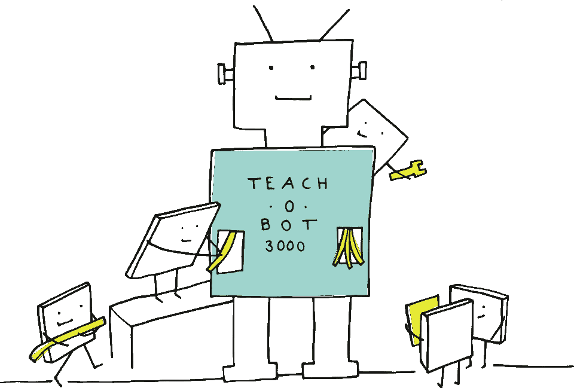
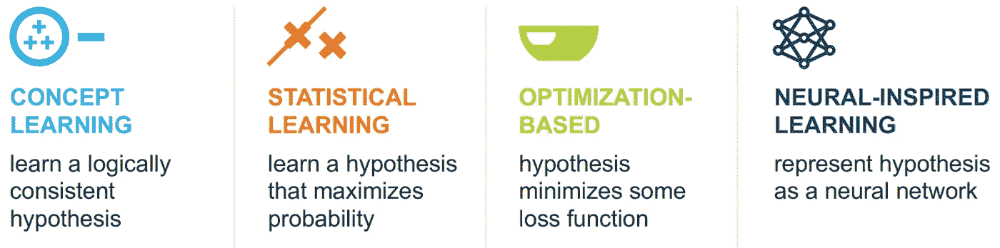
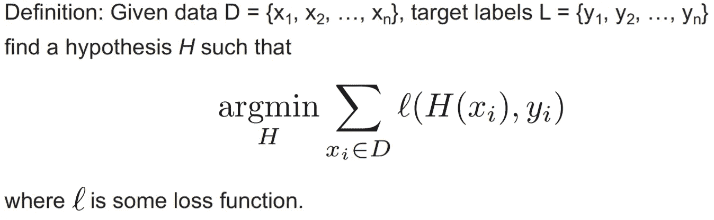
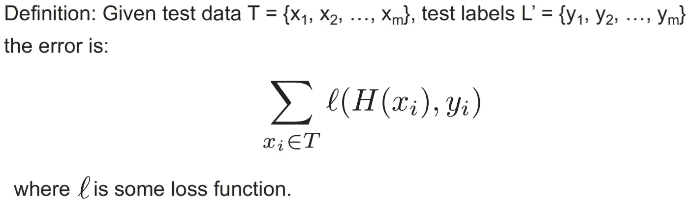
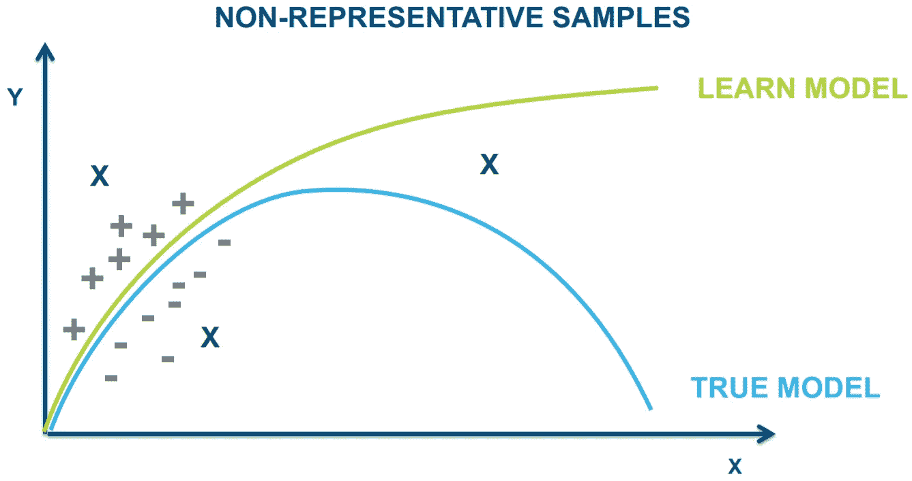
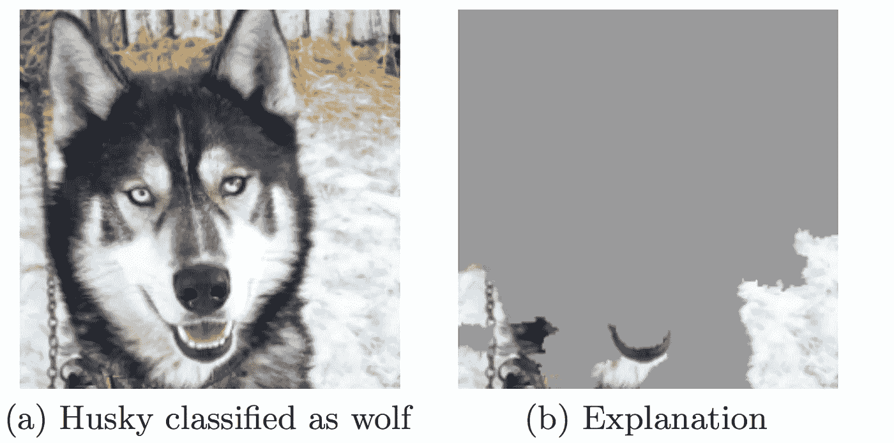

# 数据科学的隐患

> 原文：<https://towardsdatascience.com/responsible-data-science-part-1-1906062fe486?source=collection_archive---------26----------------------->

## Lise Getoor 在 IEEE 大数据大会上的主题演讲笔记

数据科学，机器学习，人工智能。这些都是我们社会出现的流行语。我们越来越依赖这些技术，但这种依赖也引发了我们完全信任这些技术的正当性问题。众所周知，机器学习和深度学习是一个黑箱——我们将数据输入模型，并得出一些我们认为理所当然的结果，而没有真正质疑这些结果是如何获得的，以及这个过程是否合理。这个问题构成了 Lise Getoor 教授在 2019 年 12 月 10 日在洛杉矶举行的 2019 年 IEEE 大数据大会上发表主题演讲的背景，我现在将概述她所做的启发性演讲。

Image by [manfredsteger](https://pixabay.com/users/manfredsteger-1848497/) from [Pixabay](https://pixabay.com/vectors/pixel-cells-techbot-teach-o-bot-3947912/)

## 背景

数据科学越来越多地成为人们关注的焦点，在全世界范围内受到越来越多的关注。但每当我们在新闻中看到数据科学，它大多是为了一些不好的东西。例如，我们许多人都熟悉剑桥分析公司的丑闻，该公司在未经同意的情况下收集了数百万人的脸书个人资料，并将其用于政治广告目的。另一个例子是科学家如何宣称已经创造了一个能够根据面部图像推断犯罪行为的模型。

在主题演讲中，Getoor 教授主要关注机器学习中的负责任的数据科学，我现在将概述一下。

## 机器学习——简介

机器学习经历了几次革命，过去一个世纪出现了几个主题，从概念学习、统计学习、基于优化的学习到深度学习。

Image taken from [IEEE Big Data 2019 Keynote](https://users.soe.ucsc.edu/~getoor/Talks/IEEE-Big-Data-Keynote-2019.pdf). Reposted with permission

概念学习围绕着机器如何学习逻辑上一致的假设，能够正确地标注正负样本。在 20 世纪 80 年代，机器学习转向统计学习，特别是概率方法，重点是学习最大化概率和数据可能性的假设。接下来，机器学习转向基于优化的，例如，支持向量机(SVM)，其中假设最小化一些损失函数。现在我们处于深度学习的神经启发学习时代，它将假设表示为神经网络。

## 培训和测试

本质上，机器学习中训练的目标是最小化目标标签和预测标签之间的损失。这在数学上表述如下:

Image taken from [IEEE Big Data 2019 Keynote](https://users.soe.ucsc.edu/~getoor/Talks/IEEE-Big-Data-Keynote-2019.pdf). Reposted with permission

在测试阶段，对学习的模型进行测试，以确定它能够多好地预测预测的标签。然后，通过目标标签和预测标签之间的损失之和来计算误差，数学公式如下:

Image taken from [IEEE Big Data 2019 Keynote](https://users.soe.ucsc.edu/~getoor/Talks/IEEE-Big-Data-Keynote-2019.pdf). Reposted with permission

这看起来相当简单——训练一个模型来减少损失，你就可以通过计算误差来客观地量化它的性能。

那么可能会出什么问题呢？事实证明很多人。

## 可能出错的事情

总之，Getoor 教授涵盖了 7 个可能出错的问题:问题的形式化，处理高维数据，测量误差，深度学习中的可解释性，因果建模，偏见和数据尊严。这些是问题所在:

## 问题# 1——形式化

似乎提出训练目标很容易，但事实上，每次我们训练一个模型时，我们都在对数据、标签和损失函数做出一些参考框架承诺。

首先，原始数据到特征向量的转换需要我们做出一个参考框架的承诺，因为原始数据总是包含更多的社会和历史背景，而这些背景是特征向量所不能表示的。这意味着每当我们转换原始数据时，我们将会错过人类数据中的许多重要信息。

其次，标签的选择也有问题，因为谁来定义标签？标签只能代表真实数据，而不能真正替代真实数据。

最后，损失函数的选择也很重要，因为不同的损失函数对误差的惩罚是不同的，影响模型性能的因素之间的权衡常常被过分简化并强制拟合到这些损失函数中，而这些损失函数可能并不真正代表任务要求。

因此，需要一些标准来评估所选择的参照系是否合适，标准被称为“结构合理性”，即在输入特征和输出标签之间应该有合理的科学联系。如果不是，无论你的分类器表现得多好，你都应该拒绝这个假设。例如，基于面部图像的犯罪推断无法通过这一测试，因为面部图像(输入特征)和分类(输出标签)之间所谓的“科学联系”根本不科学。相反，它是基于选择图像的方法。实验者可能会手动选择非犯罪图像来传达积极的印象。相比之下，犯罪图像可能既不是由所描绘的个人选择的，也不是为了塑造一个人的正面形象。因此，该模型本质上是一个“微笑探测器”，而据称被发现的联系实际上并不是一个“看似合理的科学联系”。

## 问题#2 —高维数据

机器学习的下一个问题是对数据的巨大依赖，无论是训练还是测试。这个问题出现在高维数据中，因为过度拟合的危险要高得多。随之而来的还有无数的问题:

1.  维数灾难意味着我们的直觉在高维空间中会失效，因此尽管我们在处理低维数据时仍然可以依靠直觉，但我们不能对高维数据做同样的事情。
2.  仅仅由于数据的巨大维度，找到具有预测性但实际上没有相关性的特征的随机子集的可能性很高。
3.  概化所需的样本量随维度成比例增长，因此高维数据所需的样本量呈指数增长。

一个例子是 NSA 如何尝试使用机器学习来预测恐怖分子的手机使用情况。这很成问题，因为他们对每个手机用户使用了 80 个变量，而已知的恐怖分子只有 7 个。当他们试图在野外测试该模型时，最终确定一名报道基地组织的半岛电视台记者是潜在的恐怖分子！这显示了高维数据如何使我们更容易出错，因为对样本大小的要求更高。

## 问题#3 —测量误差

下一个出现的问题是度量模型性能的问题。研究人员总是宣称他们新的最先进的模型已经达到 XX 精度或 F1，等等。然而，这种说法总是带有许多不言而喻的条件，即数据集具有定义明确的总体，训练和测试数据都是总体的代表性样本。然而，这在实践中几乎从未成立。下图很好地说明了这个问题:

Image taken from [IEEE Big Data 2019 Keynote](https://users.soe.ucsc.edu/~getoor/Talks/IEEE-Big-Data-Keynote-2019.pdf). Reposted with permission

上面用绿色表示的学习模型最初可能看起来符合真实模型。然而，在进一步的测试中，很明显，学习的模型实际上并不代表真实的模型。

## 问题#4 —深度学习中的可解释性

在过去的几年里，深度学习中的可解释性受到了越来越多的关注。这一点很重要，因为尽管深度学习模型可能会取得出色的结果，但我们无法确定这些结果是因为模型真的学习了重要的特征，还是因为模型实际上学习了错误的特征，而只是碰巧同一类别的图像的特征保持不变。当错误的特性被改变而重要的特性保持不变时，麻烦就来了。如果模型学习了错误的特征，那么它可能做出错误的预测。

一个例子是里贝罗等人在 2016 年发表的题为“我为什么要相信你”的论文“解释任何分类器的预测”。他们训练了一个模型来对哈士奇和狼进行分类，但结果是对图片背景中的雪和草进行分类。原来，图像中的雪被用来将图像分类为‘狼’，而图像中的草被用来将图像分类为‘哈士奇’。结果，当一只哈士奇以雪为背景拍照时，它被错误地归类为狼。

Image taken from Ribeiro, M. T., Singh, S., & Guestrin, C. (2016, August). " Why should i trust you?" Explaining the predictions of any classifier. In *Proceedings of the 22nd ACM SIGKDD international conference on knowledge discovery and data mining* (pp. 1135-1144).

## 问题# 5——因果建模:相关性与因果性

相关性与因果性的问题是另一个经常讨论的话题，尤其是在统计学中。这个想法是，相关性有助于预测；如果 X 和 Y 是正相关的，那么如果我们观察到一个高的 X，那么我们会期望看到高的 Y。如果 X 和 Y 有因果关系，那么如果我们在保持其他一切不变的情况下操纵 X 的值，那么 Y 的值肯定会改变。将相关性混淆为因果关系的问题在于混杂因素，其中相关性通常是由于一个或多个混杂的潜在变量，这些变量是 X 和 y 的隐藏原因。

例如，看起来好像冰淇淋销量的增加会导致鲨鱼袭击数量的增加。对于外行人来说，销售的增长似乎导致了攻击的增长。然而，实际上有一个混淆因素——天气。这可能是因为炎热的天气导致了冰淇淋销量的上升以及鲨鱼袭击事件的增加(因为天气好，更多的人去了海滩)，冰淇淋销量和鲨鱼袭击事件的增加之间只有相关性而没有因果关系。

## 问题 6——偏见和公平

机器学习中的偏差可以分为三类——数据偏差、自动化偏差和算法歧视。

首先，数据偏差是指数据集的选择。数据集的内容受到许多因素的影响，包括选择偏差、机构偏差和社会偏差。俗话说，垃圾进，垃圾出。如果系统的输入有偏差，那么输出也会有偏差。例如，亚马逊因开发人工智能工具雇佣歧视女性的人而受到抨击。原因很简单——训练集主要包含男性简历，因此模型开始了解到，仅仅根据男性简历的数量，男性会比女性更好。

其次，自动化偏见是指我们人类对自动化决策系统的建议的偏好，并且经常忽略矛盾的信息。我们倾向于相信自动化系统所做的决策，仅仅因为它们是自动化的，而没有额外考虑这些决策的有效性和合理性。当决策者开始将决策责任交给算法时，危险就来了。依靠算法来做出艰难的决定尤其诱人，因此这将影响问责制。

最后，算法歧视是指算法可以放大、操作化并最终合法化制度偏见的现象。当算法使这些偏见合法化时，我们可能会达到这样一个点，即我们不再质疑这些我们过去以怀疑的眼光看待的偏见，而是接受它们。这对我们的社会极其危险。

这就给我们带来了公平的问题。首先，公平是为了谁？不同的度量对不同的利益相关者很重要。例如，法官希望在审判中尽量减少假阴性，而被告希望减少假阳性的可能性，即被错误定罪的可能性。在处理公平和偏见问题时，我们必须始终牢记，公平是一个社会和道德概念，而不是一个统计概念。偏见是主观的，因此必须相对于任务来考虑。

## 问题 7 —数据尊严

这是提出的最后一个问题。数据是新的货币，我们每个人产生的数据都非常有价值。然而，我们的数据经常在未经我们同意和知晓的情况下被滥用，例如在剑桥分析丑闻中。因此，有必要维护数据尊严，即了解和控制您的数据如何被使用的能力。还应该有一个“数据即劳动”的概念，这是使用你的数据获得报酬的能力。这是完全正确的，因为数据是世界的新货币。

## 结论

我们已经对机器学习进行了简要的概述，并且讨论了机器学习可能会出错的七个问题。当我们思考我们如何经常毫无疑问地信任机器学习算法以及这可能对我们的社会产生的影响时，这无疑是值得思考的。

非常感谢 Getoor 教授关于负责任的数据科学的精彩而有见地的主题演讲，这确实很有启发性。