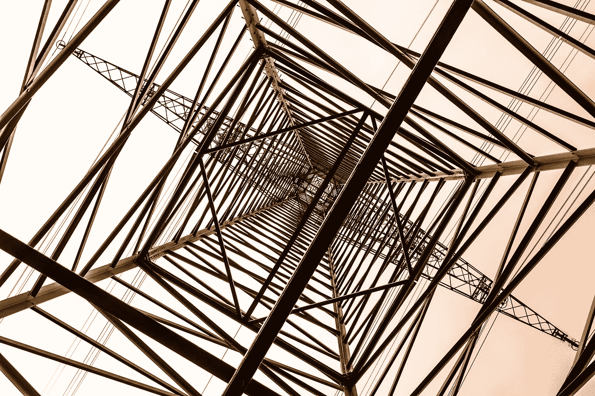
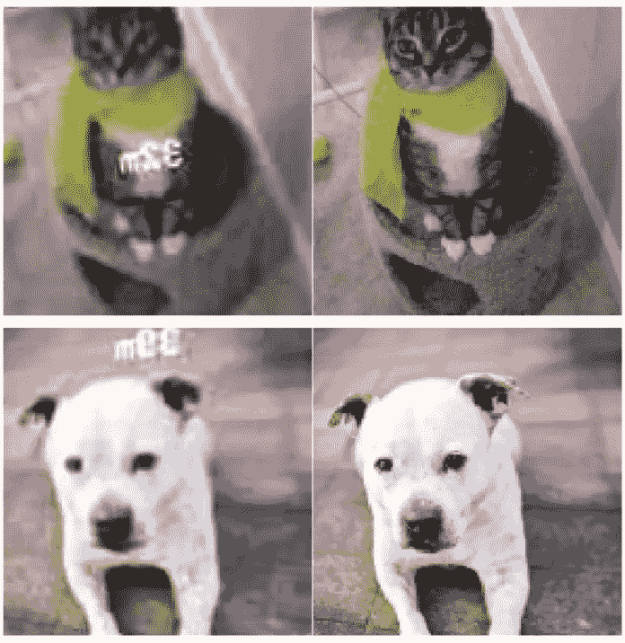
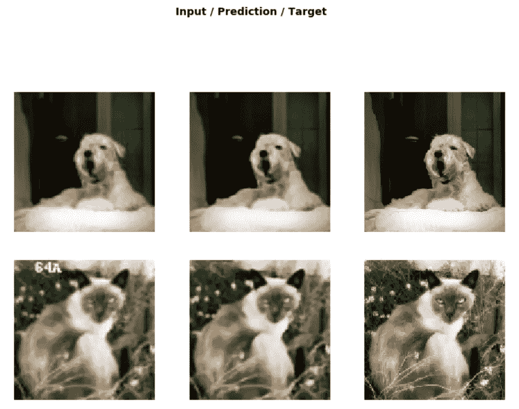
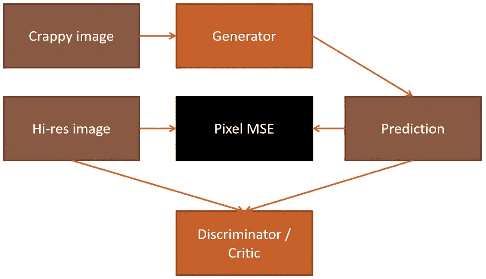
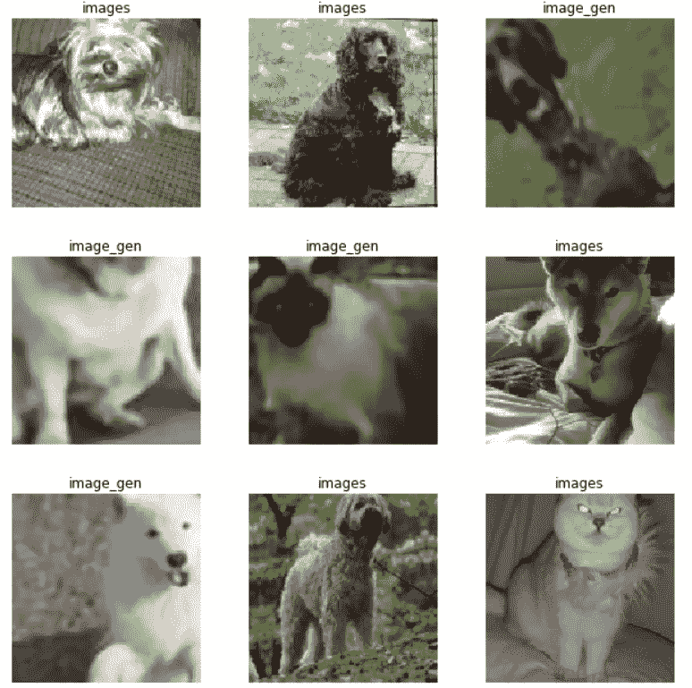
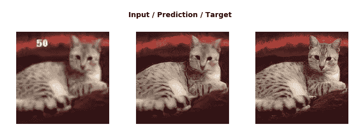

# gan 的恢复收益

> 原文：<https://towardsdatascience.com/restoration-gains-with-gans-faad910c8b66?source=collection_archive---------25----------------------->

在这篇博文中，我将讨论 GANs 以及如何使用它来恢复图像。我将使用 fastai 库进行实践。我建议读者也去探索一下 fastai 。我们开始吧。



Image by [Thomas B.](https://pixabay.com/users/Didgeman-153208/?utm_source=link-attribution&utm_medium=referral&utm_campaign=image&utm_content=4459235) from [Pixabay](https://pixabay.com/?utm_source=link-attribution&utm_medium=referral&utm_campaign=image&utm_content=4459235)

## 什么是图像恢复？

图像恢复是从失真图像中恢复原始图像的过程。图像恢复有多种类型，例如:

*   拍摄低分辨率图像并将其转换为高分辨率图像
*   将黑白图像转换为彩色图像
*   恢复图像的破损部分

还有很多。

让我们来处理第一种，即将图像上带有一些不想要的文本的低分辨率图像转换成高分辨率的清晰图像。我们需要一个图像数据集来恢复，fastai 为我们提供了图像数据集。让我们使用它。

```
import fastai
from fastai.vision import *
from fastai.callbacks import *
from fastai.vision.gan import ***path** = untar_data(URLs.PETS)
**path_hr** = path/'images'
**path_lr** = path/'crappy'
```

**path _ HR**—POSIX path('/root/)。fastai/data/Oxford-iiit-pet/images ')
**path _ lr**—POSIX path('/root/)。fastai/data/Oxford-iiit-pet/crappy’)

现在，我们需要扭曲图像，我们可以创建任何扭曲图像的函数。下面，我将使用一个函数，在这个函数中，我将图像扭曲到低分辨率，上面有文字。让我们来理解一下。

```
from fastai.vision import *
from PIL import Image, ImageDraw, ImageFontclass crappifier(object):
    def __init__(self, path_lr, path_hr):
        **self.path_lr** = path_lr
        **self.path_hr** = path_hrdef __call__(self, fn, i):
        **dest** = self.path_lr/fn.relative_to(self.path_hr)
        dest.parent.mkdir(parents=True, exist_ok=True)
        **img_open** = PIL.Image.open(fn)
        **targ_sz** = resize_to(img_open, 96, use_min=True)
        **img** = img.resize(targ_sz,     resample=PIL.Image.BILINEAR).convert('RGB')
        **w,h** = img.size
        **q** = random.randint(10,70)
        ImageDraw.
          **Draw**(img).
          **text**((random.randint(0,w//2),random.randint(0,h//2)), str(q), fill=(255,255,255))***img.save(dest, quality=q)***
```

*   **dest** —我们正在初始化存储垃圾图像的目标路径。
*   **img_open** —使用 PIL 库打开图像
*   **targ_sz** —初始化蹩脚图像的大小。
*   **img** —调整大小后的图像
*   **w，h** —图像的宽度和高度
*   问——选择任意一个随机数显示在图像上
*   **Draw() —** 在图像上绘制文本。
*   **text() —** 查找要在图像上绘制的文本。第一个参数声明了放置文本的尺寸。第二个参数是显示在图像上的数字。
*   最后，我们将图像保存到目标文件夹，质量为 q。

这就是我们如何复制图像。你可以以任何方式扭曲图像。

> 记住一件事，任何你没有包括在`crappifier()`中的事，模型不会学习去修正它。

```
il = ImageList.from_folder(path_hr)
parallel(crappify, il.items)
```

复制图像的过程可能需要一段时间，但 fast.ai 有一个名为`parallel`的功能。如果你给`parallel`一个函数名和一个运行该函数的列表，它会并行地运行这些函数。所以，会节省很多时间。

## 现在让我们对发电机进行预训练。这是我们处理完数据后通常要做的事情。

```
**bs,size** = 32, 128
**arch** = models.resnet34
**src** = ImageImageList.from_folder(path_lr).split_by_rand_pct(0.1, seed=42)def get_data(bs,size):
    **data** = (src.**label_from_func**(lambda x: path_hr/x.name)
               .**transform**(get_transforms(max_zoom=2.), size=size, tfm_y=True)
               .**databunch**(bs=bs).normalize(imagenet_stats, do_y=True))

**return data**
```

让我们将 get_data()用于预处理的图像数据集。

```
data_gen = **get_data**(bs,size)
data_gen.**show_batch**(2)
```



现在，我们已经创建了数据群，我们必须使用这个数据群来创建学习者。

在这里，我希望读者了解 UNets 以及我们为什么使用它们。如果你对此知之甚少或一无所知，请参考这里的。

我们所做的是通过学习原始图像来恢复图像，而恢复就是 UNet 所执行的。我们需要通过 UNet，我们的数据。让我们利用 UNets，建立对 GANs 的需求。

获得给我们的只是来自不同文件夹的图像列表，按照要求进行了标准化和转换。现在，我们在标准化方法`normalize(imagenet_stats, do_y=True)`中使用上面的 ImageNet 统计数据，因为我们将使用预训练模型。现在，我们为什么要使用预训练模型呢？我们想恢复扭曲的图像。使用至少了解动物(不是全部，而是很多)的模型来训练模型总是比使用对动物一无所知的东西来训练模型更好。此外，我们希望恢复图像，即从图像中移除我们的模型通常应该移除的不需要的文本。

> 一个建议是，迁移学习对几乎所有类型的计算机视觉问题都有帮助。

让我们声明参数。

```
wd = 1e-3
y_range = (-3.,3.)
loss_gen = MSELossFlat()def **create_gen_learner**():
    return **unet_learner**(**data_gen**,
                        **arch**, **wd**=wd,
                        **blur**=True,
                        **norm_type**=NormType.Weight,
                        **self_attention**=True,
                        **y_range**=y_range,
                        **loss_func**=loss_gen)**learn_gen** = create_gen_learner()
```

*   `wd` —描述正则化的模型的权重衰减。
*   `y_range` —这是应用于上一步获得的激活的 sigmoid 函数。这些值是为这类问题定义的。
*   `loss_gen` —定义了损失函数。由于我们是从原始图像恢复，因此我们需要将输出与原始图像进行比较，MSE loss 非常适合它。MSE 损耗基本上是在两个输入向量之间寻找损耗。在我们的例子中，输入是图像。因此，我们需要在将图像放入损失函数之前对其进行展平。`MSELossFlat()`基本上做同样的事情。
*   如果你想了解更多，在这里学习[。](https://docs.fast.ai/vision.models.unet.html#DynamicUnet)

因此，我们使用预定义和预训练的模型 ResNet34 创建了 UNet 学习器。这整个过程被称为 ***生成学习，*** 我们使用 unet 学习器生成图像。这不是确切的定义，而是更广泛的定义。现在让我们来拟合这个模型。

```
learn_gen.fit_one_cycle(2, pct_start=0.8)
```

*   `pct_start` —代表单个历元内的迭代次数，学习率将上升，学习率将下降的迭代次数。让我们只用上面的例子来理解它。

假设每个时期的迭代次数= 100
每个时期学习率增加的迭代次数= (100 * 1) * 0.8 = 80
学习率减少的迭代次数= 100–80 = 20

模型的上述拟合发生在 UNet 部分，即 UNet 的 ResNet 部分中的编码器冻结的情况下。但是，由于我们使用的是迁移学习，所以我们可以解冻 UNet 的预训练部分(**)U-Net 的预训练部分是下采样部分。ResNet 就在那里。**

```
learn_gen.unfreeze()learn_gen.fit_one_cycle(3, slice(1e-6,1e-3))**learn_gen.show_results(rows=2)**
```



*   我们已经获得了一个较好的预测模型。我们的图像越快越不清晰是由于损失函数。我们使用的是 MSE 损失，即获得的图像和实际图像之间的像素差异非常小。如果删除文本是唯一的任务，那么我们已经实现了我们的目标。但是，我们也在努力提高图像分辨率。
*   基本上，该模型在上采样中表现出色，但在下采样中表现不佳。
*   我们要改进的只是损失函数。一个更好的损失函数会给我们更好的结果。这就是神经网络的定义。这就确立了对 GANs 的需求。

# 生成对抗网络



image source — fastai

让我们理解 gan 背后的语义。

*   到目前为止，我们有一个模型，它适度地预测了与原始图像没有太大差别的图像。按照上面的图片，我们已经创建了蹩脚的图片，并且生成器也没有生成如此糟糕的图片。然后，我们使用像素 MSE 来比较预测图像和高分辨率图像。
*   想象一下，如果我们能得到一些东西，而不是比较图像之间的像素，实际上将预测图像分类在高分辨率图像和低分辨率图像之间。如果我们可以欺骗二进制分类器，让它开始将生成的图像分类到高分辨率图像，那就更有趣了。
*   一旦我们开始愚弄分类器，那么我们将训练分类器更多地预测图像的实际类别，即如果图像是生成的，那么它应该正确地预测它，如果图像是高分辨率图像，那么它应该预测它是高分辨率图像。
*   一旦分类器训练正确地预测预测图像的类别，这意味着我们不能再欺骗分类器。在这种情况下，我们将进一步训练生成器，使其能够生成更接近高分辨率图像的图像。一旦我们训练了足够多的生成器，我们就可以再次欺骗分类器。
*   一次，我们再次开始愚弄分类器，这次我们将开始更多地训练分类器。这个训练生成器和分类器的过程实际上越来越多地归结为 GANs。
*   因此，基本上，GANs 中的损失函数调用了我们的另一个模型，而这个模型本身已经达到了最先进的结果。所有的博弈都是为了得到越来越好的损失函数。

# 相信我！这都是干的。

我们已经创建了生成器。现在让我们创建分类器。但是在我们创建分类器之前，我们需要将我们的预测存储在某个地方，因为我们需要在预测图像和高分辨率图像之间进行分类。所以，让我们把预测的图像存储在某个地方。

```
name_gen = 'image_gen'
path_gen = path/name_genpath_gen.mkdir(exist_ok=True)
```

*   我们已经创建了一个路径`PosixPath(‘/root/.fastai/data/oxford-iiit-pet/image_gen’)]`,用于存储生成的图像。
*   我们已经有了存储高分辨率图像的路径`PosixPath(‘/root/.fastai/data/oxford-iiit-pet/images’)`。

```
def save_preds(dl):
    i=0
    names = dl.dataset.items

    for b in dl:
        preds = learn_gen.pred_batch(batch=b, reconstruct=True)
        for o in preds:
            o.save(path_gen/names[i].name)
            i += 1save_preds(data_gen.fix_dl)
```

*   我们已将预测保存在文件夹中。
*   `data_gen.fix_dl`将生成固定大小的数据加载器。
*   然后，我们迭代数据加载器，提取特定大小的数据，并将其传递给`pred_batch`进行预测。
*   然后，我们将预测的图像存储到图像名称下的文件夹中。

现在，我们需要编码分类器。如果您需要了解更多关于分类器的信息，请阅读此处的。

```
def **get_crit_data**(classes, bs, size):
    **src** = ImageList.**from_folder**(path, include=classes)
                   .**split_by_rand_pct**(0.1, seed=42)
    **ll** = src.**label_from_folder**(classes=classes)
    **data** = (ll.**transform**(get_transforms(max_zoom=2.), size=size)
              .**databunch**(bs=bs).normalize(imagenet_stats))
    return **data**data_crit = **get_crit_data**([name_gen, 'images'], bs=bs, size=size)
```

*   `from_folder` —从位于`path`的文件夹中提取图像。我们希望只包含那些名称在`include=classes`中提到的文件夹的数据。
*   `label_from_folder` —使用基本上是文件夹名称本身的类来标记图像。
*   然后，我们转换数据，创建数据串，最后将数据标准化。

```
data_crit.show_batch(rows=3, ds_type=DatasetType.Train, imgsize=3)
```



让我们为分类器定义学习者。

```
loss_critic = AdaptiveLoss(nn.BCEWithLogitsLoss())def **create_critic_learner**(data, metrics):
    return **Learner**(data, gan_critic(), metrics=metrics, loss_func=loss_critic, wd=wd)learn_critic = **create_critic_learner**(data_crit, accuracy_thresh_expand)
```

*   如果你说`gan_critic`，fast.ai 会给你一个适合 GANs 的二元分类器。
*   因为我们有稍微不同的架构和稍微不同的损失函数，所以我们做了稍微不同的度量。`accuracy_thresh_expand`是相当于甘版的准确性对于评论家来说。
*   最后，我们调用`create_critic_learner`来为 GANs 创建学习器。Fastai 数据块 API 有利于创建学习者。

```
learn_critic.fit_one_cycle(6, 1e-3)
```

*   现在，我们有一个学习者，他非常擅长区分预测图像和高分辨率图像。
*   这也是预测的行为，因为我们已经有图像很好的区分。

现在，我们有了一个生成器、分类器/评论家。让我们转到这一节的最后一部分。

## 完成 GAN

```
learn_crit=None
learn_gen=None**data_crit** = **get_crit_data**(['crappy', 'images'], bs=bs, size=size)**learn_crit** = **create_critic_learner**(data_crit, metrics=None).load('critic-pre2')**learn_gen** = **create_gen_learner**().load('gen-pre2')
```

*   既然我们已经预先训练了发生器和批评家，我们现在需要让它在两者之间进行乒乓式的训练。
*   你在每一件事情上花费的时间和你使用的学习率仍然有点模糊，所以 fastai 提供了一个`GANLearner`，你只需传入你的生成器和你的批评家(我们刚刚从我们刚刚训练的生成器和批评家中加载的)它就会继续前进
*   当你进入`learn.fit`时，它会为你做这件事——它会计算出训练生成器需要多少时间，然后什么时候切换到训练鉴别器/批评家，它会前后移动。

```
**switcher** = **partial**(AdaptiveGANSwitcher, critic_thresh=0.65)
learn = **GANLearner**.from_learners(**learn_gen**, 
                                 **learn_crit**, 
                                 **weights_gen**=(1.,50.),        
                                 **show_img**=False, 
                                 **switcher**=switcher,    
                                 **opt_func**=partial(optim.Adam, betas=(0.,0.99)), wd=wd)**learn.callback_fns.append(partial(GANDiscriminativeLR, mult_lr=5.))**
```

*   甘人讨厌你训练他们时的冲劲。用动力训练他们是没有意义的，因为你一直在发电机和批评家之间切换，所以这有点困难。所以这个数字(`betas=(0.,...)`)当你创建一个亚当优化器的时候，就是动量去的地方，所以你应该把它设置为零。
*   基本上，上面定义的超参数通常适用于 GAns。每个 GAN 问题都可能用到这些参数。

```
lr = 1e-4
learn.fit(40,lr)
```

*   随着生成器变得更好，鉴别器(即批评家)变得更难，然后随着批评家变得更好，生成器变得更难。训练甘的困难之一是很难知道他们做得怎么样。了解他们做得如何的唯一方法是不时地看一看结果。
*   如果你把`show_img=True`放入 **GANLearner，**然后它实际上会在每个历元后打印出一个样本。

做完这些，你可以检查下面的结果。

```
learn.show_results(rows=1)
```



最后，您可以将以前的结果与现在的结果进行比较。这就是甘斯发挥作用的地方。

## GANs 的缺点

我们使用了一个 critic，它没有使用任何预先训练好的模型，比如 ResNet34，而是使用了 gan_critic()。因此，我们需要一个预训练的分类器模型，它不仅在 ResNet34 上训练，而且与 GANs 兼容。

这是我对甘斯的看法。感谢阅读，并继续探索 fastai。