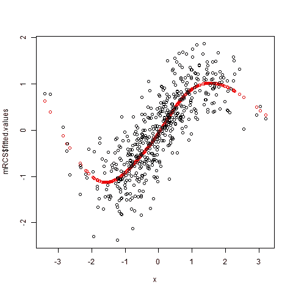
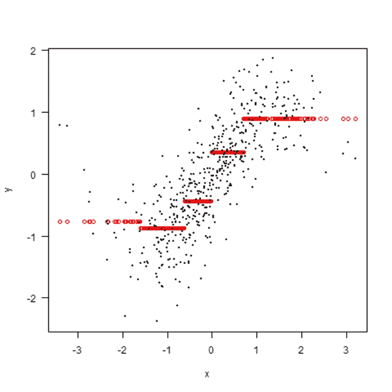
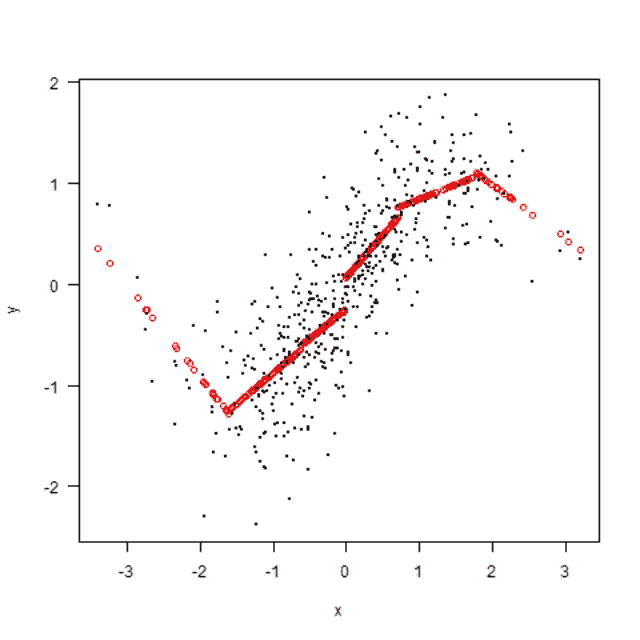
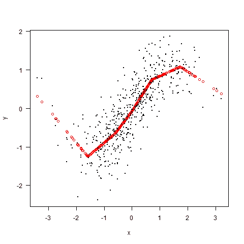
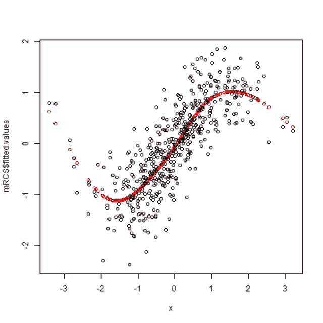

# 受限三次样条

> 原文：<https://towardsdatascience.com/restricted-cubic-splines-c0617b07b9a5?source=collection_archive---------9----------------------->

## 拟合回归线的一种灵活方法



*样条*是一种用于绘制曲线的绘图工具。在统计学中，样条是变换变量的一大类方法。我首先通过线性样条来介绍这个概念，然后用我的方法来介绍我(和许多其他人)推荐的受限三次样条。你应该知道有大量不同的样条，每一种都有其支持者。途径如下:

1.虚拟变量

2.无限制线性样条

3.受限线性样条

4.受限三次样条

在[的一篇早期文章中，我向](https://medium.com/@peterflom/what-happens-when-we-categorize-an-independent-variable-in-regression-77d4c5862b6c)展示了分类(虚拟变量方法)不是一个好方法。它有两个基本问题:关系在每个段内是平坦的，而在段之间是跳跃的。在样条术语中，让一条曲线跳跃被称为“无限制的”。第二步消除了平坦性(但是给我们留下了跳跃的直线)。第三步去掉跳跃(但保留直线)。第 4 步让每个部分的关系曲线。结果是一个非常灵活的曲线，没有跳跃。受限三次样条(RCS)有许多优点，但是它们有一个很大的缺点:结果输出并不总是容易解释。

样条的两个方面，我们还没有触及的是允许的结的数量以及如何放置它们。已经提出了各种建议，但 Frank Harrell 建议，如果 N < 100，则使用 4 个结，对于较大的数据集，使用 5 个结，对于 k = 4，将它们放置在第 5、35、65 和 95 个百分点，对于 k = 5，将它们放置在第 5、27.5、50、72.5 和 95 个百分点(其中 k 是结的数量)。

举例来说，这一切可能会更清楚。为了比较，我将从正弦回归开始(就像我以前的帖子一样)，我们应该遵循上面关于虚拟变量图的结的建议。这会产生:



第一步是允许每条线之间的斜率不为零。有些混乱的代码(该死的吉姆，我是数据分析师，不是程序员！)是:

```
mUnresLin1 <- lm(y~x, subset = (x6int == 1))
  mUnresLin2 <- lm(y~x, subset = (x6int == 2))
  mUnresLin3 <- lm(y~x, subset = (x6int == 3))
  mUnresLin4 <- lm(y~x, subset = (x6int == 4))
  mUnresLin5 <- lm(y~x, subset = (x6int == 5))
  mUnresLin6 <- lm(y~x, subset = (x6int == 6))

  plot(x[x6int == 1],mUnresLin1$fitted.values, 
       las = 1,
       xlab = "x",
       ylab = "y",
       col = "red",
       xlim = c(min(x),max(x)),
       ylim = c(min(y),max(y)))

  points(x[x6int == 2],mUnresLin2$fitted.values, 
        col = "red")

  points(x[x6int == 3],mUnresLin3$fitted.values, 
         col = "red")

  points(x[x6int == 4],mUnresLin4$fitted.values, 
         col = "red")

  points(x[x6int == 5],mUnresLin5$fitted.values, 
         col = "red")

  points(x[x6int == 6],mUnresLin6$fitted.values, 
         col = "red")

  points(x,y, pch  = 20, cex = .5)
```

这产生了



这已经是一个重大的改进，但是有跳跃(其中一个相当大)和方向的突然转变，这可能与早期模型中的跳跃一样难以证明。

接下来，我们可以用一个受限的线性样条来强制这些线匹配。这里已经有一个 R 函数，所以代码很简单:

```
install.packages("lspline")
  library(lspline)

mlinspline <- lm(y ~ lspline(x, quantile(x, c(0, .05, .275, .5, .775, .95, 1),
                             include.lowest = TRUE))) plot(x,mlinspline$fitted.values, 
     las = 1,
     xlab = "x",
     ylab = "y",
     col = "red",
     xlim = c(min(x),max(x)),
     ylim = c(min(y),max(y)))points(x,y, pch  = 20, cex = .5)
```

这会产生:



最后一步是让每一段内的线条弯曲。我们可以用受限制的三次样条来做到这一点；同样，有一个 R 包使这变得容易。

```
library(Hmisc)
library(rms)mRCS <- ols(y~rcs(x, quantile(x, c(0, .05, .275, .5, .775, .95, 1),
                              include.lowest = TRUE)))plot(x,mRCS$fitted.values,
     col = "red",
     xlim = c(min(x),max(x)),
     ylim = c(min(y),max(y)))points(x,y)
```

它产生:



这与原始正弦曲线非常匹配。