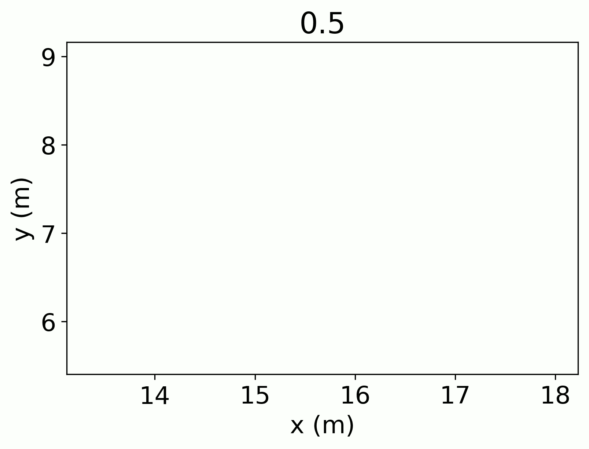

# 零售路径:使用空间数据提升零售

> 原文：<https://towardsdatascience.com/retailtrails-4724d1f12a2f?source=collection_archive---------32----------------------->

在实体零售业的世界里，获得竞争优势依赖于产品和商店管理。正确的轮班管理需要详细了解商店的占用率、顾客在商店中的时间和空间数量。历史上，商店会通过付钱给一名员工站在外面统计进出商店的顾客数量来收集入住数据。技术已经进步，现在商店可以在商店入口和出口安装定制摄像头，并自动统计顾客人数。不幸的是，安装这些摄像机仍然成本高昂。更糟糕的是，随着时间的推移，错过的顾客进出造成的误差会越来越大，使得计数变得不准确。下一代商店入住模型方法的时机已经成熟。

为了我的洞察数据科学项目，我咨询了商店大脑(BotS)。BotS 希望通过使用计算机视觉(CV)实时跟踪客户，为实体零售带来实时人工智能。大多数零售商店已经安装了监控摄像头来监视整个商店。BotS 通过与一家公司合作，分析商店员工和顾客的实时跟踪数据，该公司通过 CV 算法传递预先存在的监控摄像头镜头。合作公司输出链接到时间戳的坐标数据(x，y ),我在这篇文章中称之为轨迹。然后，机器人使用这些轨迹来建立商店占用的空间和时间模型。

我的目标是修复计算机视觉过程中产生的一些错误。CV 的第一个也是最明显的错误是轨迹不稳定。一个明显的例子是有人走在柱子后面(相对于摄像机视图)。当他们走在柱子后面时，他们不再被 CV 识别，当他们再次出现时，他们被给予一个新的识别号。虽然这可能不会对整体占用产生影响，但在项目的第二部分，单个轨道的长度变得很重要，特别是当两个摄像机两次识别同一个人时。

多重标识问题需要多一点解释。许多商店使用重叠覆盖的多个摄像机来获得完整的商店覆盖。如果一个人同时走过两个摄像头的视野，那么我们的 CV 数据集将会有重复的轨迹，从而夸大了对入住率的最终估计。

**原入住模式**

在深入研究我的项目之前，我想先做好准备，讨论一下原始的居住模型是什么样子的。所有这些数据都是从加利福尼亚的一家化妆品商店收集来的。

首先，为了理解 CV 对商店占有率的估计有多准确，我需要商店占有率的真实值。机器人从用于轨道建设的原始监控摄像机镜头中构建了这个真实值，并以 10 分钟为间隔计算商店中的人数。

The store opened at 9:00am and there seem to be clear signals of increased occupancy around 11am and after work around 6:00pm. With fluctuating signals throughout the rest of the day.

然后，机器人数据科学家之一单独创建了原始计算机视觉数据的占用时间序列模型。

The raw CV model plotted against the ground truth data

从上图中我们可以看出，原始 CV 模型在某些区域低估了入住率，而在其他区域高估了入住率。该模型的召回率和准确率分别为 0.793 和 0.793。我开始使用算法方法来提高这个模型的精确度和召回率。我希望我的算法可以通过移除重复的轨迹来减少假阳性，并通过在以前不存在轨迹的时间段(由于轨迹不稳定)将轨迹缝合在一起来减少假阴性。

**一针及时**

为了找出哪些曲目要缝合在一起，我对每个可能的曲目进行了成对比较。在开始解释之前，我需要定义两个术语:焦点轨迹和比较轨迹。焦点轨迹是我们两两比较的第一个轨迹，也是正在结束的轨迹。比较轨迹是我与焦点轨迹进行“比较”的轨迹。比较音轨是第二音轨，也就是开始的音轨。我的总体计划是将焦点轨迹的终点与一个(或多个)比较轨迹的起点进行比较。然而，我使用的 10 小时数据集足够大，导致一些计算问题。我不能只比较每首歌的结尾和起点，因为 30，776 首歌有超过 9 亿种可能的组合！

相反，我开始收集可能的候选曲目。首先，我加入了一个时间参数，该参数决定了任何在焦点轨迹之后超过 1s 才开始的轨迹都将被延迟太久，以至于无法匹配拼接。然后对于每个候选轨迹，我计算了焦点轨迹的最后一点和候选轨迹的第一点之间的距离。然后，我通过包括 0.6 米的最大距离参数来进一步细分数据，因为 76%的候选轨迹距离焦点轨迹不到 0.6 米。最后，我在做比较时结合了焦轨的一些特征。我计算了过去 5 秒内焦点轨迹的平均速度，然后估计了在焦点轨迹和候选轨迹之间的时间间隔内平均速度可能行进的距离。虽然有人可能会迅速改变他们的平均速度(想象一下从随意浏览清仓区到跑过商店)，但这种可能性很小。

在使用上述过程缩减潜在候选数据集后，我对每个焦点/候选轨迹对进行了成对比较。对于每一对，我计算了焦点轨迹的最后一点和候选轨迹的第一点之间的时空距离。时空距离听起来像一个奇特的概念，但实际上它是一个三维距离公式，第三维是时间。

Equation 1: Spacetime distance formula given the differences in x-coordinates (x), y-coordinates (y) and time (t)

使用这个公式的优点是，它对更长的距离和更长的时间间隔都不利。任何使时空距离最小化的轨迹都被认为是最终的候选轨迹。一旦我有了最终候选轨迹，我就从焦点轨迹的最后一点线性插值到最终候选轨迹的第一点。然后我给所有的音轨分配了和焦点音轨相同的 ID。

Two tracks that I identified as belonging to the same track and identified for future stitching. The green track is the focal track and the blue track is the candidate track.

**复视**

一旦我把这些轨迹拼接在一起，我需要解决多重识别的问题。与 BotS 合作的化妆品店客户在店里安装了四个摄像头。这意味着每个人在数据集中最多可能被识别 4 次！

为了解决这个问题，我使用了另一种侧重于距离的方法。像拼接问题一样，我首先需要减少潜在的比较。

第一步是找出哪些轨迹在时间上重叠，因为我只对同时的共同识别感兴趣。然后，我通过只检查来自不同摄像机的轨迹来进一步细分数据。考虑来自同一个摄像机的两条轨迹。即使这两个轨迹非常接近，也完全有可能每个轨迹都是一个独特的人，例如，一个母亲和一个孩子会在同一个摄像机中显示为两个非常接近的轨迹。两条非常接近但来自不同摄像机的轨迹实际上不太可能是唯一的个体。

对于从不同相机拍摄的每个重叠轨迹，我计算了焦点轨迹和比较轨迹中每个重叠点之间的欧几里德距离。然后我计算了两条轨道的平均距离。我认为平均距离不超过 0.8 米的比较轨迹相当于焦点轨迹。我估计这个距离是不同相机之间的近似投影误差。

Three tracks that have an average distance of less than 0.8m along their overlap in time

一个以上的重叠轨道可以被标记为相同的，当这种情况下，我设置一个决策规则来选择最长的轨道。虽然我们可能会丢失其他轨迹的一些信息，但最长的轨迹将拥有占用模型所需的最大信息。

**对比入住模型**

这些处理步骤产生了什么影响？回想一下，BotS 最终感兴趣的是为这家化妆品店构建一个入住时间序列模型。

我通过对以地面真实时间点为中心的 5 分钟窗口内的轨迹数量求和，计算了数据集中每个时间点的商店预期占用率。

Time series of ground truth (blue), raw CV data (orange), and my processed output (green).

相对于原始的计算机视觉模型，找出我的加工输出的准确趋势有点困难。所以我也画出了两者之间的差异。

Time series of the difference between the calculated occupancy from the ground truth. Positive values represent areas where the models overpredicted, negative values represent underprediction.

在这里，我可以更清楚地看到与原始 CV 占用模型相比，我的处理模型的影响。相对于真实情况，原始输出倾向于低估，而我的处理模型倾向于高估。这个结果体现在我的模型的精度和召回率上，分别是 0.734 和 0.834。因此，虽然我在模型中减少了假阴性的发生率，但却增加了假阳性的发生率。因此，我认为对机器人来说，最好的方法是使用原始 CV 输出和我处理过的模型创建一个集合预测模型。通过这样做，我的模型更可能高估的区域将被原始模型更可能低估的区域所平衡，反之亦然。

**接下来的步骤**

我的算法中内置了一些参数，我可以在其中进行一些优化。在拼接步骤期间，可以通过找到局部稳定区域来优化作为数据集子集的各种参数，在局部稳定区域中，参数的增加/减少对找到的匹配数量没有影响。然而，优化这个参数将是一个耗时的过程，因此只能在增加计算能力之后才能完成。更有可能的优化候选是在多重识别步骤期间。在这种情况下，调整最大距离参数或者改变用于比较的时间阈值都是相对便宜的，并且可以针对候选匹配的数量没有局部变化的参数进行优化。

除了优化我的算法，我认为随着这个数据集的发展，还有很多非常有趣的分析可以完成。例如，机器人可以获取经过处理的数据集，并检查每个轨迹的特征，以自动识别员工和客户。理论上，员工的轨迹特征(速度、点与点之间的方向)会有所不同。顾客更有可能有一条在商店里游荡的轨迹，而雇员更有可能做定向运动，或者长时间保持静止(例如收银员)。

不管接下来的步骤是什么，采用我处理过的模型并开发一个更准确的商店占用率模型，将不仅为机器人，而且为许多实体零售店提供真正的价值。