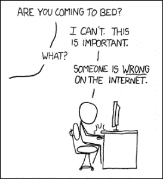
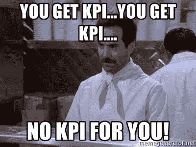
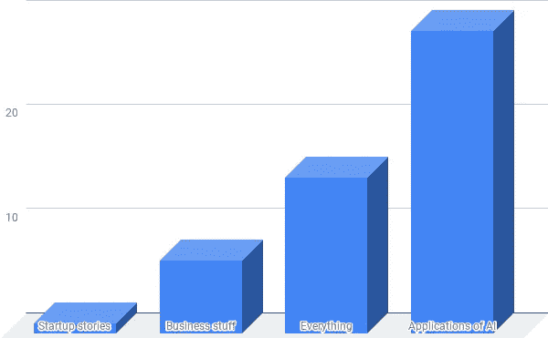

# 人工智能咨询中的预聘协议

> 原文：<https://towardsdatascience.com/retainer-agreements-in-ai-consulting-f970f6933975?source=collection_archive---------14----------------------->

## 预聘服务是微妙但有用的

谷歌对预聘的定义是“预付给某人，尤其是律师的费用，以便在需要时获得或保留他们的服务。”在本文中，你将深入了解人工智能顾问如何考虑增加固定客户，而不是参与更标准的、有明确范围和持续时间的企业项目。

已经有一些很棒的文章介绍如何选择你作为顾问的时薪，我不会在这里重复。相反，我将专注于如何将引导和机会阶段的初始对话转变为客户维系或更标准的计时/固定费用项目。我认为，预聘是一种关系状态，而不是一种产品。

From [this link](https://xkcd.com/386/)

预聘谈话往往发生在一些初始项目之后，而不是第一天。原因很简单。在聘请顾问成为客户的一个重要选择之前，顾问真的需要在这种关系上投资。仅仅基于承包商的声誉签署聘用合同的风险太高了。

考虑到不同潜在客户的[产品市场适合度](https://en.wikipedia.org/wiki/Product/market_fit)是不同的，这是很有用的。鉴于人工智能咨询是一项服务业务，客户需要使服务符合他们的需求，承包商也需要确保他们处于良好的状态。

我喜欢把这个在聘用和定期聘用之间的决定看作是一个通用的服务行业难题，而不是人工智能行业特有的情况。让我们假设 AI 咨询是搜索引擎优化(SEO)，一个聘约是 SEO 月费咨询，而开发的按小时或固定价格工作是标准工作([示例此处](https://www.rankpay.com/seo-cost/))。在这个类比中，客户每月向你支付 SEO 服务的佣金，因为你交付的是他们按月衡量的工作单位，比如流量、排名和销售额。此外，请注意，这是一个持续的努力，不会结束。没有所谓的“我们已经完成了搜索引擎优化”这个月费不是专业服务的小时，而是基于性能。另一方面，按小时或按天计费的东西，无论是人工智能、网络开发还是搜索引擎优化，都有固定的可交付成果，公司倾向于外包并支付费用，然后在内部管理。

From [this link](https://memegenerator.net/instance/63227501/soup-nazi-you-get-kpiyou-get-kpi-no-kpi-for-you)

这个*内在与外在*的思考过程让我想到了关于固定器的下一个观点。优秀的经理总是在进行“建造还是购买”的计算。在提案/RFP 阶段，经理正在考虑满足某些要求或改进某些 KPI，或解决某些棘手问题。正是在这个时候，他们考虑使用内部或外部资源。我们获得交易的原因是因为客户选择了购买而不是建造(除了一些例外，我将跳过，如培训和战略咨询和顾问委员会)。当一家公司考虑聘用协议时，同样的“建造与购买”思维过程也会发生。经理会考虑雇佣一个资源来填补职位空缺的成本和雇佣一个顾问来构建东西的成本。

有些客户就是不喜欢保持器。例如，根据我的经验，政府会保留[供应商](https://buyandsell.gc.ca/for-businesses/selling-to-the-government-of-canada/register-as-a-supplier)和[供应商名单](http://logiciels-software.tpsgc-pwgsc.gc.ca/index-eng.cfm)或[专业服务合同](https://www.tpsgc-pwgsc.gc.ca/app-acq/sp-ps/index-eng.html)，但通常不会指名道姓。我想这在高端法律工作和政治等其他领域是不同的，但在高端高科技领域，就我所见，这不是政府的事情。然而，这并不意味着政府不做家臣。相反，他们称之为固定成本的咨询服务。包括政府部门在内的一些客户可能有固定的小时工，这是无法确定的，而且他们还被分配了固定的年度或季度预算。在这种情况下，他们可能会聘请一名顾问，每年/每季度花 Y 小时做 X 量的工作。这是一个固定价格的项目，而不是预聘。不过，行话并不重要。事情就是这样。

From [this link](http://www.quickmeme.com/meme/35s6g3)

一些客户更喜欢聘请顾问，因为他们期望在一个项目或一个部门中有不均衡的工作量，而他们确实需要做得更好。想想药物或[医疗设备开发](https://www.ecnmag.com/blog/2015/09/beginners-guide-iso-14971-medical-device-risk-management)(大量的断断续续，遵循瀑布模型)，或者安排一名顾问为现有的数据科学团队增加投入。

回头客对顾问来说是好事，因为它提供了更稳定的收入，对客户来说也是如此，因为他们不必不断地接触陌生人。有一些常见的安全问题会导致测试顾问可靠性的内部流程，避免一次又一次地这样做对客户有利。一个成功的聘请为双方提供了一些额外的好处。然而，如果每月聘用的价格太高，公司就简单地将工作安排到一个新的位置(如果他们可以的话)，如果聘用的小时费率太低，那么顾问就简单地退出全价小时聘用。让我们深入研究一下这些数字，让您更具体地了解它是如何工作的。

对于咨询服务，我们收取 250 美元/小时或 2000 美元/天的费用。更多信息请点击。因此，10K/月 5 天/月的预聘听起来很聪明，但该公司也可以以 10K/月= 12 万/年的价格雇用一名员工来支付工资和福利，并获得一名全职员工而不是顾问。老实说，新员工和顾问一样容易被解雇，所以顾问需要从几个方面证明这种关系对公司来说是值得的。

**第一:质量。**咨询师牛逼。太棒了，以至于一个“普通”员工都无法增加同样的优秀、产出和洞察力。只有当关系增加了高质量时，保留才有意义。这是参加顾问委员会或参与管理规划会议的常见原因。有时(不总是)公司想宣传他们在和你合作。这基本上是顾问的免费营销，和公司的战略营销。其他时候有一英里长的 NDA 保持关系的秘密。

**第二:价值。**5 天的咨询提供的价值超过普通人 20 天的价值。这都是关于更好更快更强的代码和建议。

**第三:灵活性。**在合理的范围内，顾问将根据需要灵活调整工作规模，而不会修改预聘人员的价格。这种灵活性和规划为客户提供了价格一致性。如果客户突然需要大量的时间，额外的工作会有“数量折扣”,我们不需要为了提前交付客户需要的东西而签订合同。

**第四:可用性。如果需要完成某件事，预聘客户会排在第一位。他们不会被其他一次性项目影响进度，事实上，他们的需求会影响其他项目，以最大化客户体验的服务质量。**

**第五:规模。顾问可以在关键时刻召集他们的团队。这有助于在不雇人的情况下扩大规模。**

**第六:小玩意。参差不齐的小工作真的很难包给外人。新来的家伙/女孩不知道小任务的背景，或者组织内的技术设置，因此将这些小任务推给圈内的顾问确实有助于消除公司内部团队的困难。很多律师搞 [6 分钟计费](https://www.quovant.com/blog/understanding-legal-billing-increments-and-billable-hours/)时间增量。对于像电话这样的小项目，这种小额账单会被四舍五入。当咨询顾问这样做时，这是一个非常现实的问题，所以我不这样做。你也不应该。预聘使关系超越了一分一毫的追踪，进入了更有成效的工作领域，完成需要做的事情。**

**第七:知识传递。**如果部署的系统由客户不断更新和维护，部署后支持可以融入到预聘协议中。他们可能想让顾问在兼职的基础上帮忙。通常情况并非如此，交接会结束契约，但有时情况确实需要这样做。从设计上来说，机构记忆永远不应由顾问掌握。保持合作的主要原因可能是随着时间的推移会有一些小的改进。这个迭代过程可能会给客户带来风险，他们希望通过让客户在产品开发的大推进之间做一些零星的工作来减轻风险。

**第八:理科！**ML/AI 中的很多东西 R & D 是 R 大于 D，R 真的不可能用固定大小的作用域来捕捉。相反，预聘协议有助于以固定的速度(消耗率)推进项目，顾问承诺推进项目的费用不超过每月 X 美元。这是一个典型的大公司或初创公司的研究单位。

**第九:体验。**引入与各种解决方案和客户需求互动的外部声音会有所不同。这就是拥有一个外部顾问委员会背后的想法。这种经验可以传递到企业的思维中，避免陷阱，并从企业泡沫之外的信息中发现机会。

**第十:原因。**非常明确地提出去做最有意义的事情。你不能追加销售预聘协议。相反，你提供它作为一个替代方案，继续你已经在按项目定价的关系。客户应该觉得预聘代表着双赢，而不是你想卖给他们的东西。

## 但是等等…

你应该**而不是**与某些客户做预聘有很多原因。到目前为止，我们一直在讨论预聘可能是一件好事。现在让我们来考虑一下为什么聘用合同的情况会出问题。我们的首席执行官[马修·勒梅](https://medium.com/u/f84a70d8f74?source=post_page-----f970f6933975--------------------------------)喜欢将警告信号称为“危险信号”。当谈到预聘协议时，一些客户挥舞着巨大的红旗。这些客户参与了一种特性蔓延、范围蔓延和重新协商策略的模式，您可以在非常严格的范围内针对每个项目进行处理，但您不希望在更加松散的保留关系中导航。把这个想象成一个晚餐伙伴。各付各的完全没问题。进入一个保持器就像轮流支付晚餐。如果你在情感上感觉到，当轮到你付钱时，客户想要一份 72 盎司的牛排，那么不要为了弄清楚这是否真的会发生而进入这种情况。在承诺这种更深层次的关系之前，咨询师需要对这种关系的良好基础有信心。从顾问的角度来看，如果你能持续地少赚一点钱，这是一笔公平的交易。如果假设不成立，那么坚持标准定价模型。

**要点总结:**

*   如何考虑提供一个保持器
*   有时候，一个保持器是适合客户的，但并不总是如此
*   预聘需要是双赢的局面
*   克服构建与购买的矛盾，以获得预聘
*   有助于促进人工智能咨询聘用协议需求的因素有:质量、价值、灵活性、可用性、大量小东西、知识转移、科学、经验和理性
*   不要轻易签订预聘协议

## 背景

我决定写这篇文章，因为我以前的文章引起了很多关注，也有一些戏剧性事件。[巴黎 ML 学习小组为他们的讨论组“人工智能专业性:咨询、项目定价、交付结果”选择了我的文章](https://www.meetup.com/Paris-Machine-Learning-Study-Group-in-English-Meetup/events/rlclpqyzcbtb/)“如何聘请人工智能顾问”和“如何为人工智能项目定价”。这部戏剧是关于抄袭其中一篇相同的文章，在[LinkedIn 上的这篇文章](https://www.linkedin.com/feed/update/urn:li:activity:6473732699298291712)和[的后续文章](https://www.linkedin.com/feed/update/urn:li:activity:6488182324927221760)中有最好的总结。事实上，[同一周，我做了一个关于人工智能世界中的戏剧的网络研讨会](https://www.youtube.com/watch?v=puqQwYQ6zWM&feature=youtu.be)(“人工智能:真相、谎言和彻头彻尾的谎言”)。我也在这个平台上接触到了 3K 的追随者(THX！)，并伸手进行民调。这是我问的民意测验问题:

## 你喜欢读什么？

*   生意上的事。我想赚钱。别给我看代码了。
*   人工智能的应用。用代码做酷的东西。让我了解最新情况。
*   创业故事。说出你的故事。激励我。
*   一切。你做你的，伙计！

只有 52 人参加了投票。如果你没有收到邮件，并且想参与这样的事情，你可以[加入简讯](http://eepurl.com/gdKMVv)或者直接[给我发邮件](mailto:daniel@lemay.ai)。我真的会看我的邮件。

以下是投票结果:

因此，似乎很大一部分观众最感兴趣的是看到酷的人工智能应用程序。我回应你的反馈。我的下一篇文章将会谈到这一点。我正在使用 2017 年我在[上发表的一篇文章中的一些工作来制作 alpha 模型，根据公司的名称来解释小公司的类型](/deep-learning-magic-small-business-type-8ac484d8c3bf)。[这里是库](https://github.com/dcshapiro/smallCompanyType)的代码。当我继续为这篇文章写东西的时候，你会注意到一些代码的提交。

马蒂厄·勒梅(Mathieu Lemay)和 T2 stallion . ai(T3)团队在迪拜的时候，我在渥太华经营商店，主要负责管理技术。Samuel 正在进行 [AuditMap.ai](http://AuditMap.ai) 演示，我们通常只是在做我们该做的事情。

如果你喜欢这篇文章，那么看看我过去最常读的一些文章，比如“[如何给人工智能项目定价](https://medium.com/towards-data-science/how-to-price-an-ai-project-f7270cb630a4)”和“[如何聘请人工智能顾问](https://medium.com/towards-data-science/why-hire-an-ai-consultant-50e155e17b39)”还有嘿，[加入快讯](http://eepurl.com/gdKMVv)！

下次见！

——丹尼尔
[lemay . ai](https://lemay.ai)
[丹尼尔@lemay.ai](mailto:daniel@lemay.ai)