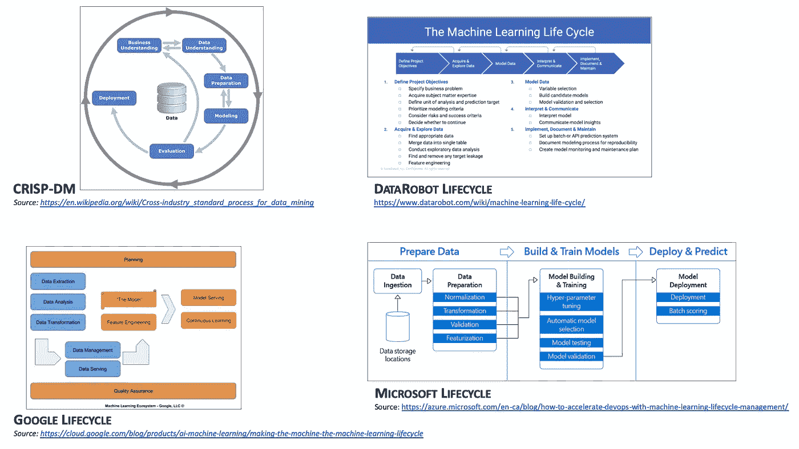
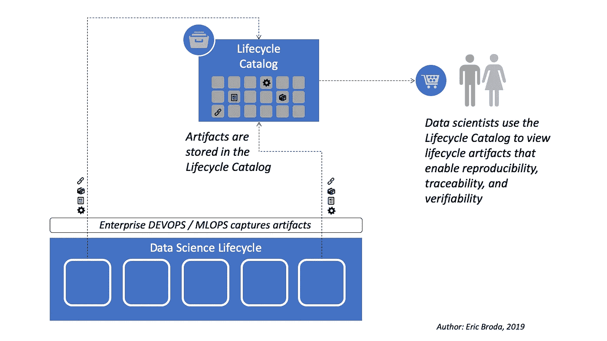

# 重新思考企业的人工智能/机器学习生命周期

> 原文：<https://towardsdatascience.com/rethinking-ai-machine-learning-model-management-8afeaa31d8f8?source=collection_archive---------15----------------------->

企业对模型可再现性、可追溯性和可验证性的需求正在推动传统人工智能/机器学习交付生命周期的变化。这里有一些进化你的 AI/ML 生命周期的实用步骤。

Image by [PublicDomainPictures](https://pixabay.com/users/PublicDomainPictures-14/?utm_source=link-attribution&amp;utm_medium=referral&amp;utm_campaign=image&amp;utm_content=72129) from [PixaBay](https://pixabay.com/?utm_source=link-attribution&amp;utm_medium=referral&amp;utm_campaign=image&amp;utm_content=72129)

# 当前数据科学生命周期中存在显著差距

虽然数据科学家使用的技术和工具大幅增长，但数据科学的生命周期却停滞不前。事实上，从 20 多年前创建的最早版本的 CRISP-DM T1 到最近由领先供应商提供的生命周期，如 T2 谷歌 T3、T4 微软 T5 和 T6 数据机器人 T7，几乎没有什么变化。数据科学生命周期的大多数版本仍然处理相同的任务集:理解业务问题、理解领域数据、获取和工程数据、模型开发和培训，以及模型部署和监控(参见图 1)。

但是，随着数据科学深入大多数公司，企业需求也发生了变化。如今，模型的可再现性、可追溯性、可验证性已经成为大型企业对数据科学的基本要求。不幸的是，在领先的 AI/ML 生命周期中，这些需求被忽略或者被大大低估了。

*Figure 1 — Current Data Science Lifecycles*

为什么这些要求很重要？在金融服务中，可再现性、可追溯性和可验证性受到明确的监管(即:在[欧盟](https://eba.europa.eu/regulation-and-policy/model-validation)、[美国](https://www.federalreserve.gov/supervisionreg/srletters/sr1107.htm)和[加拿大](http://www.osfi-bsif.gc.ca/Eng/fi-if/rg-ro/gdn-ort/gl-ld/Pages/e23.aspx))并且不容忽视。但是从医疗保健和生物技术到政府安全的许多其他行业也有类似的要求。事实上，现在即使是适度监管行业的企业也发现可重复性、可追溯性和可验证性的好处远远超过了它们的成本。

从许多方面来说，这并不令人惊讶:如果数据科学家可以轻松地修改几个月前最后一次工作的模型，而不必急于找到模型源代码和正确的训练文件，那么模型的更新速度和频率会提高多少？如果数据科学家能够确认训练数据血统，并始终如一地从原始来源重新创建训练文件，那么回答审计员和监管者的问题会更加容易和快捷？如果数据科学家可以轻松找到企业门控流程所需的生命周期输出，那么模型投入生产的速度会有多快？

大多数数据科学家都会一致认为，可再现性、可追溯性和可验证性的好处提高了他们的效率和敏捷性。

# 再现性、可追溯性和可验证性推动数据科学生命周期的成熟

考虑数据科学家经常经历的一些常见场景，以及当前数据科学生命周期中的缺点:

1.  **数据科学家必须解决导致模型性能下降的生产数据漂移:**具有成熟生命周期的企业可以通过获取模型源代码和训练文件来快速重建模型基线，然后再现结果，之后可以更新和重新训练模型。*不幸的是，在许多企业中，这个简单的场景很难实现，因为没有维护模型源代码和训练数据之间的联系。*
2.  **数据科学家必须向审计员或监管者证明模型基于原始业务事件获得了正确的结果:**在这种情况下，成熟企业中的数据科学家将能够展示原始数据文件是如何被正确地丰富、转换和/或聚合的，从而可以基于可追踪的数据谱系对模型进行可验证的训练。*然而，大多数企业无法将培训数据谱系和相关的转换联系起来，而这些必须结合在一起才能形成可验证的模型。*
3.  **在提升模型之前，数据科学家必须证明所有企业关口和检查都已成功完成**:为了在成熟企业中促进这一结果，DEVOPS 和 MLOPS 流程将自动捕获关键工件和企业关口流程所需的 AI/ML 生命周期输出。*不幸的是，很少有企业能够自动地(或者在某些不幸的情况下甚至是手动地)从 AI/ML 生命周期中捕获并保留关键的输出，这些输出是轻松快速地推广模型所必需的。*

*很明显，通过关注可再现性、可追溯性和可验证性，有很大的机会来提高企业数据科学生命周期的成熟度。真正的问题不是企业是否应该解决这些问题，而是企业必须以多快的速度解决这些问题。*

# 新的数据科学生命周期推动者:生命周期目录

可再现性、可追溯性和可验证性是由几个简单的功能实现的:在数据科学生命周期中捕获关于模型的工件，存储这些工件，以及搜索和查看工件。这些功能是在当前数据科学生命周期的基础上稍微增加的，同时提供了一个工具，即“生命周期目录”，它提供了一个了解数据科学生命周期的窗口。

*Figure 2 — Data Science Lifecycle Catalog*

简而言之，生命周期目录是一个通向存储库的门户，该存储库包含模型源代码、模型培训文件、原始源数据和将数据转换为培训文件的程序的参考，以及在数据科学生命周期中捕获的其他工件:

*   为了解决可再现性问题，生命周期目录提供了对模型源代码(包括当前版本和以前版本)的引用，并且用于训练模型的数据被保存在清单中
*   为了解决可追溯性问题，生命周期目录维护对原始源系统数据和数据工程脚本的引用，这些数据工程脚本用于转换和丰富，从而提供对交付生命周期中所有数据更改的可见性。
*   为了解决可验证性问题，对训练输出、日志和相关工件的引用——包括与模型偏差和“道德”检查相关的输出日志——由生命周期目录管理，从而获取模型有效性的证据。
*   为了自动化信息捕获过程，生命周期目录将与 AI/OPS (DEVOPS for AI/ML)过程集成，以自动捕获上述工件。有趣的是，主要的云提供商、传统的 DEVOPS 供应商以及较新的 AI/OPS 初创公司正在提供工具和功能，这些工具和功能可以缝合在一起，以捕获许多所需的指标和元数据。

生命周期目录的门户允许企业的数据科学家在 AI/ML 生命周期中搜索、可视化和跟踪模型、相关数据和工件:

*   为了推动敏捷性，生命周期目录允许数据科学家:(a)查看和管理他们的模型库存，(b)查看 AI/ML 模型和版本的状态(已部署、正在开发等)，查看和管理对用于创建每个 AI/ML 模型的培训资产和相关数据沿袭资产的引用，(d)查看和管理对在整个 AI/ML 生命周期中生成的工件的引用。
*   为了提高效率，生命周期目录提供了对所有受治理的 AI/ML 工件的访问。考虑一个这很关键的场景:首先，许多组织现在必须证明模型是无偏见的，并提供符合公司道德准则的结果——在这种情况下，保留偏见测试输出来提供这种证明。
*   为了解决安全性问题，只有经过身份验证和授权的个人才能访问生命周期目录，他们可以查看和/或管理 AI/ML 模型、部署或培训资产。
*   为了提高效率，生命周期目录提供了企业把关流程所需的所有证据，从而为“自助式” [AI/ML 治理](/ai-and-machine-learning-governance-692b245bb6d7)提供了潜力。

*生命周期目录是数据科学生命周期的“记录簿”，允许数据科学家对企业的所有数据科学资产进行可视化、分类、分组、管理和治理。生命周期目录是数据科学生命周期中缺失的环节，可满足企业对可再现性、可追溯性和可验证性的基本需求。*