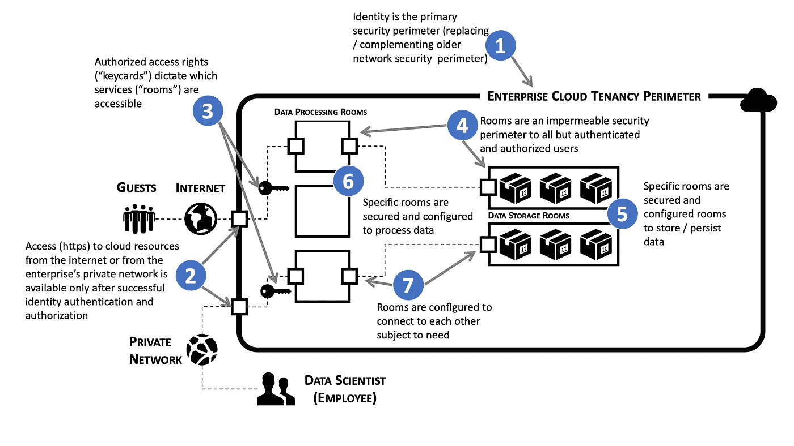

# 重新思考人工智能/机器学习的云安全

> 原文：<https://towardsdatascience.com/rethinking-enterprise-data-security-and-privacy-for-cloud-native-ai-machine-learning-f2df9009bc6d?source=collection_archive---------21----------------------->

旧的安全方法跟不上 AI/ML 对数据的需求。一个现代的云安全架构需要考虑什么？

Photo by [Cederic X](https://unsplash.com/@cedericx?utm_source=unsplash&utm_medium=referral&utm_content=creditCopyText) on [Unsplash](https://unsplash.com/search/photos/castle?utm_source=unsplash&utm_medium=referral&utm_content=creditCopyText)

# 为什么云原生 AI/机器学习在企业中停滞不前？

像之前的通用计算一样，人工智能/机器学习对数据的贪得无厌创造了对灵活容量和高级计算的巨大需求。看起来，人工智能/人工智能在云上的进军正在进行，早期采用者正在建立滩头阵地。

然而，最近的[头条](https://www.nytimes.com/2019/07/29/business/capital-one-data-breach-hacked.html)已经迫使企业非常谨慎地行动——以至于即使将少量敏感数据迁移到云中也是一项艰巨而耗时的工作。

毫不奇怪，AI/ML 的独特需求正日益与企业传统的谨慎安全策略产生严重冲突。

*在我上一篇* [*文章*](/why-has-cloud-native-ai-machine-learning-stalled-in-the-enterprise-21cfaeb29551) *中，我证明了这种谨慎是绝对必要的——坦率地说，存在有效的数据安全和隐私问题。这些担忧是实质性的，也是严重的。这些问题——直到得到解决——将继续阻碍云原生 AI/ML 在企业中的采用，这似乎是很恰当的。*

# 旧的安全方法不起作用

这个行业已经承认过去有效的方法今天可能不再有效。更具体地说，成功用于保护内部数据中心的老把戏需要重新设计，以适应云。

大多数人认为这种脱节是许多因素共同作用的结果——更聪明的黑客拥有更好的工具，加上许多企业的云安全实践相对不成熟。这显然是真的。然而，我认为事情远不止如此。

我的经验表明，企业可能需要重新思考他们如何在云上处理数据安全和隐私。我认为 McKinsey [最恰当地陈述了](https://www.mckinsey.com/business-functions/digital-mckinsey/our-insights/cloud-adoption-to-accelerate-it-modernization):“大多数传统 it 环境采用基于边界的‘城堡和护城河’安全方法”，宣称我们需要重新思考云的安全方法，因为它们“更像现代酒店，在那里，钥匙卡允许进入某些楼层和房间”。

旧城堡对现代酒店。护城河对钥匙卡。我们不再建造城堡和护城河是有原因的。更好的理由是考虑用更新的方法来解决数据安全和隐私问题。

在本文中，我将讨论所谓的“城堡和护城河”安全方法的缺点。然后，我将解释并建立麦肯锡倡导的“现代酒店房间”和“钥匙卡”概念，希望这将提供一个架构基础，以克服阻碍企业在云上采用 AI/ML 的有效安全和隐私问题。

Photo by [Jerome Granados](https://unsplash.com/@granados?utm_source=unsplash&utm_medium=referral&utm_content=creditCopyText) on [Unsplash](https://unsplash.com/search/photos/drawbridge-castle?utm_source=unsplash&utm_medium=referral&utm_content=creditCopyText)

# 城堡和护城河以及网络安全边界

许多企业仍然采用基于网络边界的安全方法。他们用更厚更坚固的网络墙建造数据中心“城堡”。他们用护城河来阻挡敌人，用吊桥来接纳朋友和客人。但这是基于一些有缺陷的假设。

第一个是墙壁并不那么好用。可能最好认为它们是必要的，但不是充分的。在过去，“城堡和护城河”的策略可能会赶走敌人。相对于今天，他们拥有更简单、效率更低的工具。但是敌人现在更聪明，有更好的武器。

有了这些新武器，敌人再也不用走前门了。相反，他们寻找砖块之间砂浆的裂缝——所需要的只是一个不为人知的小开口，让坏事发生。事实上，来自 Capital One 的[头条](https://www.nytimes.com/2019/07/29/business/capital-one-data-breach-hacked.html)暗示，即使是最好的“墙”也有裂缝。

第二个有缺陷的假设是，旧的数据中心“城堡”安全设计足够好，表明同样的方法可以应用于新的云环境。数据中心“城堡”*几乎完全专注于其边界，认为数据中心内的资产在默认情况下是安全的*。因此，重点主要是保护周边地区，而不是周边地区的资产。

另一方面，云安全原则是相反的。许多资源，除非明确受到保护，否则默认情况下*是不安全的，无法通过互联网*访问。是的，必须创建一个安全的边界，但是在许多情况下，边界内的资产也必须是安全的和锁定的。不幸的是，相对于保护云资产所需的深度和广度，许多企业的安全能力还不成熟。

最后，企业给了来宾(或员工)好处，一旦他们进入数据中心的“城堡墙”，通常可以访问他们想要的任何内容，或者至少是他们想要的大部分内容，而安全控制却少得多。但是，如果有人获得了对敏感数据的访问权，他们能够带着企业的资产离开“城堡”吗？

不幸的是，是的。在“城堡和护城河”战略中，重点通常是保护入口，较少关注一旦进入后会发生什么，更少关注保护出口。但是正如最近的头条新闻所暗示的，一旦被授权的个人——在这个特殊的例子中，是一个雇员——有权使用城堡的资产，那么把它们拿出来似乎相对简单。

为了解决这个问题，对云的关注必须是确保没有数据泄露的机会。即使有权访问敏感数据的个人也不得允许数据“泄露”到云安全边界之外。

然而，AI/ML 对数据的贪婪胃口大大增加了赌注。为了在云上实现“零泄漏”机会，必须考虑新的方法。

*很明显，我们不再建造真实世界的城堡和护城河是有原因的。同样，我们也有理由避免构建数据安全和隐私“城堡和护城河”来保护我们在云上的企业数据资产。*

# 基于身份的安全边界

过去，主要的安全边界是基于网络安全(“城堡和壕沟”策略)，其目标是建立一个不可渗透的网络屏障。前提是有了安全的网络边界，网络中的所有系统和资源都是可信的。

当时，这是有意义的，因为大多数应用程序和资产几乎只存在于数据中心内部，或者只在数据中心内部协作。

然而，时过境迁。如今，人们期望资源(应用程序、数据等)。)将可通过互联网访问，无论您身在何处。设备(例如，BYOD)和云应用的爆炸式增长现在旨在利用这种位置中立性和开放网络。

但是旧的网络边界方法没有考虑到云的相对“开放性”,使企业容易受到攻击。这就造成了这样一种情况，一旦可信边界内的单个端点受到威胁，敌人就可以迅速在整个网络中扩大立足点。

更糟糕的是，敌人变得越来越聪明，获得了更好的工具，导致网络边界变得更加漏洞百出。

实际上，以网络为中心的思维变得不那么相关了。有人可能会说，现代云安全方法现在应该在网络边界可能被攻破的明确假设下进行设计。

这导致了一种新的安全模式:今天，身份成为新的安全边界。身份边界确保您是您所说的那个人，然后完全根据与您的身份相关联的授权来分配权限。

简而言之，资源可能被设计为利用云的“开放性”，但是如果没有适当的基于身份的认证和授权，任何资源都不能被访问或影响。

考虑到这一点，云数据安全和隐私设计原则的更好比喻可能是“现代酒店”，而不是“城堡和护城河”。

Photo by [Jordan Pulmano](https://unsplash.com/@jordanpulmano?utm_source=unsplash&utm_medium=referral&utm_content=creditCopyText) on [Unsplash](https://unsplash.com/search/photos/bank-vault?utm_source=unsplash&utm_medium=referral&utm_content=creditCopyText)

# 现代酒店

任何去过一点地方的人都能体会到现代酒店的体验。前门是敞开的，很受欢迎。在我们的“现代酒店”类比中，从数据安全和隐私的角度来看，企业的云租户就是酒店。

酒店的新客人会看到一个前台——在我们的比喻中是企业的互联网角色——它充当酒店的前门(图 1 中的“2 ”),可能对所有客人开放。

但是你需要登记才能走得更远。基于身份的安全边界(图 1 中的“1”)从这里开始。

在登记入住时，您的身份得到验证，一旦您付款，您将获得一张授权您进入指定房间的钥匙卡(图 1 中的“3”)。

但是，只有由您的酒店钥匙卡配置的房间和服务可供您使用。事实上，除了你自己的房间，所有其他房间都是关闭的，你可能会(礼貌地)拒绝未经你的钥匙卡授权的服务。

从这个意义上说,“酒店房间”和“钥匙卡”这两个术语似乎非常合适，它们表示以有利于需求的规模和方式消费服务的灵活性，以及按需容量，即服务可以在需要时消费。

继续类比，“房间”(图 1 中的“4”)有“墙”，这些墙提供了一个不可渗透的安全边界，允许在企业的云租户中有安全的处理区域。与酒店服务类似，默认情况下，企业的服务或房间不可用(关闭)，只有在有效的身份验证和授权(由您的身份提供)后，服务才可用。

和现代酒店一样，这里有不同类型的房间，每种房间都有不同的配置以满足不同的需求。从 AI/ML 的角度来看，我们在企业的云租赁中有两种不同的房间类型，每种类型都可以满足特定的需求。

首先，我们需要专门设计的“数据存储室”(图 1 中的“5”)，以确保敏感数据被安全地存储，并且仅被授权的实体(人或应用程序)访问。这些房间还可以配置为支持更强的安全控制，如静态数据加密，如果数据的敏感性需要这种功能。

其次，我们需要“数据处理室”(图 1 中的“6”)，授权实体可以在这里安全地访问和处理敏感数据。

并总结我们的类比，像许多酒店房间一样，一个房间可以连接到另一个房间(图 1 中的“7”)。在我们的例子中，数据处理室将访问数据存储室，以允许 AI/ML 探索和训练活动。

顺便说一句，“房间”可能看起来类似于单个虚拟机。每个都有一个安全的边界，但相似之处可能就到此为止了。然而，与虚拟机不同,“房间”的功能是多样的、分布式的，并且实际上是由虚拟机集群部署的。

# 数据安全策略必须为云而发展

希望很明显，旧的数据安全方法需要重新考虑，以适应云。然而，这并不是说旧的方法应该完全抛弃。

仍然需要一个安全的边界。网络安全还是要落实的。

但是，旧的方法也必须不断发展，以应对云带来的独特的安全和隐私挑战。所谓的“城堡和护城河”变成了“有钥匙卡的酒店”，有基于身份的安全边界，定义了经认证和授权的客人可以执行的操作。

我们的新方法提供了“房间”,这些房间成为安全区域，是为云上的 AI/ML 特定需求定制的。它们既灵活又安全——可以按需创建(数据处理室)，并支持安全的数据处理或安全的持久存储(数据存储室)。

最后，本文为理解云上 AI/ML 特有的安全挑战提供了基础。它还提供了一个类比——有房间、墙壁和钥匙卡的现代酒店——为云上的数据安全和隐私提供了一个新概念基础。

在本系列的下一篇也是最后一篇文章中，我将深入描述如何实现“酒店”、“房间”和“钥匙卡”来支持云上的安全 AI/ML。此外，下一篇文章还将讨论必须到位的云管理技术，以支持这些功能，并允许企业自信地启动和加速云原生 AI/ML 在企业中的采用。