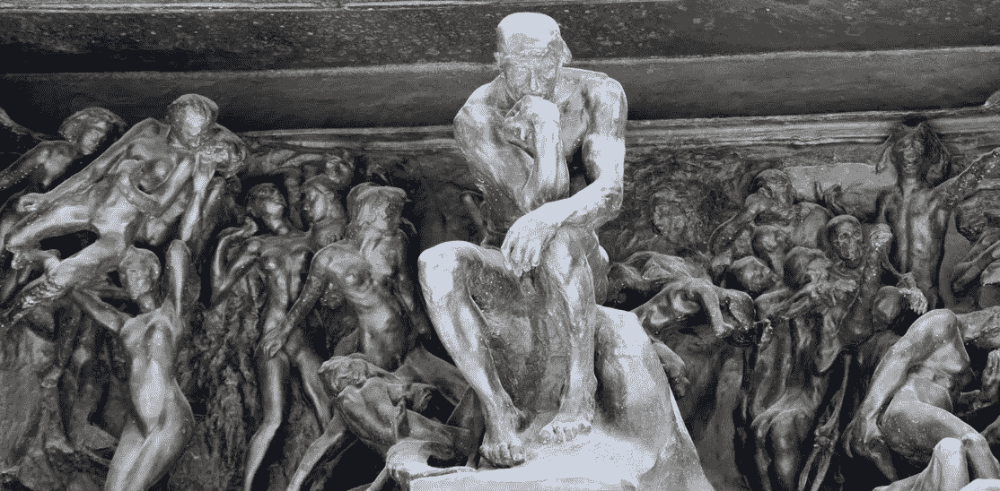

# 反思工作中的思维

> 原文：<https://towardsdatascience.com/rethinking-thinking-at-work-1e5b7bc02f53?source=collection_archive---------42----------------------->

## 数据科学需要深入思考和多学科协作。现代办公环境对两者都是适得其反的

Rodin’s The Gates of Hell (AKA trying to work in open floor plan office on Halloween)

罗丹的预感:当我们大多数人想到罗丹最著名的雕塑《思想者》时，我们会想象出一个孤独的人站在基座上，陷入沉思。当然，这是因为这就是著名的 1888 年青铜雕塑及其复制品在博物馆和照片中呈现给我们的方式。但在《思想者》作为个人表演首次亮相之前，他是后来成为 37 年杰作《地狱之门》的合奏演员之一。仔细观察这幅作品，“思想者”若有所思地坐在一群暴民中间(见标题图片)。虽然艺术史学家会告诉我们，这件作品的灵感来自但丁的地狱，但我看到了时间旅行的证据——或者至少是未来的预感。否则，他怎么能如此清晰地想象出在 2019 年的万圣节，作为一名数据科学家，在与一家数字机构共享的 WeWork 开放式平面办公室中努力完成工作是什么感觉？对于关心生产力的“思考者”来说，现代办公环境真的感觉像是地狱之门。是时候重新思考我们被教导的如何管理团队以提高生产力和协作，并给人们时间和空间进行有计划的、不间断的思考。

**忙碌并不等同于高效:**我们一生都被告知，工作意味着积极参与一项活动。从每天的开始到结束，就好像我们在进行多任务耐力测试。当然，结果往往会得到回报——但让人们看起来持续活跃的行为也是如此，不管他们是否真的完成了什么。早在小学时，“举手者”就受到奖励，“白日梦者”受到嘲笑。在课间休息时独自阅读或凝视天空被认为是反社会的，或者充其量是一个令人担忧的理由。在以后的生活中，这些词会变成“冷漠”或“脱离”，但前提是一样的——工作是*做*的地方，而不是*思考*的地方。如果你是，比如说，一个酒保，这很有道理…但是如果你的职业依赖于你专注和深入思考的能力来完成你的工作呢？

**做作的合作扼杀了独立思考:**在当今的工作场所，找到一个专注的时间和地点是很难的，这对于创新和生产力来说是必不可少的，尤其是在需要不断在创造性和定量思维之间转换的职业中。人们不认为数据科学是一个创造性的职业，但我工作过的最有才华的数据科学家能够在定量和创造性世界的交叉领域出类拔萃。从规划数据结构，到选择正确的数学方法，再到解释现实生活中的含义，然后用非技术交流的方式表达出来，这些都需要数小时不间断的专注。今天的工作环境已经将如此多的努力集中在试图诱导协作上，以至于在许多情况下，一个人不得不在沉默中思考的唯一选择是完全避开办公室。对即时通信的需求、认为远程工作是“休息时间”的主管以及强迫人为协作的办公室布局加剧了这种困境，这是颠覆他们试图培养的生产力和协作的秘诀。

**反思协作思维:**如果我们真的想从团队中获得最大收益，我们需要让他们远离噪音和干扰，腾出时间进行深入思考。我们需要消除这样一种观念，即独处是一种奢侈品或特殊恩惠，只有仁慈的主管才能给予。与团队合作的时间对于团队的成功仍然至关重要，但当每个人带着他们的*最佳想法*来到谈判桌前时，这些时间会更有成效——而我们没有培养有利于实现我们最佳想法的工作环境和实践。

关于独处的好处，我强烈推荐艾特金·坦克的文章 [**独处:原创思维的秘密**](https://medium.com/swlh/solitude-the-secret-to-original-thinking-c5ac755184ec)**https://medium . com/swlh/Solitude-The-secret-to-original-thinking-c5ac 755184 EC**