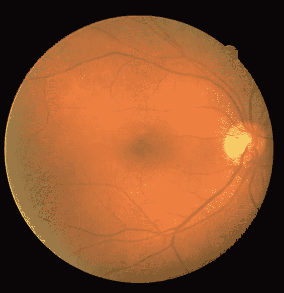
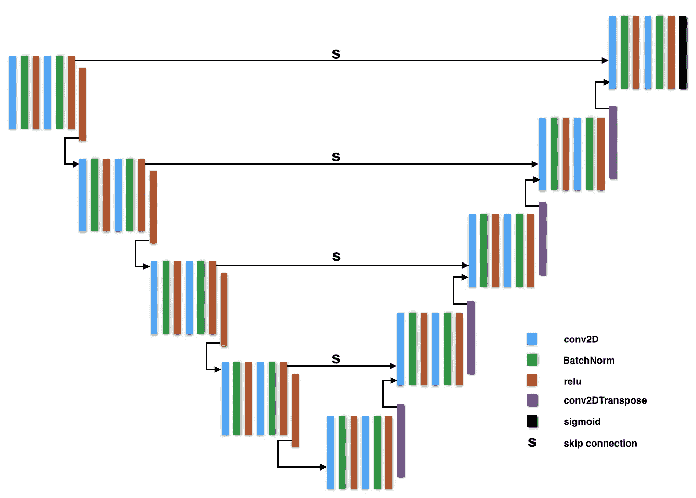
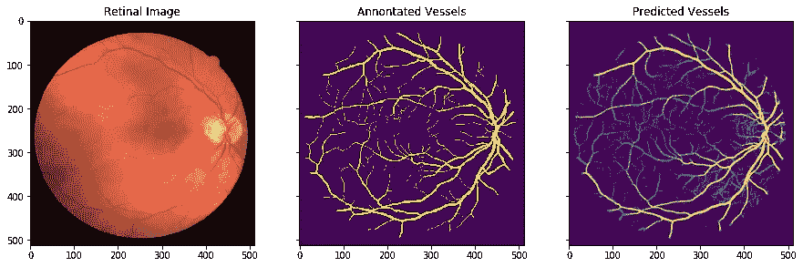

# 基于 U-Net 结构的视网膜血管分割

> 原文：<https://towardsdatascience.com/retinal-vasculature-segmentation-with-a-u-net-architecture-d927674cf57b?source=collection_archive---------9----------------------->

视网膜脉管系统所展示的结构推断出关于诸如早产儿(RoP)、糖尿病性视网膜病(DR)、青光眼、高血压和与年龄相关的黄斑变性(AMD)等广泛的视网膜病理的关键信息。这些病理是失明的主要原因。视网膜脉管系统的精确分割对于各种眼科诊断和治疗过程是重要的。

在过去的几十年里，许多研究都集中在开发用于视网膜血管分割的自动化和精确的技术上。随着近年来机器学习、深度学习和计算机视觉的兴起，研究人员已经找到了应用这些技术为医学、生物学和医疗保健中存在的问题提供解决方案的方法。

在这些技术中，U-Net 是一种有趣的深度学习网络架构。它是由 O. Ronneberger，P. Fischer 和 T. Brox 在 2015 年开发的，可以归类为用于生物医学图像分割的全卷积神经网络(CNN)。U-Net 论文的作者写了以下内容。

> *…在本文中，我们提出了一种网络和训练策略，它依赖于对数据扩充的大量使用，以更有效地使用可用的带注释的样本。该架构由一个捕获上下文的收缩路径和一个支持精确定位的对称扩展路径组成……*

U-Net 不需要大量的训练数据，这使得它非常适合于生物医学图像分析，因为生物医学领域中的图像相对稀缺。在本文中，我们将讨论如何编写一个简单的 U-Net 架构来解决视网膜血管分割问题，以及如何评估算法的性能。



A Retinal Image

我已经使用了“[驱动:用于血管提取的数字视网膜图像](https://www.isi.uu.nl/Research/Databases/DRIVE/)”数据集来训练网络。在数据集中，有两个文件夹，即“培训”和“测试”。“训练”文件夹包含 20 幅视网膜图像及其血管遮罩。“训练”文件夹中的 17 幅图像及其血管遮罩被用作训练集。剩余的 3 幅图像及其血管掩模作为验证集。测试文件夹包含 20 幅图像和两种类型的血管屏蔽(1st_manual 和 2nd_manual)。1st_manual vessel masks 被视为黄金标准，以便在评估性能时可以将人工注释(2nd_manual)与黄金标准进行比较。将 20 个图像及其血管掩模(1st_manual)作为测试数据。视网膜图像是 3 通道图像(RGB ),而它们的血管掩模是二进制图像。驱动器上的原始图像尺寸为 565 × 584。在将训练集、验证集和测试集保存在“. hdf5”文件中之前，它们的大小被调整为 512 × 512。

下图展示了我们将要考虑的 U-Net 架构。



The U-Net framework

以下要点包含了我们可以用来训练模型的 U-Net 架构。架构是用 keras 写的。

U-Net architecture coded in python (with Keras)

由于我们的训练集相当小，使用数据扩充技术来增加训练数据的大小是有帮助的。为此，我们可以使用 keras 的 ImageDataGenerator 类。它使您能够配置图像准备和增强。这个类的伟大之处在于它能够在模型拟合过程中创建扩充数据。数据生成器实际上是一个迭代器，当模型拟合算法请求时，它返回成批的增强图像。

为了准备用于训练的数据，我们必须首先在区间[0，1]内重新调整它们。当扩充我们的数据时，我们可以使用随机旋转。这些随机旋转的角度范围可以在数据生成器中指定。这将使我们的模型**旋转不变**，因为模型将看到不同方向的图像。此外，我们可以使用水平和垂直随机移动作为增强技术。通过在具有不同垂直和/或水平位移的图像上训练我们的模型，我们可以使我们的模型**平移不变**。缩放是我们可以使用的另一种增强技术。这将使我们的模型**比例不变**。我们可以如下配置上述图像数据准备和增强技术。

```
datagen_args = dict(
             rescale=1./255,
             rotation_range=90,
             width_shift_range=0.1,
             height_shift_range=0.1,
             zoom_range=0.2
)
```

在数据准备和扩充期间，我们必须确保蒙版得到的变化与我们应用于图像的变化相同。下面的函数会解决这个问题。

```
def get_generator(self, images, masks):
    image_datagen = ImageDataGenerator(**datagen_args)
    mask_datagen = ImageDataGenerator(**datagen_args)

    seed = 1

    image_generator = image_datagen.flow(images, seed=seed)
    mask_generator = mask_datagen.flow(masks, seed=seed)

    return zip(image_generator, mask_generator)
```

现在，我们可以定义模型的训练例程。我们将使用学习率为 0.0001 的 **Adam 优化器**。损失函数将是**二进制交叉熵**，因为我们正在处理像素标记问题。(血管区域= 1，非血管区域= 0)。我们将训练 50 个时期的模型，同时每个时期有 200 个步骤，我们的批量大小是 32。这样，由于我们之前定义的图像增强配置，该模型在每个时期将看到 32 × 200 = 6400 幅图像。每当在给定时期结束时损失得到改善，我们就将我们的模型权重保存到“. hdf5”文件中。此外，我们将实现一个有 10 个周期的耐心(没有改善的周期数，在此之后训练将被停止)的早期停止。

```
compile_args = dict(
            optimizer=Adam(lr=1e-4),
            loss='binary_crossentropy',
            metrics=['accuracy']
)earlystopper = EarlyStopping(
            patience=10,
            verbose=1
)model_checkpoint = ModelCheckpoint(
            self.model_path,
            monitor='loss',
            verbose=1,
            save_best_only=True
)model.compile(**self.compile_args)train_generator = self.get_generator(x_train, y_train)
val_generator = self.get_generator(x_val, y_val)model.fit_generator(
            train_generator,
            epochs=50,
            steps_per_epoch=200,
            verbose=1,
            callbacks=[model_checkpoint, earlystopper],
            validation_data=val_generator,
            validation_steps=10
)
```

训练完成后，我们可以评估我们的模型。为了评估该模型，我们可以使用性能指标，如 F1 分数、准确度分数、受试者-操作者曲线(ROC) AUC 和精确度-召回率(PR)曲线 AUC。绘制 PR 和 ROC 曲线可以很好地了解模型性能。

我们还可以绘制一个选定的视网膜图像(来自测试集)，它的血管掩模由人类注释者创建，它的血管掩模由我们的 U-Net 模型预测。



From the left : Original retinal image, vessel mask annotated by a human and the predicted vessel mask using the U-Net model

这篇文章到此结束。请在评论中告诉我你的问题。U 网快乐！

参考资料:

1.  [https://machine learning mastery . com/image-augment-deep-learning-keras/](https://machinelearningmastery.com/image-augmentation-deep-learning-keras/)