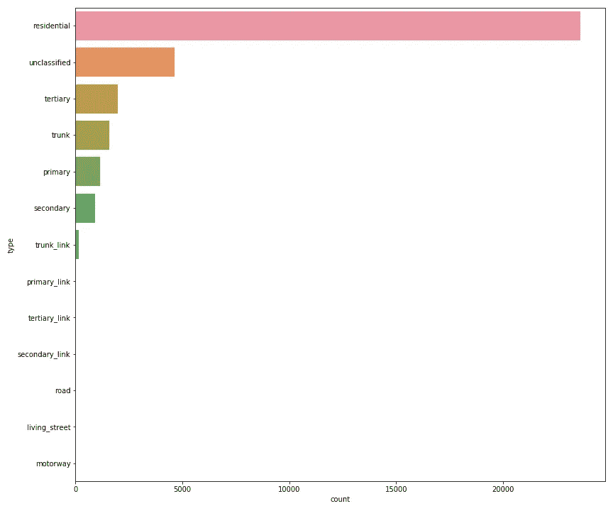
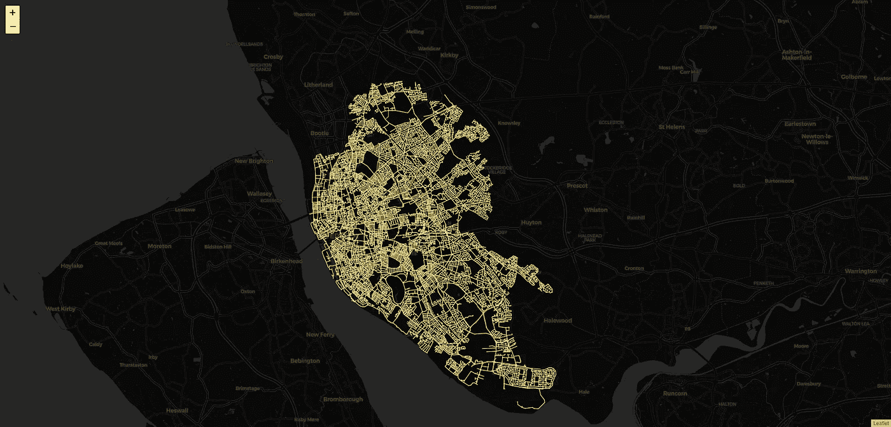
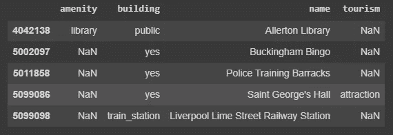
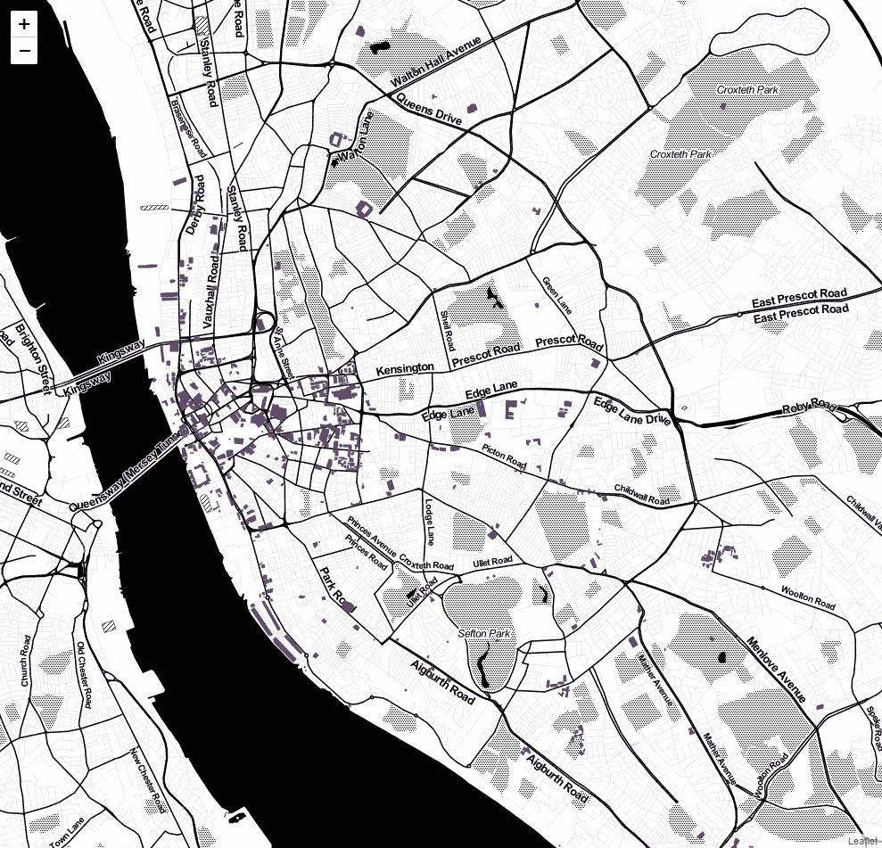
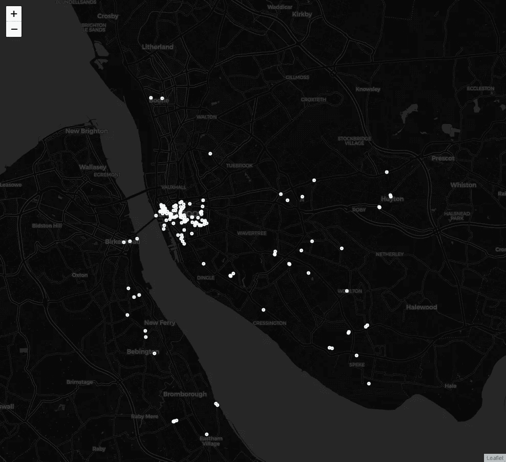

# 在 Python 中检索 OpenStreetMap 数据

> 原文：<https://towardsdatascience.com/retrieving-openstreetmap-data-in-python-1777a4be45bb?source=collection_archive---------8----------------------->

## 关于如何使用 Google Colab 通过 Python 访问 OpenStreetMap 数据库的指南。


OpenStreetMap — [Source](https://www.techrepublic.com/article/is-openstreetmap-the-next-linux-or-openoffice/)

如果您想从 OpenStreetMap (OSM)中检索地理空间数据，您可以下载它，但这需要时间和存储空间。无需离开您的开发环境(Jupyter 笔记本)，您就可以访问和检索 OpenStreetMap 数据。假设您正在进行分析，并想找出您感兴趣的区域内有多少娱乐设施或餐馆。

在本教程中，我们将学习使用 python 包 OSMNX 检索 OpenStreetMap 数据。

> OSMnx 是一个 Python 包，允许您从 OpenStreetMap 的 API 下载空间几何图形并对街道网络和其他空间数据进行建模、投影、可视化和分析

在接下来的三个部分中，我们从 OpenStreetMap 中检索三种不同的数据:作为兴趣点的咖啡馆、建筑物和街道网络。我们还探索了使用 leav 的地理空间数据可视化。

## 街道

我们首先创建一个变量来保存我们感兴趣的区域。你可以随意探索任何你想去的地方，但是我在本教程中使用利物浦市(注意你的区域越大，计算时间就越长。)

```
place = “Liverpool, United Kingdom”graph = ox.graph_from_place(place, network_type=’drive’)
```

通过上面两行代码，OSMnx 允许我们快速检索城市的街道网络。结果是一个 Networkx 类，我们将其转换为 Geopandas 以进一步处理数据。让我们看看如何将它转化为 Geopandas 地理数据框架。OSMnx 自带的“graph_to_gdf”功能可以轻松做到这一点:

```
nodes, streets = ox.graph_to_gdfs(graph)streets.head()
```

现在，如果我们看数据，它被转换成熟悉的熊猫数据框的形式，具有额外的地理数据处理能力。


Retrieved streets

您可以使用您选择的任何工具(在我们的例子中是 Pandas)来处理检索到的数据，或者使用任何 Python 库来可视化您的数据。假设我们想要获得街道类型的条形图。下面的过程只是纯粹的熊猫功能与 seaborn 数据可视化。

```
street_types = pd.DataFrame(edges["highway"].apply(pd.Series)[0].value_counts().reset_index())street_types.columns = ["type", "count"]fig, ax = plt.subplots(figsize=(12,10))sns.barplot(y="type", x="count", data=street_types, ax=ax)plt.tight_layout()plt.savefig("barchart.png")
```

这是数据的输出条形图。住宅区街道在该数据集中出现频率最高。



Bar chart — Street types

我们还可以通过使用 Python 中您最喜欢的地理空间可视化工具，使用地图来可视化街道数据。我在这里用叶子。

```
style = {‘color’: ‘#F7DC6F’, ‘weight’:’1'}m = folium.Map([-2.914018, 53.366925],zoom_start=15,tiles=”CartoDb dark_matter”)folium.GeoJson(edges.sample(), style_function=lambda x: style).add_to(m)m.save(“edges.html”)m
```

输出是利物浦所有街道的美丽地图。不需要下载数据，上传，用熊猫看。



Streets Visualized in Folium

在下一部分中，我们将检索利物浦 OpenStreetMap 数据中所有可用的建筑。

## 建筑足迹

为了检索建筑占地面积，我们使用 OSMnx 的“footprints_from_place”功能。我们需要传递这个地方的名称。

```
buildings = ox.footprints_from_place(place)
buildings.shape
```

建筑物数据集有 27329 行和 185 列(请注意，随着 OSM 用户更新该区域的任何要素，这可能会发生变化)。让我们看看我们检索到的建筑物数据集的子集。

```
cols = [‘amenity’,’building’, ‘name’, ‘tourism’]buildings[cols].head()
```



Building table

我们还可以绘制建筑地图。由于较大的数据集，lyum 可能无法在笔记本中正确显示它，但您可以保存它并在浏览器中打开它。

```
style_buildings = {‘color’:’#6C3483 ‘, ‘fillColor’: ‘#6C3483 ‘, ‘weight’:’1', ‘fillOpacity’ : 1}m = folium.Map([ 57.70958, 11.96687],zoom_start=15,tiles=”Stamen Toner”)folium.GeoJson(buildings[:1000], style_function=lambda x: style_buildings).add_to(m)m
```



A subset of Building footprints in Liverpool.

## 兴趣点(咖啡馆)

我们还可以从 OpenStreetMap 数据集访问和检索其他一些基于点的数据集。OSMnx 还具有 ox.pois_from_place()功能，您可以在其中传递对舒适性参数感兴趣的变量。可用设施列表可从 [OpenStreetMap Wiki](https://wiki.openstreetmap.org/wiki/Key:amenity) 获得。

在这个例子中，我们检索利物浦的咖啡馆。

```
cafe = ox.pois_from_place(place, amenities=[“cafe”])
cafe.head()
```

这是咖啡馆数据集的一个子集，其中有一个名称、轮椅可用性和开放时间列。但是，有些列没有数据。


最后，让我们在地图上标出这些咖啡馆。

```
cafe_points = cafe[cafe.geom_type == “Point”]m = folium.Map([53.366925, -2.914018], zoom_start=10, tiles=”CartoDb dark_matter”)locs = zip(cafe_points.geometry.y, cafe_points.geometry.x)#folium.GeoJson(buildings, style_function=lambda x: style_buildings).add_to(m)for location in locs:folium.CircleMarker(location=location,color = “#F4F6F7”, radius=2).add_to(m)m.save(“cafes.html”)m
```

以下是利物浦 OpenStreetMap 数据库中所有咖啡馆的地图。



Cafes in Liverpool

检索 OSM 数据可以与你的任何其他数据分析或可视化项目相结合。尝试任何你感兴趣的地方。请注意，如果您发现您感兴趣的区域没有足够的数据，您可以贡献 OpenStreetMap 数据。

## 结论

在本教程中，我们使用 OSMnx 检索 OpenStreetMap 数据，并使用 Pandas 和 Geopandas 处理它。我们还了解了如何使用 leav 可视化地理空间数据。

本教程的笔记本是可用的。你可以直接在 Google Colab 中运行这个。

[](https://colab.research.google.com/drive/1Rpg0uFFMRB8Im3c32lO6J5-821vIt5p5) [## 谷歌联合实验室

### 编辑描述

colab.research.google.com](https://colab.research.google.com/drive/1Rpg0uFFMRB8Im3c32lO6J5-821vIt5p5)