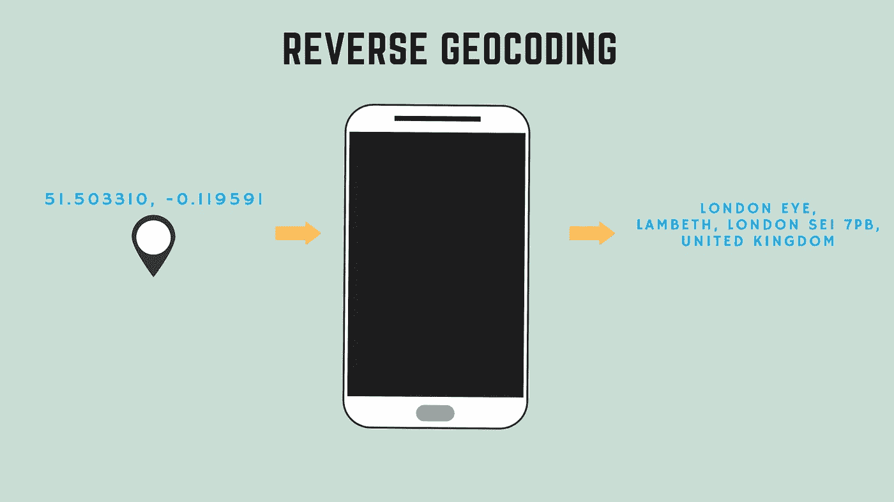
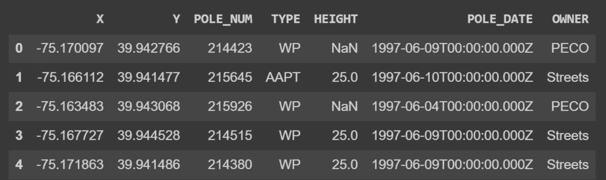
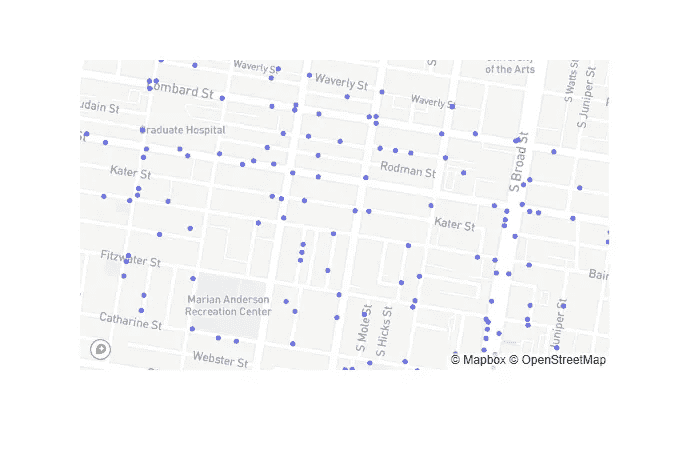
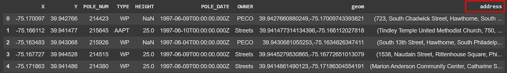

# Python 中的反向地理编码

> 原文：<https://towardsdatascience.com/reverse-geocoding-in-python-a915acf29eb6?source=collection_archive---------0----------------------->

## 如何将原始的纬度/经度转换成带有地址的有洞察力的数据。


Photo by [Devin Avery](https://unsplash.com/@devintavery?utm_source=medium&utm_medium=referral) on [Unsplash](https://unsplash.com?utm_source=medium&utm_medium=referral)

许多数据集只有坐标——纬度和经度——与我们人类识别的地址、街道名称、建筑名称或邮政编码等可识别特征没有任何关联。反向地理编码是许多位置数据科学应用中的重要组成部分。将原始坐标转换为有洞察力的位置数据要素的过程称为反向地理编码。

> **反向地理编码**是将一个点的位置(纬度、经度)反向(反向)编码为可读地址或地名的过程。— [维基百科](https://en.wikipedia.org/wiki/Reverse_geocoding)



Reverse Geocoding

在本教程中，我们将介绍如何使用 Python 执行反向地理编码。我们使用 Pandas 和 Geopy 库来提供反向地理编码。在下一节中，我们将介绍一些基础知识，并将单点坐标转换为带有邮政编码和建筑物名称的地址。

## 反向地理编码单一示例

让我们先导入我们的库。

```
%load_ext autotime
import pandas as pd
import geopandas as gpd
import geopy
from geopy.geocoders import Nominatim
from geopy.extra.rate_limiter import RateLimiterimport matplotlib.pyplot as plt
import plotly_express as pximport tqdm
from tqdm._tqdm_notebook import tqdm_notebook
```

我们现在可以构建我们的地理编码器。我们首先需要指定地理编码服务。您可以访问不同的服务，包括`'google'`、`'bing'`、`'yahoo'`和`'openmapquest'`。其中一些服务在特定限制后收取少量免费费用，但在我们的示例中，我们将使用 Openstreetmap 的免费地理编码服务。

```
locator = Nominatim(user_agent=”myGeocoder”)coordinates = “53.480837, -2.244914”location = locator.reverse(coordinates)location.raw
```

一旦您使用我们选择的地理编码服务提供了坐标，结果就是您可以访问的不同要素的字典。如果你打印出`location`的`raw`元素，你将会看到几个源自坐标的激动人心的特征。

```
{‘address’: {‘building’: ‘Eagle Insurance Buildings’, 
‘city’: ‘Manchester’, 
‘country’: ‘United Kingdom’, 
‘country_code’: ‘gb’, 
‘county’: ‘Greater Manchester’, 
‘house_number’: ‘68’, 
‘postcode’: ‘M2 4JG’, 
‘road’: ‘Cross Street’, 
‘state’: ‘England’, 
‘state_district’: ‘North West England’, 
‘suburb’: ‘City Centre’}, 
‘boundingbox’: [‘53.480856’, ‘53.4810634’, ‘-2.2451761’, ‘-2.2449576’], 
‘display_name’: ‘Eagle Insurance Buildings, 68, Cross Street, City Centre, Manchester, Greater Manchester, North West England, England, M2 4JG, United Kingdom’,
‘lat’: ‘53.4809597’, 
‘licence’: ‘Data © OpenStreetMap contributors, ODbL 1.0\. [https://osm.org/copyright](https://osm.org/copyright)', 
‘lon’: ‘-2.24506682746292’, 
‘osm_id’: 37139875, 
‘osm_type’: ‘way’, 
‘place_id’: 86197794}
```

在这里，您有一个建筑物，邮政编码，地址，国家，道路名称和一堆其他深刻的属性，不可用的原始坐标。如果你只对打印地址感兴趣，你可以使用字典键，或者你可以直接这样做。

```
print(location.address)
```

它将打印出输出的地址部分。在下一节中，我们将了解如何在 Pandas 数据帧中使用反向地理编码。

## 使用熊猫数据框架进行反向地理编码

我们通常希望从纬度和经度(反向地理编码)而不是单个坐标获得地址的子集或完整数据集。在这一部分，我们将探索如何通过熊猫和地质公园做到这一点。

首先，我们从熊猫的 URL 中读取数据。数据存储在 Dropbox 中，如果我们有一个链接，我们可以很容易地使用熊猫。你只需要确保 URL 的最后几个字符设置为“dl=1”。

```
url = “https://www.dropbox.com/s/15gisj8hx218rn1/street-pole-sample.csv?dl=1"df = pd.read_csv(url)df.head()
```

数据具有 X 和 Y 列，其中的坐标与其他要素一起存储，如下表所示。



Street Poles in Philadelphia Data

我们还可以使用 Plotly Express 浏览数据并在地图中显示。只需一行代码，您就可以显示带有底图的地图。

```
import plotly_express as pxpx.scatter_mapbox(df, lat=”Y”, lon=”X”, zoom=15)
```



Philly Street Poles Map

地图显示了 Phillidelphia 街道杆的子集。现在，我们需要从 X 和 Y 列构造坐标列。我们只需将这两列(X & Y)映射为字符串，然后用逗号将它们连接起来，就可以实现这一点。

```
df[“geom”] = df[“Y”].map(str) + ‘,’ + df[‘X’].map(str)
df[“geom”][0]
```

下面是我们在上面创建的`geom`列的第一行。

```
'39.9427660880249,-75.17009743393821'
```

我们创建一个服务提供者`locator`这个时间通行证`timeout`是 10 分钟，因为我们有许多行。这将防止您在此过程中可能遇到的超时错误。

```
locator = Nominatim(user_agent=”myGeocoder”, timeout=10)rgeocode = RateLimiter(locator.reverse, min_delay_seconds=0.001)
```

现在，我们可以通过应用上面创建的反向地理编码`rgeocode`来进行反向地理编码。为了得到一个漂亮的进度条，我们使用了 tqdm 库。

```
tqdm.pandas()df[‘address’] = df[‘geom’].progress_apply(rgeocode)
df.head()
```

这可能需要一段时间，具体取决于数据集中的行数。但是一旦该过程完成，数据集中就会有一个额外的要素，其中每个点都有一个地址，如下所示。



数据现在有了与每个点相关的更有洞察力的属性，包括地址、邮政编码、建筑物等。…

仅用 150 个点进行反向地理编码，耗时 1 分 45 秒。计算时间可能不是一个好的选择，因为数据点的增加将需要大量的处理时间。如果您有一个大型数据集，您可以尝试减少延迟秒数。

## 结论

在本文中，我们探讨了如何将地理编码坐标转换为地址。您可以在这个 Google Colab 笔记本中访问本教程的笔记本。

[](https://colab.research.google.com/github/shakasom/geocoding/blob/master/ReverseGeocoding.ipynb) [## 谷歌联合实验室

### 编辑描述

colab.research.google.com](https://colab.research.google.com/github/shakasom/geocoding/blob/master/ReverseGeocoding.ipynb)