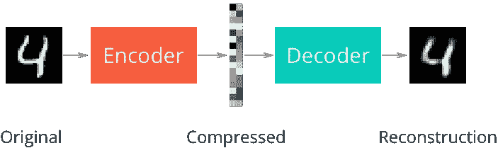
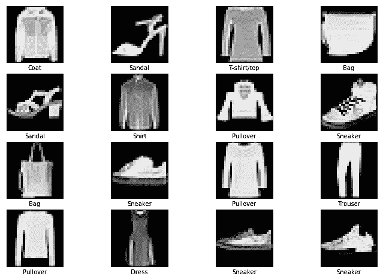
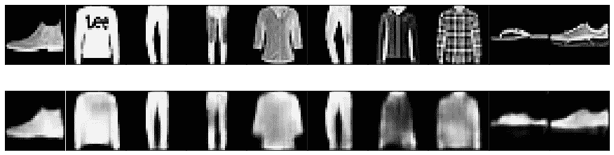
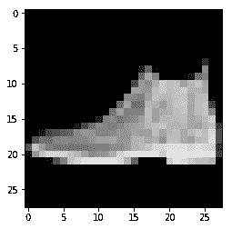
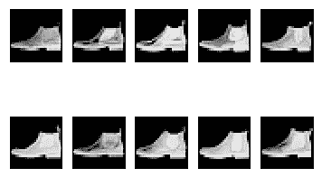

# 使用自动编码器的反向图像搜索

> 原文：<https://towardsdatascience.com/reverse-image-search-using-auto-encoders-afbf906970f5?source=collection_archive---------17----------------------->

你有没有想过谷歌反向图片搜索是如何工作的？他们如何快速扫描所有图像并返回合适的结果？在这篇博客中，我们将制作自己的轻量级反向搜索引擎。为此，我们将使用自动编码器。

## 什么是自动编码器？

自动编码器是一种特殊类型的前馈神经网络，其输入与输出相同。它们以无人监督的方式接受训练，以学习输入的低级特征。这些低级特征通常被称为**潜在**特征。然后，这些潜在特征被用于重构原始输入。

自动编码器由 3 个主要组件组成

*   编码器:用于压缩输入图像
*   潜在表征:保留大部分信息的输入的低层次特征
*   解码器:用于从潜在特征中重建原始输入。

在这种情况下，输入是一个图像。下图清楚地解释了自动编码器的工作原理。



[Source](https://github.com/udacity/deep-learning/blob/master/autoencoder/Simple_Autoencoder_Solution.ipynb)

## 我们将在这个博客中讨论什么？

*   我们将使用时尚 MNIST 数据集并对其进行预处理
*   训练自动编码器学习所有图像的潜在表示
*   使用骚扰索引潜在特征
*   查找给定图像的相似图像

让我们开始吧。

## 时尚 MNIST 数据集

在加载和处理数据之前，了解数据集、类的数量和数据集中的样本数量是一个很好的做法。

时尚 MNIST 数据库由时尚产品的 28*28 灰度图像的 60000 个训练样本和 10000 个测试样本组成。每个类别有 6000 个训练样本和 1000 个测试样本。你可以在这里阅读更多关于数据集[的信息](https://github.com/zalandoresearch/fashion-mnist)。

## 导入库

```
import numpy as np
import matplotlib.pyplot as plt
import tensorflow as tf
from tensorflow import keras
from annoy import AnnoyIndex
import os
```

## 下载数据

```
fashion_mnist = keras.datasets.fashion_mnist
(train_images, train_labels), (test_images, test_labels) = fashion_mnist.load_data()
```

## 预处理和探索性数据分析

像素值介于 0 和 255 之间。我们将在 0 和 1 之间缩放像素值。

```
*# resize the pixel values between 0 and 255*
train_images = train_images/255
test_images = test_images/255
```

让我们将分类标签映射到适当的产品类别。

```
*# different product categories in the dataset* 
labeldict = {
    0: 'T-shirt/top',
    1: 'Trouser',
    2: 'Pullover',
    3: 'Dress',
    4: 'Coat',
    5: 'Sandal',
    6: 'Shirt',
    7: 'Sneaker',
    8: 'Bag',
    9: 'Ankle boot'
}*# no of times each product category is present in the dataset*
category_counts = dict(zip(*np.unique(train_labels, return_counts=True)))
```

让我们展示一些样本图像。

```
plt.figure(figsize=(12,8))
for index in range(16):
  rand_idx = np.random.randint(0,train_labels.shape[0])
  plt.subplot(4,4,index+1)
  plt.xticks([])
  plt.yticks([])
  plt.grid('off')
  plt.imshow(train_images[rand_idx], cmap='Greys_r')
  plt.xlabel(labeldict[train_labels[rand_idx]])
```



## 助手功能

让我们定义一个效用函数来绘制原始图像和重建图像。

```
def plot_images(original, reconstructed):

  fig, axes = plt.subplots(nrows=2, ncols=10, sharex=True, sharey=True, figsize=(12,4))

  for images, axes in zip([original, reconstructed], axes):
    for image, ax in zip(images, axes):
      ax.imshow(image.reshape(28,28), cmap="Greys_r")
      ax.get_xaxis().set_visible(False)
      ax.get_yaxis().set_visible(False)

  fig.tight_layout(pad=0.1)
```

## 占位符

让我们为输入和目标定义占位符。在这种情况下，输入和目标是相等的。我们还将为批量大小定义一个占位符。

```
def placeholders(image_size, n_channels ):
  inputs = tf.placeholder(dtype=tf.float32, shape=[None, image_size, image_size,n_channels], name='inputs') targets = tf.placeholder(dtype=tf.float32, shape=[None, image_size, image_size, n_channels], name='targets') batch_size = tf.placeholder(dtype=tf.int32, name='batch_size') return inputs, targets, batch_size
```

## 编码器和解码器网络

我们将使用卷积神经网络来训练我们的模型。编码器网络将 28*28 图像转换成 4*4*8 的低级表示。解码器使用这种低级表示来重建 28*28 的图像。网络参数取自[这里的](https://github.com/udacity/deep-learning/blob/master/autoencoder/Convolutional_Autoencoder_Solution.ipynb)。

```
def encoder_decoder_network(X):

  *#ENCODER NETOWRK*

  *# X's shape - 28*28*1*
  W1 = tf.get_variable("W1", shape=[3,3,1,16], initializer=tf.contrib.layers.xavier_initializer(seed=0))
  *# 28*28*16* 
  conv1 = tf.nn.conv2d(X, W1, strides=[1,1,1,1], padding='SAME')
  relu1 = tf.nn.relu(conv1)
  *#14*14*16*
  pool1 = tf.nn.max_pool(relu1, ksize=[1,2,2,1], strides=[1,2,2,1], padding='SAME')

  *#14*14*8*
  W2 = tf.get_variable("W2", shape=[3,3,16,8], initializer=tf.contrib.layers.xavier_initializer(seed=0))
  conv2 = tf.nn.conv2d(pool1, W2, strides=[1,1,1,1], padding='SAME')
  relu2 = tf.nn.relu(conv2)
  *#7*7*8*
  pool2 = tf.nn.max_pool(relu2, ksize=[1,2,2,1], strides=[1,2,2,1], padding='SAME')
  *#7*7*8*
  W3 = tf.get_variable("W3", shape=[3,3,8,8], initializer=tf.contrib.layers.xavier_initializer(seed=0))
  conv3 = tf.nn.conv2d(pool2, W3, strides=[1,1,1,1], padding='SAME')
  relu3 = tf.nn.relu(conv3)
  *#4*4*8*
  pool3 = tf.nn.max_pool(relu3, ksize=[1,2,2,1], strides=[1,2,2,1], padding='SAME', name='encodings')

  encoded = pool3

  *# the image is now 4*4*8* 

  *# DECODER NETWORK* 

  upsample1 = tf.image.resize_nearest_neighbor(encoded, (7,7))
  *#7*7*8*
  W4 = tf.get_variable("W4", shape=[3,3,8,8], initializer=tf.contrib.layers.xavier_initializer(seed=0))
  conv4 = tf.nn.conv2d(upsample1, W4, strides=[1,1,1,1], padding='SAME')
  relu4 = tf.nn.relu(conv4)

  upsample2 = tf.image.resize_nearest_neighbor(relu4, (14,14))
  *# 14*14*8*
  W5 = tf.get_variable("W5", shape=[3,3,8,8], initializer=tf.contrib.layers.xavier_initializer(seed=0))
  conv5 = tf.nn.conv2d(upsample2, W5, strides=[1,1,1,1], padding='SAME')
  relu5 = tf.nn.relu(conv5)

  *# 28*28*8*
  upsample3 = tf.image.resize_nearest_neighbor(relu5, (28,28))

  W6 = tf.get_variable("W6", shape=[3,3,8,16], initializer=tf.contrib.layers.xavier_initializer(seed=0))
  conv6 = tf.nn.conv2d(upsample3, W6, strides=[1,1,1,1], padding='SAME')
  relu6 = tf.nn.relu(conv6)

  W7 = tf.get_variable("W7", shape=[3,3,16,1], initializer=tf.contrib.layers.xavier_initializer(seed=0))
  conv7 = tf.nn.conv2d(relu6, W7, strides=[1,1,1,1], padding='SAME')

  logits = conv7

  decoded = tf.nn.sigmoid(logits, name='decoded')

  return encoded, decoded, logits
```

## 定义培训操作

然后，我们计算原始图像和重建图像之间的误差。由于目标是最小化误差，我们将使用 Adam 优化算法来学习误差最小的网络参数。

```
def train_operations(logits, targets, learning_rate): *# define the loss*
  loss = tf.reduce_mean(tf.nn.sigmoid_cross_entropy_with_logits(logits=logits, labels=targets)) *# use adam optimizer for faster convergence*
  training_op = tf.train.AdamOptimizer(learning_rate=learning_rate).minimize(loss)
  return loss, training_op
```

## 训练模型

接下来，我们将定义一个用于训练模型的函数。代替使用 *feed_dict，*我们将使用推荐的方式，使用*数据集和迭代器*向模型提供数据。如果你不知道数据集和迭代器，你可以参考这个博客。

一旦训练结束，我们还会保存模型，以便以后恢复。

```
def train_model(epochs, image_size, n_channels, batch_size, learning_rate, model_save_path):

  *# reset the graphs*
  tf.reset_default_graph()

  *# get the placeholders*
  inputs, targets, batch_op = placeholders(image_size, n_channels)

  *# create a Dataset from the input data*
  dataset = tf.data.Dataset.from_tensor_slices((inputs,targets))

  *# create batches of data* 
  dataset = dataset.batch(batch_size)

  *# define an iterator to consume the data*
  iterator = tf.data.Iterator.from_structure(dataset.output_types,dataset.output_shapes)

  train_initializer = iterator.make_initializer(dataset, name='init_iterator')

  *# get the batch of data using get_next*
  input_batch, target_batch = iterator.get_next()

  encoded, decoded, logits = encoder_decoder_network(input_batch)
  loss, training_op = train_operations(logits, target_batch, learning_rate)

  saver = tf.train.Saver()
  with tf.Session() as sess:
    sess.run(tf.global_variables_initializer())
    for epoch in range(epochs):
      epoch_loss = 0

      *# run the initializer* 
      sess.run(train_initializer, feed_dict = {
          inputs: train_images.reshape(-1, image_size, image_size, n_channels),
          targets : train_images.reshape(-1, image_size, image_size, n_channels),
          batch_op: batch_size
      })

      try:
        while True:
          batch_loss, _ = sess.run([loss, training_op])
          epoch_loss += batch_loss
      except tf.errors.OutOfRangeError:
        pass

      print("Epoch {}/{}: Loss is {:.3f}".format(epoch+1, epochs, epoch_loss))

    print("Training over\n")
    *# save the model* 
    saver.save(sess,model_save_path)

    print("Model saved at {}".format(model_save_path))
```

## 模型参数

我们将以 400 个为一批，总共 20 个时期来训练模型。

```
epochs = 20
batch_size = 400
image_size = 28 
n_channels = 1
learning_rate = 0.001
```

## 运行模型

在运行模型之前，我们将创建一个**检查点**目录来保存我们的模型。

```
if not os.path.exists('checkpoints'):
  os.mkdir('checkpoints')

*# checpoint directory* 
chkpt_dir = os.path.join(os.getcwd(), 'checkpoints')
*# path to save the model*
model_save_path = os.path.join(chkpt_dir, 'fashion-mnist.chkpt')

train_model(epochs=epochs, 
            batch_size=batch_size, 
            image_size=image_size, 
            n_channels= n_channels, 
            learning_rate = learning_rate,
            model_save_path = model_save_path)
```

## 失败

```
Epoch 1/20: Loss is 64.375
Epoch 2/20: Loss is 48.220
Epoch 3/20: Loss is 46.779
Epoch 4/20: Loss is 46.140
Epoch 5/20: Loss is 45.726
Epoch 6/20: Loss is 45.435
Epoch 7/20: Loss is 45.215
Epoch 8/20: Loss is 45.031
Epoch 9/20: Loss is 44.868
Epoch 10/20: Loss is 44.724
Epoch 11/20: Loss is 44.593
Epoch 12/20: Loss is 44.470
Epoch 13/20: Loss is 44.357
Epoch 14/20: Loss is 44.251
Epoch 15/20: Loss is 44.152
Epoch 16/20: Loss is 44.060
Epoch 17/20: Loss is 43.975
Epoch 18/20: Loss is 43.894
Epoch 19/20: Loss is 43.820
Epoch 20/20: Loss is 43.750
```

## 可视化重建的图像

让我们定义一个函数，它接受保存模型的文件的路径和需要重建的图像列表。

```
def test_network(model_path, images):
  with tf.Session() as sess:
    saver = tf.train.Saver()
    saver.restore(sess, model_path)
    default_graph = tf.get_default_graph()
    inputs = default_graph.get_tensor_by_name('inputs:0')
    targets = default_graph.get_tensor_by_name('targets:0')

    test_iterator_init = default_graph.get_operation_by_name('init_iterator')
    decoded = default_graph.get_tensor_by_name('decoded:0')
    reconstructed =[]
    sess.run(test_iterator_init, feed_dict={
        inputs:images,
        targets:images
    })
    try:
      while True:
        reconstructed.append(sess.run(decoded))
    except tf.errors.OutOfRangeError:
      pass
    return reconstructed
```

我们恢复了训练时定义的各种张量和运算。**输入**和**目标**张量用于将图像输入网络。运行**解码后的**张量以恢复重建图像。

让我们将测试数据集中的一些图像传递给模型，并可视化它们的重建图像。

```
test_sample_images = test_images[:10]
test_sample_images = test_sample_images.reshape(-1, image_size, image_size, n_channels)
reconstructed_images = test_network(model_save_path, test_sample_images)
reconstructed_images = np.array(reconstructed_images).reshape(10,28,28,1)
plot_images(test_sample_images, reconstructed_images)
```



这个模型在重建图像方面做得相当不错。

## 潜在特征

既然我们对训练模型感到满意，让我们计算所有训练样本的潜在表示。为此，我们将定义一个函数，它接受保存模型的文件的路径，一个我们想要获得潜在表示的图像列表和编码图像的大小。

```
def get_encodings(model_path, images, encoding_vector_length):
  with tf.Session() as sess:
    saver = tf.train.Saver()
    saver.restore(sess, model_path)
    default_graph = tf.get_default_graph()
    inputs = default_graph.get_tensor_by_name('inputs:0')
    targets = default_graph.get_tensor_by_name('targets:0')

    iterator_init = default_graph.get_operation_by_name('init_iterator')
    encoded = default_graph.get_tensor_by_name('encodings:0')
    encoding_vectors =[]
    sess.run(iterator_init, feed_dict={
        inputs:images,
        targets:images
    })
    try:
      while True:
        encoding_vectors.append(sess.run(encoded))
    except tf.errors.OutOfRangeError:
      pass
    return np.array(encoding_vectors).reshape(-1, encoding_vector_length)
```

## 烦恼

近似最近邻([aroy](https://pypi.org/project/annoy/))是一个库，用于搜索空间中更靠近给定查询点的点。我们将使用 Annoy 来保存所有训练样本的所有潜在表示。

接下来，给定一个查询图像，我们将计算给定图像的潜在表示，并将其与所有编码表示进行比较，以找到相似的图像。如果你想了解更多关于 Annoy 是如何工作的，请参考[这篇](https://erikbern.com/2015/10/01/nearest-neighbors-and-vector-models-part-2-how-to-search-in-high-dimensional-spaces.html)精彩的博文。

让我们来定义构建烦恼指数所需的参数。

*   编码向量长度:图像的编码表示的大小
*   骚扰文件名称:骚扰索引将被保存的文件的名称
*   num_trees:构建 n 个树的森林。树的数量越多，精度越高。

```
# our encoded image is of the shape 4*4*8, hence it's represted by a # vector of length 128
encoding_vector_length = 128
annoy_file_name = 'fashion-mnist.annoy.index'
num_trees = 10
```

**创建骚扰指数**

```
def build_annoy_index(encoding_dim, num_trees, annoy_index_file, encodings):   
  ann = AnnoyIndex(encoding_dim)   
  for index, encoding in enumerate(encodings):
     ann.add_item(index, encoding) # builds a forest of num_trees, higher the number of trees,     higher the precision
     ann.build(num_trees)

     #save the index to a file
     ann.save(annoy_index_file)
     print("Created Annoy Index Successfully") # resize the training images
train_images = train_images.reshape(train_images.shape[0], image_size, image_size, n_channels)# get the encoded representations of all the training samples
encodings = get_encodings(model_save_path, train_images, encoding_vector_length)# create the annoy index
build_annoy_index(encoding_vector_length, num_trees, annoy_file_name, encodings)
```

让我们定义一个函数来获取给定查询图像的相似图像。要搜索的相似图像的数量由参数*n _ 相似*表示

```
def get_similar_images(image, n_similar=10): # get the encoded representation of the image
  encoding = get_encodings(model_save_path,image.reshape(-1, image_size, image_size,n_channels), encoding_vector_length) # Load the annoy index
  saved_ann = AnnoyIndex(encoding_vector_length)
  saved_ann.load(annoy_file_name) # get the nearest images 
  #get_nns_by_vector returns the indices of the most similar images 
  nn_indices = saved_ann.get_nns_by_vector(encoding[0], n_similar) print("Similar images are")
  for i, index in enumerate(nn_indices,1):
    image = train_images[index].reshape(28,28)
    plt.subplot(2,5,i)
    plt.xticks([])
    plt.yticks([])
    plt.imshow(image, cmap='Greys_r')
```

## 查询图像

```
sample_image = test_images[0]
print("Sample Image")
plt.imshow(sample_image, cmap='Greys_r')
```



## 相似的图像

```
get_similar_images(sample_image)
```



所有返回的图像都与查询图像属于同一类。

感谢阅读博客。完整的代码可以在[这个](https://github.com/animesh-agarwal/Auto-Encoders/blob/master/Reverse_Image_Search.ipynb) Jupyter 笔记本里找到。

如果你有任何问题或者你有任何改进这篇文章的建议，请在下面留下你的评论。

参考资料:

1.  [https://github . com/uda city/deep-learning/tree/master/auto encoder](https://github.com/udacity/deep-learning/tree/master/autoencoder)
2.  [https://github.com/zalandoresearch/fashion-mnist](https://github.com/zalandoresearch/fashion-mnist)
3.  [https://pypi.org/project/annoy/](https://pypi.org/project/annoy/)
4.  [https://Erik Bern . com/2015/10/01/nearest-neighbors-and-vector-models-part-2-how-to-search-in-high-dimensional-spaces . html](https://erikbern.com/2015/10/01/nearest-neighbors-and-vector-models-part-2-how-to-search-in-high-dimensional-spaces.html)