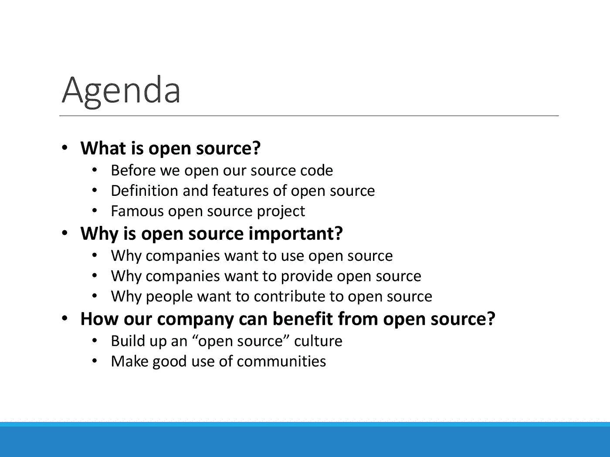
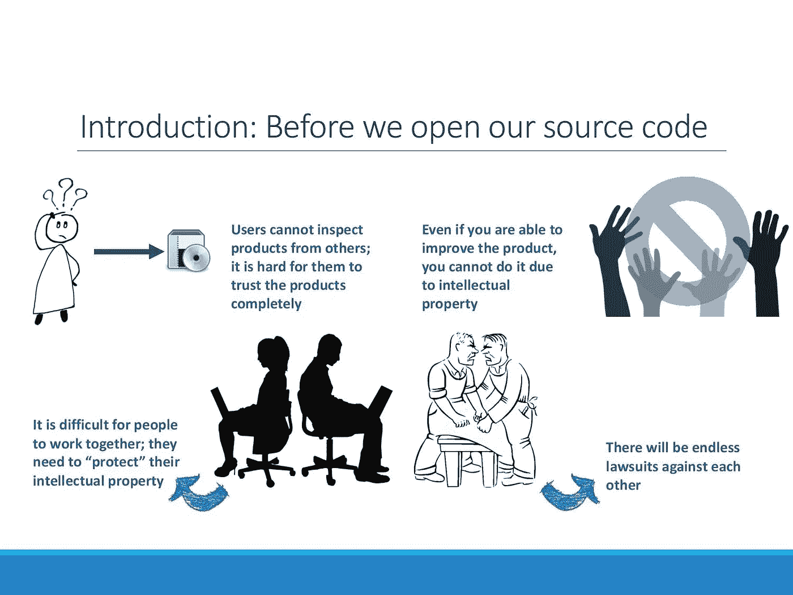
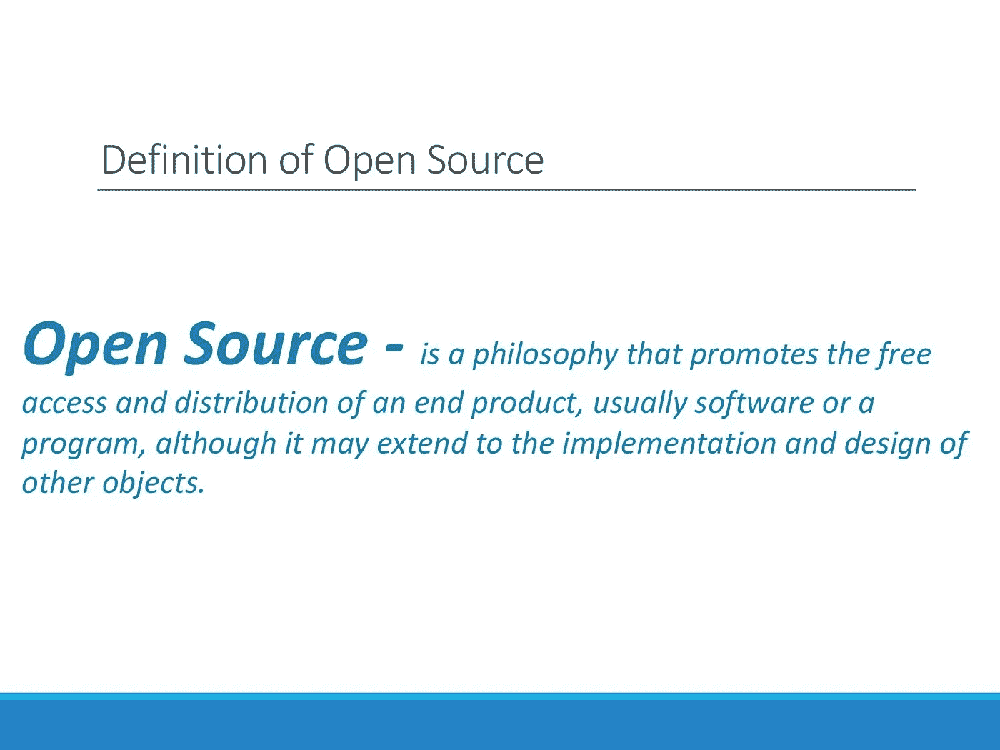
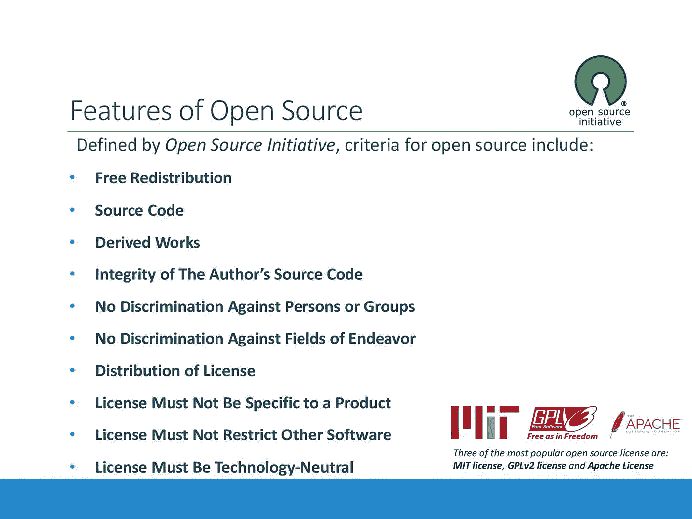
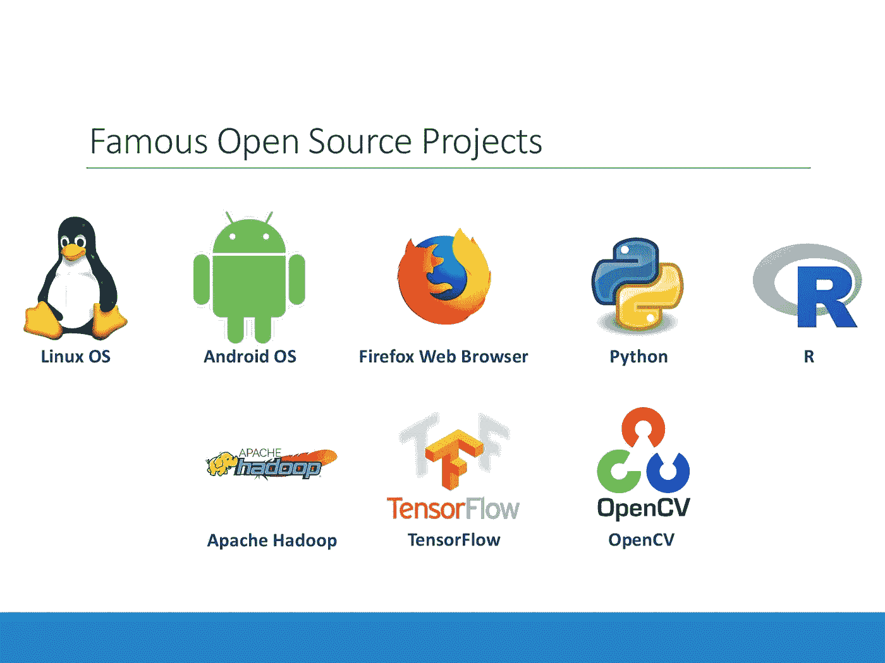
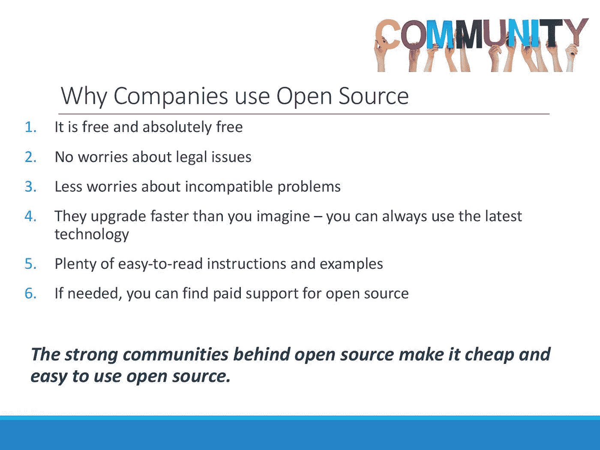
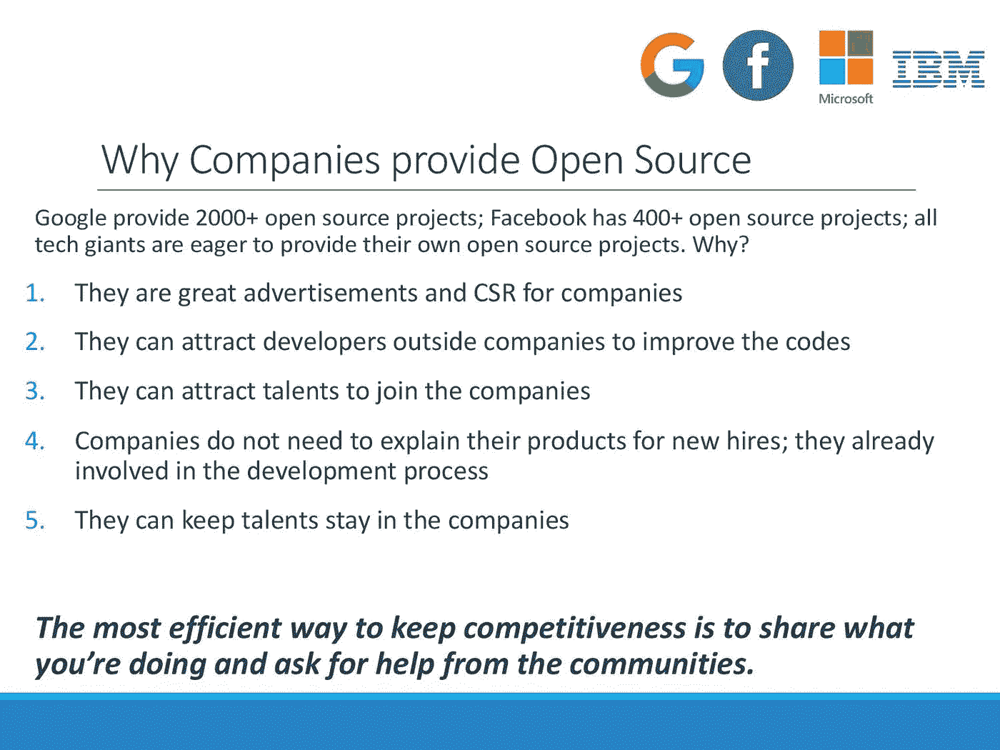
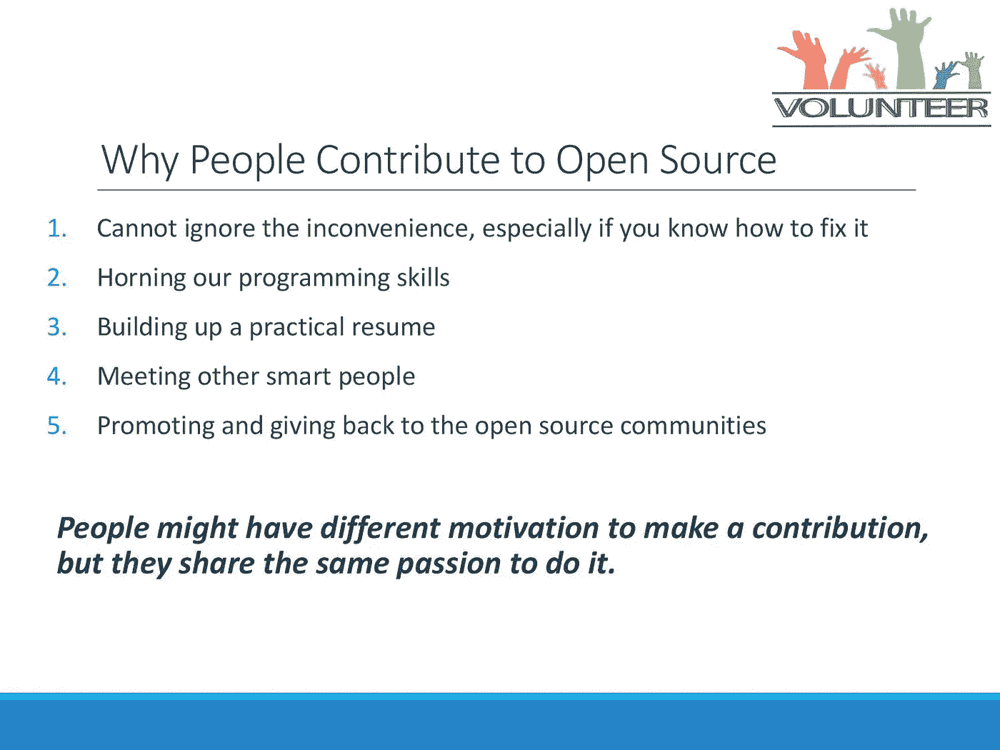

# 反向指导共享——开源

> 原文：<https://towardsdatascience.com/reverse-mentoring-sharing-open-source-868cc19da97a?source=collection_archive---------40----------------------->

Source: genesis_3g on Pixabay

最近，我参加了反向辅导计划，辅导我们的高管，他们在各自领域知识方面经验丰富，但对新技术趋势的理解有限。我们关注他们最感兴趣的四个领域:**开源**、**人工智能**、**编码&原型**和**数字趋势**。作为导师，我和学员们觉得我们从彼此身上学到了很多东西，值得与更多人分享，这就是我写这个系列的原因。

在这个系列中，每个主题有四篇文章:

*   反向师徒分享—开源[ [**文章**](/reverse-mentoring-sharing-open-source-868cc19da97a) ] [ [**幻灯片**](https://www.slideshare.net/ssuserf1b9cf/open-source-140737960) ]
*   反向指导分享——人工智能(未完待续…
*   反向指导分享—编码和原型制作(待续…
*   反向指导分享—数字趋势(待续…

在每个主题中，我会首先介绍*什么是*，以帮助学员对主题有基本的了解。一旦他们知道了这个话题，我会解释为什么这个话题对现在的人很重要。作为高管，他们更关心我们的公司如何从技术中获益，这将包括在第三部分中。

在每篇文章中，我将分享我的 PowerPoint 和我在每张幻灯片上提到的内容。此外，在我与高管们分享了他们的反馈后，我将总结我对每个主题的感受。一旦你理解了这个话题，你就可以去看最后一部分来了解主管们和我的意见。我将排除我们业务中任何敏感的东西，希望每个人，不管你是否熟悉这些话题，都能够从这些文章中学到一些东西。如果你有任何新的想法，请留下你的评论和我们讨论。我真的很感谢大家的回复，这是和人们一起学习的最好的事情。

指令中有三个部分:什么是开源？为什么开源很重要？我们的公司如何从开源中获益？在第一部分，它将从没有开源思想的世界开始，因此人们可以理解开源的重要性。之后，我将给出开源的定义和一些著名的开源项目。在第二部分，我将通过展示开源社区的人们是如何充满活力和积极的来证明我们为什么需要关心开源。最后，我将指出一个公司如何从开源中获益。

在开源之前，我们倾向于使用知识产权来保护提出新想法的人。我们相信，通过保护发明者的财产权并给予他们额外的奖励，我们可以激励更多的创造，这对我们的社会是有益的。

然而，知识产权制度也有一些不利之处。首先，用户将不再完全了解产品，因为开发者和公司需要隐藏他们的配方，并继续赚取超额回报。此外，用户作为对产品有真实体验并知道应该改进什么的人，因为他们没有权利而什么也做不了。最终，这个世界没有变得创新和合作，而是以自我为中心，充满了无尽的诉讼。

为了让人们能够一起工作，而不是互相争斗，开源的想法变得流行起来。它允许他人自由访问和分发最终产品，包括但不限于软件或程序。这样做，我们从智力上解决了逆境。值得一提的是，开源实际上正在很多领域发生。例如，[开源可乐](https://en.wikipedia.org/wiki/Open-source_cola)是一个公开的、可共享的软饮料配方。

不是任何项目都可以自己定义为开源的。从开源倡议开始，有 [10 条开源项目需要遵循的原则](https://opensource.org/osd-annotated)。关于第五项原则,“不得歧视个人或群体”,这表明只能用于非商业目的的免费产品不能被定义为开放源码。它使得开源软件与传统的“自由软件”非常不同，更适合商业。此外，开源不仅是一个想法，而且是合法的许可。最流行的三种开源许可是:MIT 许可、GPLv2 许可和 Apache 许可。

开源与技术的成功密切相关，我们可以在身边看到它。从 Linux 和 Android 等操作系统、网络浏览器 Firefox、分析工具 Python 和 R、Hadoop 等数据库到隐藏在 TensorFlow 和 OpenCV 等许多应用程序背后的算法，我们真的无法想象没有它们的生活。

正如我们提到的，开源对于我们当前的技术是至关重要的，在这一部分我们将讨论为什么它会如此强大。一个成功的产品意味着它拥有大量的用户和提供商，所以我们可以从用户的角度来理解为什么公司和人们想要使用开源。

第一个也是最明显的原因，开源是成本优势。然而，另一个原因是，开源可以避免公司遇到令人烦恼的麻烦，如诉讼和兼容问题。有了大而活跃的社区，开源通常可以应用最新的技术，并且有来自许多网站和用户社区的易于阅读的说明和例子。如果你仍然面临一个非常定制化的问题，实际上有很多有经验的顾问为你提供有偿支持。因此，对于公司来说，使用开源软件是一个便宜而简单的解决方案。

很容易理解为什么公司要使用开源软件，但是很难解释为什么他们要提供开源软件。事实上，公司都愿意向公众开放他们的项目，谷歌托管 2000+项目就是一个例子。背后的原因是，开放他们的源代码也有利于公司。比如对他们来说是最好的广告，不仅是对他们的产品，也是对人才。此外，开源可以吸引合适的人加入他们的公司，花更少的时间来培训他们要做什么。

开源的另一个重要参与者是志愿者开发者。促使公司使用并向公众开放代码的是开源社区背后的人才群体。程序员和开发人员花费数小时为开源做贡献的原因有很多，我只给出五点作为实例。有了这些激励，我们可以相信会有越来越多的人继续热情地为开源做出贡献。

在我看来，开源不仅仅是法律文件，而是共享的文化。作为一家非科技公司，我们能从开源，或者说科技世界的快速成长中学到的，是**来自开放与合作的影响。**我们倾向于把学到的一切都当成秘密，不让别人知道。然而，为了有效地与他人合作，我们不应该害怕与他人分享我们的知识。我们需要相信开放的力量，让开放成为常态，让封闭成为例外。对于一个大公司来说，不是一定要对公众开放，而是对其他部门开放。如果你同意我们希望像科技公司一样快速发展，我们需要拥抱开放的心态。

# 反馈

作为一名技术布道者，我是开源的忠实粉丝。从我的角度来看，没有开源，我们就看不到新技术带来的便利，大数据和人工智能的想法也将不再可能。我们的进度会很慢，效率会很低，而且我无法以可承受的成本创造出任何有趣的东西(我是 Python 和 r 的忠实用户)。此外，我已经习惯了 GitHub 上每天都有成千上万的请求和问题发生的现象。我乐观地认为，一切都可以通过开放来解决。

H 然而，对于高管们来说，尽管他们对开源的想法印象深刻，但他们看到了比光明更大的挑战。他们指出，例如，特斯拉钥匙的[缺陷可能与其开源文化有关。此外，作为一家拥有可靠品牌声誉的成熟企业，我们的客户不会像那些科技公司一样容忍错误。同时，我们需要更加谨慎地选择披露的内容，因为这可能会影响我们的合作伙伴，如供应商。这也可能包括在公司内部共享信息。](https://www.zdnet.com/article/how-to-steal-a-tesla-model-s-in-seconds/)

每个人都理解协作和共享的价值，这是开源背后的核心价值，与知识产权的理念相矛盾。尽管如此，作为处于不同位置的人，他们对应用开源概念会有不同的观点。或许不是每个人都能复制这些科技公司的做法，但我们应该永远记住分享的能力。我们永远无法知道你告诉别人你所知道的会产生什么影响，所以为了创造一个更好的世界，尽量不要保密。

# 参考

*   [***【维基百科】***](https://en.wikipedia.org/wiki/Open-source_model)
*   [***【维基百科】***](https://en.wikipedia.org/wiki/Open-source_software)
*   [***为什么开源对商业有好处【ruby garage】***](https://rubygarage.org/blog/why-open-source-is-good-for-business)
*   [***贵公司应该开源更多代码的 5 个理由【Matt Asay】***](https://readwrite.com/2015/01/28/open-source-code-5-reasons-to-open-up/)
*   [***【维基百科】***](https://en.wikipedia.org/wiki/The_Open_Source_Definition)
*   [***【维基百科】***](https://en.wikipedia.org/wiki/Apache_License)
*   [***为什么人们会为开源项目做贡献【Joel Lee】***](https://www.makeuseof.com/tag/people-contribute-open-source-projects/)