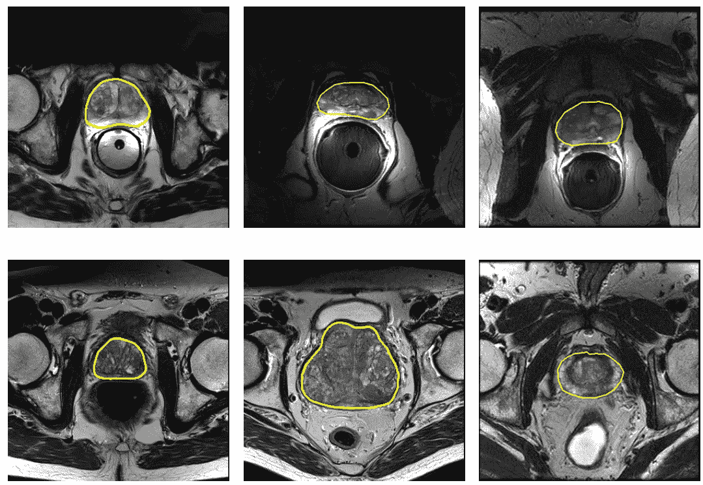
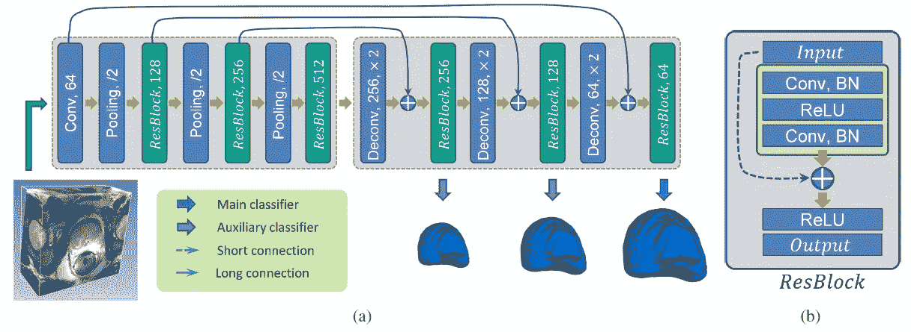
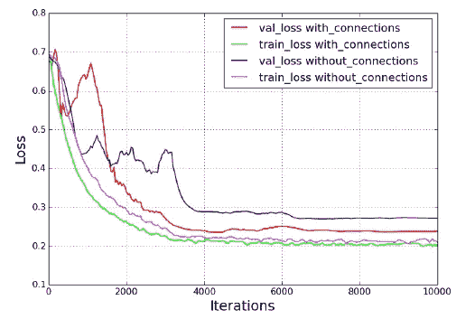
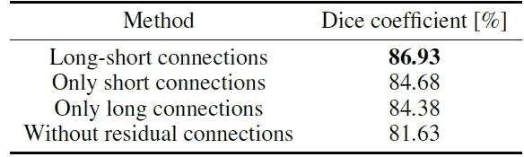
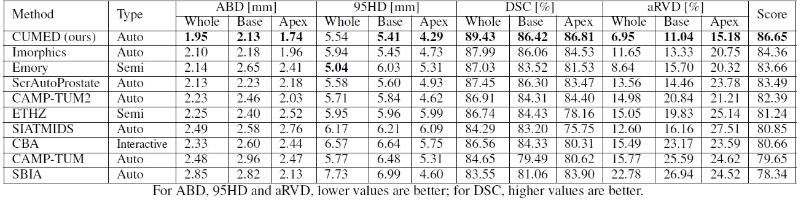
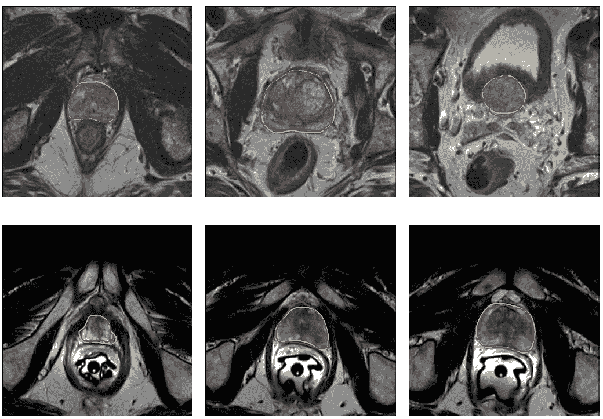

# 综述:3D U-Net+ResNet —体积卷积+长短残差连接(生物医学图像分割)

> 原文：<https://towardsdatascience.com/review-3d-u-net-resnet-volumetric-convolutions-long-short-residual-connections-biomedical-3a7da3f98dae?source=collection_archive---------13----------------------->

## 胜过类似 V-Net 的网络

**Example of prostate MR images displaying large variations (Only centre part)**

在这个故事中，回顾了一篇论文“**使用混合残差连接的体积转换，用于从 3D MR 图像中自动分割前列腺**”。这是一个使用[**3D U-Net**](/review-3d-u-net-volumetric-segmentation-medical-image-segmentation-8b592560fac1)**+**[**ResNet**](/review-resnet-winner-of-ilsvrc-2015-image-classification-localization-detection-e39402bfa5d8)概念的网络。对于 3D 磁共振(MR)图像，**从 3D MR 图像中手动分割耗时且主观，可重复性有限**。它严重依赖于经验，并且在观察者之间和观察者内部有很大的差异。另一方面，自动分段非常具有挑战性:

*   首先，**由于不同的 MR 扫描协议，不同的 MR 图像具有全局的扫描间可变性和扫描内强度变化**，例如有/没有直肠内线圈。
*   第二，**缺乏清晰的前列腺边界**由于前列腺和周围组织的外观相似。
*   第三，**由于病变或图像分辨率不同，前列腺在不同受试者之间的大小和形状差异很大**。

在这项工作中，混合使用长短剩余连接，提出了具有体积卷积的类 U-Net 网络。这是由 **CUMED** 团队在**香港中文大学(CUHK)** 的 **MICCAI 前列腺 MR 图像分割(PROMISE12)挑战数据集**上所做的工作。这是一篇 **2017 AAAI** 论文，引用次数超过 **90 次**。( [Sik-Ho Tsang](https://medium.com/u/aff72a0c1243?source=post_page-----3a7da3f98dae--------------------------------) @中)

# 概述

1.  **网络架构**
2.  **混合短长剩余连接**
3.  **消融研究**
4.  **与最先进方法的比较**

# **1。网络架构和混合长短残留连接**

**(a) Network Structure, (b) ResBlock**

## 1.1.基本体积转换网络

*   2D 完全转换网络(FCN)扩展为**体积转换网络**以实现体积到体积的预测。
*   从**下采样路径**中，我们只能获得粗略的预测，这对于一些检测和分类任务来说是足够的，但是**不适用于基于体素的语义分割**。
*   在 ResBlocks 之间应用三个 **2×2×2 最大池层，跨距为 2** 。
*   由**去卷积和卷积层**组成的**上采样路径**被实现为**生成具有更高分辨率的密集预测**。
*   通过 3D 方式的卷积、反卷积和汇集工作，网络可以在提取要素和进行预测时完全保留和利用 3D 空间信息。

## 1.2.深度监督机制

*   利用网络中的深度监督机制来加快收敛速度。
*   在网络末端增加一个卷积层(核大小 1×1×1)，生成**主预测**。
*   此外，采用几个卷积层(核大小 1×1×1)，然后在上采样路径中使用隐藏特征映射来获得**辅助粗略预测**，然后使用解卷积层来获得具有相同输入大小的辅助密集预测。
*   **当训练体积 ConvNet 时，主预测和辅助预测的交叉熵损失的加权和被最小化**。
*   原则上，深度监督机制可以在训练期间起到强有力的“**规则化**的作用，因此对于用有限的训练数据训练 ConvNet 是重要的。

# **2。混合短长**剩余**连接**

*   长和短剩余连接的使用就像 [U-Net+ResNet](https://medium.com/datadriveninvestor/review-u-net-resnet-the-importance-of-long-short-skip-connections-biomedical-image-ccbf8061ff43) 一样。

## 2.1.短剩余连接

*   第一种残差连接用于**构建局部残差块(ResBlocks)** ，如图的(b)部分所示。
*   在 ResBlock 中，它由两个卷积层和两个校正线性单元(ReLUs)组成。

## 2.2.长剩余连接

*   **长残差连接:**第二种残差连接用于**连接下采样和上采样路径**中具有相同分辨率的残差块，如图(a)部分所示。
*   这些剩余连接可以在 ConvNet 中显式传播两种重要信息。
*   首先，它们可以**将空间位置信息向前传播到上采样路径**，以便恢复由下采样操作引起的空间信息丢失，从而进行更精确的分割。
*   第二，使用求和操作来构建剩余连接，该架构可以更平滑地将梯度流向后传播，从而提高训练效率和网络性能。
*   因此，这些连接可以**在端到端训练过程**期间有效地向前和向后传播上下文和梯度信息。

# 3.消融研究

## 3.1.资料组

*   **使用 MICCAI 前列腺 MR 图像分割(PROMISE12)挑战数据集**。
*   **训练** **数据集**包含**前列腺**的 50 个横向 T2 加权 MR 图像和相应的分割基础事实。
*   **测试** **数据集**由 **30 幅 MR 图像**组成，地面实况由组织者拿出进行独立评估。
*   将所有 MR 体积转换为 0.625×0.625×1.5 mm 的固定分辨率，然后将其归一化为零均值和单位方差。
*   增强操作包括旋转(90 度、180 度和 270 度)和轴向翻转。

## 3.2.培训和测试

*   用的是 Caffe。
*   使用 NVIDIA TITAN X GPU，由于有限的 GPU 内存，在训练网络时，从每个样本中随机裁剪 **64×64×16 个子体积作为输入。**
*   在测试过程中，**重叠滑动窗口策略**用于裁剪子体积。并且**这些子体积**的概率图的平均值被用于获得整个体积预测。
*   子体积大小也是 64×64×16，步距是 50×50×12。一般来说，训练网络大约需要 **4 小时，处理一张 320×320×60** 大小的 MR 图像大约需要 **12 秒。**
*   消融研究采用 10 倍交叉验证。

**Training and validation loss of networks with and without mixed residual connections**

**Cross validation performance with different configurations.**

*   当然，无论是长剩余连接还是短剩余连接，Dice 系数都是最高的。

# **4。与最先进方法的比较**

**Quantitative comparison between the proposed method and other methods**

*   PROMISE12 挑战中使用的评估指标包括 Dice 系数(DSC)、体积之间绝对差异的百分比(aRVD)、体积边界点之间最短距离的平均值(ABD)和 95% Hausdorff 距离(95HD)。然后主办方算了一个**总分**，如上图。
*   在论文提交之前，共有 21 个团队提交了他们的结果，只有前 10 个团队列在表格中。
*   前十名中的七个团队采用了各种手工制作的功能。除了 team (CUMED)之外，使用 ConvNet 的另外两个小组是 SIATMIDS 和 CAMP-TUM2。
*   团队 CAMP-TUM2 有一个 [V 网](/review-v-net-volumetric-convolution-biomedical-image-segmentation-aa15dbaea974)般的网络。
*   再次，当然是 CUMED 队，凭借使用 [3D U-Net](/review-3d-u-net-volumetric-segmentation-medical-image-segmentation-8b592560fac1) 般的网络和 [U-Net+ResNet](https://medium.com/datadriveninvestor/review-u-net-resnet-the-importance-of-long-short-skip-connections-biomedical-image-ccbf8061ff43) 般的长短剩余连接，以 86.65 分的成绩遥遥领先。

**Qualitative segmentation results of case 4 (first row) and case 22 (second row) at the apex(left), center (middle) and base (right) of the prostate in testing dataset.**

## 参考

【2017 AAAI】【3D U-Net+ResNet】
[具有混合残差连接的体积 ConvNets，用于从 3D MR 图像中自动分割前列腺](https://appsrv.cse.cuhk.edu.hk/~lqyu/papers/AAAI17_Prostate.pdf)

## 我以前的评论

)(他)(们)(都)(不)(在)(这)(些)(事)(上)(,)(我)(们)(还)(不)(在)(这)(些)(事)(上)(有)(什)(么)(情)(况)(?)(我)(们)(都)(不)(在)(这)(些)(情)(况)(上)(,)(我)(们)(还)(没)(有)(什)(么)(情)(况)(,)(我)(们)(还)(没)(有)(什)(么)(情)(况)(,)(我)(们)(还)(没)(有)(什)(么)(情)(况)(,)(我)(们)(还)(没)(有)(什)(么)(好)(好)(的)(情)(感)(。 )(他)(们)(都)(不)(在)(这)(些)(事)(上)(,)(她)(们)(还)(不)(在)(这)(些)(事)(上)(有)(什)(么)(情)(况)(呢)(?)(她)(们)(都)(不)(在)(这)(些)(情)(况)(下)(,)(她)(们)(还)(不)(在)(这)(些)(事)(上)(有)(什)(么)(情)(况)(吗)(?)(她)(们)(们)(都)(不)(在)(这)(些)(事)(上)(,)(她)(们)(们)(还)(不)(在)(这)(些)(事)(上)(,)(她)(们)(们)(还)(不)(在)(这)(些)(事)(上)(有)(什)(么)(好)(的)(情)(情)(况)(。 [PyramidNet](https://medium.com/@sh.tsang/review-pyramidnet-deep-pyramidal-residual-networks-image-classification-85a87b60ae78) [DRN](/review-drn-dilated-residual-networks-image-classification-semantic-segmentation-d527e1a8fb5) [DPN](/review-dpn-dual-path-networks-image-classification-d0135dce8817) [残留注意网络](/review-residual-attention-network-attention-aware-features-image-classification-7ae44c4f4b8) [MSDNet](/review-msdnet-multi-scale-dense-networks-image-classification-4d949955f6d5) [ShuffleNet V1](/review-shufflenet-v1-light-weight-model-image-classification-5b253dfe982f)

**物体检测** [过食](https://medium.com/coinmonks/review-of-overfeat-winner-of-ilsvrc-2013-localization-task-object-detection-a6f8b9044754)[R-CNN](https://medium.com/coinmonks/review-r-cnn-object-detection-b476aba290d1)[快 R-CNN](https://medium.com/coinmonks/review-fast-r-cnn-object-detection-a82e172e87ba)[快 R-CNN](/review-faster-r-cnn-object-detection-f5685cb30202)[MR-CNN&S-CNN](/review-mr-cnn-s-cnn-multi-region-semantic-aware-cnns-object-detection-3bd4e5648fde)[DeepID-Net](/review-deepid-net-def-pooling-layer-object-detection-f72486f1a0f6)[CRAFT](/review-craft-cascade-region-proposal-network-and-fast-r-cnn-object-detection-2ce987361858)[R-FCN](/review-r-fcn-positive-sensitive-score-maps-object-detection-91cd2389345c)】 [[G-RMI](/review-g-rmi-winner-in-2016-coco-detection-object-detection-af3f2eaf87e4)][[TDM](https://medium.com/datadriveninvestor/review-tdm-top-down-modulation-object-detection-3f0efe9e0151)][[SSD](/review-ssd-single-shot-detector-object-detection-851a94607d11)][[DSSD](/review-dssd-deconvolutional-single-shot-detector-object-detection-d4821a2bbeb5)][[约洛夫 1](/yolov1-you-only-look-once-object-detection-e1f3ffec8a89) ] [ [约洛夫 2 /约洛 9000](/review-yolov2-yolo9000-you-only-look-once-object-detection-7883d2b02a65) ] [ [约洛夫 3](/review-yolov3-you-only-look-once-object-detection-eab75d7a1ba6)[[FPN](/review-fpn-feature-pyramid-network-object-detection-262fc7482610)[[视网膜网](/review-retinanet-focal-loss-object-detection-38fba6afabe4)[[DCN](/review-dcn-deformable-convolutional-networks-2nd-runner-up-in-2017-coco-detection-object-14e488efce44)

**语义切分** [FCN](/review-fcn-semantic-segmentation-eb8c9b50d2d1)[de convnet](/review-deconvnet-unpooling-layer-semantic-segmentation-55cf8a6e380e)[deeplabv 1&deeplabv 2](/review-deeplabv1-deeplabv2-atrous-convolution-semantic-segmentation-b51c5fbde92d)[CRF-RNN](/review-crf-rnn-conditional-random-fields-as-recurrent-neural-networks-semantic-segmentation-a11eb6e40c8c)】[SegNet](/review-segnet-semantic-segmentation-e66f2e30fb96)】[parse net](https://medium.com/datadriveninvestor/review-parsenet-looking-wider-to-see-better-semantic-segmentation-aa6b6a380990)[dilated net](/review-dilated-convolution-semantic-segmentation-9d5a5bd768f5)[DRN](/review-drn-dilated-residual-networks-image-classification-semantic-segmentation-d527e1a8fb5)[RefineNet](/review-refinenet-multi-path-refinement-network-semantic-segmentation-5763d9da47c1)

**生物医学图像分割** [[cumed vision 1](https://medium.com/datadriveninvestor/review-cumedvision1-fully-convolutional-network-biomedical-image-segmentation-5434280d6e6)][[cumed vision 2/DCAN](https://medium.com/datadriveninvestor/review-cumedvision2-dcan-winner-of-2015-miccai-gland-segmentation-challenge-contest-biomedical-878b5a443560)][[U-Net](/review-u-net-biomedical-image-segmentation-d02bf06ca760)][[CFS-FCN](https://medium.com/datadriveninvestor/review-cfs-fcn-biomedical-image-segmentation-ae4c9c75bea6)][[U-Net+ResNet](https://medium.com/datadriveninvestor/review-u-net-resnet-the-importance-of-long-short-skip-connections-biomedical-image-ccbf8061ff43)][[多通道](/review-multichannel-segment-colon-histology-images-biomedical-image-segmentation-d7e57902fbfc)][[V-Net](/review-v-net-volumetric-convolution-biomedical-image-segmentation-aa15dbaea974)][[3D U-Net](/review-3d-u-net-volumetric-segmentation-medical-image-segmentation-8b592560fac1)][[M FCN](/review-m²fcn-multi-stage-multi-recursive-input-fully-convolutional-networks-biomedical-image-4f8d5e3f07f1) 

**实例分割** [ [SDS](https://medium.com/datadriveninvestor/review-sds-simultaneous-detection-and-segmentation-instance-segmentation-80b2a8ce842b) ] [ [超列](/review-hypercolumn-instance-segmentation-367180495979) ] [ [深度掩码](/review-deepmask-instance-segmentation-30327a072339) ] [ [锐度掩码](/review-sharpmask-instance-segmentation-6509f7401a61) ] [ [多路径网络](/review-multipath-mpn-1st-runner-up-in-2015-coco-detection-segmentation-object-detection-ea9741e7c413) ] [ [MNC](/review-mnc-multi-task-network-cascade-winner-in-2015-coco-segmentation-instance-segmentation-42a9334e6a34) ] [ [实例中心](/review-instancefcn-instance-sensitive-score-maps-instance-segmentation-dbfe67d4ee92) ] [ [FCIS](/review-fcis-winner-in-2016-coco-segmentation-instance-segmentation-ee2d61f465e2)

)(我)(们)(都)(不)(知)(道)(,)(我)(们)(还)(是)(不)(知)(道)(,)(我)(们)(还)(是)(不)(知)(道)(,)(我)(们)(还)(是)(不)(知)(道)(,)(我)(们)(还)(是)(不)(知)(道)(,)(我)(们)(还)(是)(不)(知)(道)(,)(我)(们)(还)(是)(不)(知)(道)(,)(我)(们)(还)(是)(不)(知)(道)(。

 **[【DeepPose】](/review-deeppose-cascade-of-cnn-human-pose-estimation-cf3170103e36)[【汤普森 NIPS'14】](/review-tompson-nips14-joint-training-of-cnn-and-graphical-model-human-pose-estimation-95016bc510c)[【汤普森 CVPR'15】](/review-tompson-cvpr15-spatial-dropout-human-pose-estimation-c7d6a5cecd8c)**