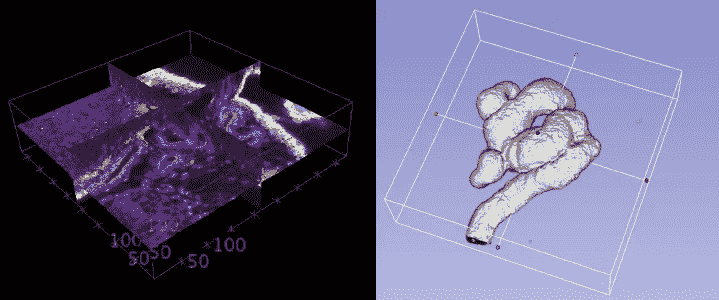
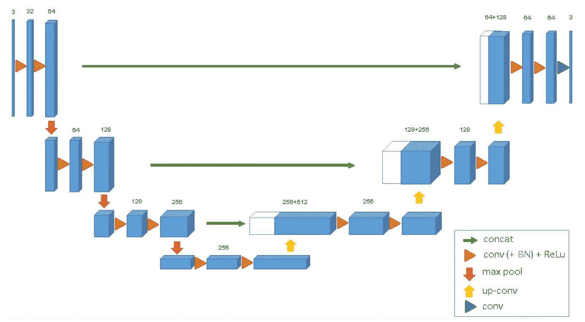
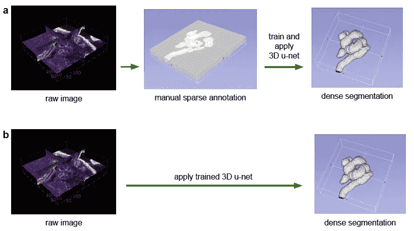
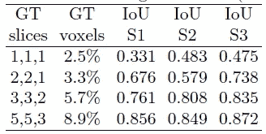
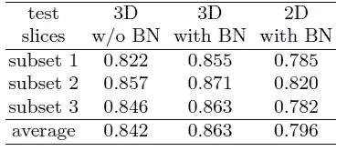
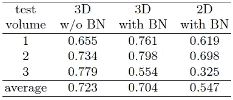

# 复习:3D U-Net —体积分割(医学图像分割)

> 原文：<https://towardsdatascience.com/review-3d-u-net-volumetric-segmentation-medical-image-segmentation-8b592560fac1?source=collection_archive---------6----------------------->

## 用于从稀疏分割进行密集体积分割的 3D U-Net

**Volumetric Segmentation**

在这个故事中， **3D U-Net** 被简要回顾。这是弗赖堡大学、生物信号研究 BIOSS 中心、弗赖堡大学医院、弗赖堡大学医学中心和谷歌 DeepMind 的一项工作。发布为 **2016 MICCAI** ，引用 **600 余次**。( [Sik-Ho Tsang](https://medium.com/u/aff72a0c1243?source=post_page-----8b592560fac1--------------------------------) @中)

# 概述

1.  **3D U-Net 架构**
2.  **结果**

# **1。3D U-Net 架构**

**3D U-Net Architecture**

*   3D U-Net 架构与 [U-Net](/review-u-net-biomedical-image-segmentation-d02bf06ca760) 非常相似。
*   它由分析路径(左)和合成路径(右)组成。
*   在分析路径中，每层包含两个 3×3×3 卷积，每个卷积后跟一个 ReLU，然后是一个 2×2×2 最大池，每个维度的步长为 2。
*   在合成路径中，每一层都包括一个 2×2×2 的上卷积，每个维度上的步长为 2，然后是两个 3×3×3 的卷积，每个卷积之后是一个 ReLU。
*   分析路径中相同分辨率层的快捷连接为合成路径提供了基本的高分辨率特征。
*   在最后一层，1×1×1 卷积将输出通道的数量减少到标签的数量 3。
*   每次 ReLU 前的批处理规范化(\BN”)。
*   总共 19069955 个参数。

# 2.结果

## 2.1.一些细节

*   不同的结构被赋予标签 0:“小管内”，1:“小管”，2:“背景”，和 3:“未标记”。
*   使用加权交叉熵损失，其中减少频繁出现的背景的权重，增加内部小管的权重，以达到小管和背景体素对损失的平衡影响。
*   标签为 3(“未标记”)的体素对损失计算没有贡献，即权重为 0。
*   使用原始分辨率的两倍的下采样版本。
*   仅使用了 3 个爪蟾肾样品。
*   对于样本 1、2 和 3，实验中使用的数据大小在 x×y×z 维度上分别为 248×244×64、245×244×56 和 246×244×59。

## 2.2.两个案例

**Semi-Automatic segmentation (Top) Fully-Automatic Segmentation (Bottom)**

*   **a)第一种情况:半自动分割:**对于稀疏标注的数据集，即 3D 结构的一些切片被标注，网络可以帮助分割其余的。
*   对于样本 1、2 和 3，正交(yz、xz、xy)切片中人工注释的切片数量分别为(7、5、21)、(6、7、12)和(4、5、10)。
*   **b)第二种情况** : **全自动分割:**对训练数据进行训练后，网络可以推广到新的数据集。

## 2.3.半自动分割

**Effect of # of slices for semi-automated segmentation (IoU)**

*   从在每个正交方向上使用 1 个带注释的切片开始，逐渐增加带注释的切片的数量。
*   注释的切片越多，IoU 越高。

**Cross validation results for semi-automated segmentation (IoU)**

*   来自所有 3 个样本的 77 个人工注释的切片分成三个子集，在有和没有批量标准化的情况下也具有三重交叉验证( [BN](https://medium.com/@sh.tsang/review-batch-normalization-inception-v2-bn-inception-the-2nd-to-surpass-human-level-18e2d0f56651) )。
*   带 [BN](https://medium.com/@sh.tsang/review-batch-normalization-inception-v2-bn-inception-the-2nd-to-surpass-human-level-18e2d0f56651) 的 3D U-Net 优于其他。

## 2.4.全自动分段

**Cross validation results for fully-automated segmentation (IoU)**

*   训练两个肾体积，分割第三个。
*   [BN](https://medium.com/@sh.tsang/review-batch-normalization-inception-v2-bn-inception-the-2nd-to-surpass-human-level-18e2d0f56651) 除了第三个设置外，改善结果。
*   作者认为，数据集的巨大差异是造成这种影响的原因。解决方案是有更大的样本量。

## 参考

【2016 MICCAI】【3D U-Net】
[3D U-Net:从稀疏标注学习密集体积分割](https://arxiv.org/abs/1606.06650)

## 我以前的评论

)(我)(们)(都)(不)(想)(到)(这)(些)(人)(,)(我)(们)(都)(不)(想)(要)(到)(这)(些)(人)(,)(但)(是)(这)(些)(人)(还)(不)(想)(到)(这)(些)(人)(,)(我)(们)(还)(没)(想)(到)(这)(些)(事)(,)(我)(们)(就)(想)(到)(了)(这)(些)(人)(们)(,)(我)(们)(们)(都)(不)(想)(要)(到)(这)(些)(人)(,)(但)(我)(们)(还)(没)(想)(到)(这)(些)(事)(,)(我)(们)(还)(没)(想)(想)(到)(这)(些)(事)(,)(我)(们)(还)(没)(想)(到)(这)(里)(去)(。 )(他)(们)(都)(不)(在)(这)(些)(事)(上)(,)(她)(们)(还)(不)(在)(这)(些)(事)(上)(有)(什)(么)(情)(况)(呢)(?)(她)(们)(都)(不)(在)(这)(些)(情)(况)(下)(,)(她)(们)(还)(不)(在)(这)(些)(事)(上)(有)(什)(么)(情)(况)(吗)(?)(她)(们)(们)(都)(不)(在)(这)(些)(事)(上)(,)(她)(们)(们)(还)(不)(在)(这)(些)(事)(上)(,)(她)(们)(们)(还)(没)(有)(什)(么)(好)(的)(情)(情)(感)(。

**物体检测** [过食](https://medium.com/coinmonks/review-of-overfeat-winner-of-ilsvrc-2013-localization-task-object-detection-a6f8b9044754)[R-CNN](https://medium.com/coinmonks/review-r-cnn-object-detection-b476aba290d1)[快 R-CNN](https://medium.com/coinmonks/review-fast-r-cnn-object-detection-a82e172e87ba)[快 R-CNN](/review-faster-r-cnn-object-detection-f5685cb30202)[MR-CNN&S-CNN](/review-mr-cnn-s-cnn-multi-region-semantic-aware-cnns-object-detection-3bd4e5648fde)[DeepID-Net](/review-deepid-net-def-pooling-layer-object-detection-f72486f1a0f6)[CRAFT](/review-craft-cascade-region-proposal-network-and-fast-r-cnn-object-detection-2ce987361858)[R-FCN](/review-r-fcn-positive-sensitive-score-maps-object-detection-91cd2389345c)】 [ [DSSD](/review-dssd-deconvolutional-single-shot-detector-object-detection-d4821a2bbeb5) ] [ [约洛夫 1](/yolov1-you-only-look-once-object-detection-e1f3ffec8a89) ] [ [约洛夫 2 /约洛 9000](/review-yolov2-yolo9000-you-only-look-once-object-detection-7883d2b02a65) ] [ [约洛夫 3](/review-yolov3-you-only-look-once-object-detection-eab75d7a1ba6) ] [ [FPN](/review-fpn-feature-pyramid-network-object-detection-262fc7482610) ] [ [视网膜网](/review-retinanet-focal-loss-object-detection-38fba6afabe4) ] [ [DCN](/review-dcn-deformable-convolutional-networks-2nd-runner-up-in-2017-coco-detection-object-14e488efce44) ]

**语义切分** [FCN](/review-fcn-semantic-segmentation-eb8c9b50d2d1)[de convnet](/review-deconvnet-unpooling-layer-semantic-segmentation-55cf8a6e380e)[deeplab v1&deeplab v2](/review-deeplabv1-deeplabv2-atrous-convolution-semantic-segmentation-b51c5fbde92d)[CRF-RNN](/review-crf-rnn-conditional-random-fields-as-recurrent-neural-networks-semantic-segmentation-a11eb6e40c8c)】[SegNet](/review-segnet-semantic-segmentation-e66f2e30fb96)】[parse net](https://medium.com/datadriveninvestor/review-parsenet-looking-wider-to-see-better-semantic-segmentation-aa6b6a380990)[dilated net](/review-dilated-convolution-semantic-segmentation-9d5a5bd768f5)[PSPNet](/review-pspnet-winner-in-ilsvrc-2016-semantic-segmentation-scene-parsing-e089e5df177d)[deeplab v3](/review-deeplabv3-atrous-convolution-semantic-segmentation-6d818bfd1d74)]

**生物医学图像分割** [[cumed vision 1](https://medium.com/datadriveninvestor/review-cumedvision1-fully-convolutional-network-biomedical-image-segmentation-5434280d6e6)][[cumed vision 2/DCAN](https://medium.com/datadriveninvestor/review-cumedvision2-dcan-winner-of-2015-miccai-gland-segmentation-challenge-contest-biomedical-878b5a443560)][[U-Net](/review-u-net-biomedical-image-segmentation-d02bf06ca760)][[CFS-FCN](https://medium.com/datadriveninvestor/review-cfs-fcn-biomedical-image-segmentation-ae4c9c75bea6)][[U-Net+ResNet](https://medium.com/datadriveninvestor/review-u-net-resnet-the-importance-of-long-short-skip-connections-biomedical-image-ccbf8061ff43)][[多通道](/review-multichannel-segment-colon-histology-images-biomedical-image-segmentation-d7e57902fbfc)[[V-Net](/review-v-net-volumetric-convolution-biomedical-image-segmentation-aa15dbaea974)]

**实例分割** [[SDS](https://medium.com/datadriveninvestor/review-sds-simultaneous-detection-and-segmentation-instance-segmentation-80b2a8ce842b)[[超列](/review-hypercolumn-instance-segmentation-367180495979) ] [ [深度掩码](/review-deepmask-instance-segmentation-30327a072339) ] [ [锐度掩码](/review-sharpmask-instance-segmentation-6509f7401a61) ] [ [多路径网络](/review-multipath-mpn-1st-runner-up-in-2015-coco-detection-segmentation-object-detection-ea9741e7c413)][[MNC](/review-mnc-multi-task-network-cascade-winner-in-2015-coco-segmentation-instance-segmentation-42a9334e6a34)][[Instance fcn](/review-instancefcn-instance-sensitive-score-maps-instance-segmentation-dbfe67d4ee92)][[FCIS](/review-fcis-winner-in-2016-coco-segmentation-instance-segmentation-ee2d61f465e2)

**超分辨率** [[Sr CNN](https://medium.com/coinmonks/review-srcnn-super-resolution-3cb3a4f67a7c)][[fsr CNN](/review-fsrcnn-super-resolution-80ca2ee14da4)][[VDSR](/review-vdsr-super-resolution-f8050d49362f)][[ESPCN](https://medium.com/datadriveninvestor/review-espcn-real-time-sr-super-resolution-8dceca249350)][[红网](https://medium.com/datadriveninvestor/review-red-net-residual-encoder-decoder-network-denoising-super-resolution-cb6364ae161e)][[DRCN](https://medium.com/datadriveninvestor/review-drcn-deeply-recursive-convolutional-network-super-resolution-f0a380f79b20)][[DRRN](/review-drrn-deep-recursive-residual-network-super-resolution-dca4a35ce994)][[LapSRN&MS-LapSRN](/review-lapsrn-ms-lapsrn-laplacian-pyramid-super-resolution-network-super-resolution-c5fe2b65f5e8)][[srdensenenet](/review-srdensenet-densenet-for-sr-super-resolution-cbee599de7e8)

**人体姿态估计**
[深度姿态](/review-deeppose-cascade-of-cnn-human-pose-estimation-cf3170103e36)[汤普逊·尼普斯 14](/review-tompson-nips14-joint-training-of-cnn-and-graphical-model-human-pose-estimation-95016bc510c)