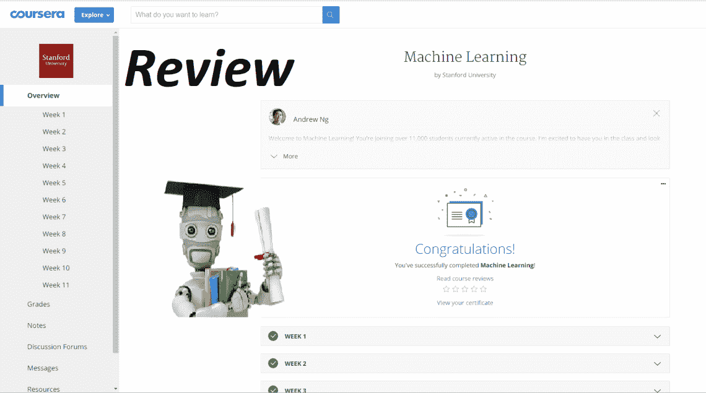
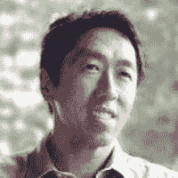
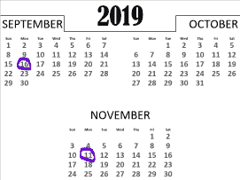

# 回顾:吴恩达的机器学习课程

> 原文：<https://towardsdatascience.com/review-andrew-ngs-machine-learning-course-b905aafdb7d9?source=collection_archive---------12----------------------->

吴恩达教授的机器学习课程于 2011 年发布。出版 8 年后，吴恩达的课程仍然被列为顶级机器学习课程之一。这已经成为 [Coursera](https://www.coursera.org/) 的一门主食，说实话，也是机器学习的一门主食。

截至本文发表时，已经有 2，632，122 名用户注册了该课程。那是刚刚入学，但不知道他们是否已经完成。据估计，开始学习的用户中有 1% — 15%完成了课程。因此，低端有 26，321 人，高端有 394，818 名注册用户全程观看了课程。

我于 2019 年 11 月 11 日完成课程，这将是对这门课程的诚实回顾。在开始之前，我已经搜索了一些常见问题以及我自己的问题。因此，让我们深入到我对吴恩达的机器学习课程的诚实评论中。

*但是首先……*

# 什么是 MOOCs？

大规模提供在线课程，简称 MOOCs，是在预算内获得自学教育的一个很好的方式。这些类型的课程自 2008 年第一门课程“连接主义和连接知识/2008”发布以来就一直存在。这是由加拿大曼尼托巴大学的教授斯蒂芬·道恩斯和乔治·西门子发明的。

这些课程的好处在于它们通常是免费的。然而，订阅托管平台或为完成证书付费已经变得很普遍。

*好了，让我们进入课程提问吧！*

# 谁是吴恩达？

Coursera headshot.

吴恩达是世界上最著名的人工智能专家之一。他是 2011 年谷歌大脑的创始人和负责人，同年他成为 Coursera 的联合创始人。他之前是百度的首席科学家。目前，他是人工智能基金的普通合伙人，也是 deeplearning.ai 和 Landing AI 的创始人。他还是斯坦福大学计算机科学的兼职教授。不用说，这家伙有相当的[履历](https://www.linkedin.com/in/andrewyng)。

# 课程结构是怎样的？

这门为期 11 周的完全在线课程由视频和阅读讲座、测验和编程作业组成。不是所有的周都包含编程作业，但是每个周主题都有测验。

## 视频讲座和测验

视频讲座需要 10-15 分钟来完成，每个讲座至少包含一个测验问题，以便让学生明白他想要表达的意思。阅读课包含额外的笔记，如后期制作中发现的任何错误，所以如果你是一个听觉型学习者，请确保至少看一眼。

测验可能会很难，但他会在他的视频讲座中提供幻灯片，以及每周可以参考的阅读资源。

## 编码任务

编码作业是这门课程的重要组成部分。不过在我自己看来唯一的缺点就是用 Octave(免费)或者 Matlab(付费)完成。你确实得到了参加 Matlab 课程的 12 周许可证。

我很想用 Python 或 R 来完成这个课程，但是他用教和学的简单性验证了他的决定。他继续讲述了在这些语言中构建原型是多么容易，并且硅谷在进入 Python 或 r 之前大量使用它。Octave 语言很容易学习，并且有大量的文档和线程可用于计算任务。

# 吴恩达的机器学习课程到底涵盖了哪些内容？

吴恩达的机器学习课程可以分为 4 个不同的主题:

*   监督学习(线性回归、逻辑回归、神经网络、支持向量机)
*   无监督学习(K 均值、PCA、异常检测)
*   特殊应用/主题(推荐系统、大规模机器学习)
*   关于构建机器学习系统的建议(偏差/方差、正则化、学习算法评估、学习曲线、误差分析、上限分析)

他主要关注机器学习的理论和概念，而不是编码部分。如果你刚刚开始学习机器学习，这是一个很好的策略。

关于建立机器学习系统的建议是课程中非常重要的一部分。他将带您了解如何正确训练您的模型，以及在模型遇到问题时该如何处理。他为你提供了你在未来模型中需要的工具。

# 时间承诺是什么？

您预计每周将投入 5-7 个小时来完成该课程。尽管这是一个为期 11 周的课程，但你可以提前完成。2019 年 9 月 16 日开课，2019 年 11 月 11 日结束；不到两个月。前 2 周和后 2 周相当简单，可以捆绑在一起。

# 前提条件是什么？

接触线性代数和微积分将是有益的。吴恩达深入研究了机器学习的数学。这里有一个帮助你复习数学的列表:

*   [线性代数的本质](https://www.youtube.com/watch?v=fNk_zzaMoSs&list=PLZHQObOWTQDPD3MizzM2xVFitgF8hE_ab)由 3Blue1Brown
*   [微积分的本质](https://www.youtube.com/watch?v=WUvTyaaNkzM&list=PLZHQObOWTQDMsr9K-rj53DwVRMYO3t5Yr)由 3Blue1Brown
*   [可汗学院](https://www.khanacademy.org/)

他确实很快地完成了一些数学运算，所以暂停一下视频，让你的大脑思考一下他在说什么。我不得不这样做好几次。

# 这要花多少钱？

这门课程有免费、付费和经济资助三种选择。在免费版本中，你可以接触到一些材料，但不能接触到评分作业。然而，花 80 美元你就可以接触到整个课程，包括评分作业，并且会得到一个数字证书来炫耀。如果你愿意，可以选择将证书放在你的 LinkedIn 页面上，或者通过链接与任何人分享。

如果你有预算或者雇主愿意，一定要选择付费版本。分级作业是筛选主题和理解所涉及模型的数学运算的好方法。以及努力获得证书，并能够打印出来是一种有益的感觉。

# 学完这门课我能做什么？

继续你的机器学习教育。跳上 Kaggle，玩转泰坦尼克号数据集及其分类问题。一旦你掌握了这一点，就跳到其他数据集中展示你新开发的技能。很快，你就可以了解深度学习，并参加他的 deeplearning.ai 课程。

仅仅凭这个证书找工作是不可能的。明智地使用 GitHub 或任何存储库来存放您的代码，从长远来看会对您有帮助。绝对值得花时间记录你的学习成果，这样你就可以在职业生涯中以及潜在的雇主和客户面前参考它们。

我创造了 [5 个学习机器学习的简单步骤](https://medium.com/analytics-vidhya/5-easy-steps-to-master-machine-learning-18621ac795d7)来帮助你进行机器学习的自我教育。完成吴恩达课程后，您已经部分完成了几个步骤！

# 吴恩达的机器学习课程还有意义吗？

这个问题是我报名前突然想到的。随着机器学习发展如此之快，并接管了我们生活的每个领域，担心它不相关是有道理的。然而，这种担心可以打消了。吴恩达设计课程的方式是为了长远打算。他没有涉及任何外部图书馆，以便当他们改变课程时不会受到影响。他专注于机器学习的理论和概念，而不是编码基础。

## 欺骗的

与它的相关性有关的另一个问题是它在防止作弊方面的有效性。对于每个测验，您需要勾选一个方框，确认您回答的所有问题都来自您自己，而不是其他人。然而，由于它的流行，一些存储库包含测验的答案和完成的编码作业。如果你被发现作弊，你的 Coursera 账户将被停用，证书作废。

当你选择这门课程时，**不要欺骗**！如果你对机器学习很认真，那就接受挑战吧。他们确实有一个社区论坛，你可以访问并检查以前提出的问题及其答案。如果你的问题之前没人问过，可以发帖，会有人帮你的。

# 最后的想法

这个课程是一次很棒的经历，我非常喜欢这个主题。它的结构方式温和地帮助你度过每一周，这是令人惊讶的。我感到失望的是，它不是用一种通用的机器学习语言完成的，但你从中获得的东西超过了你想要的。对于刚刚开始机器学习之旅的人，我强烈推荐这个课程的付费版本。如果你有多年的经验，你可能会觉得课程有点无聊，所以如果你属于这一类，就去找免费版本。

非常感谢您阅读这篇评论。我祝你一路顺风。

在我们重新学习之前，

