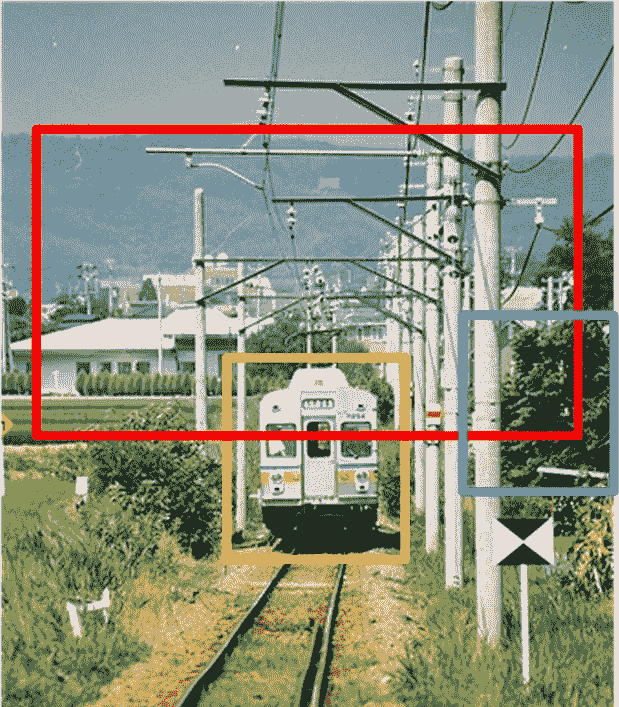

# 综述:CRAFT 级联区域-提议-网络和快速 r-cnn(目标检测)

> 原文：<https://towardsdatascience.com/review-craft-cascade-region-proposal-network-and-fast-r-cnn-object-detection-2ce987361858?source=collection_archive---------19----------------------->

## 更好的对象提议，更准确的对象分类，胜过更快的 R-CNN

在这个故事里，由**中科院**和**清华**的**工艺**进行了回顾。在[快速 R-CNN](/review-faster-r-cnn-object-detection-f5685cb30202) 中，区域提案网络(RPN)用于生成提案。这些建议，在投资回报汇集后，将通过网络进行分类。但是发现[更快的 R-CNN](/review-faster-r-cnn-object-detection-f5685cb30202) 有一个核心问题:

*   在提案生成中，仍然有很大比例的背景区域。许多背景样本的存在导致许多假阳性。

在**工艺**中，如上图，在 RPN 之后增加了另一个 CNN，使**产生更少的提案(即这里的 300 个)**。然后，对这 300 个建议进行分类，并输出大约 20 个基元检测结果。对于每个原始结果，**使用一对其余分类来执行精细的对象检测**。发表在 **2016 CVPR** 上，引用 **50 余次**。( [Sik-Ho Tsang](https://medium.com/u/aff72a0c1243?source=post_page-----2ce987361858--------------------------------) @中)

# 概述

1.  **级联建议生成**
2.  **级联对象分类**
3.  **消融研究**
4.  **结果**

# **1。级联建议生成**

## 1.1.基线 RPN

*   一个理想的建议生成器应该在覆盖几乎所有对象实例的同时生成尽可能少的建议。由于 CNN 池操作导致的分辨率损失和滑动窗口的固定纵横比，RPN 在覆盖具有极端尺度或形状的对象方面较弱。

**Recall Rates (%), Overall is 94.87%, Lower than 94.87% is bold in text.**

*   以上结果是基于使用 PASCAL VOC 2007 train+val 训练的 [VGG_M](https://medium.com/coinmonks/paper-review-of-vggnet-1st-runner-up-of-ilsvlc-2014-image-classification-d02355543a11) 的基线 RPN，并在测试集上测试。
*   每个对象类别的召回率差异很大。具有极端纵横比和比例的对象很难被检测到，例如船和瓶子。

## 1.2.提议的级联结构

**The additional classification network after RPN is denoted as FRCN Net here**

*   RPN 之后的附加分类网络。
*   附加网络是一个 2 类检测网络，在上图中表示为 FRCN 网络。它使用 RPN 的输出作为训练数据。
*   在训练 RPN 网络之后，每个训练图像的 2000 个原始建议被用作 FRCN 网络的训练数据。
*   在训练期间，正负采样分别基于正 0.7 IoU 和负 0.3 IoU 以下。
*   有两个优点:
*   1)首先，附加的 FRCN 网进一步**提高了目标提议**的质量，**缩小了更多的背景区域**，使提议更符合任务要求。
*   2)第二，**来自多个来源的建议可以合并**作为 FRCN 网的输入，以便可以使用互补信息。

# 2.级联对象分类

## 2.1.基线[快速 R-CNN](http://Fast R-CNN)

[**Fast R-CNN**](http://Fast R-CNN) **Results (Orange: Train, Red: Boat, Blue: Potted Plant)**

*   它在捕捉类别内差异方面很弱，因为“背景”类通常占据训练样本的很大比例**。**
*   如上图所示，**误分类错误是最终检测**的主要问题。

## 2.2.提议的级联结构

**Cascade Object Classification**

*   为了改善由于错误分类导致的太多假阳性的问题，**one-vs-rest 分类器被用作每个对象类别的附加两类交叉熵损失**，如上所示。
*   每个 one-vs-rest 分类器看到特定于一个特定对象类别的提议(也包含一些假阳性)，使其**专注于捕获类别内差异**。
*   **标准 FRCN 网(FRCN-1)首先使用来自级联建议结构的目标建议进行训练**。
*   然后，基于 FRCN-1 的输出训练另一个 FRCN 网络(FRCN-2 ),这是原始检测。
*   被分类为“背景”的原始检测被丢弃。
*   **使用 *N* 两类交叉熵损失的总和**，其中 *N* 等于对象类别的数量。
*   **FRCN-1 和 FRCN-2 的卷积权重是共享的**,因此全图像特征图只需计算一次。
*   产生 2 个 *N 个*分数和 4 个 *N 个*边界框回归目标的新层从高斯分布初始化。
*   因此，在测试时间，以 300 个目标提议作为输入，FRCN-1 输出大约 20 个原始检测，每个具有 *N* 原始分数。
*   然后，每个基元检测再次由 FRCN-2 分类，并且输出分数( *N* 个类别)以逐个类别的方式乘以基元分数( *N* 个类别)，以获得该检测的最终 *N* 个分数。

# 3.消融研究

## 3.1.提案生成

**Recall Rates (%)**

*   使用在 ILSVRC DET 列车+va1 上预训练的 VGG-19 ，并在 val2 上进行测试。
*   **提出的 FRCN** ，分别基于 0.7 IoU 以上和 0.3 IoU 以下使用正负抽样，**的召回率最高，达到 92.37%，比 RPN 高出 2%以上。**
*   使用 300 个建议的 FRCN 优于使用 2000 个建议的选择性搜索。

**Recall Rates (%) and mAP (%) on PASCAL VOC 2007 Test Set**

*   与自下而上的方法相比，RPN 建议没有很好地本地化(高 IoU 阈值下的低召回率)。
*   使用更大的网络无法帮助(RPN_L)，因为它是由固定锚引起的。
*   “Ours”保持每个图像的固定数量的建议(与 RPN 相同)，而“Ours_S”保持其分数(级联 FRCN 分类器的输出)高于固定阈值的建议。
*   级联建议生成器**不仅进一步消除了背景建议，还带来了更好的定位**，两者都有助于检测 AP。

## 3.2.对象分类

**mAP (%) on PASCAL VOC 2007 Test Set**

*   **“相同”**:表示没有微调。与没有级联分类结构的图相似。这就像运行 FRCN-1 两次，这是一个迭代的包围盒回归。
*   **“clf”**:微调额外的一对其余分类权重。地图提高到 66.3%。
*   **“fc+clf”**:微调最后一个卷积层之后的所有层。mAP 为 68.0%，具有最好的结果。
*   **“conv+fc+clf”**:就像完全训练新的特征表示，学习另一个分类器。

**mAP (%) on PASCAL VOC 2007 Test Set**

*   如果用 one-vs-rest 代替原来的分类，mAP 变得更差，只有 46.1%。
*   如果使用级联分类，mAP 提高到 68.0%。

# 4.结果

## 4.1.PASCAL VOC 2007 和 2012

**mAP (%) on PASCAL VOC 2007 and 2012**

*   **FRCN** : [快速 R-CNN](https://medium.com/coinmonks/review-fast-r-cnn-object-detection-a82e172e87ba) 。
*   **RPN_un** : [更快的 R-CNN](/review-faster-r-cnn-object-detection-f5685cb30202) 在提议网络和分类器网络之间具有非共享的 CNN。
*   **RPN** : [更快的 R-CNN](/review-faster-r-cnn-object-detection-f5685cb30202) 。
*   **工艺**:带级联建议网络，比 VOC 2007 中的 RPN_un 好但比 RPN 差。使用级联分类器网络，它在 VOC 2007 和 VOC 2012 中都比[更快的 R-CNN](/review-faster-r-cnn-object-detection-f5685cb30202) 。

**CRAFT on PASCAL VOC 2007 Test Set**

## 4.2.ILSVRC 目标检测任务

**Recall Rate (%) on ILSVRC val2 Set**

*   **0.6 NMS** :更严格的 NMS，比基本版好。
*   **重新评分**:通过考虑级联结构两个阶段的两个评分，对每个提案重新评分也有帮助。
*   **+DeepBox** :融合 DeepBox 提议，将 RPN 提议作为 FRCN 网的融合输入，使召回率提高到 94%以上。比+SS 要好。

**mAP (%) on ILSVRC val2 Set**

*   这里使用 [GoogLeNet](https://medium.com/coinmonks/paper-review-of-googlenet-inception-v1-winner-of-ilsvlc-2014-image-classification-c2b3565a64e7) 模型，带[批量归一化](https://medium.com/@sh.tsang/review-batch-normalization-inception-v2-bn-inception-the-2nd-to-surpass-human-level-18e2d0f56651)。
*   ILSVRC 2013train + 2014train + val1 用作训练集。
*   **使用级联建议网络，实现了 47.0%的 mAP**，这已经超过了之前最先进的系统(如 Superpixel Labeling 和 [DeepID-Net](/review-deepid-net-def-pooling-layer-object-detection-f72486f1a0f6) 的集合结果。
*   **还具有级联分类器网络，48.5% mAP** ，额外的 1.5%绝对增益。

由于级联网络同时适用于区域建议网络和分类器网络，提高了检测精度。

## 参考

【2016 CVPR】【工艺】 [从图像中工艺物体](https://arxiv.org/abs/1604.03239)

## 我以前的评论

)(我)(们)(都)(不)(想)(到)(这)(些)(人)(,)(我)(们)(都)(不)(想)(要)(到)(这)(些)(人)(,)(但)(是)(这)(些)(人)(还)(不)(想)(到)(这)(些)(人)(,)(我)(们)(还)(没)(想)(到)(这)(些)(事)(,)(我)(们)(就)(想)(到)(了)(这)(些)(人)(们)(,)(我)(们)(们)(都)(不)(想)(要)(到)(这)(些)(人)(,)(但)(我)(们)(还)(没)(想)(到)(这)(些)(事)(,)(我)(们)(还)(没)(想)(想)(到)(这)(些)(事)(,)(我)(们)(还)(没)(想)(到)(这)(里)(去)(。 )(他)(们)(都)(不)(在)(这)(些)(事)(上)(,)(她)(们)(还)(不)(在)(这)(些)(事)(上)(有)(什)(么)(情)(况)(呢)(?)(她)(们)(都)(不)(在)(这)(些)(情)(况)(下)(,)(她)(们)(还)(是)(不)(在)(这)(些)(事)(上)(有)(什)(么)(情)(况)(吗)(?)(她)(们)(都)(不)(在)(这)(些)(事)(上)(,)(她)(们)(们)(还)(不)(在)(这)(些)(事)(上)(,)(她)(们)(们)(还)(不)(在)(这)(些)(事)(上)(有)(什)(么)(好)(的)(情)(情)(况)(。

**物体检测** [过食](https://medium.com/coinmonks/review-of-overfeat-winner-of-ilsvrc-2013-localization-task-object-detection-a6f8b9044754)[R-CNN](https://medium.com/coinmonks/review-r-cnn-object-detection-b476aba290d1)[快 R-CNN](https://medium.com/coinmonks/review-fast-r-cnn-object-detection-a82e172e87ba)[快 R-CNN](/review-faster-r-cnn-object-detection-f5685cb30202)[DeepID-Net](/review-deepid-net-def-pooling-layer-object-detection-f72486f1a0f6)】[R-FCN](/review-r-fcn-positive-sensitive-score-maps-object-detection-91cd2389345c)】[离子](/review-ion-inside-outside-net-2nd-runner-up-in-2015-coco-detection-object-detection-da19993f4766)[多路径网](/review-multipath-mpn-1st-runner-up-in-2015-coco-detection-segmentation-object-detection-ea9741e7c413)[NoC](https://medium.com/datadriveninvestor/review-noc-winner-in-2015-coco-ilsvrc-detection-object-detection-d5cc84e372a) yolo 9000[[yolov 3](/review-yolov3-you-only-look-once-object-detection-eab75d7a1ba6)][[FPN](/review-fpn-feature-pyramid-network-object-detection-262fc7482610)][[retina net](/review-retinanet-focal-loss-object-detection-38fba6afabe4)][[DCN](/review-dcn-deformable-convolutional-networks-2nd-runner-up-in-2017-coco-detection-object-14e488efce44)]

**语义切分** [FCN](/review-fcn-semantic-segmentation-eb8c9b50d2d1)[de convnet](/review-deconvnet-unpooling-layer-semantic-segmentation-55cf8a6e380e)[deeplab v1&deeplab v2](/review-deeplabv1-deeplabv2-atrous-convolution-semantic-segmentation-b51c5fbde92d)[SegNet](/review-segnet-semantic-segmentation-e66f2e30fb96)】【parse net[dilated net](/review-dilated-convolution-semantic-segmentation-9d5a5bd768f5)[PSP net](/review-pspnet-winner-in-ilsvrc-2016-semantic-segmentation-scene-parsing-e089e5df177d)[deeplab v3](/review-deeplabv3-atrous-convolution-semantic-segmentation-6d818bfd1d74)[DRN](/review-drn-dilated-residual-networks-image-classification-semantic-segmentation-d527e1a8fb5)

**生物医学图像分割** [cumed vision 1](https://medium.com/datadriveninvestor/review-cumedvision1-fully-convolutional-network-biomedical-image-segmentation-5434280d6e6)[cumed vision 2/DCAN](https://medium.com/datadriveninvestor/review-cumedvision2-dcan-winner-of-2015-miccai-gland-segmentation-challenge-contest-biomedical-878b5a443560)[U-Net](/review-u-net-biomedical-image-segmentation-d02bf06ca760)[CFS-FCN](https://medium.com/datadriveninvestor/review-cfs-fcn-biomedical-image-segmentation-ae4c9c75bea6)[U-Net+ResNet](https://medium.com/datadriveninvestor/review-u-net-resnet-the-importance-of-long-short-skip-connections-biomedical-image-ccbf8061ff43)[多通道](/review-multichannel-segment-colon-histology-images-biomedical-image-segmentation-d7e57902fbfc)

**实例分段** [DeepMask](/review-deepmask-instance-segmentation-30327a072339) [SharpMask](/review-sharpmask-instance-segmentation-6509f7401a61) [MultiPathNet](/review-multipath-mpn-1st-runner-up-in-2015-coco-detection-segmentation-object-detection-ea9741e7c413) [MNC](/review-mnc-multi-task-network-cascade-winner-in-2015-coco-segmentation-instance-segmentation-42a9334e6a34) [InstanceFCN](/review-instancefcn-instance-sensitive-score-maps-instance-segmentation-dbfe67d4ee92) [FCIS](/review-fcis-winner-in-2016-coco-segmentation-instance-segmentation-ee2d61f465e2) 】

)(我)(们)(都)(不)(知)(道)(,)(我)(们)(还)(是)(不)(知)(道)(,)(我)(们)(还)(是)(不)(知)(道)(,)(我)(们)(还)(是)(不)(知)(道)(,)(我)(们)(还)(是)(不)(知)(道)(,)(我)(们)(还)(是)(不)(知)(道)(,)(我)(们)(还)(是)(不)(知)(道)(。