# 综述:条件随机场-RNN——作为递归神经网络(语义分割)

> 原文：<https://towardsdatascience.com/review-crf-rnn-conditional-random-fields-as-recurrent-neural-networks-semantic-segmentation-a11eb6e40c8c?source=collection_archive---------3----------------------->

## 一种将 CRF 集成到端到端深度学习解决方案中的方法

在这个故事中， **CRF-RNN** ，**条件随机场作为递归神经网络**，由**牛津大学**，**斯坦福大学**，**百度**进行综述。CRF 是计算机视觉中最成功的图形模型之一。发现全卷积网络( [FCN](/review-fcn-semantic-segmentation-eb8c9b50d2d1) )输出的分割结果非常粗糙。因此，许多方法使用 CRF 作为后处理步骤来细化从网络获得的输出语义分割图，例如[deeplab v1&deeplab v2](/review-deeplabv1-deeplabv2-atrous-convolution-semantic-segmentation-b51c5fbde92d)，以具有更细粒度的分割结果。但是，CRF 的参数不与 [FCN](/review-fcn-semantic-segmentation-eb8c9b50d2d1) 一起训练。换句话说， [FCN](/review-fcn-semantic-segmentation-eb8c9b50d2d1) 在训练中并不知道慢性肾衰竭。这可能会限制网络能力。

**在 CRF-RNN 中，作者提出将 CRF 表述为 RNN，以便与**[**【FCN】**](/review-fcn-semantic-segmentation-eb8c9b50d2d1)**集成，以端到端的方式训练整个网络，以获得更好的结果**。这是一篇 **2015 年 ICCV** 论文，引用超过 **1300 次**。( [Sik-Ho Tsang](https://medium.com/u/aff72a0c1243?source=post_page-----a11eb6e40c8c--------------------------------) @中)

# CRF-RNN 现场演示

作者们还为此制作了一个现场演示:

```
[http://www.robots.ox.ac.uk/~szheng/crfasrnndemo](http://www.robots.ox.ac.uk/~szheng/crfasrnndemo)
```


**We can try our own image from internet or upload our own**

以下是我的试验，这很有趣:

## 奇迹

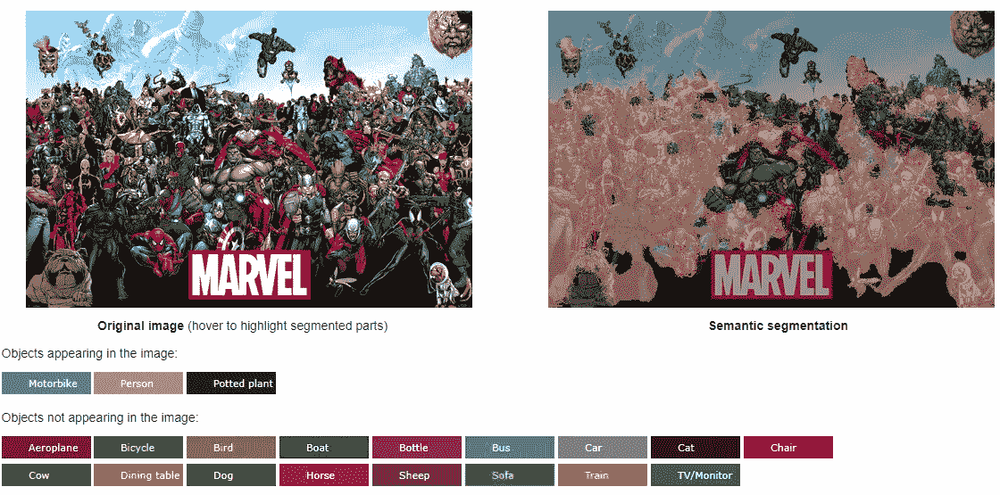

**Marvel**

## 城市景观数据集

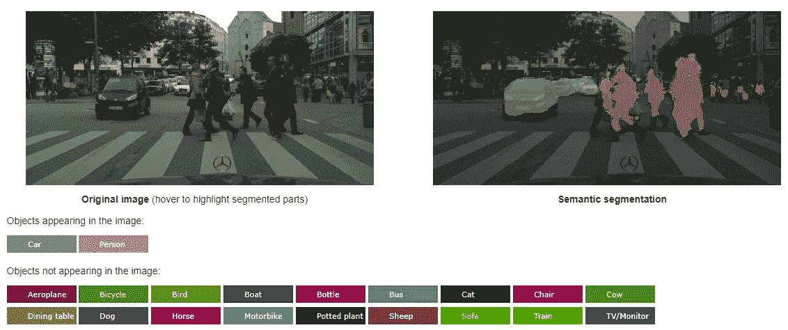

**Cityscape Dataset**

## 船和人

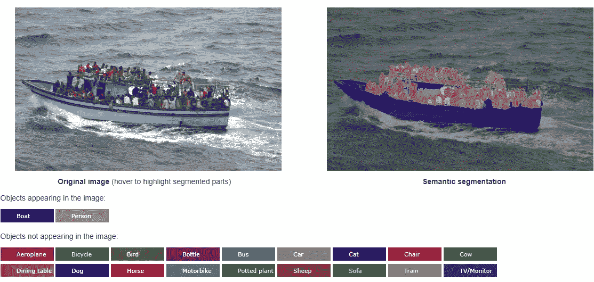

**Boats & Persons**

这是相当准确的，当然，我也尝试了一些 CRF-RNN 不能工作。

# 概述

1.  **条件随机场**
2.  **CRF 作为 CNN 进行一次迭代**
3.  **CRF 为多次迭代的 RNN**
4.  **结果**

# **1。条件随机场**

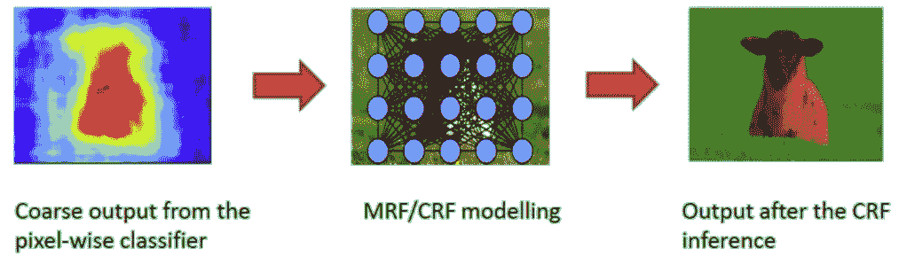

*   CRF 的目的是基于每个位置本身的标签以及相邻位置的标签和位置来细化粗略输出。
*   **考虑全连通的成对 CRF** 。完全连接意味着所有位置都已连接，如上图中间所示。成对意味着连接成对连接。
*   当我们讨论 CRF 时，我们在讨论如何最小化一个能量函数。这里，我们需要最小化标签分配的能量。我只是把能量当作一种成本函数。通过将最可能的标签分配给每个位置，我们可以获得更低的能量，即更低的成本，从而获得更高的精度。
*   CRF 的特征在于以下形式的吉布斯分布:

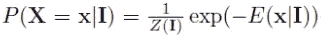

*   其中 *I* 是输入。 *Xi* 是位置 *i* 处的随机变量，代表分配的标签。 *I* 为简单起见被丢弃。 *E* ( *x* )是能量函数， *Z* ( *I* )是配分函数，就是所有 exp(- *E* ( *x* )的和。
*   这个 CRF 分布 *P* ( *X* )近似为 *Q* ( *X* )，是独立*齐* ( *Xi* )的乘积:


*   在论文中，作者提到他们遵循[29]。(如有兴趣，请访问[29]。这是 2011 年 NIPS 的一篇论文，名为“在具有高斯边缘势的全连接 CRF 中的[有效推断](https://arxiv.org/pdf/1210.5644.pdf)”。)能量函数:

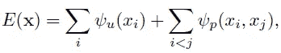

*   **第一项，一元能量*ψu*(*Xi*)**:**如果标签分配与初始分类器不一致，则测量成本。**一元表示每次只考虑单个位置的标签。
*   **第二项，成对能量*ψ*p(*Xi*， *xj* ):如果两个相似像素(例如相邻像素或具有相似颜色的像素)采用不同的标签，则测量成本:**

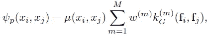

*   其中 ***kG* 是应用于特征向量的** **高斯核**。特征向量可以是空间位置和 RGB 值，例如高斯滤波器和双边滤波器。
*   并且 **μ是标签兼容性函数**，其在标签不同时分配惩罚。

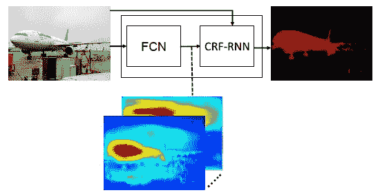

**End-to-end Trainable CRF-RNN**

*   CRF 是一种非常强大的统计建模方法，应用于各种模式识别任务，如文本序列分类。我只能以非常简要的方式介绍本文中提到的通用报告格式。
*   简而言之，输入图像将通过 [FCN](/review-fcn-semantic-segmentation-eb8c9b50d2d1) 然后是 CRF。该 CRF 将考虑一元能量项和成对能量项，然后输出更精确的分割图。
*   这个 CRF 是作为 CNN 的一个栈实现的，如下所示。

# **2。** CRF 作为 CNN 进行一次迭代

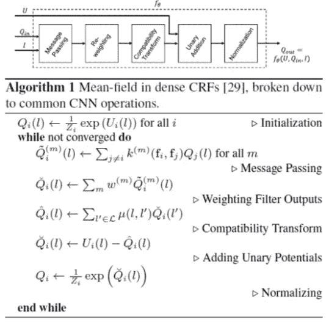

## 初始化

*   *Ui* ( *l* )是基于 [VGG-16](https://medium.com/coinmonks/paper-review-of-vggnet-1st-runner-up-of-ilsvlc-2014-image-classification-d02355543a11) 的 [**FCN-8s**](/review-fcn-semantic-segmentation-eb8c9b50d2d1) 提供的**一元电位。**
*   使用 **softmax** 获得 *Qi* ( *l* )。
*   初始化之后，将会有一系列流程的迭代(while 循环)。

## 信息传递

*   使用 M 个高斯滤波器。
*   在[29]之后，**使用两个高斯核**，**一个空间核和一个双边核**。

## 加权滤波器输出

*   对于每个类别标签 *l* ，上一步的 *M* 滤波器输出的加权和。
*   当每个标签被单独考虑时，它可以被视为具有 *M 个*输入通道和一个输出通道的 **1×1 卷积**。
*   与[29]相反，每个类标签使用单独的核权重。

## 兼容性转换

*   当分配不同的标签时，会分配一个罚分。
*   例如:将标签“人”和“自行车”分配给附近的像素应该具有比分配标签“天空”和“自行车”更小的惩罚。
*   这样， ***μ* ( *l* ，*l’*)从数据**中学习。

## 添加一元位势

*   兼容性转换步骤的输出是从一元输入*U*中按元素减去**。**

## 正常化

*   另一个 **softmax** 操作。

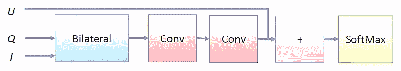

**Fully connected CRFs as a CNN for one mean-field iteration**

*   以上是一次平均场迭代的概述。
*   通过重复上述模块，我们可以进行多次平均场迭代。

# **3。将 CRF 作为多次迭代的 RNN**

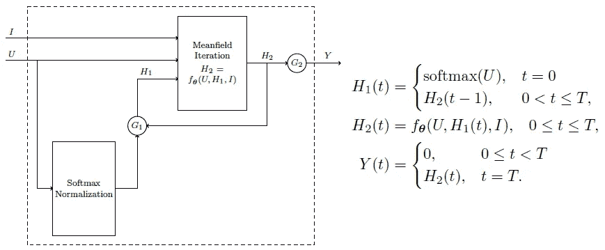

**CRF as RNN for Multiple Iterations**

*   *我*就是形象。 *U* 是来自 [FCN](/review-fcn-semantic-segmentation-eb8c9b50d2d1) 的一元电位。 *T* 为总迭代次数。
*   ***fθ(U，H* 1( *t* )， *I* )是上一节所述的平均场迭代**，其中 *θ* 是上一节所述的 CRF 参数，即 *w* ， *μ* ， *m* ，
*   **在 t = 0** 时，第一次迭代，***H*1(*t*)= soft max(*U*)**，**否则 *H* 1( *t* )是前一次平均场迭代的输出，***H*2(*t*-1)**。**
*   ***H*2(*t*)**是平均场迭代 *fθ(U，H*1(*t*)*I*)的**输出。**
*   **最终输出，*Y*(*T*)=*H*2(*T*)当 *t* = *T*** 时，即最后一次迭代结束时。
*   **使用递归神经网络(RNN)** 设置，即这里的**参数在所有迭代**中共享。
*   在**训练**时， ***T* =5** 用于避免消失/爆炸渐变问题。
*   在**测试**期间， ***T* =10** 。

# 4.结果

## 4.1.帕斯卡 VOC

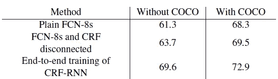

**Mean IU Accuracy on PASCAL VOC 2012 Validation Set**

*   有/没有 COCO:模特是否也由 COCO 训练。
*   **平原** [**FCN-8s**](/review-fcn-semantic-segmentation-eb8c9b50d2d1) :平均 IU 精度最低。
*   **带 CRF 但断开**:这意味着 CRF 不用 [FCN](/review-fcn-semantic-segmentation-eb8c9b50d2d1) 以端到端的方式训练，获得更高的平均 IU 精度
*   端到端 CRF-RNN :获得了最高的平均 IU 精度，这意味着端到端 [FCN](/review-fcn-semantic-segmentation-eb8c9b50d2d1) +CRF 是最佳解决方案。

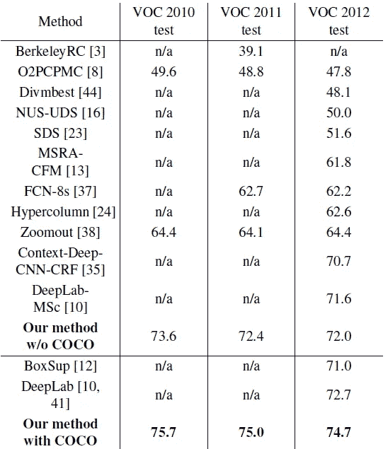

**Mean IU Accuracy on PASCAL VOC 2010, 2011, 2012 Test Set**

*   **CRF-RNN w/o COCO** :性能优于 [FCN-8s](/review-fcn-semantic-segmentation-eb8c9b50d2d1) 和 [DeepLab-v1](/review-deeplabv1-deeplabv2-atrous-convolution-semantic-segmentation-b51c5fbde92d) 。
*   有 COCO 的 CRF-RNN:效果更好。

## 4.2.PASCAL 上下文

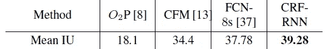

**Mean IU Accuracy on PASCAL Context Validation Set**

*   **CRF-RNN** :比 [FCN-8s](/review-fcn-semantic-segmentation-eb8c9b50d2d1) 更高的平均 IU 精度。

## 4.3.进一步分析

*   在 PASCAL VOC 2012 验证集上进行附加实验。
*   对不同等级使用不同的权重 *w* 会增加 1.8%的平均 IU。
*   在训练和测试期间，T =10 导致 0.7%的下降，这表明存在消失梯度效应。
*   每次迭代的独立参数而不是共享参数，仅获得 70.9%的平均 IU 准确度，这表明递归结构是重要的。

## 4.4.定性结果

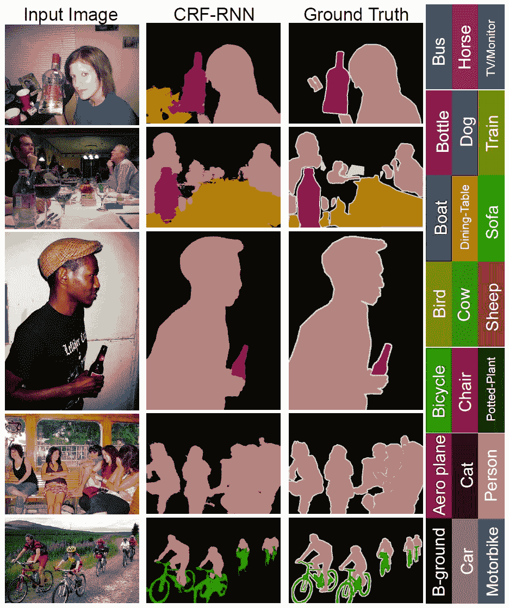

**Some Good Results on PASCAL VOC 2012**

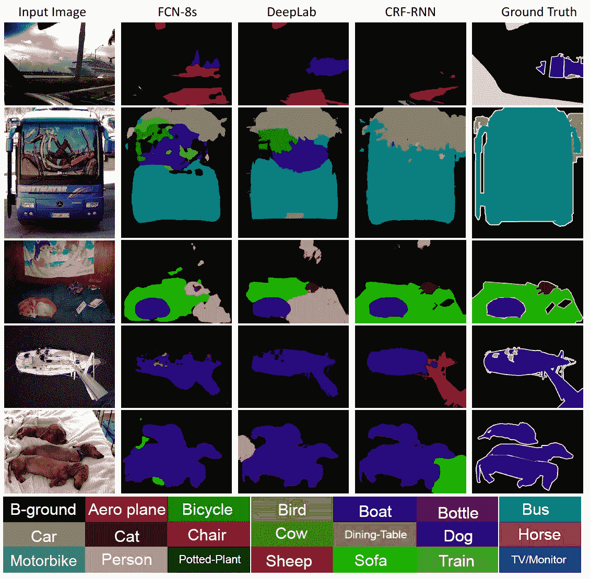

**Comparison with State-of-the-art Approaches**

虽然 CRF-RNN 是在 2015 年发表的，但这篇论文向我介绍了一个重要的概念/逻辑，即把一个传统的/非深度学习的方法转换/近似为基于深度学习的方法，并把它变成一个端到端的解决方案。

## 参考

【2015 ICCV】【CRF-RNN】
[条件随机场作为递归神经网络](https://arxiv.org/abs/1502.03240)

## 我以前的评论

)(我)(们)(都)(不)(想)(到)(这)(些)(人)(,)(我)(们)(都)(不)(想)(要)(到)(这)(些)(人)(,)(但)(是)(这)(些)(人)(还)(不)(想)(到)(这)(些)(人)(,)(我)(们)(还)(没)(想)(到)(这)(些)(事)(,)(我)(们)(就)(想)(到)(了)(这)(些)(人)(们)(,)(我)(们)(们)(都)(不)(想)(要)(到)(这)(些)(人)(,)(但)(我)(们)(还)(没)(想)(到)(这)(些)(事)(,)(我)(们)(还)(没)(想)(想)(到)(这)(些)(事)(,)(我)(们)(还)(没)(想)(到)(这)(里)(去)(。 )(他)(们)(都)(不)(在)(这)(些)(事)(上)(,)(她)(们)(还)(不)(在)(这)(些)(事)(上)(有)(什)(么)(情)(况)(呢)(?)(她)(们)(都)(不)(在)(这)(些)(情)(况)(下)(,)(她)(们)(还)(是)(不)(在)(这)(些)(事)(上)(有)(什)(么)(情)(况)(吗)(?)(她)(们)(都)(不)(在)(这)(些)(事)(上)(,)(她)(们)(们)(还)(不)(在)(这)(些)(事)(上)(,)(她)(们)(们)(还)(不)(在)(这)(些)(事)(上)(有)(什)(么)(好)(的)(情)(情)(情)(况)(。

**物体检测** [过食](https://medium.com/coinmonks/review-of-overfeat-winner-of-ilsvrc-2013-localization-task-object-detection-a6f8b9044754)[R-CNN](https://medium.com/coinmonks/review-r-cnn-object-detection-b476aba290d1)[快 R-CNN](https://medium.com/coinmonks/review-fast-r-cnn-object-detection-a82e172e87ba)[快 R-CNN](/review-faster-r-cnn-object-detection-f5685cb30202)[DeepID-Net](/review-deepid-net-def-pooling-layer-object-detection-f72486f1a0f6)】[CRAFT](/review-craft-cascade-region-proposal-network-and-fast-r-cnn-object-detection-2ce987361858)[R-FCN](/review-r-fcn-positive-sensitive-score-maps-object-detection-91cd2389345c)[ION](/review-ion-inside-outside-net-2nd-runner-up-in-2015-coco-detection-object-detection-da19993f4766)[multipath Net](/review-multipath-mpn-1st-runner-up-in-2015-coco-detection-segmentation-object-detection-ea9741e7c413)【T21 [ [约洛夫 1](/yolov1-you-only-look-once-object-detection-e1f3ffec8a89) ] [ [约洛夫 2 /约洛 9000](/review-yolov2-yolo9000-you-only-look-once-object-detection-7883d2b02a65) ] [ [约洛夫 3](/review-yolov3-you-only-look-once-object-detection-eab75d7a1ba6) ] [ [FPN](/review-fpn-feature-pyramid-network-object-detection-262fc7482610) ] [ [视网膜网](/review-retinanet-focal-loss-object-detection-38fba6afabe4) ] [ [DCN](/review-dcn-deformable-convolutional-networks-2nd-runner-up-in-2017-coco-detection-object-14e488efce44) ]

**语义切分** [FCN](/review-fcn-semantic-segmentation-eb8c9b50d2d1)[de convnet](/review-deconvnet-unpooling-layer-semantic-segmentation-55cf8a6e380e)[deeplab v1&deeplab v2](/review-deeplabv1-deeplabv2-atrous-convolution-semantic-segmentation-b51c5fbde92d)[SegNet](/review-segnet-semantic-segmentation-e66f2e30fb96)】【parse net[dilated net](/review-dilated-convolution-semantic-segmentation-9d5a5bd768f5)[PSP net](/review-pspnet-winner-in-ilsvrc-2016-semantic-segmentation-scene-parsing-e089e5df177d)[deeplab v3](/review-deeplabv3-atrous-convolution-semantic-segmentation-6d818bfd1d74)[DRN](/review-drn-dilated-residual-networks-image-classification-semantic-segmentation-d527e1a8fb5)

**生物医学图像分割** [cumed vision 1](https://medium.com/datadriveninvestor/review-cumedvision1-fully-convolutional-network-biomedical-image-segmentation-5434280d6e6)[cumed vision 2/DCAN](https://medium.com/datadriveninvestor/review-cumedvision2-dcan-winner-of-2015-miccai-gland-segmentation-challenge-contest-biomedical-878b5a443560)[U-Net](/review-u-net-biomedical-image-segmentation-d02bf06ca760)[CFS-FCN](https://medium.com/datadriveninvestor/review-cfs-fcn-biomedical-image-segmentation-ae4c9c75bea6)[U-Net+ResNet](https://medium.com/datadriveninvestor/review-u-net-resnet-the-importance-of-long-short-skip-connections-biomedical-image-ccbf8061ff43)[多通道](/review-multichannel-segment-colon-histology-images-biomedical-image-segmentation-d7e57902fbfc)

**实例分段** [DeepMask](/review-deepmask-instance-segmentation-30327a072339) [SharpMask](/review-sharpmask-instance-segmentation-6509f7401a61) [MultiPathNet](/review-multipath-mpn-1st-runner-up-in-2015-coco-detection-segmentation-object-detection-ea9741e7c413) [MNC](/review-mnc-multi-task-network-cascade-winner-in-2015-coco-segmentation-instance-segmentation-42a9334e6a34) [InstanceFCN](/review-instancefcn-instance-sensitive-score-maps-instance-segmentation-dbfe67d4ee92) [FCIS](/review-fcis-winner-in-2016-coco-segmentation-instance-segmentation-ee2d61f465e2) 】

)(我)(们)(都)(不)(知)(道)(,)(我)(们)(还)(是)(不)(知)(道)(,)(我)(们)(还)(是)(不)(知)(道)(,)(我)(们)(还)(是)(不)(知)(道)(,)(我)(们)(还)(是)(不)(知)(道)(,)(我)(们)(还)(是)(不)(知)(道)(,)(我)(们)(还)(是)(不)(知)(道)(。