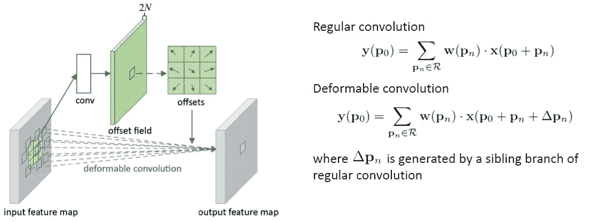
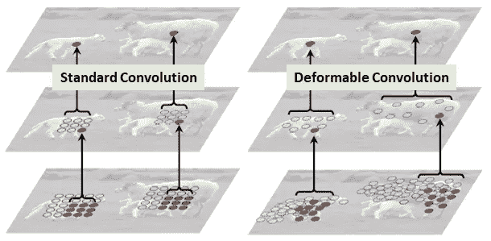

# 回顾:DCN/DCN v1——可变形卷积网络，2017 年 COCO 检测(物体检测)亚军

> 原文：<https://towardsdatascience.com/review-dcn-deformable-convolutional-networks-2nd-runner-up-in-2017-coco-detection-object-14e488efce44?source=collection_archive---------3----------------------->

## 使用可变形卷积，改进了更快的 R-CNN 和 R-FCN，在可可检测中获得亚军，在可可分割中获得季军。

A 继 [STN](/review-stn-spatial-transformer-network-image-classification-d3cbd98a70aa) 之后，这次 **DCN(可变形卷积网络)**，由**微软亚洲研究院(MSRA)** 进行评审。它也被称为 **DCNv1** ，因为后来作者也提出了 DCNv2。

**(a) Conventional Convolution, (b) Deformable Convolution, (c) Special Case of Deformable Convolution with Scaling, (d) Special Case of Deformable Convolution with Rotation**

**常规/常规卷积基于定义的滤波器尺寸，在来自输入图像或一组输入特征图**的预定义矩形网格上操作。该网格的大小可以是 3×3 和 5×5 等。然而，我们想要检测和分类的对象可能会在图像中变形或被遮挡。

**在 DCN** 中，网格是可变形的，因为**每个网格点都移动了一个可学习的偏移量。**和**卷积在这些移动的网格点**上操作，因此被称为可变形卷积，类似于可变形 RoI 合并的情况。通过使用这两个新模块，DCN 提高了 [DeepLab](/review-deeplabv1-deeplabv2-atrous-convolution-semantic-segmentation-b51c5fbde92d) 、[fast R-CNN](/review-faster-r-cnn-object-detection-f5685cb30202)、 [R-FCN](/review-r-fcn-positive-sensitive-score-maps-object-detection-91cd2389345c) 和 [FPN](/review-fpn-feature-pyramid-network-object-detection-262fc7482610) 等的精确度。

最终，通过使用**DCN+**[**FPN**](/review-fpn-feature-pyramid-network-object-detection-262fc7482610)**+对齐** [**例外**](/review-xception-with-depthwise-separable-convolution-better-than-inception-v3-image-dc967dd42568) ，MSRA 获得了 COCO 检测挑战赛亚军和细分挑战赛**季军**。发表于 **2017 ICCV** ，引用 **200 余次**。( [Sik-Ho Tsang](https://medium.com/u/aff72a0c1243?source=post_page-----14e488efce44--------------------------------) @中)

# 概述

1.  **可变形回旋**
2.  **可变形 RoI 汇集**
3.  **可变形正敏感(PS) RoI 汇集**
4.  **使用 ResNet-101 &对齐-初始-ResNet** 的可变形 ConvNets
5.  **消融研究&结果**
6.  **使用比对异常的 COCO 检测挑战的更多结果**

# 1.可变形卷积

**Deformable Convolution**

*   规则卷积在规则网格 *R* 上运算。
*   可变形卷积运算在 *R* 上进行，但是每个点都增加了一个可学习的偏移量∈*pn*。
*   卷积用于生成对应于 *N* 2D 偏移∈*pn*(*x*-方向和*y*-方向)的 2 *N* 个特征图。

**Standard Convolution (Left), Deformable Convolution (Right)**

*   如上所示，可变形卷积将根据输入图像或特征图为卷积选取不同位置的值。
*   **相比** [**阿特鲁卷积**](/review-deeplabv1-deeplabv2-atrous-convolution-semantic-segmentation-b51c5fbde92d) : [阿特鲁卷积](/review-deeplabv1-deeplabv2-atrous-convolution-semantic-segmentation-b51c5fbde92d)在卷积时具有较大但固定的膨胀值，而可变形卷积在卷积时对网格中的每个点应用不同的膨胀值。([阿特鲁卷积](/review-deeplabv1-deeplabv2-atrous-convolution-semantic-segmentation-b51c5fbde92d)也叫[扩张卷积](/review-dilated-convolution-semantic-segmentation-9d5a5bd768f5)或空洞算法。)
*   **相对于** [**空间变换网络**](/review-stn-spatial-transformer-network-image-classification-d3cbd98a70aa) : [空间变换网络](/review-stn-spatial-transformer-network-image-classification-d3cbd98a70aa)对输入图像或特征地图进行变换，而可变形卷积可以被视为一个极轻量级的[空间变换网络](/review-stn-spatial-transformer-network-image-classification-d3cbd98a70aa)。

# 2.**可变形 RoI 合并**

**Deformable RoI Pooling**

*   常规 RoI 池将任意大小的输入矩形区域转换为固定大小的特征。
*   在可变形 RoI 合并中，**首先，在顶部路径**，我们仍然需要**常规 RoI 合并**来生成合并的特征图。
*   然后，**一个全连接(fc)层生成归一化偏移****∈*p*̂*ij***和**，然后转换为偏移∈*pij***(右下方的等式)，其中γ=0.1。
*   偏移归一化对于使偏移学习不随 RoI 尺寸变化是必要的。
*   最后，**在底部路径，**我们执行**可变形 RoI 合并。输出要素地图基于具有增大偏移的区域进行合并。**

# **3。可变形正敏感(PS) RoI 汇集**

**Deformable Positive-Sensitive (PS) RoI Pooling (Colors are important here)**

*   对于 [R-FCN](/review-r-fcn-positive-sensitive-score-maps-object-detection-91cd2389345c) 中的原始正敏感(PS) RoI pooling，首先将所有输入特征图转换为每个对象类的 *k* 得分图(总共 *C* 对于 *C* 对象类+ 1 个背景)(最好先阅读 [R-FCN](/review-r-fcn-positive-sensitive-score-maps-object-detection-91cd2389345c) 来了解原始 PS RoI pooling)。如果感兴趣，请阅读关于它的评论。)
*   在可变形 PS RoI 合并中，**首先，在顶部路径**，与原始路径类似， **conv 用于生成 2 个 *k* ( *C* +1)分数图。**
*   这意味着对于每个类，将有 k 个特征地图。这些 **k 特征图代表了{左上(TL)，中上(TC)、..，右下角(BR)}** 我们要学习的对象的偏移量。
*   **偏移(顶部路径)的原始 PS RoI 汇集在**中完成，即**它们汇集在图中的相同区域和相同颜色。**我们在这里得到补偿。
*   最后，**在底部路径**，我们执行**可变形 PS RoI 合并**来合并由偏移增加的特征图。

# **4。使用 ResNet-101 &对准初始 ResNet** 的可变形 ConvNets

## 4.1.对齐- [盗梦空间-ResNet](/review-inception-v4-evolved-from-googlenet-merged-with-resnet-idea-image-classification-5e8c339d18bc)

**Aligned-**[**Inception-ResNet**](/review-inception-v4-evolved-from-googlenet-merged-with-resnet-idea-image-classification-5e8c339d18bc) **Architecture (Left), Inception Residual Block (IRB) (Right)**

*   在**原始**[**Inception-ResNet**](/review-inception-v4-evolved-from-googlenet-merged-with-resnet-idea-image-classification-5e8c339d18bc)中，在 [Inception-v4](/review-inception-v4-evolved-from-googlenet-merged-with-resnet-idea-image-classification-5e8c339d18bc) 中提出了**对准问题**，对于靠近输出的特征图上的细胞，其在图像上的投影空间位置与其感受野中心位置不对准。
*   在**Aligned-**[**Inception-ResNet**](/review-inception-v4-evolved-from-googlenet-merged-with-resnet-idea-image-classification-5e8c339d18bc)中，我们可以看到在 Inception 残差块(IRB)内，**所有用于因子分解的非对称卷积(例如:1×7，7×1，1×3，3×1 conv)都被去除了。如上所示，仅使用一种 IRB。此外，IRB 的编号不同于 [Inception-ResNet-v1](/review-inception-v4-evolved-from-googlenet-merged-with-resnet-idea-image-classification-5e8c339d18bc) 或 [Inception-ResNet-v2](/review-inception-v4-evolved-from-googlenet-merged-with-resnet-idea-image-classification-5e8c339d18bc) 。**

**Error Rates on ImageNet-1K validation.**

*   aligned-[Inception-ResNet](/review-inception-v4-evolved-from-googlenet-merged-with-resnet-idea-image-classification-5e8c339d18bc)比 [ResNet-101](/review-resnet-winner-of-ilsvrc-2015-image-classification-localization-detection-e39402bfa5d8) 的错误率低。
*   虽然 Aligned-[Inception-ResNet](/review-inception-v4-evolved-from-googlenet-merged-with-resnet-idea-image-classification-5e8c339d18bc)比 [Inception-ResNet-v2](/review-inception-v4-evolved-from-googlenet-merged-with-resnet-idea-image-classification-5e8c339d18bc) 有更高的错误率，Aligned-[Inception-ResNet](/review-inception-v4-evolved-from-googlenet-merged-with-resnet-idea-image-classification-5e8c339d18bc)解决了对齐问题。

## 4.2.修改后的 ResNet-101 & Aligned-[Inception-ResNet](/review-inception-v4-evolved-from-googlenet-merged-with-resnet-idea-image-classification-5e8c339d18bc)

*   现在我们得到了两个主干:[ResNet-101](/review-resnet-winner-of-ilsvrc-2015-image-classification-localization-detection-e39402bfa5d8)&Aligned-[Inception-ResNet](/review-inception-v4-evolved-from-googlenet-merged-with-resnet-idea-image-classification-5e8c339d18bc)用于特征提取，原本用于图像分类任务。
*   然而，输出特征图太小，这对于对象检测和分割任务来说是不好的。
*   [阿特鲁卷积](/review-deeplabv1-deeplabv2-atrous-convolution-semantic-segmentation-b51c5fbde92d)(或[扩张卷积](/review-dilated-convolution-semantic-segmentation-9d5a5bd768f5))用于减少最后一个块(conv5)的开始，步幅从 2 变为 1。
*   因此，最后一个卷积块中的有效步幅从 32 个像素减少到 16 个像素，以增加特征图的分辨率。

## 4.3.不同的物体探测器

*   在特征提取之后，使用不同的对象检测器或分割方案，例如 [DeepLab](/review-deeplabv1-deeplabv2-atrous-convolution-semantic-segmentation-b51c5fbde92d) 、类别感知 RPN(或被视为简化的 [SSD](/review-ssd-single-shot-detector-object-detection-851a94607d11) )、[更快的 R-CNN](/review-faster-r-cnn-object-detection-f5685cb30202) 和 [R-FCN](/review-r-fcn-positive-sensitive-score-maps-object-detection-91cd2389345c) 。

# 5.消融研究和结果

## **语义分割**

*   **PASCAL VOC** ，20 个类别，带有附加遮罩注释的 VOC 2012 数据集，用于训练的 10，582 幅图像，用于验证的 1，449 幅图像。 **mIoU@V** 用于评价。
*   **城市景观**，19 个类别+ 1 个背景类别，2975 张用于训练的图像，500 张用于验证的图像。 **mIoU@C** 用于评估。

## **物体检测**

*   PASCAL VOC ，VOC 2007 trainval 和 VOC 2012 trainval 联合培训，VOC 2007 测试评估。使用**贴图@0.5** 和**贴图@0.7** 。
*   **COCO** ，trainval 中 120k 图像，test-dev 中 20k 图像。**mAP @ 0.5:0.95**和 **mAP@0.5** 用于评估。

## 5.1.对不同数量的最后几层应用可变形卷积

**Results of using deformable convolution in the last 1, 2, 3, and 6 convolutional layers (of 3×3 filter) in** [**ResNet-101**](/review-resnet-winner-of-ilsvrc-2015-image-classification-localization-detection-e39402bfa5d8)

*   3 和 6 可变形回旋也是好的。最后，作者选择了 **3，因为对于不同的任务**有一个**的良好权衡。**
*   而且我们还可以看到 **DCN 提高了** [**DeepLab**](/review-deeplabv1-deeplabv2-atrous-convolution-semantic-segmentation-b51c5fbde92d) **、类感知 RPN(或者视为简化的**[**SSD**](/review-ssd-single-shot-detector-object-detection-851a94607d11)**)、** [**更快的 R-CNN**](/review-faster-r-cnn-object-detection-f5685cb30202) **和**[**R-FCN**](/review-r-fcn-positive-sensitive-score-maps-object-detection-91cd2389345c)**。**

## 5.2.**分析可变形卷积偏移距离**

**Analysis of deformable convolution in the last 3 convolutional layers**

**Examples: three levels of 3×3 deformable filters for three activation units (green points) on the background (left), a small object (middle), and a large object (right)**

*   为了说明 DCN 的有效性，也进行了如上的分析。首先，根据地面真实边界框注释和滤波器中心的位置，将可变形卷积滤波器分为四类:小、中、大和背景。
*   然后，测量扩张值(偏移距离)的平均值和标准偏差。
*   发现**可变形滤光器的感受野大小与对象大小**相关，表明变形是从图像内容中有效学习的。
*   并且**背景区域上的滤光器尺寸介于中大型物体上的滤光器尺寸之间，这表明相对较大的感受野对于识别背景区域是必要的**。

**Offset parts in deformable (positive sensitive) RoI pooling in** [**R-FCN**](/review-r-fcn-positive-sensitive-score-maps-object-detection-91cd2389345c) **and 3×3 bins (red) for an input RoI (yellow)**

*   类似地，对于可变形的 RoI 合并，现在部件被偏移以覆盖非刚性对象。

## 5.3.帕斯卡 VOC 与[阿特鲁卷积](/review-deeplabv1-deeplabv2-atrous-convolution-semantic-segmentation-b51c5fbde92d)的比较

**Comparison of** [**Atrous Convolution**](/review-deeplabv1-deeplabv2-atrous-convolution-semantic-segmentation-b51c5fbde92d) **& Deformable Convolution**

*   **只有可变形卷积** : [DeepLab](/review-deeplabv1-deeplabv2-atrous-convolution-semantic-segmentation-b51c5fbde92d) 、类感知 RPN、 [R-FCN](/review-r-fcn-positive-sensitive-score-maps-object-detection-91cd2389345c) 有了改进，已经胜过 [DeepLab](/review-deeplabv1-deeplabv2-atrous-convolution-semantic-segmentation-b51c5fbde92d) 、类感知 RPN 和 [R-FCN](/review-r-fcn-positive-sensitive-score-maps-object-detection-91cd2389345c) 有 [atrous 卷积](/review-deeplabv1-deeplabv2-atrous-convolution-semantic-segmentation-b51c5fbde92d)。并且具有可变形卷积的[更快的 R-CNN](/review-faster-r-cnn-object-detection-f5685cb30202) 获得了与具有[不规则卷积](/review-deeplabv1-deeplabv2-atrous-convolution-semantic-segmentation-b51c5fbde92d) (4，4，4)的[更快的 R-CNN](/review-faster-r-cnn-object-detection-f5685cb30202) 的竞争结果。
*   **仅可变形 RoI 合并**:仅在[更快的 R-CNN](/review-faster-r-cnn-object-detection-f5685cb30202) 和 [R-FCN](/review-r-fcn-positive-sensitive-score-maps-object-detection-91cd2389345c) 中有 RoI 合并。[具有可变形 RoI 池的更快 R-CNN](/review-faster-r-cnn-object-detection-f5685cb30202) 获得与具有 [atrous 卷积](/review-deeplabv1-deeplabv2-atrous-convolution-semantic-segmentation-b51c5fbde92d) (4，4，4)的[更快 R-CNN](/review-faster-r-cnn-object-detection-f5685cb30202) 竞争的结果。[具有可变形 RoI 池的 R-FCN](/review-r-fcn-positive-sensitive-score-maps-object-detection-91cd2389345c) 优于具有 [atrous 卷积](/review-deeplabv1-deeplabv2-atrous-convolution-semantic-segmentation-b51c5fbde92d) (4，4，4)的 R-FCN 。
*   **变形卷积& RoI 合并** : [更快的 R-CNN](/review-faster-r-cnn-object-detection-f5685cb30202) 和 [R-FCN](/review-r-fcn-positive-sensitive-score-maps-object-detection-91cd2389345c) 带变形卷积& RoI 合并是所有设置中最好的。

## 5.4.PASCAL VOC 上的模型复杂性和运行时间

**Model Complexity and Runtime**

*   **可变形的凸网只增加了模型参数和计算的少量开销。**
*   除了增加模型参数之外，显著的性能改进来自于对几何变换进行建模的能力。

## 5.5.COCO 上的对象检测

**Object Detection on COCO test-dev** (**M**: Multi-Scale Testing with Shorter Side {480, 576, 688, 864, 1200, 1400}**, B**: Iterative Bounding Box Average)

*   使用可变形的 ConvNet 始终优于普通的。
*   用**对齐-**[**Inception-ResNet**](/review-inception-v4-evolved-from-googlenet-merged-with-resnet-idea-image-classification-5e8c339d18bc)，用 [**R-FCN**](/review-r-fcn-positive-sensitive-score-maps-object-detection-91cd2389345c) 与**可变形 ConvNet** ，加上**多尺度测试**和**迭代包围盒平均**，**37.5% mAP @【0.5:0.95】**得到。

# 6。使用比对异常检测 COCO 挑战的更多结果

*   以上结果来自论文。他们还在 ICCV 2017 大会上展示了一项新成果。

## 6.1.对齐[异常](/review-xception-with-depthwise-separable-convolution-better-than-inception-v3-image-dc967dd42568)

**Aligned** [**Xception**](/review-xception-with-depthwise-separable-convolution-better-than-inception-v3-image-dc967dd42568)

*   原始[异常](/review-xception-with-depthwise-separable-convolution-better-than-inception-v3-image-dc967dd42568)的校准[异常](/review-xception-with-depthwise-separable-convolution-better-than-inception-v3-image-dc967dd42568)的更新为蓝色。
*   简而言之，一些最大池操作被入口流中的可分离 conv 所取代。在中间流程中，重复次数从 8 次增加到 16 次。在出口流中增加了一个 conv。

## 6.2.可可检测挑战

**Object Detection on COCO test-dev**

*   [**ResNet-101**](/review-resnet-winner-of-ilsvrc-2015-image-classification-localization-detection-e39402bfa5d8) **作为特征提取器，******+OHEM 作为物体检测器**:获得了 40.5%的 mAP，已经高于上一节提到的结果。**
*   ****用对齐的** [**替换**](/review-xception-with-depthwise-separable-convolution-better-than-inception-v3-image-dc967dd42568)[**ResNet-101**](/review-resnet-winner-of-ilsvrc-2015-image-classification-localization-detection-e39402bfa5d8)**例外** : 43.3% mAP。**
*   ****6 款车型组合+其他小改进** : 50.7%地图。**
*   **在 **COCO 2017 探测挑战排行榜**中，50.4%的地图使其成为挑战亚军。**
*   **在 **COCO 2017 细分挑战赛排行榜**中，42.6%的地图使其成为挑战赛季军。**
*   **排行榜:[http://cocodataset.org/#detection-leaderboard](http://cocodataset.org/#detection-leaderboard)**

**如果有时间，希望也能复习一下 DCNv2。**

## **参考**

**【2017 ICCV】【DCN】
[可变形卷积网络](https://arxiv.org/abs/1703.06211)**

## **我以前的评论**

**)(我)(们)(都)(不)(想)(到)(这)(些)(人)(,)(我)(们)(都)(不)(想)(要)(到)(这)(些)(人)(,)(但)(是)(这)(些)(人)(还)(不)(想)(到)(这)(些)(人)(,)(我)(们)(还)(不)(想)(到)(这)(些)(人)(,)(我)(们)(们)(还)(不)(想)(到)(这)(些)(人)(们)(,)(我)(们)(们)(还)(不)(想)(到)(这)(些)(人)(,)(我)(们)(们)(还)(没)(想)(到)(这)(些)(人)(,)(我)(们)(还)(没)(想)(到)(这)(里)(来)(。 )(我)(们)(都)(不)(想)(到)(这)(些)(人)(,)(我)(们)(都)(不)(想)(要)(到)(这)(里)(去)(,)(我)(们)(还)(不)(想)(到)(这)(些)(人)(,)(我)(们)(都)(不)(想)(要)(到)(这)(里)(去)(了)(,)(我)(们)(还)(不)(想)(到)(这)(些)(人)(,)(我)(们)(都)(不)(想)(到)(这)(里)(来)(。**

****物体检测** [过食](https://medium.com/coinmonks/review-of-overfeat-winner-of-ilsvrc-2013-localization-task-object-detection-a6f8b9044754)[R-CNN](https://medium.com/coinmonks/review-r-cnn-object-detection-b476aba290d1)[快 R-CNN](https://medium.com/coinmonks/review-fast-r-cnn-object-detection-a82e172e87ba)[快 R-CNN](/review-faster-r-cnn-object-detection-f5685cb30202)[DeepID-Net](/review-deepid-net-def-pooling-layer-object-detection-f72486f1a0f6)】[R-FCN](/review-r-fcn-positive-sensitive-score-maps-object-detection-91cd2389345c)】[离子](/review-ion-inside-outside-net-2nd-runner-up-in-2015-coco-detection-object-detection-da19993f4766)[多路径网](/review-multipath-mpn-1st-runner-up-in-2015-coco-detection-segmentation-object-detection-ea9741e7c413)[NoC](https://medium.com/datadriveninvestor/review-noc-winner-in-2015-coco-ilsvrc-detection-object-detection-d5cc84e372a)**

****语义切分** [FCN](/review-fcn-semantic-segmentation-eb8c9b50d2d1)[de convnet](/review-deconvnet-unpooling-layer-semantic-segmentation-55cf8a6e380e)[deeplab v1&deeplab v2](/review-deeplabv1-deeplabv2-atrous-convolution-semantic-segmentation-b51c5fbde92d)[parse net](https://medium.com/datadriveninvestor/review-parsenet-looking-wider-to-see-better-semantic-segmentation-aa6b6a380990)】[dilated net](/review-dilated-convolution-semantic-segmentation-9d5a5bd768f5)[PSP net](/review-pspnet-winner-in-ilsvrc-2016-semantic-segmentation-scene-parsing-e089e5df177d)[deeplab v3](/review-deeplabv3-atrous-convolution-semantic-segmentation-6d818bfd1d74)**

****生物医学图像分割** [[cumed vision 1](https://medium.com/datadriveninvestor/review-cumedvision1-fully-convolutional-network-biomedical-image-segmentation-5434280d6e6)][[cumed vision 2/DCAN](https://medium.com/datadriveninvestor/review-cumedvision2-dcan-winner-of-2015-miccai-gland-segmentation-challenge-contest-biomedical-878b5a443560)][[U-Net](/review-u-net-biomedical-image-segmentation-d02bf06ca760)][[CFS-FCN](https://medium.com/datadriveninvestor/review-cfs-fcn-biomedical-image-segmentation-ae4c9c75bea6)][[U-Net+ResNet](https://medium.com/datadriveninvestor/review-u-net-resnet-the-importance-of-long-short-skip-connections-biomedical-image-ccbf8061ff43)**

****实例分割
[[深度掩码](/review-deepmask-instance-segmentation-30327a072339) ] [ [锐度掩码](/review-sharpmask-instance-segmentation-6509f7401a61) ] [ [多路径网络](/review-multipath-mpn-1st-runner-up-in-2015-coco-detection-segmentation-object-detection-ea9741e7c413) ] [ [MNC](/review-mnc-multi-task-network-cascade-winner-in-2015-coco-segmentation-instance-segmentation-42a9334e6a34) ] [ [实例中心](/review-instancefcn-instance-sensitive-score-maps-instance-segmentation-dbfe67d4ee92) ] [ [FCIS](/review-fcis-winner-in-2016-coco-segmentation-instance-segmentation-ee2d61f465e2)****

****超分辨率** [Sr CNN](https://medium.com/coinmonks/review-srcnn-super-resolution-3cb3a4f67a7c)[fsr CNN](/review-fsrcnn-super-resolution-80ca2ee14da4)[VDSR](/review-vdsr-super-resolution-f8050d49362f)[ESPCN](https://medium.com/datadriveninvestor/review-espcn-real-time-sr-super-resolution-8dceca249350)[红网](https://medium.com/datadriveninvestor/review-red-net-residual-encoder-decoder-network-denoising-super-resolution-cb6364ae161e)】**