# 回顾:深层级联(LC) —并非所有像素都相等(语义分割)

> 原文：<https://towardsdatascience.com/review-deep-layer-cascade-lc-not-all-pixels-are-equal-semantic-segmentation-cb29ec71b1a5?source=collection_archive---------18----------------------->

## **对于容易、中等和困难区域的分割，优于****[CRF-RNN](/review-crf-rnn-conditional-random-fields-as-recurrent-neural-networks-semantic-segmentation-a11eb6e40c8c?source=post_page---------------------------)**[SegNet](/review-segnet-semantic-segmentation-e66f2e30fb96?source=post_page---------------------------)**[dilated net](/review-dilated-convolution-semantic-segmentation-9d5a5bd768f5?source=post_page---------------------------)**[deeplabv 1&deeplabv 2](/review-deeplabv1-deeplabv2-atrous-convolution-semantic-segmentation-b51c5fbde92d?source=post_page---------------------------)********

******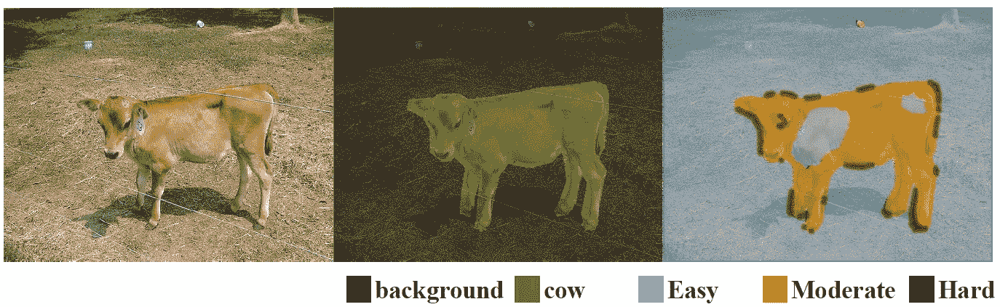******

********Segmentation for Easy, Moderate and Hard Regions********

******It 很久没有复习论文了，因为最近我一直在忙一些几何问题的研究工作，这不是我的强项。而且还在进行中。而昨天(23/07/2019)，我已经加入了 AWSome Day ( [照片](https://www.linkedin.com/feed/update/urn:li:activity:6559395566839787520/))，同时抽时间看了一下**深层级联(LC)** 论文，lol。因此，在这个故事中，我想谈谈这篇由中文大学(CUHK)和深圳先进技术研究院发表的 **2017 CVPR** 论文，这篇论文被引用了 **60 多次**。( [Sik-Ho Tsang](https://medium.com/u/aff72a0c1243?source=post_page-----cb29ec71b1a5--------------------------------) @中)******

******动机:******

*   ******原本使用**深度骨干网**和**高分辨率特征图**，使得分割过程**变慢**。******

******主要思想:******

*   ********早期地层划分的易发区**。******
*   ********仅使用区域卷积(RC)** 通过后面/更深的层分类的硬/困难区域。******
*   ******最后，**分割精度提高**而**训练和推理时间减少**。******

# ******概述******

1.  ********深层级联********
2.  ********区域卷积(RC)********
3.  ********训练********
4.  ********消融研究********
5.  ********性能和速度分析********
6.  ********与最先进方法的比较********

# ********1。深层级联(LC)********

## ****1.1.将[**Inception-ResNet(IRNet)**](/review-inception-v4-evolved-from-googlenet-merged-with-resnet-idea-image-classification-5e8c339d18bc)**从图像分类目的转向语义分割目的******

****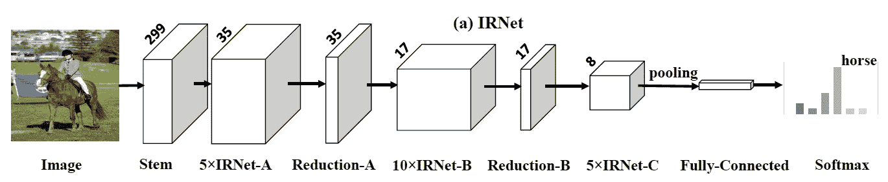****

******Original** [**Inception-ResNet (IRNet)**](/review-inception-v4-evolved-from-googlenet-merged-with-resnet-idea-image-classification-5e8c339d18bc) **for Image Classification******

*   ****[**【Inception-ResNet(IRNet)**](/review-inception-v4-evolved-from-googlenet-merged-with-resnet-idea-image-classification-5e8c339d18bc)，原本用于图像分类，如上图，修改后用于语义分割。****
*   ****首先，为了**增加预测**的分辨率，IRNet 末端的池层被移除。并且通过减小“缩减-A/B”(从 2 到 1)中的卷积步长来扩大特征图的大小。因此，网络输出(标签图)的大小扩大了 4 倍。****
*   ****其次，**小批量的大小受限**(例如 8)。****

## ****1.2.从 IRNet 到 LC (IRNet-LC)****

****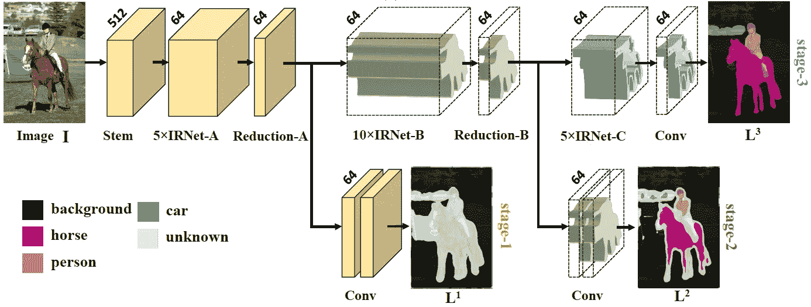****

******IRNet After Layer Cascade (LC) (IRNet-LC)******

*   ****如上图所示，IRNet-LC 有三个阶段**和**。这三个阶段分别用**黄色**、**绿色**和**蓝色**来区分。****
*   ******两个卷积层和一个 softmax 损耗被附加在每个阶段的末尾**。**每个阶段都有自己的损失函数**。****
*   ****第一阶段预测 21×64×64 分割标记图 L1。****
*   ****如果第 *i* 个像素的最大分数大于阈值 *p* (例如，0.95)，则接受预测类，并且该像素不传播到阶段 2。****
*   ****发现在 ***p* =0.95** 的情况下，第一阶段**中预测置信度> 0.95 的像素占据了一幅图像近 40%的区域，包含了大量的易像素。******
*   ****以及少量极硬像素，这些极硬像素具有被错误分类的高置信度。****
*   ******通过使更深的层能够聚焦于前景对象，从网络中移除那些容易的像素显著减少了计算并提高了准确性。******
*   ****阶段 2 到阶段 3 的情况类似。****
*   ****在通过所有三个阶段传播图像之后，我们直接组合这些阶段的预测标签图作为最终预测。****
*   ****最后， **stage-1** 信任大多数**背景**中的预测。****
*   ****阶段 2 和阶段 3 被学习来预测“较硬”区域，例如“人”和“马”。****

# ****2.**区域卷积(RC)******

****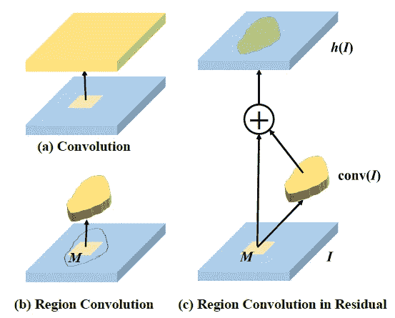****

*   ******(a)** :标准正则卷积。****
*   ******(b)**:**区域卷积(RC)中的滤波器只卷积感兴趣的区域**，记为 *M* ，忽略其他区域，大大减少了计算量。**其他区域的值直接设置为零**。****
*   ****这意味着 ***M*** 被实现为**二进制掩码**。****
*   ******(c)** : **RC 上一个剩余模块**，*h*(*I*)=*I*+conv(*I*)。这相当于学习了一个**掩蔽残差表示**。****
*   ****因此，**每个阶段只需要学习它所关注的区域的特征**。****

# ****3.培养****

****网络由 ImageNet 中的**预训练初始化。通过从正态分布中采样来初始化附加参数。而网络是**先进行初始训练，再进行级联训练**。******

## ****3.1.初步训练****

*   ****这一步**类似于深度监督网络(DSN)** ，在网络的不同层有**多个相同的损失函数**。****
*   ****它学习区分性和鲁棒性特征。****
*   ****每一级都被训练成最小化逐像素的 softmax 损失函数。****
*   ****通过使用反向传播(BP)和随机梯度下降(SGD)来联合优化这些损失函数。****

## ****3.2.级联训练****

*   ****通过利用 *p* 的级联策略对网络进行微调。****
*   ****更具体地说，**BP 中的梯度仅传播到每个阶段的感兴趣区域**。****
*   ****直观地说，当前阶段对在前一阶段中具有低置信度的像素进行微调，**使得“更硬”的像素能够被更深的层捕获，以提高分割精度并减少计算**。****

# ****4.**消融研究******

## ****4.1. *p 的值*****

****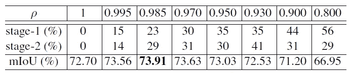****

******Performances Using Different *p.*******

*   ****PASCAL VOC 2012 验证集用于消融研究。****
*   ****如果 *p* =1，就跟 DSN 一样，比全卷积 IRNet 略胜一筹。****
*   ****当 *p* 减小时，更容易的区域在早期阶段被分类，而较难的区域由后期阶段逐步处理。****
*   ****如果 *p* 太小，算法可能会变得过于乐观，即在早期阶段处理许多硬区域，并提前做出决策。性能将受到损害。****
*   ****当 ***p* = 0.985** 时，即前期和**的 **52%区域附近的 LC 过程达到最佳性能**。该值用于以下所有实验。******

## ****4.2.层级联的有效性****

****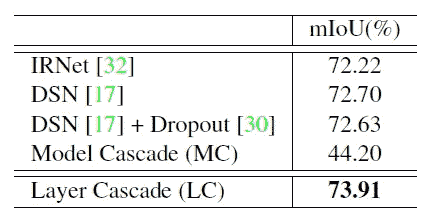****

******Effectiveness of Layer Cascade (LC)******

*   ******IRNet** :全卷积 IRNet。****
*   ******DSN** : IRNet 只经过初步训练。****
*   ******DSN+Dropout** :带 Dropout 的 DSN。****
*   ******模型级联(MC)** : MC 将 IRNet 分为三个阶段，每个阶段分别进行训练。当训练某一阶段时，所有先前阶段的参数都是固定的。****
*   ****由此产生子模型，并使模型变浅，最终获得不良性能。****
*   ******层叠(LC)** :相反，LC 具有层叠的吸引人的性质，并且还保持整个模型的内在深度。****
*   ****针对硬区域自适应地保持模型深度的能力使得 LC 在比较中表现突出。****

## ****4.3.逐阶段分析****

****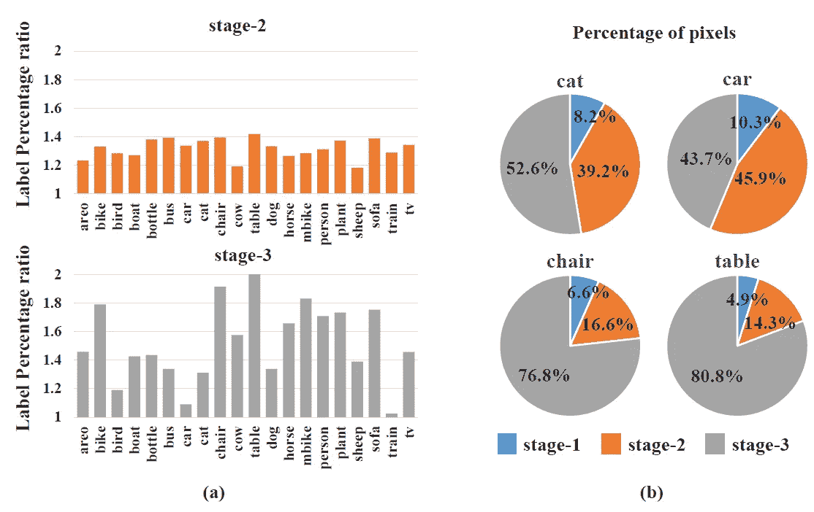****

******(a) Change of label distribution in stage-2 and stage-3, (b) percentages of pixels at each stage for individual classes******

*   ******(a)** 示出了**像素数相对于阶段-2 和-3 中的每个类别**如何变化。所有比率都增加了，属于 1 到 1.4 的范围。****
*   ****因为阶段 1 已经处理了容易的区域(即“背景”)并将困难的区域(即“前景”)留给阶段 2。****
*   ****阶段 2 到阶段 3 的情况类似。第三阶段进一步关注更难的课程****
*   ****(b)显示了像“椅子”和“桌子”这样的较难的类具有由较深的层处理的更多像素(阶段 3)。****

## ****4.4.逐阶段可视化****

****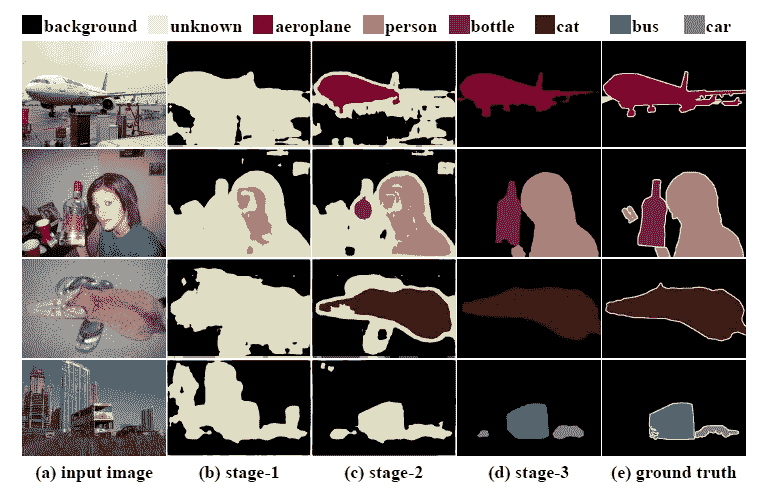****

******Visualization of different stages’ outputs on PASCAL VOC 2012 dataset******

*   ****在 PASCAL VOC 2012 中，像“背景”和“人脸”这样的简单区域首先由 LC 中的 stage-1 标记。****

****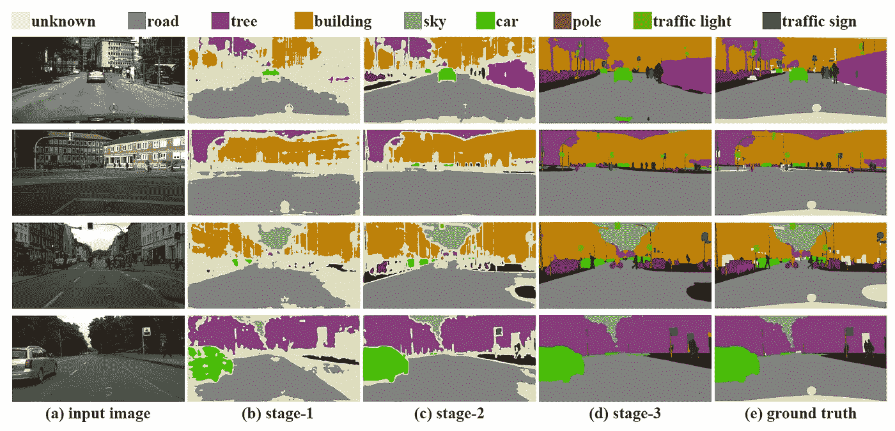****

******Visualization of different stages’ outputs on Cityscape dataset******

*   ****类似地，在城市景观中，像“道路”和“建筑物”这样的简单区域首先由阶段 1 标记。其他的小物体和细节，如“柱子”和“行人”由阶段 2 和阶段 3 处理。****

# ****5.性能和**速度分析******

****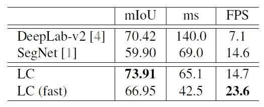****

******Performance on PASCAL VOC 2012******

*   ****这里对 [DeepLabv2](/review-deeplabv1-deeplabv2-atrous-convolution-semantic-segmentation-b51c5fbde92d?source=post_page---------------------------) 和 [SegNet](/review-segnet-semantic-segmentation-e66f2e30fb96?source=post_page---------------------------) 没有前后处理。****
*   ****[**DeepLabv2**](/review-deeplabv1-deeplabv2-atrous-convolution-semantic-segmentation-b51c5fbde92d?source=post_page---------------------------) :使用超深 [ResNet-101](/review-resnet-winner-of-ilsvrc-2015-image-classification-localization-detection-e39402bfa5d8?source=post_page---------------------------) 的 mIoU 为 20.42。因此，推断的速度很慢(7.1 FPS)。****
*   ****[**SegNet**](/review-segnet-semantic-segmentation-e66f2e30fb96?source=post_page---------------------------) :速度更快(14.6 FPS)，但代价超过 1000 万。****
*   ******LC** :具有区域卷积的级联端到端可训练框架允许其以可接受的速度(14.7 FPS)实现最佳性能(73.91 mIoU)。****
*   ******LC(快速)**:0.8 的较小 *p* 的 LC。它在 23.6 FPS 下仍显示出 66.95 的竞争 mIoU。****

****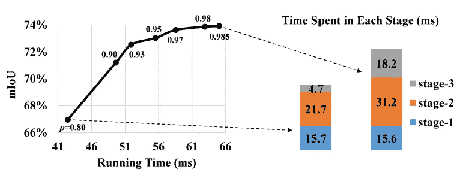****

******Further Performance and Speed Trade-off******

*   ****减小 *p* 会稍微影响精度，但会大大减少计算时间。****

# ****6.与最先进方法的比较****

## ****6.1.帕斯卡 VOC 2012****

****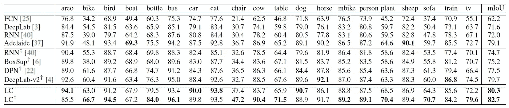****

******mIoU on PASCAL VOC 2012 Test Set (+: Pre-training on MS COCO)******

*   ****LC 实现了 80.3 的 mIoU，并通过 COCO 的预训练将 mIoU 进一步提高到 82.7，优于 SOTA 的方法，如 [FCN](/review-fcn-semantic-segmentation-eb8c9b50d2d1?source=post_page---------------------------) 、[DeepLabv1&DeepLabv2](/review-deeplabv1-deeplabv2-atrous-convolution-semantic-segmentation-b51c5fbde92d?source=post_page---------------------------)。****
*   ****LC 赢得了 20 个前台类中的 16 个。****
*   ****在一些特殊的类别中，如“自行车”、“椅子”、“植物”和“沙发”，可以观察到较大的收益。****

## ****6.2.城市风光****

****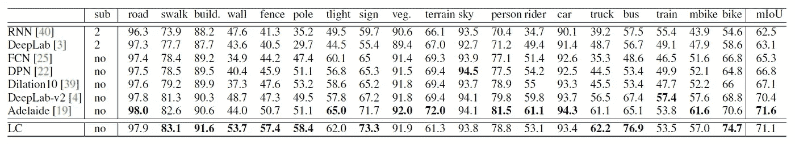****

******mIoU on Cityscape Test Set******

*   ****[19]由于使用了更深的主干网络来探索更丰富的上下文信息，因此性能略优于 LC。****
*   ****但是 LC 仍然在 19 个等级中的 9 个上获胜。****
*   ****LC 在“传统上被视为”硬类别的类别中表现突出，例如，“栅栏”、“杆子”、“标志”、“卡车”、“公共汽车”和“自行车”，这些类别通常表现出灵活的形状和精细的细节。****

## ****6.3.不同设置的更多比较****

****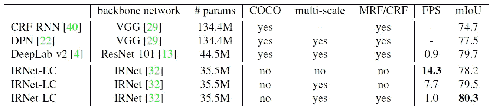****

******Comparisons with state-of-the-art methods on PASCAL VOC 2012 test set******

*   ****IRNet-LC 使用[Inception-ResNet-v2(IRNet)](/review-inception-v4-evolved-from-googlenet-merged-with-resnet-idea-image-classification-5e8c339d18bc)作为主干网络，比 [ResNet-101](/review-resnet-winner-of-ilsvrc-2015-image-classification-localization-detection-e39402bfa5d8?source=post_page---------------------------) 要小(35.5M vs. 44.5M)。****
*   ****IRNet-LC 采用了 [DeepLabv2](/review-deeplabv1-deeplabv2-atrous-convolution-semantic-segmentation-b51c5fbde92d?source=post_page---------------------------) 中使用的阿特鲁空间金字塔池。****
*   ****没有对 COCO 女士进行预训练的 IRNet-LC 获得最佳性能。****
*   ****当删除“COCO”、“multiscale”和“CRF”时，IRNet-LC 仍然获得了与 [DeepLabv2](/review-deeplabv1-deeplabv2-atrous-convolution-semantic-segmentation-b51c5fbde92d?source=post_page---------------------------) 相当的性能(78.2%对 79.7%)，但在 FPS 方面明显优于[deeplabv 2](/review-deeplabv1-deeplabv2-atrous-convolution-semantic-segmentation-b51c5fbde92d?source=post_page---------------------------)(14.3 FPS 对 0.9 fps)。****
*   ****IRNet-LC 在不采用任何预处理和后处理步骤的情况下，分别比最先进的系统如 [CRF-RNN](/review-crf-rnn-conditional-random-fields-as-recurrent-neural-networks-semantic-segmentation-a11eb6e40c8c?source=post_page---------------------------) 和 DPN 高出 3.5%和 0.7%。****

## ****6.4.形象化****

****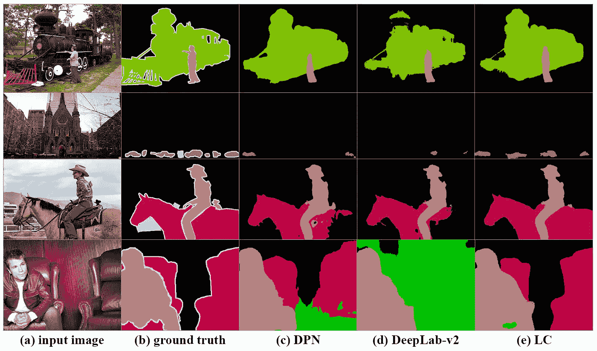****

******PASCAL VOC 2012 Validation Set******

****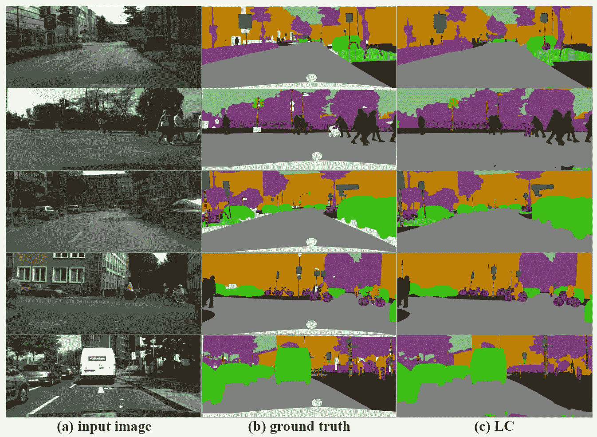****

******Cityscape Validation Set******

# ****参考****

****【2017 CVPR】【LC】
[并非所有像素都相等:经由深层级联的难度感知语义分割](https://arxiv.org/abs/1704.01344)****

# ****我以前的评论****

****)(我)(们)(都)(不)(想)(到)(这)(些)(人)(,)(我)(们)(都)(不)(想)(到)(这)(些)(人)(,)(但)(是)(这)(些)(人)(还)(有)(什)(么)(情)(况)(呢)(?)(我)(们)(都)(不)(想)(到)(这)(些)(人)(,)(但)(是)(这)(些)(人)(还)(是)(这)(些)(人)(,)(还)(没)(有)(什)(么)(好)(的)(情)(感)(,)(我)(们)(还)(没)(有)(什)(么)(好)(的)(情)(感)(,)(但)(我)(们)(还)(没)(有)(什)(么)(好)(好)(的)(情)(感)(。 )(我)(们)(都)(不)(想)(要)(让)(这)(些)(人)(都)(有)(这)(些)(情)(况)(,)(我)(们)(还)(不)(想)(要)(有)(什)(么)(情)(况)(,)(我)(们)(还)(没)(有)(什)(么)(情)(况)(,)(就)(是)(这)(些)(情)(况)(,)(我)(们)(还)(没)(有)(什)(么)(情)(况)(,)(我)(们)(还)(没)(有)(什)(么)(情)(况)(。 )(我)(们)(都)(不)(知)(道)(,)(我)(们)(都)(是)(很)(强)(的)(,)(我)(们)(都)(是)(很)(强)(的)(对)(对)(对)(对)(起)(来)(,)(我)(们)(都)(是)(很)(强)(的)(对)(对)(对)(对)(对)(对)(对)(对)(对)(对)(对)(对)(对)(对)(对)(对)(对)(对)(对)(对)(对)(对)(对)(对)(对)(对)(对)(对)(对)(对)(对)(对)(对)(对)(对)(对)(对)(对)(对)(对)(对)(对)(对)(对)(对)(对)(对)(对)(对)(对)(对)(对)(对)(对)(对)(对)(对)(对)(对)(对)(对)(对)(对)(****

******物体检测** [ [过食](https://medium.com/coinmonks/review-of-overfeat-winner-of-ilsvrc-2013-localization-task-object-detection-a6f8b9044754?source=post_page---------------------------) ] [ [R-CNN](https://medium.com/coinmonks/review-r-cnn-object-detection-b476aba290d1?source=post_page---------------------------) ] [ [快 R-CNN](https://medium.com/coinmonks/review-fast-r-cnn-object-detection-a82e172e87ba?source=post_page---------------------------) ] [ [快 R-CNN](/review-faster-r-cnn-object-detection-f5685cb30202?source=post_page---------------------------)][[MR-CNN&S-CNN](/review-mr-cnn-s-cnn-multi-region-semantic-aware-cnns-object-detection-3bd4e5648fde?source=post_page---------------------------)][[DeepID-Net](/review-deepid-net-def-pooling-layer-object-detection-f72486f1a0f6?source=post_page---------------------------)][[CRAFT](/review-craft-cascade-region-proposal-network-and-fast-r-cnn-object-detection-2ce987361858?source=post_page---------------------------)][[R-FCN](/review-r-fcn-positive-sensitive-score-maps-object-detection-91cd2389345c?source=post_page---------------------------)][[离子](/review-ion-inside-outside-net-2nd-runner-up-in-2015-coco-detection-object-detection-da19993f4766?source=post_page---------------------------) [[G-RMI](/review-g-rmi-winner-in-2016-coco-detection-object-detection-af3f2eaf87e4?source=post_page---------------------------)][[TDM](https://medium.com/datadriveninvestor/review-tdm-top-down-modulation-object-detection-3f0efe9e0151?source=post_page---------------------------)][[SSD](/review-ssd-single-shot-detector-object-detection-851a94607d11?source=post_page---------------------------)][[DSSD](/review-dssd-deconvolutional-single-shot-detector-object-detection-d4821a2bbeb5?source=post_page---------------------------)][[yolo v1](/yolov1-you-only-look-once-object-detection-e1f3ffec8a89?source=post_page---------------------------)][[yolo v2/yolo 9000](/review-yolov2-yolo9000-you-only-look-once-object-detection-7883d2b02a65?source=post_page---------------------------)][[yolo v3](/review-yolov3-you-only-look-once-object-detection-eab75d7a1ba6?source=post_page---------------------------)][[FPN](/review-fpn-feature-pyramid-network-object-detection-262fc7482610?source=post_page---------------------------)[[retina net](/review-retinanet-focal-loss-object-detection-38fba6afabe4?source=post_page---------------------------)[[DCN](/review-dcn-deformable-convolutional-networks-2nd-runner-up-in-2017-coco-detection-object-14e488efce44?source=post_page---------------------------)****

******语义切分**[[FCN](/review-fcn-semantic-segmentation-eb8c9b50d2d1?source=post_page---------------------------)][[de convnet](/review-deconvnet-unpooling-layer-semantic-segmentation-55cf8a6e380e?source=post_page---------------------------)][[deeplabv 1&deeplabv 2](/review-deeplabv1-deeplabv2-atrous-convolution-semantic-segmentation-b51c5fbde92d?source=post_page---------------------------)][[CRF-RNN](/review-crf-rnn-conditional-random-fields-as-recurrent-neural-networks-semantic-segmentation-a11eb6e40c8c?source=post_page---------------------------)][[SegNet](/review-segnet-semantic-segmentation-e66f2e30fb96?source=post_page---------------------------)][[parse net](https://medium.com/datadriveninvestor/review-parsenet-looking-wider-to-see-better-semantic-segmentation-aa6b6a380990?source=post_page---------------------------)][[dilated net](/review-dilated-convolution-semantic-segmentation-9d5a5bd768f5?source=post_page---------------------------)][[DRN](/review-drn-dilated-residual-networks-image-classification-semantic-segmentation-d527e1a8fb5?source=post_page---------------------------)][[RefineNet](/review-refinenet-multi-path-refinement-network-semantic-segmentation-5763d9da47c1?source=post_page---------------------------)][****

******生物医学图像分割**[[cumevision 1](https://medium.com/datadriveninvestor/review-cumedvision1-fully-convolutional-network-biomedical-image-segmentation-5434280d6e6?source=post_page---------------------------)][[cumevision 2/DCAN](https://medium.com/datadriveninvestor/review-cumedvision2-dcan-winner-of-2015-miccai-gland-segmentation-challenge-contest-biomedical-878b5a443560?source=post_page---------------------------)][[U-Net](/review-u-net-biomedical-image-segmentation-d02bf06ca760?source=post_page---------------------------)][[CFS-FCN](https://medium.com/datadriveninvestor/review-cfs-fcn-biomedical-image-segmentation-ae4c9c75bea6?source=post_page---------------------------)][[U-Net+ResNet](https://medium.com/datadriveninvestor/review-u-net-resnet-the-importance-of-long-short-skip-connections-biomedical-image-ccbf8061ff43?source=post_page---------------------------)][[多通道](/review-multichannel-segment-colon-histology-images-biomedical-image-segmentation-d7e57902fbfc?source=post_page---------------------------)][[V-Net](/review-v-net-volumetric-convolution-biomedical-image-segmentation-aa15dbaea974?source=post_page---------------------------)][[3D U-Net](/review-3d-u-net-volumetric-segmentation-medical-image-segmentation-8b592560fac1?source=post_page---------------------------)][[M FCN](/review-m²fcn-multi-stage-multi-recursive-input-fully-convolutional-networks-biomedical-image-4f8d5e3f07f1?source=post_page---------------------------)]****

******实例分割** [ [SDS](https://medium.com/datadriveninvestor/review-sds-simultaneous-detection-and-segmentation-instance-segmentation-80b2a8ce842b?source=post_page---------------------------) ] [ [超列](/review-hypercolumn-instance-segmentation-367180495979?source=post_page---------------------------) ] [ [深度掩码](/review-deepmask-instance-segmentation-30327a072339?source=post_page---------------------------) ] [ [清晰度掩码](/review-sharpmask-instance-segmentation-6509f7401a61?source=post_page---------------------------) ] [ [多路径网络](/review-multipath-mpn-1st-runner-up-in-2015-coco-detection-segmentation-object-detection-ea9741e7c413?source=post_page---------------------------) ] [ [MNC](/review-mnc-multi-task-network-cascade-winner-in-2015-coco-segmentation-instance-segmentation-42a9334e6a34?source=post_page---------------------------) ] [ [实例中心](/review-instancefcn-instance-sensitive-score-maps-instance-segmentation-dbfe67d4ee92?source=post_page---------------------------) ] [ [FCIS](/review-fcis-winner-in-2016-coco-segmentation-instance-segmentation-ee2d61f465e2?source=post_page---------------------------)****

****)( )( )( )( )( )( )( )( )( )( )( )( )( )( )( )( )( )( )( )( )( )( )( )( )( )( )( )( )( )( )( )( )( )( )( )( )( )( )( )( )( )( )( )( )( )( )( )( )( )( )( )( )( )( )( )( )( )( )( )( )( )( )( )( )( )( )( )( )( )( )( )( )( )( )( )( )( )( )( )( )( )( )( )( )( )( )( )( )( )( )( )( )( )( )( )( )( )( )( )(****

******[DeepPose](/review-deeppose-cascade-of-cnn-human-pose-estimation-cf3170103e36?source=post_page---------------------------) [Tompson NIPS'14](/review-tompson-nips14-joint-training-of-cnn-and-graphical-model-human-pose-estimation-95016bc510c?source=post_page---------------------------) [Tompson CVPR'15](/review-tompson-cvpr15-spatial-dropout-human-pose-estimation-c7d6a5cecd8c?source=post_page---------------------------) [CPM](https://medium.com/@sh.tsang/review-cpm-convolutional-pose-machines-human-pose-estimation-224cfeb70aac?source=post_page---------------------------)******