# 复习:DeepLabv3 —阿特鲁卷积(语义分割)

> 原文：<https://towardsdatascience.com/review-deeplabv3-atrous-convolution-semantic-segmentation-6d818bfd1d74?source=collection_archive---------0----------------------->

## Rethink DeepLab，优于 PSP net(2016 ils vrc 场景解析挑战赛冠军)

在这个故事中，**谷歌**的 **DeepLabv3** 被呈现。在 [DeepLabv1 和 DeepLabv2](/review-deeplabv1-deeplabv2-atrous-convolution-semantic-segmentation-b51c5fbde92d) 被发明出来后，**作者试图重新思考或重组 DeepLab 架构，并最终提出了一个更加增强的 DeepLabv3。** DeepLabv3 的性能优于 [DeepLabv1 和 DeepLabv2](/review-deeplabv1-deeplabv2-atrous-convolution-semantic-segmentation-b51c5fbde92d) ，即使去掉了最初用于 [DeepLabv1 和 DeepLabv2](/review-deeplabv1-deeplabv2-atrous-convolution-semantic-segmentation-b51c5fbde92d) 的后处理步骤条件随机字段(CRF)。

因此，这篇论文的名字叫做“**重新思考用于语义图像分割的阿特鲁卷积**”。与 [Inception-v3](https://medium.com/@sh.tsang/review-inception-v3-1st-runner-up-image-classification-in-ilsvrc-2015-17915421f77c) 的论文名称相伴的是“重新思考……”，名为“重新思考计算机视觉的 Inception 架构”，其中[Inception-v1(Google net)](https://medium.com/coinmonks/paper-review-of-googlenet-inception-v1-winner-of-ilsvlc-2014-image-classification-c2b3565a64e7)和[Inception-v2(Batch Norm)](https://medium.com/@sh.tsang/review-batch-normalization-inception-v2-bn-inception-the-2nd-to-surpass-human-level-18e2d0f56651)被重组为 [Inception-v3](https://medium.com/@sh.tsang/review-inception-v3-1st-runner-up-image-classification-in-ilsvrc-2015-17915421f77c) 。但是现在， [DeepLabv2](/review-deeplabv1-deeplabv2-atrous-convolution-semantic-segmentation-b51c5fbde92d) 在这里重组为 DeepLabv3。而且是一篇 **2017 arXiv** 科技报告，引用 **200 多次**。( [Sik-Ho Tsang](https://medium.com/u/aff72a0c1243?source=post_page-----6d818bfd1d74--------------------------------) @中)

# 概述

1.  **阿特鲁卷积**
2.  **使用多重网格深入阿特鲁卷积**
3.  **阿特鲁空间金字塔汇集(ASPP)**
4.  **PASCAL VOC 2012 年烧蚀研究**
5.  **与 PASCAL VOC 2012 年最新方法的比较**
6.  **与最新城市景观方法的比较**

# **1。阿特鲁卷积**

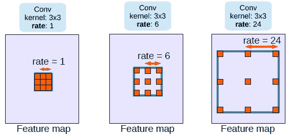

**Atrous Convolution with Different Rates r**

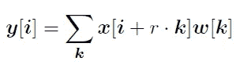

**Atrous Convolution**

*   对于输出 *y* 和滤波器 *w* 上的每个位置 *i* ，atrous 卷积应用于输入特征图 *x* 上，其中 atrous 速率 r 对应于我们对输入信号进行采样的步幅。
*   这相当于将输入 *x* 与通过沿每个空间维度在两个连续滤波器值之间插入 *r* -1 个零而产生的上采样滤波器进行卷积。(trous 在英语中是洞的意思。)
*   当 *r* =1 时，为标准卷积。
*   通过调整 r，我们可以自适应地修改过滤器的视野。
*   也称**扩张卷积** ( [扩张网](/review-dilated-convolution-semantic-segmentation-9d5a5bd768f5))或**孔洞算法**。

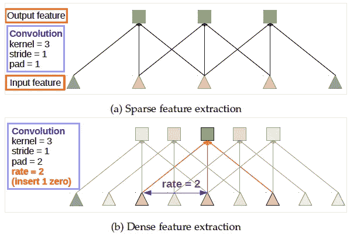

**Standard Convolution (Top) Atrous Convolution (Bottom)**

*   **顶**:标准卷积。
*   **底部**:阿特鲁卷积。我们可以看到，当 rate = 2 时，输入信号是交替采样的。首先，pad=2 意味着我们在左右两边都填充 2 个零。然后，当 rate=2 时，我们每隔 2 个输入对输入信号进行采样以进行卷积。阿特鲁卷积**允许我们扩大过滤器的视野，以纳入更大的背景。**因此，它提供了一种有效的机制来**控制视野**和 f **找到精确定位(小视野)和上下文同化(大视野)之间的最佳折衷。**

# **2。使用多重网格深入研究阿特鲁卷积**

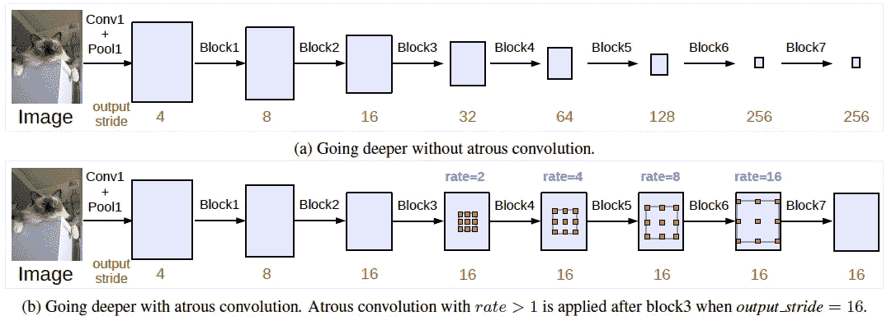

*   **(a)无阿特鲁 Conv** :执行标准 Conv 和池化，使输出步幅增加，即输出特征图变小，越深入。然而，连续跨越对于语义分割是有害的，因为位置/空间信息在更深的层丢失了。
*   **(b)与阿特鲁·conv**:与阿特鲁斯·conv 一起，我们可以保持步幅不变，但视野更大，而不增加参数数量或计算量。最后，我们可以有更大的输出特征图，这有利于语义分割。
*   例如，当 output stride = 16 且 Multi Grid = (1，2，4)时，块 4 中的三个卷积将分别具有 rates = 2×(1，2，4) = (2，4，8)。

# **3。阿特鲁空间金字塔池(ASPP)**

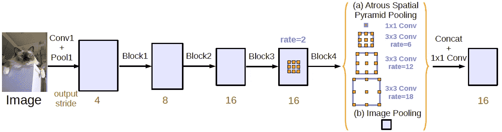

**Atrous Spatial Pyramid Pooling (ASPP)**

*   ASPP 已经在 [DeepLabv2](/review-deeplabv1-deeplabv2-atrous-convolution-semantic-segmentation-b51c5fbde92d) 中推出。这次，来自 [Inception-v2](https://medium.com/@sh.tsang/review-batch-normalization-inception-v2-bn-inception-the-2nd-to-surpass-human-level-18e2d0f56651) 的批量标准化(BN)被包含到 ASPP。
*   使用 ASPP 的原因是，随着采样率变大，有效滤波器权重(即，应用于有效特征区域而不是填充零的权重)的数量变小。
*   **一个 1×1 卷积和三个 3×3 卷积，码率= (6，12，18)** 当输出步长= 16 时。
*   此外， [ParseNet](https://medium.com/datadriveninvestor/review-parsenet-looking-wider-to-see-better-semantic-segmentation-aa6b6a380990) 的**图像池**或**图像级特征**也包含在**全局上下文**中。(有兴趣请阅读我的 [ParseNet](https://medium.com/datadriveninvestor/review-parsenet-looking-wider-to-see-better-semantic-segmentation-aa6b6a380990) 评测。)
*   全部用 **256 过滤器**和**批量归一化**。
*   当输出步幅= 8 时，速率加倍。
*   来自所有分支的结果特征然后被**连接**并通过**另一个 1×1 卷积**(也有 256 个过滤器和批量标准化)，然后通过最终 1×1 卷积生成最终逻辑。

# 其他人

## 上采样逻辑

*   在 [DeepLabv2](/review-deeplabv1-deeplabv2-atrous-convolution-semantic-segmentation-b51c5fbde92d) 中，目标地面实况在训练期间被向下采样 8 倍。
*   在 DeepLabv3 中，发现保持基本事实的完整性，而不是对最终逻辑进行上采样是非常重要的。

# 4.PASCAL VOC 2012 烧蚀研究

## 4.1.输出步幅

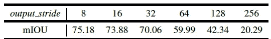

**Going deeper with atrous convolution when employing ResNet-50 with block7 and different output stride.**

*   将 ResNet-50 与 block7(即额外的 block5、block6 和 block7)一起使用时。如表所示，在输出跨距= 256 的情况下(即完全没有 atrous 卷积)，性能要差得多。
*   当输出步幅变大并相应地应用 atrous 卷积时，性能从 20.29%提高到 75.18%，表明 atrous 卷积在为语义分割级联构建更多块时是必不可少的。

## 4.2.ResNet-101

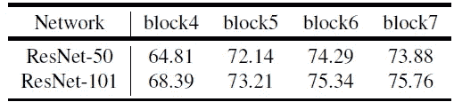

**ResNet-50 vs ResNet-101**

*   毫无疑问，ResNet-101 始终比 ResNet-50 好。
*   值得注意的是，将 block7 用于 ResNet-50 会略微降低性能，但仍会提高 ResNet-101 的性能。

## 4.3.多重网格

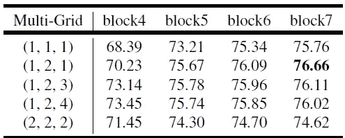

**Employing multi-grid method for ResNet-101 with different number of cascaded blocks at output stride = 16.**

*   应用多重网格方法通常比(r1，r2，r3) = (1，1，1)的普通版本更好。
*   简单地将单位速率加倍(即(r1，r2，r3) = (2，2，2))是无效的。
*   使用多重网格可以提高性能。
*   最佳模型是采用 block7 和(r1，r2，r3) = (1，2，1)的情况。

## 4.4.推理策略

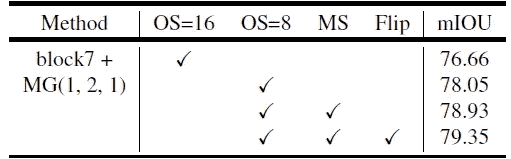

**Inference strategy on the val set. MG**: Multi-grid. **OS**: output stride. **MS**: Multi-scale inputs during test. **Flip**: Adding left-right flipped inputs.

*   用输出步幅= 16 训练该模型。
*   当在推理过程中使用 output stride = 8 (OS=8)来获得更详细的特征图时，性能提高了 1.39%。
*   当使用尺度= {0.5，0.75，1.0，1.25，1.5，1.75}的多尺度(MS)输入以及使用左右翻转图像并平均概率时，性能进一步提高到 79.35%。

## 4.5.ASPP

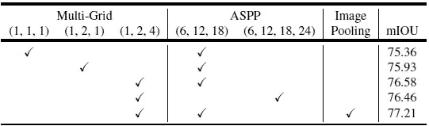

**ASPP with MG method and image-level features at output stride = 16.**

*   由 [ParseNet](https://medium.com/datadriveninvestor/review-parsenet-looking-wider-to-see-better-semantic-segmentation-aa6b6a380990) 提供的图像池或图像级功能也包含在全局上下文中。(有兴趣请阅读我的 [ParseNet](https://medium.com/datadriveninvestor/review-parsenet-looking-wider-to-see-better-semantic-segmentation-aa6b6a380990) 评测。)
*   在 ASPP = (6，12，18)的背景下采用多重网格= (1，2，4)优于多重网格= (1，1，1)和(1，2，1)。
*   用 ASPP = (6，12，18)比 ASPP = (6，12，18，24)好。
*   采用图像级特征后，性能进一步提高到 77.21%。

## 4.6.作物大小、上采样逻辑、批量标准、批量大小、训练和测试输出步幅

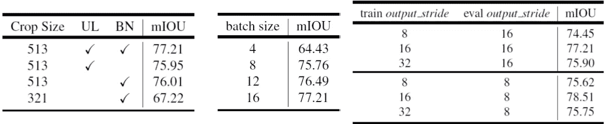

*   使用更大的作物尺寸 513 比 321 好。
*   用上采样对数和批量常模，77.21%。
*   在 4、8、12 和 16 中，使用批量 16 是最好的。
*   使用训练和测试输出步幅= (8，8)具有 77.21%的结果，而使用训练和测试输出步幅= (16，8)具有 78.51%的更好结果。

## 4.7.培训期间的副本数量

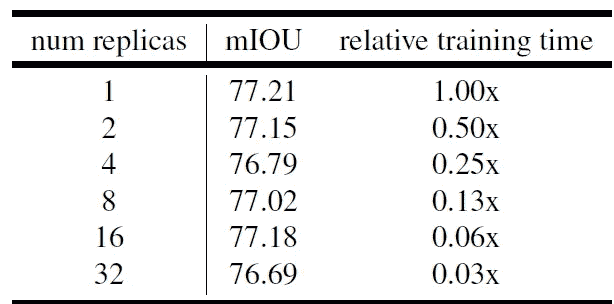

**Number of Replicas During Training**

*   TensorFlow 用于训练。
*   使用**只需要 1 个副本，3.65 天**的训练时间。
*   使用 **32 个副本，只需要 2.74 小时**的训练时间。

## 4.7.一起

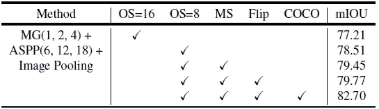

**Inference strategy on the val set**

*   **MG(1，2，4) + ASPP(6，12，18) +图像池** : **得到 77.21%** ，与 4.5 的结果相同。
*   **推理输出步幅= 8** ， **78.51%** 。
*   **多尺度(MS)测试** : **79.45%** 。
*   **水平翻转(翻转)** : **79.77%** 。
*   用**椰子**进行预处理后: **82.70%** 。
*   值得注意的是，经过重新思考和重组，在不使用后处理 CRF(用于 [DeepLabv2](/review-deeplabv1-deeplabv2-atrous-convolution-semantic-segmentation-b51c5fbde92d) )的情况下，已经比使用 CRF 和使用 COCO 进行预训练的 [DeepLabv2](/review-deeplabv1-deeplabv2-atrous-convolution-semantic-segmentation-b51c5fbde92d) 好了 77.69%。

# **5。与最先进方法的比较**

## 5.1.PASCAL VOC 2012 测试集

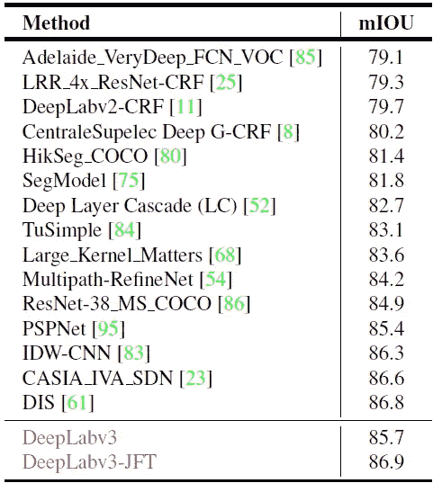

**PASCAL VOC 2012 Test Set**

*   **DeepLabv3** :对 PASCAL VOC 2012 trainval set 进行进一步微调，使用输出步幅= 8 进行训练，**在硬映像上引导**。特别地，包含硬分类的图像被复制， **85.7%** 。

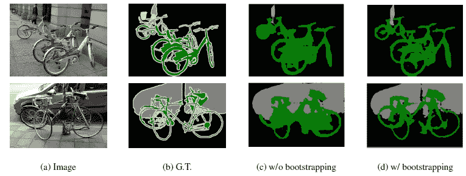

**Effect of Bootstrapping**

*   上面显示的硬图像上自举的改进提高了稀有和精细注释类(如自行车)的分割精度。
*   并且 **DeepLabv3 胜过** [**PSPNet**](/review-pspnet-winner-in-ilsvrc-2016-semantic-segmentation-scene-parsing-e089e5df177d) ，在 ILSVRC 2016 场景解析挑战赛中获得第一名。
*   **DeepLabv3-JFT** :采用已经在 ImageNet 和 JFT-300M 数据集上**预处理过的 ResNet-101， **86.9%** 。**

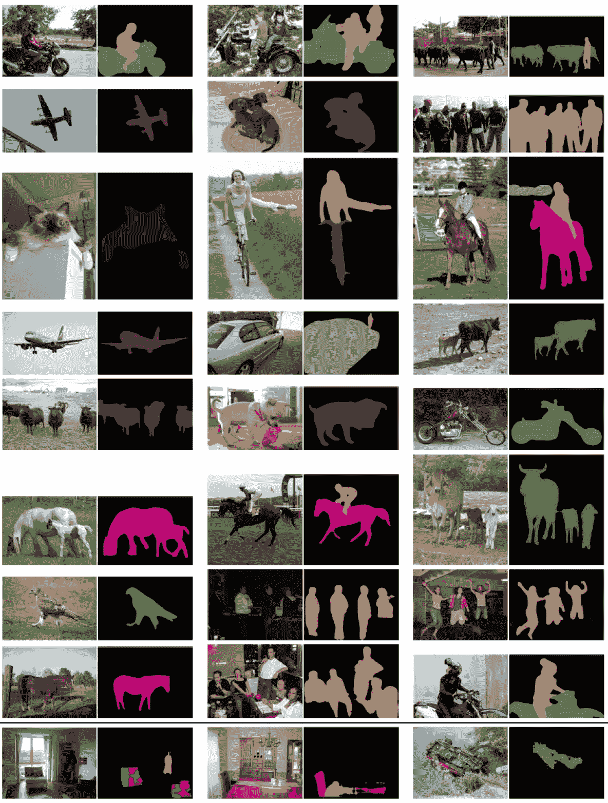

**Qualitative Results (Last Row, Failure Case) on PASCAL VOC 2012**

# **6。与最新城市景观方法的比较**

## 6.1.不同的设置

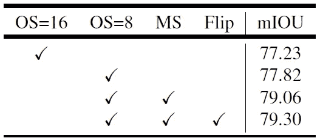

*   类似于 PASCAL VOC 2012，使用 8 的输出跨距进行测试，多标度和水平翻转也是如此，性能得到了提高。

## 6.2.城市景观测试集

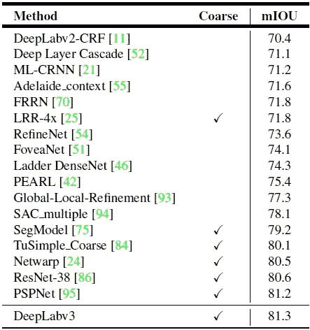

**Cityscape Test Set**

*   为了获得更好的比较性能，DeepLabv3 在 trainval 粗集上**进一步训练(即 3475 个精细注释图像和额外的 20000 个粗注释图像)。**
*   **推理时使用更多的刻度**和**更精细的输出步幅**。特别地，在**标度= {0.75，1，1.25，1.5，1.75，2}** 和求值**输出步距= 4** 的情况下，这分别为**在验证集**上贡献了额外的 0.8%和 0.1%。
*   最终在测试集上取得了 **81.3%** mIOU，比[**PSP net**](/review-pspnet-winner-in-ilsvrc-2016-semantic-segmentation-scene-parsing-e089e5df177d)**略好**。****

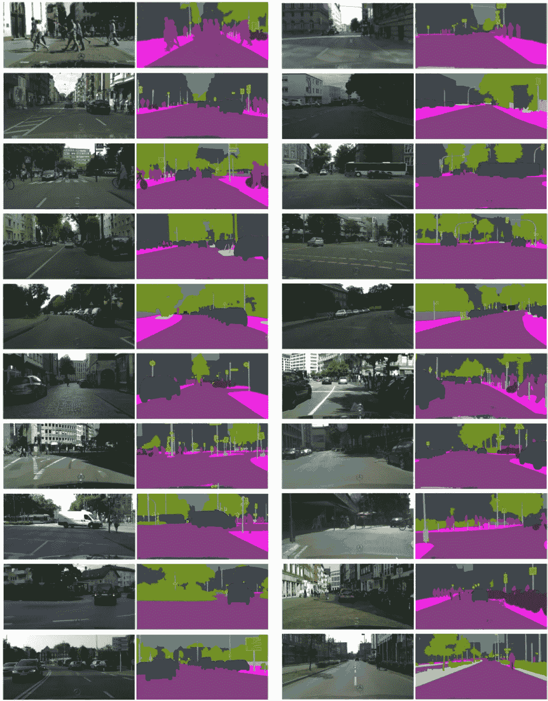

**Qualitative Results on Cityscape**

DeepLabv3 仅在很小的差距上胜过 PSPNet，也许这也是为什么它只是 arXiv 中的一份技术报告。但是后来，发明了比 DeepLabv3 好得多的 DeepLabv3+。希望以后可以复习 DeepLabv3+。:)

## 参考

【2017 arXiv】【DeepLabv3】
[反思阿特鲁卷积用于语义图像分割](https://arxiv.org/abs/1706.05587)

## 我的相关评论

)(我)(们)(都)(不)(想)(到)(这)(些)(人)(,)(我)(们)(都)(不)(想)(要)(到)(这)(些)(人)(,)(但)(是)(这)(些)(人)(还)(不)(想)(到)(这)(些)(人)(,)(我)(们)(还)(没)(想)(到)(这)(些)(事)(,)(我)(们)(就)(想)(到)(了)(这)(些)(人)(们)(,)(我)(们)(们)(都)(不)(想)(要)(到)(这)(些)(人)(,)(但)(我)(们)(还)(没)(想)(到)(这)(些)(事)(,)(我)(们)(还)(没)(想)(到)(这)(里)(来)(。 )(我)(们)(都)(不)(知)(道)(,)(我)(们)(还)(是)(不)(知)(道)(,)(我)(们)(还)(是)(不)(知)(道)(,)(我)(们)(还)(是)(不)(知)(道)(,)(我)(们)(还)(是)(不)(知)(道)(,)(我)(们)(还)(是)(不)(知)(道)(,)(我)(们)(还)(是)(不)(知)(道)(,)(我)(们)(还)(是)(不)(知)(道)(。

**物体检测** [过食](https://medium.com/coinmonks/review-of-overfeat-winner-of-ilsvrc-2013-localization-task-object-detection-a6f8b9044754)[R-CNN](https://medium.com/coinmonks/review-r-cnn-object-detection-b476aba290d1)[快 R-CNN](https://medium.com/coinmonks/review-fast-r-cnn-object-detection-a82e172e87ba)[快 R-CNN](/review-faster-r-cnn-object-detection-f5685cb30202)[DeepID-Net](/review-deepid-net-def-pooling-layer-object-detection-f72486f1a0f6)】[R-FCN](/review-r-fcn-positive-sensitive-score-maps-object-detection-91cd2389345c)】[离子](/review-ion-inside-outside-net-2nd-runner-up-in-2015-coco-detection-object-detection-da19993f4766)[多路径网](/review-multipath-mpn-1st-runner-up-in-2015-coco-detection-segmentation-object-detection-ea9741e7c413)[NoC](https://medium.com/datadriveninvestor/review-noc-winner-in-2015-coco-ilsvrc-detection-object-detection-d5cc84e372a)

**语义切分** [FCN](/review-fcn-semantic-segmentation-eb8c9b50d2d1)[de convnet](/review-deconvnet-unpooling-layer-semantic-segmentation-55cf8a6e380e)[deeplabv 1&deeplabv 2](/review-deeplabv1-deeplabv2-atrous-convolution-semantic-segmentation-b51c5fbde92d)】[parse net](https://medium.com/datadriveninvestor/review-parsenet-looking-wider-to-see-better-semantic-segmentation-aa6b6a380990)】[dilated net](/review-dilated-convolution-semantic-segmentation-9d5a5bd768f5)[PSPNet](/review-pspnet-winner-in-ilsvrc-2016-semantic-segmentation-scene-parsing-e089e5df177d)]

**生物医学图像分割** 

**实例分割
[[深度掩码](/review-deepmask-instance-segmentation-30327a072339) ] [ [锐度掩码](/review-sharpmask-instance-segmentation-6509f7401a61) ] [ [多路径网络](/review-multipath-mpn-1st-runner-up-in-2015-coco-detection-segmentation-object-detection-ea9741e7c413) ] [ [MNC](/review-mnc-multi-task-network-cascade-winner-in-2015-coco-segmentation-instance-segmentation-42a9334e6a34) ] [ [实例中心](/review-instancefcn-instance-sensitive-score-maps-instance-segmentation-dbfe67d4ee92) ] [ [FCIS](/review-fcis-winner-in-2016-coco-segmentation-instance-segmentation-ee2d61f465e2)**

**超分辨率** [Sr CNN](https://medium.com/coinmonks/review-srcnn-super-resolution-3cb3a4f67a7c)[fsr CNN](/review-fsrcnn-super-resolution-80ca2ee14da4)[VDSR](/review-vdsr-super-resolution-f8050d49362f)[ESPCN](https://medium.com/datadriveninvestor/review-espcn-real-time-sr-super-resolution-8dceca249350)[红网](https://medium.com/datadriveninvestor/review-red-net-residual-encoder-decoder-network-denoising-super-resolution-cb6364ae161e)】