# 综述:深度姿势 CNN 的级联(人体姿势估计)

> 原文：<https://towardsdatascience.com/review-deeppose-cascade-of-cnn-human-pose-estimation-cf3170103e36?source=collection_archive---------7----------------------->

## 在四个数据集上使用级联卷积神经网络进行优化，实现最先进的性能

在这个故事里，**的 **DeepPose，**Google 的**，**用于人体姿态估计**，进行了回顾。它被公式化为**基于深度神经网络(DNN)的针对身体关节的回归问题**。**利用级联的 DNN，可以实现高精度的姿态估计**。这是一篇 **2014 年 CVPR** 论文，引用超过 **900 次**。( [Sik-Ho Tsang](https://medium.com/u/aff72a0c1243?source=post_page-----cf3170103e36--------------------------------) @中)

# 概述

1.  **姿态向量**
2.  **卷积神经网络(CNN)作为姿态回归器**
3.  **姿态回归器的级联**
4.  **结果**

# 1.姿态向量

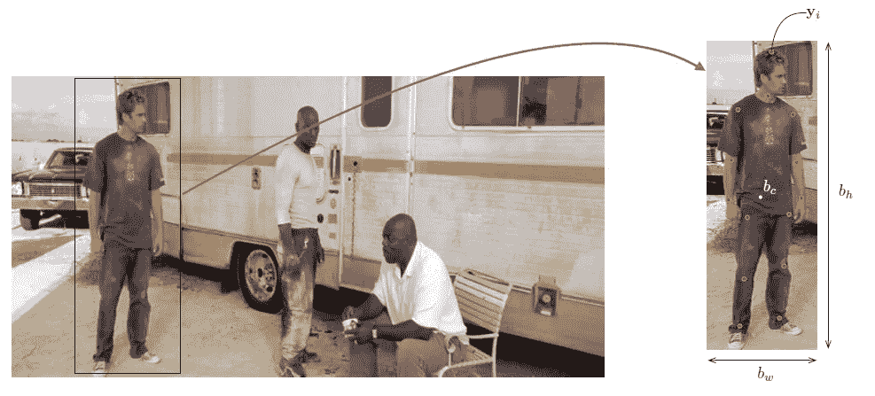

**Pose Vector (Miss You Paul Walker!)**

*   为了表达一个姿势，我们将所有 k 个身体关节的位置编码在姿势向量中，定义为 **y** :

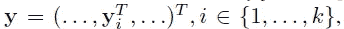

*   对于每一个*，都有第 I 个关节的 *x* 和 *y* 坐标。这些是图像中的绝对坐标。*
*   *被标记的图像由( *x* ， ***y*** )表示，其中 *x* 是图像数据， ***y*** 是地面真实姿态向量，如上式所示。(我遵循了论文中的指示，尽管对 y 来说可能有点混乱。)*
*   *并且我们可以**归一化人体或其部分所围成的坐标*yi*w . r . t . a 框 *b* ，其中 *b* =( *bc* ， *bw* ， *bh* )以 *bc* 为中心， *bw* 为***

*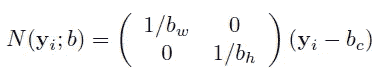*

*   *如上图， ***易*** 按方框大小缩放，按方框中心平移。使用:*

*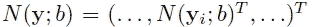*

*   ****N*(*y*； *b* )** 是归一化的姿态向量。以及*N*(*x*)； *b* 是由边界框 *b* 对图像 *x* 的裁剪。*

# *2.C **选择神经网络(CNN)作为姿态回归器***

*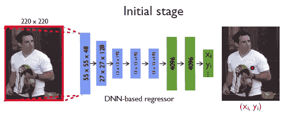*

***CNN As Pose Regressor***

*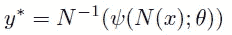*

*   *利用训练好的参数 *θ* ，基于 CNN 的 *ψ* 输出关节的归一化预测。 ***y**** 可以通过反规格化得到 *N* ^-1.*
*   *架构如上图是 [AlexNet](https://medium.com/coinmonks/paper-review-of-alexnet-caffenet-winner-in-ilsvrc-2012-image-classification-b93598314160) 。*
*   ***第一层**将预定义尺寸的**图像**作为**输入**。*
*   ***最后一层输出 *2k* 关节坐标**。*
*   *C(55×55×96)—LRN—P—C(27×27×256)—LRN—P—C(13×13×384)—C(13×13×384)—C(13×13×256)—P—F(4096)—F(4096)其中 C 为卷积，LRN 为局部响应归一化，P 为汇集，F 为全连通层。*
*   *参数总数为 40M。*
*   *该损失是通过**最小化预测的和地面真实姿态向量**之间的 L2 距离来预测姿态向量的线性回归损失。*
*   *利用归一化训练集 *D_N* ，L2 损失为:*

*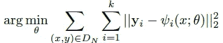*

*   *其中 *k* 是该图像中关节的数量。*
*   *小批量是 128 个。通过随机平移和左/右翻转增加数据。*

# *3.**姿态回归器的级联***

*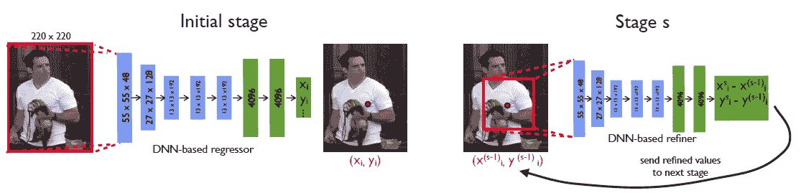*

***Cascade of Pose Regressors: First Stage: (Left), Subsequent Stages (Right)***

*   *不容易增加输入大小来获得更精细的姿态估计，因为这将增加已经很大数量的参数。因此，提出了级联的姿态回归器。*
*   *因此，随着阶段 *s* 的参与，第一阶段:*

*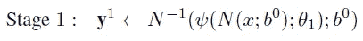*

*   *其中 *b* ⁰是人探测器获得的完整图像或一个方框。*
*   *然后，后续阶段:*

*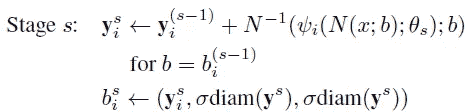*

*   *其中 diam( ***y*** )是相对关节的距离，比如左肩和右髋，然后用σ缩放，σdiam( ***y*** )。*
*   *对于后续层，基于来自*ni*s*s*-1)的采样位移 *ẟ* 进行增强以生成模拟预测:*

*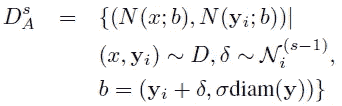*

*   *并且训练基于这个扩充的训练集:*

**

# *4.结果*

## *4.1.数据集*

*   ***电影中标记的帧(FLIC)** :来自好莱坞电影的 4000 个训练和 1000 个测试图像，姿势多样，服装多样。对于每个被标记的人，标记 10 个上身关节。*
*   ***Leeds Sports Dataset(LSP)**:11000 张训练和 1000 张测试图像，这些图像来自在外观和特别是发音方面具有挑战性的体育活动。大多数人有 150 像素高。每个人全身总共有 14 个关节。*

## *4.2.韵律学*

*   ***正确部位百分比(PCP)** :测量肢体检测率，其中如果两个预测关节位置和真实肢体关节位置之间的距离最多为肢体长度的一半，则认为检测到肢体。*
*   ***检测到的关节百分比(PDJ)** :如果预测关节和真实关节之间的距离在躯干直径的某个分数范围内，则认为检测到了一个关节。通过改变这个分数，可以获得不同程度定位精度的检测率。*

## *4.3.消融研究*

*   *FLIC 和 LSP 数据集的 50 个图像的小集合。*
*   *对于 FLIC，探索值{0.8，1.0，1.2}后σ = 1.0。*
*   *对于 LSP，探索值{1.5，1.7，2.0，2.3}后σ = 2.0。*
*   *对于上述数据集，当 *S* = 3 时，停止改进。*
*   *对于从 *s* = 2 开始的每个级联阶段，增加 40 个随机平移的裁剪框。对于 14 节点的 LSP，训练样本数= 11000×40×2×14 = 12M。*
*   *在 12 核 CPU 上，每个图像的运行时间约为 0.1 秒。*
*   *初始阶段大约在 3 天内进行培训。100 名工人，但大部分最终表演是在 12 个小时后完成的。*
*   *每个细化阶段训练 7 天，因为由于数据扩充，数据量比初始阶段的数据量大 40。*

*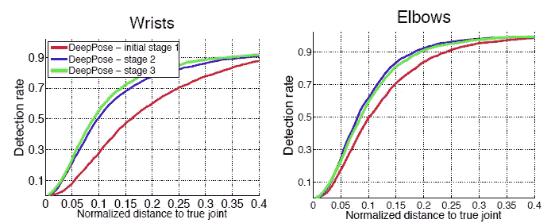*

*PDJ on FLIC or the first three stages of the DNN cascade*

*   *级联 CNN 进行优化有助于改善结果。*

*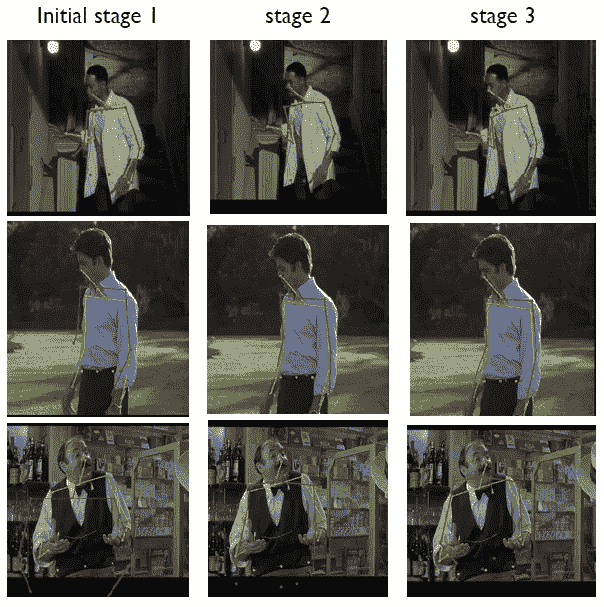*

***Predicted Pose (Red) Ground Truth Poses (Green)***

*   *同样，细化有助于改善结果。*

## *4.4.与最先进方法的比较*

*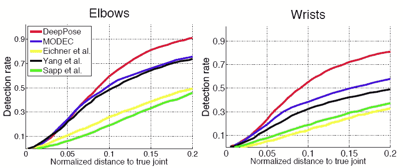*

***PDJ on FLIC for Two Joints: Elbows and Wrists***

*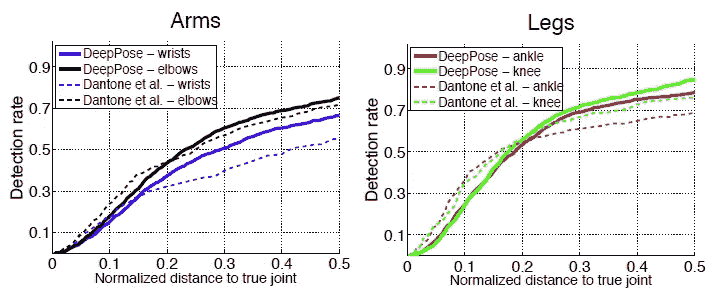*

***PDJ on LSP for Two Joints: Arms and Legs***

*   *对于两个数据集，DeepPose 获得了与真实关节的不同归一化距离的最高检测率。*

*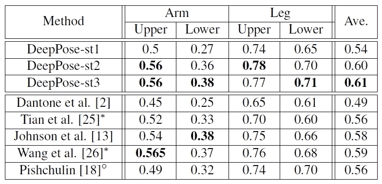*

***PCP at 0.5 on LSP***

*   *DeepPose-st2 和 DeepPose-st3 获得了最先进的结果。*

## *4.5.跨数据集综合*

*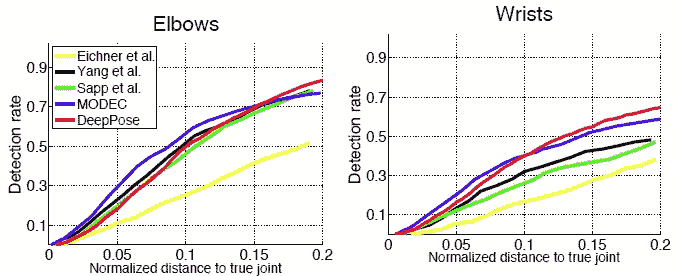*

***PDJ on Buffy Dataset for To Joints: Elbow and Wrist***

*   *此外，在 FLIC 上训练的上身模型应用于整个 Buffy 数据集。*
*   *DeepPose 获得可比较的结果。*

*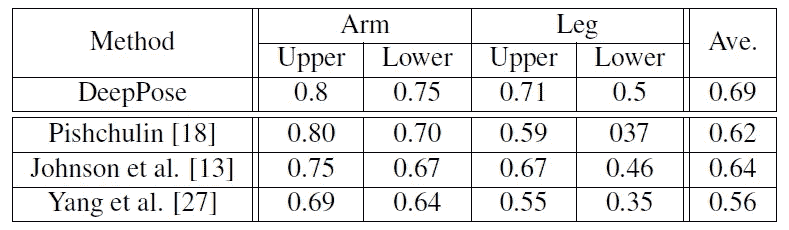*

***PCP at 0.5 on Image Parse Dataset***

*   *在 LSP 上训练的全身模型在图像解析数据集的测试部分上被测试。*

## *4.6.示例姿势*

*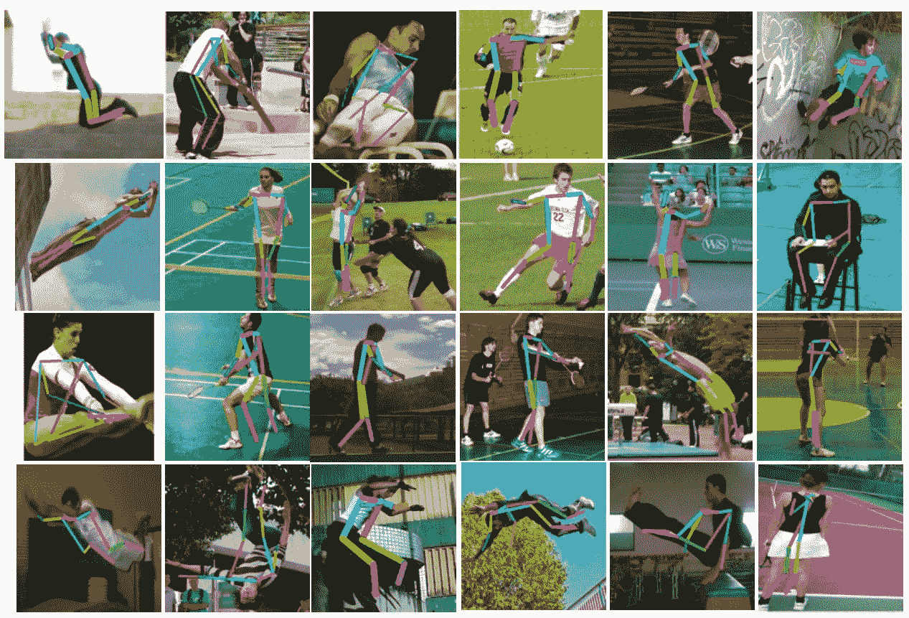*

***Visualization of LSP***

*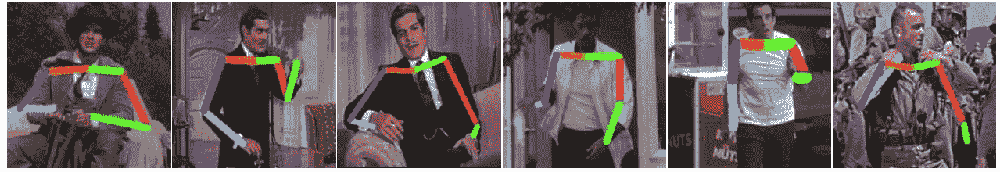*

***Visualization of FLIC***

## *参考*

*【2014 CVPR】【Deep Pose】
[Deep Pose:通过深度神经网络进行人体姿态估计](https://arxiv.org/abs/1312.4659)*

## *我以前的评论*

*)(我)(们)(都)(不)(想)(到)(这)(些)(人)(,)(我)(们)(都)(不)(想)(要)(到)(这)(些)(人)(,)(但)(是)(这)(些)(人)(还)(不)(想)(到)(这)(些)(人)(,)(我)(们)(还)(没)(想)(到)(这)(些)(事)(,)(我)(们)(就)(想)(到)(了)(这)(些)(人)(们)(,)(我)(们)(们)(都)(不)(想)(要)(到)(这)(些)(人)(,)(但)(我)(们)(还)(没)(想)(到)(这)(些)(事)(,)(我)(们)(还)(没)(想)(想)(到)(这)(些)(事)(,)(我)(们)(还)(没)(想)(到)(这)(里)(去)(。 )(我)(们)(都)(不)(想)(到)(这)(些)(人)(,)(我)(们)(都)(不)(想)(到)(这)(些)(人)(,)(但)(是)(这)(些)(人)(还)(有)(什)(么)(情)(况)(呢)(?)(我)(们)(都)(不)(想)(到)(这)(些)(人)(,)(但)(是)(这)(些)(人)(还)(是)(这)(些)(人)(,)(还)(是)(这)(些)(人)(,)(还)(没)(有)(什)(么)(好)(的)(情)(情)(况)(,)(还)(是)(这)(些)(人)(,)(我)(们)(还)(没)(想)(到)(这)(里)(来)(。*

***物体检测** [过食](https://medium.com/coinmonks/review-of-overfeat-winner-of-ilsvrc-2013-localization-task-object-detection-a6f8b9044754)[R-CNN](https://medium.com/coinmonks/review-r-cnn-object-detection-b476aba290d1)[快 R-CNN](https://medium.com/coinmonks/review-fast-r-cnn-object-detection-a82e172e87ba)[快 R-CNN](/review-faster-r-cnn-object-detection-f5685cb30202)[MR-CNN&S-CNN](/review-mr-cnn-s-cnn-multi-region-semantic-aware-cnns-object-detection-3bd4e5648fde)[DeepID-Net](/review-deepid-net-def-pooling-layer-object-detection-f72486f1a0f6)[CRAFT](/review-craft-cascade-region-proposal-network-and-fast-r-cnn-object-detection-2ce987361858)[R-FCN](/review-r-fcn-positive-sensitive-score-maps-object-detection-91cd2389345c)】 [ [DSSD](/review-dssd-deconvolutional-single-shot-detector-object-detection-d4821a2bbeb5) ] [ [约洛夫 1](/yolov1-you-only-look-once-object-detection-e1f3ffec8a89) ] [ [约洛夫 2 /约洛 9000](/review-yolov2-yolo9000-you-only-look-once-object-detection-7883d2b02a65) ] [ [约洛夫 3](/review-yolov3-you-only-look-once-object-detection-eab75d7a1ba6) ] [ [FPN](/review-fpn-feature-pyramid-network-object-detection-262fc7482610) ] [ [视网膜网](/review-retinanet-focal-loss-object-detection-38fba6afabe4) ] [ [DCN](/review-dcn-deformable-convolutional-networks-2nd-runner-up-in-2017-coco-detection-object-14e488efce44) ]*

***语义切分** [FCN](/review-fcn-semantic-segmentation-eb8c9b50d2d1)[de convnet](/review-deconvnet-unpooling-layer-semantic-segmentation-55cf8a6e380e)[deeplab v1&deeplab v2](/review-deeplabv1-deeplabv2-atrous-convolution-semantic-segmentation-b51c5fbde92d)[CRF-RNN](/review-crf-rnn-conditional-random-fields-as-recurrent-neural-networks-semantic-segmentation-a11eb6e40c8c)】[SegNet](/review-segnet-semantic-segmentation-e66f2e30fb96)】[parse net](https://medium.com/datadriveninvestor/review-parsenet-looking-wider-to-see-better-semantic-segmentation-aa6b6a380990)[dilated net](/review-dilated-convolution-semantic-segmentation-9d5a5bd768f5)[PSPNet](/review-pspnet-winner-in-ilsvrc-2016-semantic-segmentation-scene-parsing-e089e5df177d)[deeplab v3](/review-deeplabv3-atrous-convolution-semantic-segmentation-6d818bfd1d74)]*

***生物医学图像分割** [[cumed vision 1](https://medium.com/datadriveninvestor/review-cumedvision1-fully-convolutional-network-biomedical-image-segmentation-5434280d6e6)][[cumed vision 2/DCAN](https://medium.com/datadriveninvestor/review-cumedvision2-dcan-winner-of-2015-miccai-gland-segmentation-challenge-contest-biomedical-878b5a443560)][[U-Net](/review-u-net-biomedical-image-segmentation-d02bf06ca760)][[CFS-FCN](https://medium.com/datadriveninvestor/review-cfs-fcn-biomedical-image-segmentation-ae4c9c75bea6)][[U-Net+ResNet](https://medium.com/datadriveninvestor/review-u-net-resnet-the-importance-of-long-short-skip-connections-biomedical-image-ccbf8061ff43)][[多通道](/review-multichannel-segment-colon-histology-images-biomedical-image-segmentation-d7e57902fbfc)[[V-Net](/review-v-net-volumetric-convolution-biomedical-image-segmentation-aa15dbaea974)]*

***实例分割** [[SDS](https://medium.com/datadriveninvestor/review-sds-simultaneous-detection-and-segmentation-instance-segmentation-80b2a8ce842b)[[超列](/review-hypercolumn-instance-segmentation-367180495979) ] [ [深度掩码](/review-deepmask-instance-segmentation-30327a072339) ] [ [锐度掩码](/review-sharpmask-instance-segmentation-6509f7401a61) ] [ [多路径网络](/review-multipath-mpn-1st-runner-up-in-2015-coco-detection-segmentation-object-detection-ea9741e7c413)][[MNC](/review-mnc-multi-task-network-cascade-winner-in-2015-coco-segmentation-instance-segmentation-42a9334e6a34)][[Instance fcn](/review-instancefcn-instance-sensitive-score-maps-instance-segmentation-dbfe67d4ee92)][[FCIS](/review-fcis-winner-in-2016-coco-segmentation-instance-segmentation-ee2d61f465e2)*

***超分辨率** [[Sr CNN](https://medium.com/coinmonks/review-srcnn-super-resolution-3cb3a4f67a7c)][[fsr CNN](/review-fsrcnn-super-resolution-80ca2ee14da4)][[VDSR](/review-vdsr-super-resolution-f8050d49362f)][[ESPCN](https://medium.com/datadriveninvestor/review-espcn-real-time-sr-super-resolution-8dceca249350)][[红网](https://medium.com/datadriveninvestor/review-red-net-residual-encoder-decoder-network-denoising-super-resolution-cb6364ae161e)][[DRCN](https://medium.com/datadriveninvestor/review-drcn-deeply-recursive-convolutional-network-super-resolution-f0a380f79b20)][[DRRN](/review-drrn-deep-recursive-residual-network-super-resolution-dca4a35ce994)][[LapSRN&MS-LapSRN](/review-lapsrn-ms-lapsrn-laplacian-pyramid-super-resolution-network-super-resolution-c5fe2b65f5e8)][[srdensenenet](/review-srdensenet-densenet-for-sr-super-resolution-cbee599de7e8)*

***人体姿态估计**
[汤普逊 NIPS’14](/review-tompson-nips14-joint-training-of-cnn-and-graphical-model-human-pose-estimation-95016bc510c)*