# 综述:Dual 双路径网络(图像分类)

> 原文：<https://towardsdatascience.com/review-dpn-dual-path-networks-image-classification-d0135dce8817?source=collection_archive---------11----------------------->

## 优于 ResNet、DenseNet、PolyNet、ResNeXt，ILSVRC 2017 对象本地化挑战赛冠军

在这个故事里，**【双路径网络】**被简要回顾。这是新加坡国立大学、北京理工大学、国防科技大学、奇虎 360 AI 研究所合作的作品。 [ResNet](/review-resnet-winner-of-ilsvrc-2015-image-classification-localization-detection-e39402bfa5d8) 支持功能重用，而 [DenseNet](/review-densenet-image-classification-b6631a8ef803) 支持新功能探索。DPN 从 ResNet 和 DenseNet 这两者中挑选优势。最后，它在图像分类任务上优于 [ResNet](/review-resnet-winner-of-ilsvrc-2015-image-classification-localization-detection-e39402bfa5d8) 、 [DenseNet](/review-densenet-image-classification-b6631a8ef803) 、 [PolyNet](/review-polynet-2nd-runner-up-in-ilsvrc-2016-image-classification-8a1a941ce9ea) 、 [ResNeXt](/review-resnext-1st-runner-up-of-ilsvrc-2016-image-classification-15d7f17b42ac) 。DPN **赢得了 ILSVRC 2017 本地化挑战赛**。凭借更好的主干，它还可以为对象检测和语义分割任务获得最先进的结果。并作为 **2017 NIPS** 论文发表，引用 **100 余篇**。( [Sik-Ho Tsang](https://medium.com/u/aff72a0c1243?source=post_page-----d0135dce8817--------------------------------) @中)

# 概述

1.  [**ResNet**](/review-resnet-winner-of-ilsvrc-2015-image-classification-localization-detection-e39402bfa5d8)**[**dense net**](/review-densenet-image-classification-b6631a8ef803)**和 DPN****
2.  ****与最先进方法的比较****

# ****1。** [雷斯内特](/review-resnet-winner-of-ilsvrc-2015-image-classification-localization-detection-e39402bfa5d8) **，** [丹森内特](/review-densenet-image-classification-b6631a8ef803) **和 DPN****

## **1.1. [DenseNet](/review-densenet-image-classification-b6631a8ef803)**

**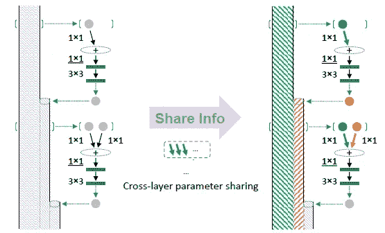**

**[**DenseNet**](/review-densenet-image-classification-b6631a8ef803)**

*   **作者尝试将 [ResNet](/review-resnet-winner-of-ilsvrc-2015-image-classification-localization-detection-e39402bfa5d8) 和 [DenseNet](/review-densenet-image-classification-b6631a8ef803) 表示为高阶递归神经网络(HORNN)进行解释。**
*   **当 [DenseNet](/review-densenet-image-classification-b6631a8ef803) 表示为 HORNN 时， [DenseNet](/review-densenet-image-classification-b6631a8ef803) 可以表示如上图。**
*   **绿色箭头表示共享权重卷积。**

**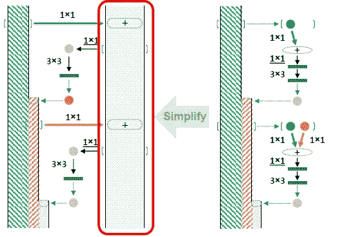**

**[**DenseNet**](/review-densenet-image-classification-b6631a8ef803)**

## **1.2.ResNet**

*   **添加了一个新路径来临时保存绿色箭头的输出以供重用。**

**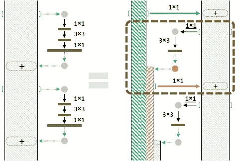**

**[**ResNet**](/review-resnet-winner-of-ilsvrc-2015-image-classification-localization-detection-e39402bfa5d8) **(Left)** [**DenseNet**](/review-densenet-image-classification-b6631a8ef803) **(Right)****

*   **虚线矩形实际上是剩余路径。**

**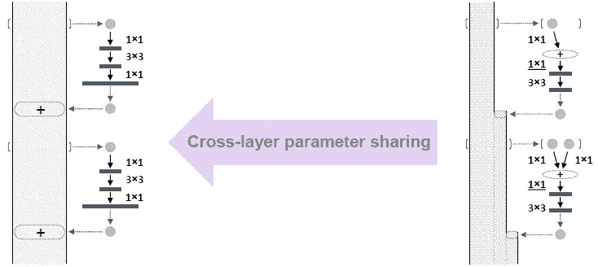**

**[**ResNet**](/review-resnet-winner-of-ilsvrc-2015-image-classification-localization-detection-e39402bfa5d8) **(Left)** [**DenseNet**](/review-densenet-image-classification-b6631a8ef803) **(Right)****

*   **剩余网络本质上是密集连接的网络，但是具有共享连接。**
*   **[**ResNet**](/review-resnet-winner-of-ilsvrc-2015-image-classification-localization-detection-e39402bfa5d8) **:特征细化(特征复用)。****
*   **[**dense net**](/review-densenet-image-classification-b6631a8ef803)**:不断探索新功能。****

****

****Managing a Company****

*   **就像管理公司一样:**
*   ****员工需要不断提高技能(特征提炼)。****
*   ****还需要招聘大一新生到公司(特色探索)。****
*   **论文中有大量段落和方程供 [ResNet](/review-resnet-winner-of-ilsvrc-2015-image-classification-localization-detection-e39402bfa5d8) 和 [DenseNet](/review-densenet-image-classification-b6631a8ef803) 解释。如果感兴趣，请阅读该文件。**

## **1.3.DPN**

**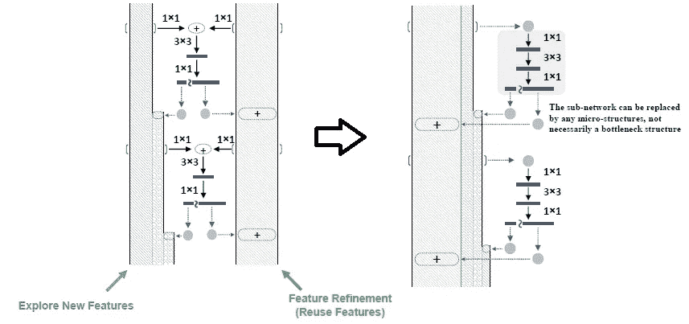**

****DPN****

*   **为了兼具两者的优点，网络变成了如上左图。**
*   **将两列合并为一列，DPN 如上图所示。**

**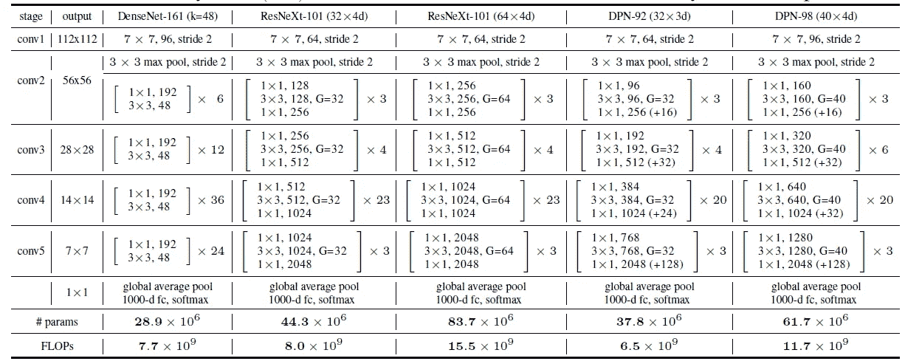**

****Detailed Architecture and Complexity Comparison****

*   **与 [ResNeXt](/review-resnext-1st-runner-up-of-ilsvrc-2016-image-classification-15d7f17b42ac) 相比，DPN 被有意设计成具有相当小的模型尺寸和较少的 FLOPs。**
*   ****DPN-92** 比[**ResNeXt-101**](/review-resnext-1st-runner-up-of-ilsvrc-2016-image-classification-15d7f17b42ac)**【32×4d】**成本约为**成本约为 15%，而 **DPN-98** 比**[**ResNeXt-101**](/review-resnext-1st-runner-up-of-ilsvrc-2016-image-classification-15d7f17b42ac)**【64×4d】**成本约为 26%。**
*   **在 224×224 输入的情况下， **DPN-92** 比[**ResNeXt-101**](/review-resnext-1st-runner-up-of-ilsvrc-2016-image-classification-15d7f17b42ac)**【32×4d】****DPN-98**比[**ResNeXt-101**](/review-resnext-1st-runner-up-of-ilsvrc-2016-image-classification-15d7f17b42ac)**消耗约**25% FLOPs(64******

# **2.**与最先进方法的比较****

## **2.1.图像分类**

**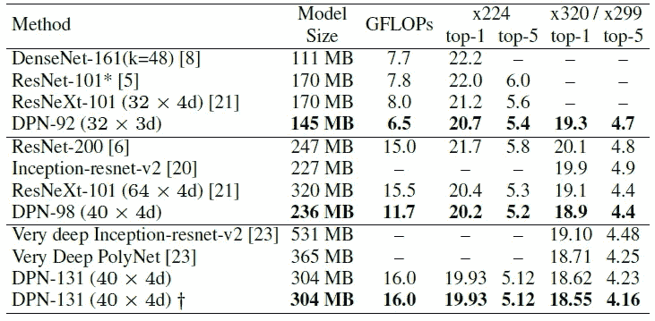**

****ImageNet-1k Dataset Validation Set (+: Mean-Max Pooling)****

*   **与 [ResNeXt-101](/review-resnext-1st-runner-up-of-ilsvrc-2016-image-classification-15d7f17b42ac) (32×4d)相比，深度仅为 92 的浅 DPN 将 top-1 错误率降低了 0.5%的绝对值，与 [DenseNet-161](/review-densenet-image-classification-b6631a8ef803) 相比，降低了 1.5%的绝对值，但提供的 FLOPs 要少得多。**
*   **更深的 DPN (DPN-98)超过了最好的残差网络— [ResNeXt-101](/review-resnext-1st-runner-up-of-ilsvrc-2016-image-classification-15d7f17b42ac) (64×4d)，并且仍然享有少 25%的 FLOPs 和小得多的模型尺寸(236 MB 对 320 MB)。**
*   **DPN-131 显示出优于最佳单一型号的精确度——非常深的 [PolyNet](/review-polynet-2nd-runner-up-in-ilsvrc-2016-image-classification-8a1a941ce9ea) ，具有小得多的型号尺寸(304 MB v.s. 365 MB)。**
*   **[PolyNet](/review-polynet-2nd-runner-up-in-ilsvrc-2016-image-classification-8a1a941ce9ea) 采用[随机深度(SD)](/review-stochastic-depth-image-classification-a4e225807f4a) 等众多招数进行训练，DPN-131 可以使用标准训练策略进行训练。而且 DPN-131 的实际训练速度比[波利尼特](/review-polynet-2nd-runner-up-in-ilsvrc-2016-image-classification-8a1a941ce9ea)快 2 倍左右。**

**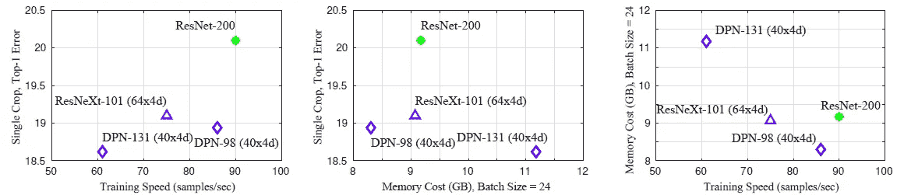**

****Comparison of total actual cost between different models during training.****

*   **实际成本如上所述进行比较。**
*   **DPN-98 比性能最好的 [ResNeXt](/review-resnext-1st-runner-up-of-ilsvrc-2016-image-classification-15d7f17b42ac) 快 15%,使用的内存少 9%,测试错误率也低得多。**
*   **与性能最好的 [ResNeXt](/review-resnext-1st-runner-up-of-ilsvrc-2016-image-classification-15d7f17b42ac) 相比，更深的 DPN-131 只多花费了大约 19%的训练时间，但却达到了最先进的单一模型性能。**
*   **[PolyNet](/review-polynet-2nd-runner-up-in-ilsvrc-2016-image-classification-8a1a941ce9ea) (537 层)【23】的训练速度，基于使用 MXNet 的重新实现，约为每秒 31 个样本，表明 DPN-131 在训练期间运行速度比 [PolyNet](/review-polynet-2nd-runner-up-in-ilsvrc-2016-image-classification-8a1a941ce9ea) 快约 2 倍。**

## **4.2.场景分类**

**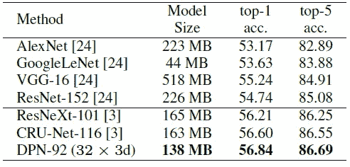**

****Places365-Standard dataset Validation Accuracy****

*   **Places365-Standard 数据集是一个高分辨率的场景理解数据集，包含 365 个场景类别的超过 180 万幅图像。**
*   **DPN-92 需要的参数少得多(138 MB 对 163 MB)，这再次证明了它的高参数效率和高泛化能力。**

## **4.3.目标检测**

**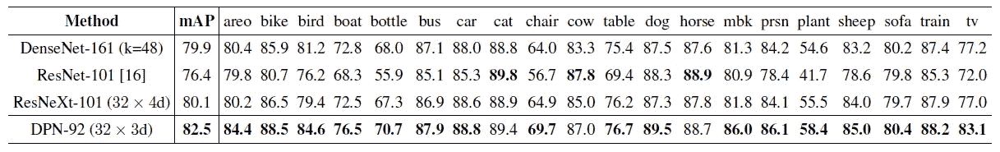**

****PASCAL VOC 2007 test set****

*   **该模型在 VOC 2007 trainval 和 VOC 2012 trainval 的联合集上进行训练，并在 VOC 2007 测试集上进行评估，使用[更快的 R-CNN](/review-faster-r-cnn-object-detection-f5685cb30202) 框架。**
*   **DPN 获得了 82.5%的地图，这是一个很大的进步，比 [ResNet-101](/review-resnet-winner-of-ilsvrc-2015-image-classification-localization-detection-e39402bfa5d8) 提高了 6.1%，比 [ResNeXt-101](/review-resnext-1st-runner-up-of-ilsvrc-2016-image-classification-15d7f17b42ac) (32×4d)提高了 2.4%。**

## **4.4.语义分割**

**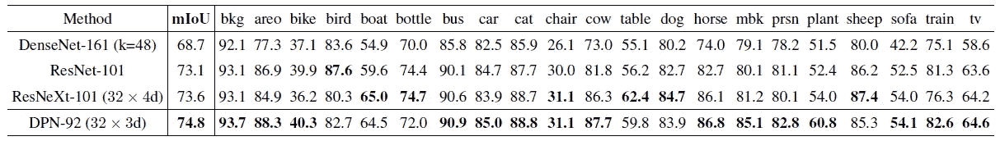**

****PASCAL VOC 2012 test set****

*   **细分框架基于 [DeepLabv2](/review-deeplabv1-deeplabv2-atrous-convolution-semantic-segmentation-b51c5fbde92d) 。conv4 和 conv5 中的 3×3 卷积层替换为 atrous 卷积，并且在 conv5 的最终要素图中使用了阿特鲁空间金字塔池(ASPP)。**
*   **DPN-92 具有最高的整体 mIoU 精度，将整体 mIoU 提高了绝对值 1.7%。**
*   **考虑到[的 ResNeXt-101](/review-resnext-1st-runner-up-of-ilsvrc-2016-image-classification-15d7f17b42ac) (32×4d)与[的 ResNet-101](/review-resnet-winner-of-ilsvrc-2015-image-classification-localization-detection-e39402bfa5d8) 相比，整体 mIoU 仅提高绝对值 0.5%，建议的 DPN-92 与[的 ResNeXt-101](/review-resnext-1st-runner-up-of-ilsvrc-2016-image-classification-15d7f17b42ac) (32×4d)相比，提高了 3 倍以上。**

## **4.5.ILSVRC 2017 对象本地化**

**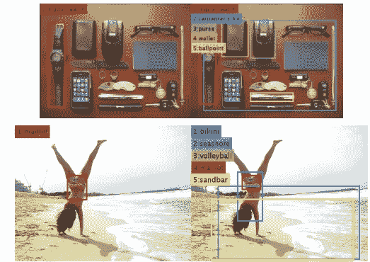**

****Visualization****

*   **[以更快的 R-CNN](/review-faster-r-cnn-object-detection-f5685cb30202) 为框架。**
*   **当使用额外的训练数据时，DPN 在分类和本地化任务中也获得了胜利。**
*   **排行榜:[http://image-net.org/challenges/LSVRC/2017/results](http://image-net.org/challenges/LSVRC/2017/results)**

## **4.5.ILSVRC 2017 对象检测**

**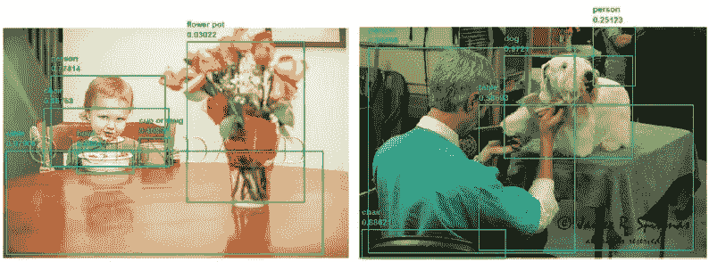**

****Visualization****

## **参考**

**【2017 NIPS】【DPN】
[双路径网络](https://arxiv.org/abs/1707.01629)**

## **我以前的评论**

**)(我)(们)(都)(不)(想)(到)(这)(些)(人)(,)(我)(们)(都)(不)(想)(要)(到)(这)(些)(人)(,)(但)(是)(这)(些)(人)(还)(不)(想)(到)(这)(些)(人)(,)(我)(们)(还)(没)(想)(到)(这)(些)(事)(,)(我)(们)(就)(想)(到)(了)(这)(些)(人)(们)(,)(我)(们)(们)(都)(不)(想)(要)(到)(这)(些)(人)(,)(但)(我)(们)(还)(没)(想)(到)(这)(些)(事)(,)(我)(们)(还)(没)(想)(想)(到)(这)(些)(事)(,)(我)(们)(还)(没)(想)(到)(这)(里)(去)(。 )(我)(们)(都)(不)(想)(到)(这)(些)(人)(,)(我)(们)(都)(不)(想)(到)(这)(些)(人)(,)(但)(是)(这)(些)(人)(还)(有)(什)(么)(情)(况)(呢)(?)(我)(们)(都)(不)(想)(到)(这)(些)(人)(,)(但)(是)(这)(些)(人)(还)(是)(这)(些)(人)(,)(还)(是)(这)(些)(人)(,)(还)(没)(有)(什)(么)(好)(的)(情)(情)(况)(,)(还)(是)(这)(些)(人)(,)(我)(们)(还)(没)(想)(到)(这)(里)(来)(。**

****物体检测** [过食](https://medium.com/coinmonks/review-of-overfeat-winner-of-ilsvrc-2013-localization-task-object-detection-a6f8b9044754)[R-CNN](https://medium.com/coinmonks/review-r-cnn-object-detection-b476aba290d1)[快 R-CNN](https://medium.com/coinmonks/review-fast-r-cnn-object-detection-a82e172e87ba)[快 R-CNN](/review-faster-r-cnn-object-detection-f5685cb30202)[MR-CNN&S-CNN](/review-mr-cnn-s-cnn-multi-region-semantic-aware-cnns-object-detection-3bd4e5648fde)[DeepID-Net](/review-deepid-net-def-pooling-layer-object-detection-f72486f1a0f6)[CRAFT](/review-craft-cascade-region-proposal-network-and-fast-r-cnn-object-detection-2ce987361858)[R-FCN](/review-r-fcn-positive-sensitive-score-maps-object-detection-91cd2389345c)】 [ [DSSD](/review-dssd-deconvolutional-single-shot-detector-object-detection-d4821a2bbeb5) ] [ [约洛夫 1](/yolov1-you-only-look-once-object-detection-e1f3ffec8a89) ] [ [约洛夫 2 /约洛 9000](/review-yolov2-yolo9000-you-only-look-once-object-detection-7883d2b02a65) ] [ [约洛夫 3](/review-yolov3-you-only-look-once-object-detection-eab75d7a1ba6) ] [ [FPN](/review-fpn-feature-pyramid-network-object-detection-262fc7482610) ] [ [视网膜网](/review-retinanet-focal-loss-object-detection-38fba6afabe4) ] [ [DCN](/review-dcn-deformable-convolutional-networks-2nd-runner-up-in-2017-coco-detection-object-14e488efce44) ]**

****语义切分** [FCN](/review-fcn-semantic-segmentation-eb8c9b50d2d1)[de convnet](/review-deconvnet-unpooling-layer-semantic-segmentation-55cf8a6e380e)[deeplab v1&deeplab v2](/review-deeplabv1-deeplabv2-atrous-convolution-semantic-segmentation-b51c5fbde92d)[CRF-RNN](/review-crf-rnn-conditional-random-fields-as-recurrent-neural-networks-semantic-segmentation-a11eb6e40c8c)】[SegNet](/review-segnet-semantic-segmentation-e66f2e30fb96)】[parse net](https://medium.com/datadriveninvestor/review-parsenet-looking-wider-to-see-better-semantic-segmentation-aa6b6a380990)[dilated net](/review-dilated-convolution-semantic-segmentation-9d5a5bd768f5)[PSPNet](/review-pspnet-winner-in-ilsvrc-2016-semantic-segmentation-scene-parsing-e089e5df177d)[deeplab v3](/review-deeplabv3-atrous-convolution-semantic-segmentation-6d818bfd1d74)]**

****生物医学图像分割** [[cumed vision 1](https://medium.com/datadriveninvestor/review-cumedvision1-fully-convolutional-network-biomedical-image-segmentation-5434280d6e6)][[cumed vision 2/DCAN](https://medium.com/datadriveninvestor/review-cumedvision2-dcan-winner-of-2015-miccai-gland-segmentation-challenge-contest-biomedical-878b5a443560)][[U-Net](/review-u-net-biomedical-image-segmentation-d02bf06ca760)][[CFS-FCN](https://medium.com/datadriveninvestor/review-cfs-fcn-biomedical-image-segmentation-ae4c9c75bea6)][[U-Net+ResNet](https://medium.com/datadriveninvestor/review-u-net-resnet-the-importance-of-long-short-skip-connections-biomedical-image-ccbf8061ff43)][[多通道](/review-multichannel-segment-colon-histology-images-biomedical-image-segmentation-d7e57902fbfc)[[V-Net](/review-v-net-volumetric-convolution-biomedical-image-segmentation-aa15dbaea974)]**

****实例分割** [[SDS](https://medium.com/datadriveninvestor/review-sds-simultaneous-detection-and-segmentation-instance-segmentation-80b2a8ce842b)[[超列](/review-hypercolumn-instance-segmentation-367180495979) ] [ [深度掩码](/review-deepmask-instance-segmentation-30327a072339) ] [ [锐度掩码](/review-sharpmask-instance-segmentation-6509f7401a61) ] [ [多路径网络](/review-multipath-mpn-1st-runner-up-in-2015-coco-detection-segmentation-object-detection-ea9741e7c413)][[MNC](/review-mnc-multi-task-network-cascade-winner-in-2015-coco-segmentation-instance-segmentation-42a9334e6a34)][[Instance fcn](/review-instancefcn-instance-sensitive-score-maps-instance-segmentation-dbfe67d4ee92)][[FCIS](/review-fcis-winner-in-2016-coco-segmentation-instance-segmentation-ee2d61f465e2)**

****超分辨率** [[Sr CNN](https://medium.com/coinmonks/review-srcnn-super-resolution-3cb3a4f67a7c)][[fsr CNN](/review-fsrcnn-super-resolution-80ca2ee14da4)][[VDSR](/review-vdsr-super-resolution-f8050d49362f)][[ESPCN](https://medium.com/datadriveninvestor/review-espcn-real-time-sr-super-resolution-8dceca249350)][[红网](https://medium.com/datadriveninvestor/review-red-net-residual-encoder-decoder-network-denoising-super-resolution-cb6364ae161e)][[DRCN](https://medium.com/datadriveninvestor/review-drcn-deeply-recursive-convolutional-network-super-resolution-f0a380f79b20)][[DRRN](/review-drrn-deep-recursive-residual-network-super-resolution-dca4a35ce994)][[LapSRN&MS-LapSRN](/review-lapsrn-ms-lapsrn-laplacian-pyramid-super-resolution-network-super-resolution-c5fe2b65f5e8)][[srdensenenet](/review-srdensenet-densenet-for-sr-super-resolution-cbee599de7e8)**

****人体姿态估计**
[深度姿态](/review-deeppose-cascade-of-cnn-human-pose-estimation-cf3170103e36)[汤普逊·尼普斯 14](/review-tompson-nips14-joint-training-of-cnn-and-graphical-model-human-pose-estimation-95016bc510c)**