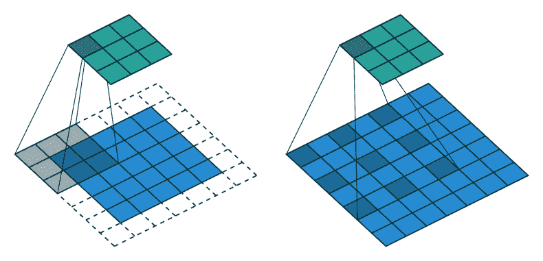

# 综述:DRN——扩张残差网络(图像分类和语义分割)

> 原文：<https://towardsdatascience.com/review-drn-dilated-residual-networks-image-classification-semantic-segmentation-d527e1a8fb5?source=collection_archive---------10----------------------->

## 使用扩展卷积、改进的 ResNet，用于图像分类、图像定位和语义分割

在这个故事中，回顾了**普林斯顿大学**和**英特尔实验室**的 **DRN(扩张剩余网络)**。在 2016 年 ICML 发表了用于语义分割的 [DilatedNet](/review-dilated-convolution-semantic-segmentation-9d5a5bd768f5) 之后，作者发明了 DRN，它不仅可以改善语义分割，还可以改善图像分类，而不增加模型的深度或复杂性。发表在 **2017 CVPR** 上，引用 **100 余次**。( [Sik-Ho Tsang](https://medium.com/u/aff72a0c1243?source=post_page-----d527e1a8fb5--------------------------------) @中)

# 概述

1.  **扩张卷积**
2.  **扩张的原因**
3.  **扩张的剩余网络(DRN)**
4.  **本地化**
5.  **去网纹**
6.  **结果**

# **1。扩张卷积**

*   为简单起见，我仅引用[中的方程式:](/review-dilated-convolution-semantic-segmentation-9d5a5bd768f5)

**Standard Convolution (Left), Dilated Convolution (Right)**

*   左边的是标准卷积。右边的是扩张的回旋。我们可以看到在求和的时候，就是 s+ *l* t=p 我们在卷积的时候会跳过一些点。
*   **当 *l* =1 时，为标准卷积。**
*   **当*l*1 时，为扩张卷积。**

**Standard Convolution (l=1) (Left) Dilated Convolution (l=2) (Right)**

*   以上举例说明了 *l* =2 时**展开卷积的例子。我们可以看到**感受野比标准感受野大**。**

**l=1 (left), l=2 (Middle), l=4 (Right)**

*   上图显示了更多关于感受野的例子。

# **2。扩张卷积的原因**

*   研究发现，在网络末端获得的输出特征图很小的情况下，语义切分的准确率会降低。
*   在 [FCN](/review-fcn-semantic-segmentation-eb8c9b50d2d1) 中，也说明了当需要 32 倍上采样时，我们只能得到一个非常粗略的分割结果。因此，需要更大的输出特征图。
*   一种简单的方法是简单地去除网络中的子采样(步长)步骤，以增加特征图的分辨率。然而，这也减少了感受野，严重减少了上下文的数量。对于更高分辨率来说，感受野的这种减小是不可接受的代价。
*   由于这个原因，使用扩张的卷积来增加较高层的感受野，补偿由于去除二次采样而引起的感受野的减少。
*   并且发现使用扩张卷积也有助于本文的图像分类任务。

# 3.**扩张残差网络(DRN)**

*   在本文中，使用 *d* 作为膨胀因子。
*   **当 *d* =1 时，为标准卷积。**
*   **当*d*1 时，为扩张卷积。**

## 原件 [ResNet](/review-resnet-winner-of-ilsvrc-2015-image-classification-localization-detection-e39402bfa5d8)

*   在原 [ResNet](/review-resnet-winner-of-ilsvrc-2015-image-classification-localization-detection-e39402bfa5d8) 中，最后 2 组卷积层 *G4* 和 *G5* 使用 3×3 标准卷积( *d* =1):

*   由于最大池化，特征地图变得越来越小。
*   输出特征图只有 7×7 的大小。这并不像上一节提到的那样好。

## DRN

*   在 DRN，在 *G4 处，使用 d* =2:

*   在 *G5* 处，对于第一次卷积( *i* =1)，仍然使用 *d* =2:

*   在 *G5* ，对于剩余的卷积(*I>1)，使用 *d* =4:*

*   最后， *G5* 在 DRN 的产量是 28×28，比原来的 [ResNet](/review-resnet-winner-of-ilsvrc-2015-image-classification-localization-detection-e39402bfa5d8) 产量大很多。

# 4.**本地化**

*   对于图像分类任务，最后，有一个全局平均池，然后是 1×1 卷积和 softmax。
*   为了进行本地化配置，只需简单地删除普通池。不涉及训练或参数调整。准确的分类 DRN 可以直接用于定位。

# 5.**去网纹**

**A Gridding Artifact**

*   如上所示，当特征图的高频成分高于扩展卷积的采样速率时，会出现网格伪像。

**DRN-A (Top) DRN-B (Middle) DRN-C (Bottom)**

*   **DRN-A** :只有扩张卷积的，有网格状伪影。
*   **DRN-B** :发现第一次最大汇集操作导致高振幅高频率激活。因此，**第一最大池层由 2 个残差块(4 个 3×3 卷积层)代替，以减少网格伪影。**网络末端还增加了 2 个剩余块。
*   **DRN-C** :在网络的末端，膨胀逐渐降低到**去除混叠伪影**，即**2-膨胀卷积后跟 1-膨胀卷积。**然而，神器仍然在这里，因为它可以通过残余连接传递。因此，**相应的剩余连接被移除。**

**Activation Maps of** [**ResNet-18**](/review-resnet-winner-of-ilsvrc-2015-image-classification-localization-detection-e39402bfa5d8) **and Corresponding DRNs**

*   上面显示了一个可视化。
*   **DRN-A-18** :卷积扩张，存在网格状伪影。
*   **DRN-B-26** :用卷积代替最大池，特征图有更少的伪影。
*   **DRN-C-26** :随着逐渐变小的扩张卷积和去除残留连接，伪影进一步减少。

**Feature Map Visualization at Different Levels in DRN-C-26 (The highest average activation at each level is shown)**

# 6.结果

## 6.1.ImageNet 上的图像分类

**Top-1 & Top-5 Error Rates on ImageNet Validation Set**

*   **DRN-A-18 和 DRN-A-34 在 1-crop top-1 精度上分别领先**[**ResNet-18**](/review-resnet-winner-of-ilsvrc-2015-image-classification-localization-detection-e39402bfa5d8)**和**[**ResNet-34**](/review-resnet-winner-of-ilsvrc-2015-image-classification-localization-detection-e39402bfa5d8)2.43 和 2.92 个百分点。(在 [ResNet-34](/review-resnet-winner-of-ilsvrc-2015-image-classification-localization-detection-e39402bfa5d8) 到 DRN-A-34 的情况下，误差相对减少 10.5%。)
*   **DRN-A-50 在单作物 top-1 精度上比** [**雷斯内特-50**](/review-resnet-winner-of-ilsvrc-2015-image-classification-localization-detection-e39402bfa5d8) 高出一个百分点以上。
*   **将一个**[**ResNet**](/review-resnet-winner-of-ilsvrc-2015-image-classification-localization-detection-e39402bfa5d8)**直接转化为一个 DRN-A** ，完全不改变模型的深度或容量，**显著提高分类精度。**
*   每只 DRN-C 的表现都明显优于相应的 DRN-A
*   DRN-C-26 是从 DRN-A-18 衍生而来的，其精确度与更深的 DRN-A-34 相当。
*   DRN-C-42 是从 DRN-A-34 衍生而来的，其精确度与更深的 DRN-A-50 相当。
*   DRN-C-42 接近于 ResNet-101 的精确度，尽管后者更深 2.4 倍。

## 6.2.ImageNet 上的对象定位

*   这里，基于特征图激活值执行弱监督对象定位。

*   *C* =1000，因为它是一个 1000 级的 ImageNet 数据集。
*   以 *C* 分辨率的响应图 *W* × *H* ，f( *c* ， *w* ， *h* )为位置响应( *w* ， *h* )，各位置的优势类为 *g* ( *w* ， *h* )。边界框的集合是 *Bi* 其中 *t* 是激活阈值。并且在 *Bi* 中选择最小包围盒 *bi* 。
*   对于地面实况框大于 0.5 的 IoU，它被认为是准确的。

**Top-1 & Top-5 Localization Error Rates on ImageNet Validation Set**

*   **DRNs 优于相应的**[**ResNet**](/review-resnet-winner-of-ilsvrc-2015-image-classification-localization-detection-e39402bfa5d8)**车型**，说明了基本 DRN 建设的好处。
*   DRN-C-26 的性能明显优于 DRN-A-50，尽管其深度要低得多。这表明去网格方案对于需要更详细的空间图像分析的应用特别有益。
*   DRN-C-26 也胜过[雷斯内特-101](/review-resnet-winner-of-ilsvrc-2015-image-classification-localization-detection-e39402bfa5d8) 。

## 6.3.城市景观的语义分割

*   对于 [ResNet-101](/review-resnet-winner-of-ilsvrc-2015-image-classification-localization-detection-e39402bfa5d8) ，它得到了 66.6%的平均 IoU。
*   DRN-C-26 比 ResNet-101 基准高出一个多百分点，尽管深度低了 4 倍。
*   尽管深度低 2.4 倍，但 DRN-C-42 型号的性能比 ResNet-101 基线高出 4 个百分点。
*   DRN-C-26 和 DRN-C-42 都优于 DRN-A-50，这表明去网格结构对密集预测任务特别有利。

**Cityscape Dataset**

*   如上所示，DRN-A-50 的预测被网格伪影破坏，即使该模型是在密集像素级监督下训练的。
*   相比之下，DRN-C-26 的预测不仅更准确，而且更清晰。

## 6.4.使用 DRN-D 获得更多结果

*   在作者的 [GitHub](https://github.com/fyu/drn) 中也有一个 DRN-D，它是 DRN-C 的简化版本

**Classification error rate on ImageNet validation set and numbers of parameters.**

**Classification error rate on ImageNet validation set and numbers of parameters**

所有的 DRN 也可以获得较低的错误率，而有较少的参数数目(较小的模型)。

**Segmentation mIoU and number of parameters ( *trained with poly learning rate, random scaling and rotations.)**

*   DRN-D-22 以较少的参数达到 68%的 mIoU，与 DRN-C-26 相同，但高于 DRN-A-50。

不是逐渐降低内部表示的分辨率直到场景的空间结构不再可辨，而是在最终输出图层中始终保持高空间分辨率。图像分类精度提高，最终 DRN 优于最先进的 [ResNet](/review-resnet-winner-of-ilsvrc-2015-image-classification-localization-detection-e39402bfa5d8) 。

## 参考

【2017 CVPR】【DRN】
[散漫残网](https://arxiv.org/abs/1705.09914)

## 我以前的评论

)(我)(们)(都)(不)(想)(到)(这)(些)(人)(,)(我)(们)(都)(不)(想)(要)(到)(这)(些)(人)(,)(但)(是)(这)(些)(人)(还)(不)(想)(到)(这)(些)(人)(,)(我)(们)(还)(没)(想)(到)(这)(些)(事)(,)(我)(们)(就)(想)(到)(了)(这)(些)(人)(们)(,)(我)(们)(们)(都)(不)(想)(要)(到)(这)(些)(人)(,)(但)(我)(们)(还)(没)(想)(到)(这)(些)(事)(,)(我)(们)(还)(没)(想)(想)(到)(这)(些)(事)(,)(我)(们)(还)(没)(想)(到)(这)(里)(去)(。 )(我)(们)(都)(不)(想)(到)(这)(些)(人)(,)(我)(们)(都)(不)(想)(要)(到)(这)(些)(人)(,)(但)(是)(这)(些)(人)(还)(不)(想)(到)(这)(些)(人)(,)(我)(们)(还)(不)(想)(到)(这)(些)(人)(,)(我)(们)(还)(没)(想)(要)(到)(这)(些)(人)(,)(我)(们)(就)(不)(想)(要)(到)(这)(些)(人)(里)(来)(,)(我)(们)(都)(不)(想)(到)(这)(些)(人)(了)(,)(我)(们)(还)(没)(想)(到)(这)(里)(去)(。

**物体检测** [过食](https://medium.com/coinmonks/review-of-overfeat-winner-of-ilsvrc-2013-localization-task-object-detection-a6f8b9044754)[R-CNN](https://medium.com/coinmonks/review-r-cnn-object-detection-b476aba290d1)[快 R-CNN](https://medium.com/coinmonks/review-fast-r-cnn-object-detection-a82e172e87ba)[快 R-CNN](/review-faster-r-cnn-object-detection-f5685cb30202)[DeepID-Net](/review-deepid-net-def-pooling-layer-object-detection-f72486f1a0f6)】[R-FCN](/review-r-fcn-positive-sensitive-score-maps-object-detection-91cd2389345c)】[离子](/review-ion-inside-outside-net-2nd-runner-up-in-2015-coco-detection-object-detection-da19993f4766)[多路径网](/review-multipath-mpn-1st-runner-up-in-2015-coco-detection-segmentation-object-detection-ea9741e7c413)[NoC](https://medium.com/datadriveninvestor/review-noc-winner-in-2015-coco-ilsvrc-detection-object-detection-d5cc84e372a) yolo 9000[[yolov 3](/review-yolov3-you-only-look-once-object-detection-eab75d7a1ba6)][[FPN](/review-fpn-feature-pyramid-network-object-detection-262fc7482610)][[retina net](/review-retinanet-focal-loss-object-detection-38fba6afabe4)][[DCN](/review-dcn-deformable-convolutional-networks-2nd-runner-up-in-2017-coco-detection-object-14e488efce44)]

**语义切分** [FCN](/review-fcn-semantic-segmentation-eb8c9b50d2d1)[de convnet](/review-deconvnet-unpooling-layer-semantic-segmentation-55cf8a6e380e)[deeplab v1&deeplab v2](/review-deeplabv1-deeplabv2-atrous-convolution-semantic-segmentation-b51c5fbde92d)[SegNet](/review-segnet-semantic-segmentation-e66f2e30fb96)】[parse net](https://medium.com/datadriveninvestor/review-parsenet-looking-wider-to-see-better-semantic-segmentation-aa6b6a380990)[dilated net](/review-dilated-convolution-semantic-segmentation-9d5a5bd768f5)[PSP net](/review-pspnet-winner-in-ilsvrc-2016-semantic-segmentation-scene-parsing-e089e5df177d)[deeplab v3](/review-deeplabv3-atrous-convolution-semantic-segmentation-6d818bfd1d74)

**生物医学图像分割** [ [累计视觉 1](https://medium.com/datadriveninvestor/review-cumedvision1-fully-convolutional-network-biomedical-image-segmentation-5434280d6e6) ] [ [累计视觉 2/DCAN](https://medium.com/datadriveninvestor/review-cumedvision2-dcan-winner-of-2015-miccai-gland-segmentation-challenge-contest-biomedical-878b5a443560)][[U-Net](/review-u-net-biomedical-image-segmentation-d02bf06ca760)][[CFS-FCN](https://medium.com/datadriveninvestor/review-cfs-fcn-biomedical-image-segmentation-ae4c9c75bea6)][[U-Net+ResNet](https://medium.com/datadriveninvestor/review-u-net-resnet-the-importance-of-long-short-skip-connections-biomedical-image-ccbf8061ff43)]

**实例分段** [DeepMask](/review-deepmask-instance-segmentation-30327a072339) [SharpMask](/review-sharpmask-instance-segmentation-6509f7401a61) [MultiPathNet](/review-multipath-mpn-1st-runner-up-in-2015-coco-detection-segmentation-object-detection-ea9741e7c413) [MNC](/review-mnc-multi-task-network-cascade-winner-in-2015-coco-segmentation-instance-segmentation-42a9334e6a34) [InstanceFCN](/review-instancefcn-instance-sensitive-score-maps-instance-segmentation-dbfe67d4ee92) [FCIS](/review-fcis-winner-in-2016-coco-segmentation-instance-segmentation-ee2d61f465e2) 】

)(我)(们)(都)(不)(知)(道)(,)(我)(们)(还)(是)(不)(知)(道)(,)(我)(们)(还)(是)(不)(知)(道)(,)(我)(们)(还)(是)(不)(知)(道)(,)(我)(们)(还)(是)(不)(知)(道)(,)(我)(们)(还)(是)(不)(知)(道)(,)(我)(们)(还)(是)(不)(知)(道)(。